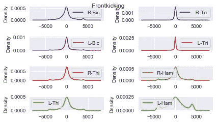
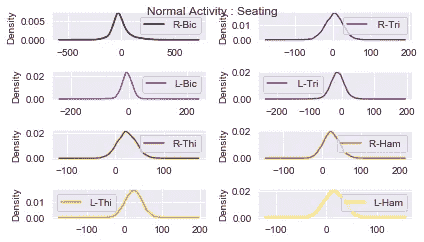
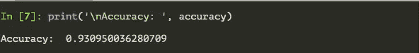
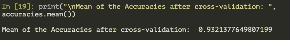
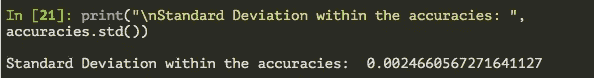

# 肌电图身体数据分析:攻击性和正常活动

> 原文：<https://medium.com/analytics-vidhya/analysis-of-emg-physical-data-aggressive-normal-activities-4d5a696730b4?source=collection_archive---------12----------------------->

作为提高我在数据科学和机器学习方面技能的常规挑战的一部分，我使用[随机数据集链接生成器](/@shraddha.anala/randomized-link-generator-for-datasets-f46342b5033)来建立一个机器学习模型，并在这里和在 [**我的 GitHub**](https://github.com/shraddha-an) 上发布一个教程。

所以这次上面代码挑选的数据集是[肌电肢体动作数据集](https://archive.ics.uci.edu/ml/datasets/EMG+Physical+Action+Data+Set)。

> **数据集的一点描述:**

该数据集包括从总共 8 块肌肉中记录的 EMG 信号；双臂的二头肌和三头肌以及双腿的腘绳肌和大腿肌肉。

四个不同的人进行了 10 个攻击性活动和 10 个正常活动的组合。基于这些活动的类型，信号记录了肌肉之间电势差的变化。

查看数据集，我可以直观地猜测这是一个分类问题，任务是分析 8 个输入变量，并预测正在执行的活动是积极的还是正常的。

> **探索性数据分析:**

绘制两种类型活动的输入变量的密度分布图，可以识别哪块肌肉(和肢体)用于执行活动以及两种活动之间的差异。

```
import matplotlib.pyplot as plt
import pandas as pd dataset = pd.read_csv('Frontkicking.csv')
dataset.drop(columns = [‘Aggressive’], axis = 1, inplace = True)plt.figure(figsize=(8,8))
dataset.plot(kind = ’density’, subplots = True, 
layout = (4,2), sharex = False, grid = True, legend = True,
title = ‘Frontkicking’, cmap = ‘brg’)plt.tight_layout()
plt.savefig(‘frontkicking.png’)
plt.show()
```



侵略性活动的密度分布

```
d1 = pd.read_csv(‘Seating.csv’)
d1.drop(columns = [‘Aggressive’], axis = 1, inplace = True)plt.figure(figsize=(8,8))
d1.plot(kind = ’density’, subplots = True, layout = (4,2), 
sharex = False, grid = True, legend = ‘reverse’, 
title = ‘Normal Activity : Seating’, cmap = ‘gnuplot’)plt.tight_layout()
plt.savefig(‘seating.png’)
plt.show()
```



正常活动的密度分布

下面是的完整代码

1.  标准化数据
2.  在训练数据上训练随机森林分类模型
3.  预测测试集上的活动标签，以及
4.  最后用 K-Fold 交叉验证评估模型的性能。



该模型达到了 93%的准确率，这确实是一个非常好的结果。现在让我们实现交叉验证来测试我们的模型的有效性。

使用交叉验证结果评估模型，得出以下指标:



交叉验证数据集的平均准确度



精度范围内的标准偏差

从上面可以看出，93%的交叉验证准确度和 0.0024 的标准偏差很好地表明我们的模型没有过度拟合，并且能够充分说明独立特征和目标变量之间的相关性。

原来如此。希望您对这个实现感兴趣。考虑到这个数据集是原始的，我不仅花时间清理它，还得自己编写问题陈述并实现解决方案。

通过这种方式，我能够深入了解原始形式的数据必须如何进行有用的分析，以及数据固有的、没有明确提到的问题。

更多我的作品请看 [**我的 GitHub 回购**](https://github.com/shraddha-an) 。

感谢你阅读这篇文章，我们会再见的。