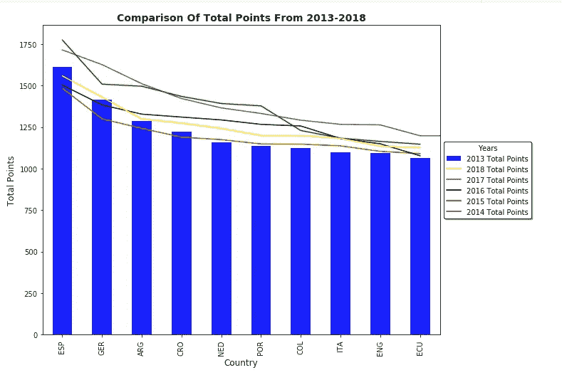
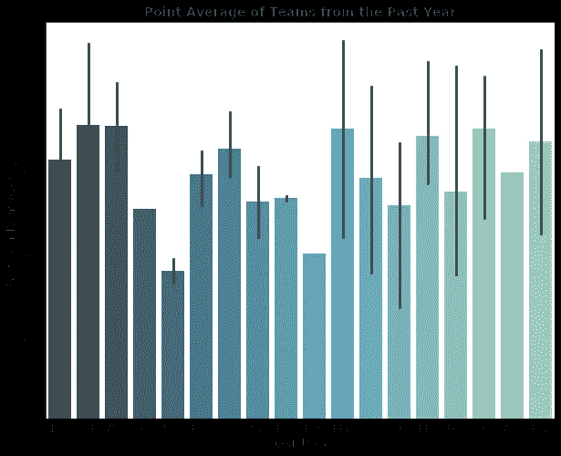
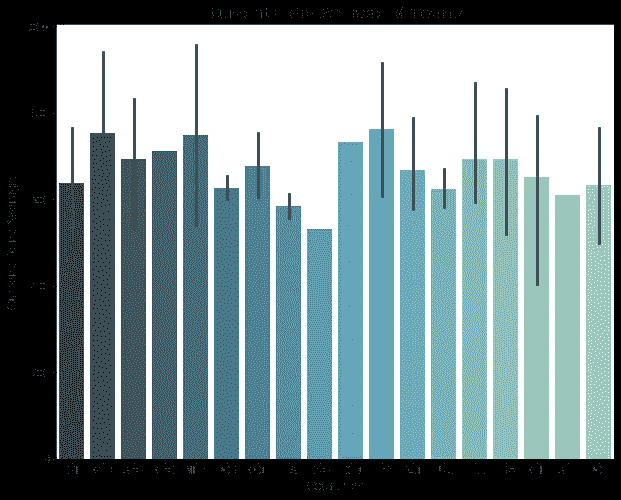
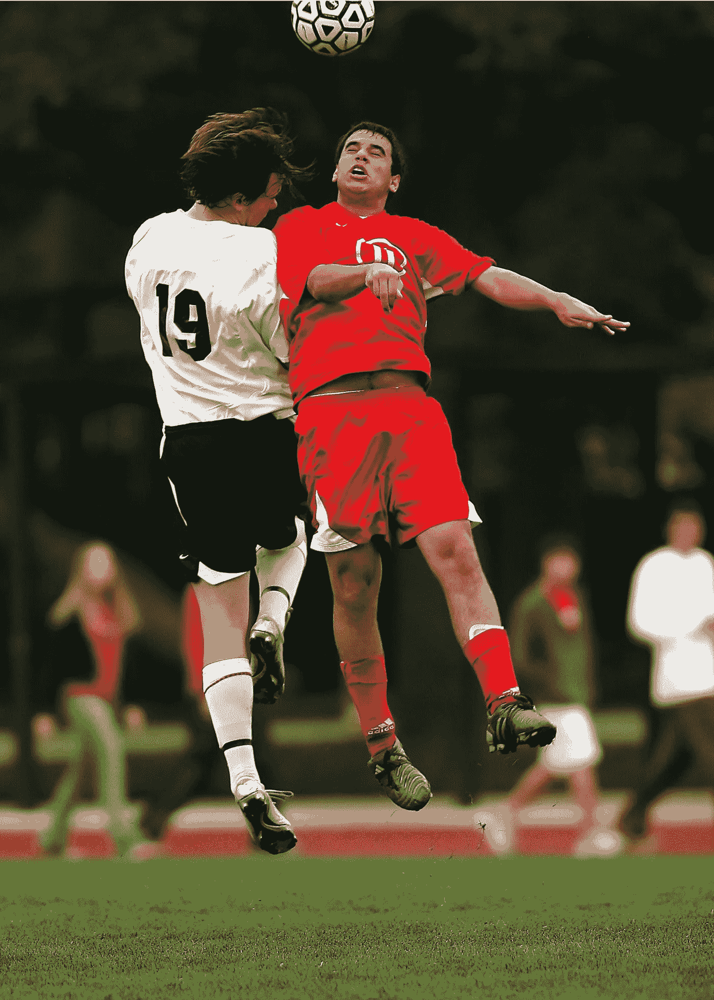

# 国际足联排名分析及不能被重视的原因

> 原文：<https://medium.com/analytics-vidhya/analysis-of-fifa-rankings-and-why-it-cant-be-taken-seriously-404a22f0e765?source=collection_archive---------6----------------------->

托马斯·塞勒在 [Unsplash](https://unsplash.com?utm_source=medium&utm_medium=referral) 上的照片

## 国际足联世界排名是如何工作的

国际足联世界排名是一个合乎逻辑的配方的创造，试图为一个不合理的游戏辩护。该框架利用四个变量来确定每个群体的定位:

第一种是真正正常的；它在一场比赛中获得的分数(M)。小组赛一场胜利得三分，一场平局得一分，点球获胜得两分。

以下变量是匹配的显著性(I)。友谊赛和小型比赛得 1 分，世界杯或洲际预选赛得 2 分，洲际对抗决赛或联合会杯得 3 分，世界杯得 4 分。

第三个因素是限制的剩余，正如已经发布的最新国际足联世界排名所示(T)。取 200，从小组的定位中减去，然后除以 100，得出这一部分。

最后一个因素是联合会的质量，这是 c。联合会的质量是由过去三届世界杯的平均成绩决定的。

等式结果是 P= M x I x T x C x 100。

## 1.最大的问题在于自身(很讽刺吧)

最大的问题是等式在其中利用了自己。一些计算依赖于组被给定的最后位置。因此，如果计算将一个群体定位为 30，但有一些好游戏击败了定位较高的群体，较低的群体会得到帮助，但较高的位置不会移动太多，因为它们的价值不太重要。这通常认为，当稳健的集团经历连续亏损和名单变动时，它们在任何情况下都会持有高仓位。

这张图表显示了 2013 年至 2018 年前十名球队的总积分对比。

在这张图表中，我们可以分析出，前十名球队在 2014 年和 2018 年的总积分没有显著差异，这两年都是最近两届世界杯。更重要的是，与 2013 年的结果相比，两者之间的分数相当。这根本没有任何意义，而且表明国际足联对某些球队和联赛有偏见。

## 2.计算中没有结构

另一个大问题是，计算不能以任何方式塑造或形成游戏中的图形结构。在一个半小时的比赛中，一个糟糕的定位组可能会扼杀第一或第二定位组，这种情况可能会被视为一场非凡的比赛。排名会因此下降，这一组显示了与坚实的一方战斗的能力。此外，排名不能授予或删除真实竞争情况的焦点。

如果一个团队得到了他们的 B 组程序，并与他们一起战胜了一个更有基础的对手，或者与他们一起输给了一个更脆弱的对手，那么这一方由于未知原因而被削弱的方式不能被放入计算中。那些为不符合竞争条件的对手提供便利的团体不会在定位上获得特殊地位。这意味着，如果一个团体正在促成一场比赛，他们在全球日期玩的是精心安排的比赛，而不是他们在比赛中的对手会玩的传球比赛。

根据等式，这使得竞争对手比被选中竞争的国家获得更多关注。

今年和去年各队平均得分的比较。

在这里，我们可以看到去年和今年(在这种情况下，将是 2018 年)平均积分的差异，如上所述，这是荒谬的，因为 2018 年世界杯是德国没有通过小组赛，意大利甚至没有资格参加世界杯。因此，根据国际足联世界排名数据，这并没有对德国两年的平均积分产生太大影响，但意大利今年的平均积分确实有所增加。如果你问我，我会觉得很可笑。

> -说到底，足球是一种无法自圆其说的游戏。

## 3.团队最终会受到伤害，这取决于他们所在的联盟

最后一个巨大的问题是，当一个团体正在为一场比赛准备账单的时候，这个团体受到了伤害。这是因为他们只是在一个联盟内玩团体游戏。如果一个群体在他们的聚集中是一个发电站，他们的定位就不能像一个高级联盟中的群体中心一样提升。

因此，虽然像奥地利或斯洛伐克这样的国家可以在重大比赛的能力时限内得到支持，但墨西哥或美国却受到惩罚，因为他们的联盟看起来并不稳固。在进行重大比赛时，没有一致性的因素。

## 中的**中的**结论中的****

足球，和任何游戏一样，是一种无法自圆其说的游戏。有一个框架来衡量一个团体有多稳固是令人愉快的。它帮助个人评估他们国家的对手，但就像任何衡量体育运动的等式一样，国际足联世界排名基本上不能包含所有元素。

[链接到我的代码](https://github.com/jsmazorra/DS-Unit1-Build/blob/master/Johan_Mazorra_Data_Storytelling_Project.ipynb)