# 巴西森林火灾分析

> 原文：<https://medium.com/analytics-vidhya/analysis-of-forest-fires-in-brazil-dec001ddf718?source=collection_archive---------14----------------------->

通过分析，我们将弄清楚巴西的一些森林火灾趋势。

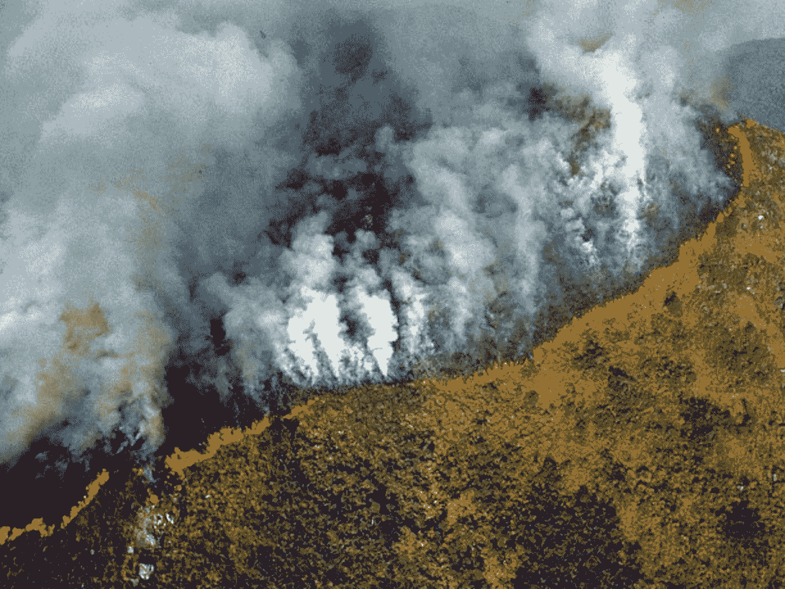

最近亚马逊大火让我思考作为一名数据科学学生，我可以做些什么，我可以与数据打交道。当我更多地思考这个话题时，问题出现了，为什么野火会蔓延？为什么 2019 年的巴西野火破坏力如此之大？巴西的火灾有哪些趋势？

巴西约占亚马逊盆地外围 60%的面积，在 1583000 平方英里的范围内。巴西属于热带气候，有旱季(通常从 5 月到 8 月)和雨季(通常从 10 月到 3 月，高峰期在仲夏，即 12 月到 2 月)。

2019 年，巴西各地的火灾数量异常多，8 月份呈指数增长。那个月，该国的国家空间研究所(INPE)报告说，有超过 80，000 起火灾，这是有史以来最大的一次。我想到的第一个问题是“巴西火灾的原因是什么？”。到目前为止，肆虐亚马逊的大部分大火是三个主要因素的结合:森林砍伐、农业和气候变化。

本文所做的所有分析都是在 1998 年至 2017 年之间进行的。让我们开始分析…

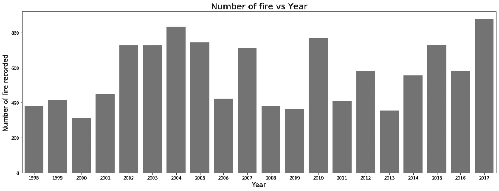

每年平均火灾次数

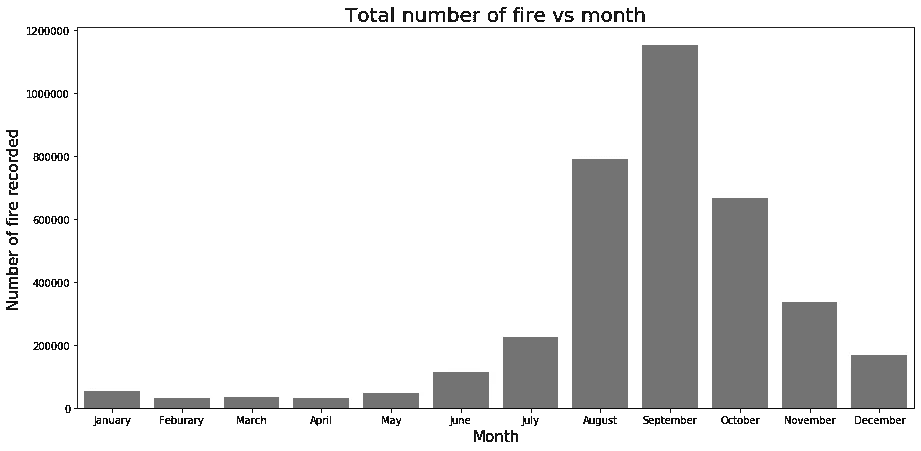

每月火灾总数

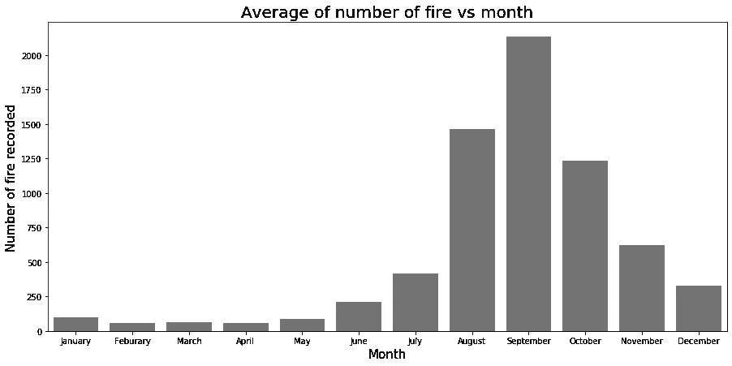

每月平均火灾次数

刀耕火种的程序，砍伐森林的土地用于农业，气候变化的影响，由于异常漫长的旱季和高于平均气温的全球 7 月和 8 月。今年前四个月的降雨量高于平均水平，这是刀耕火种的警示。然而，随着 2019 年 5 月旱季的开始，野火数量大幅增加(1998-2017 年期间，5 月份的野火总数为 *46083* 上升至 *1151789* )。所以下半年会有更多的森林火灾。

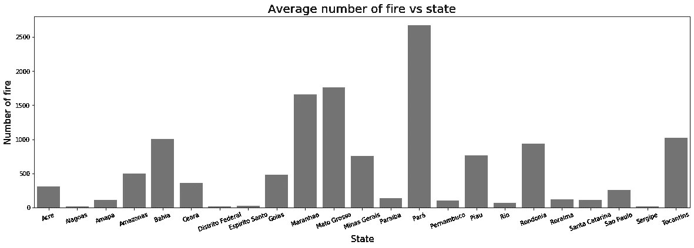

每个州的平均火灾次数

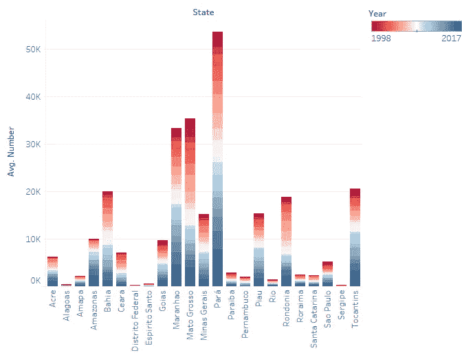

巴西各州火灾平均数量逐年增长。

巴西的帕拉州、马托格罗索州和朗多尼亚州位于亚马逊雨林的南部边界，处于所谓的“毁林弧”地带。大多数火灾发生在这些州(在 1998 年至 2017 年期间，帕拉州、马托格罗索州和朗多尼亚州分别发生了 *2670 起、* 1765，939 起野火)。

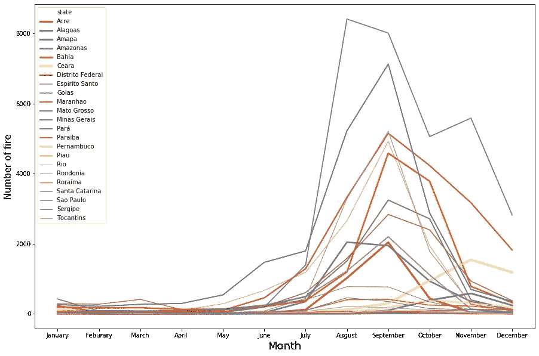

在此期间(1998 年至 2017 年)，巴西各州每月记录的平均火灾次数

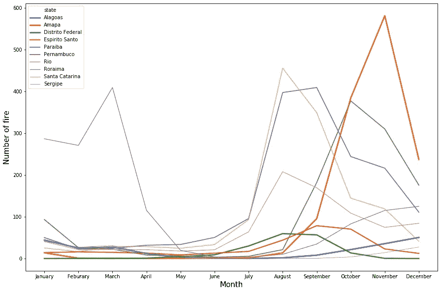

每月记录的平均火灾次数至少记录了该时期(1998–2017 年)巴西各州的火灾次数。

巴西大多数州在下半年记录的森林火灾次数最多，但有一个州*阿拉戈斯州*上半年的森林火灾次数大致相同。我不确定这种奇怪现象的原因是什么。这需要进一步分析。也许气候变化、农业和森林砍伐对火灾的影响全年都是一样的。

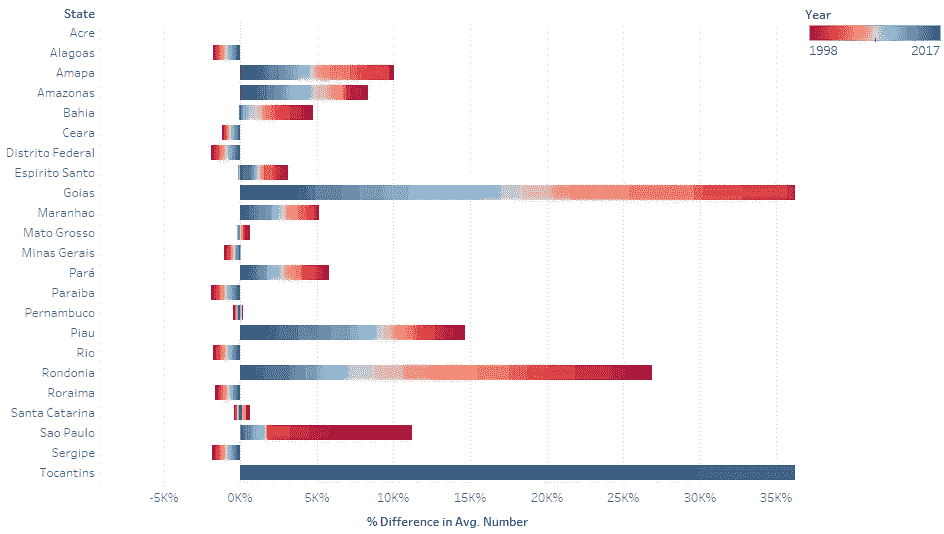

巴西平均火灾数量同比增长的百分比。

视觉化是一种技能。如果我说你想象野火平均数量的年增长率，很难直接从数据中想象出来。所以提供了一些图表来理解这些趋势。如果你对这些情节的编码方式很感兴趣。作为指导，我在文章末尾提供了我的 GitHub 库。

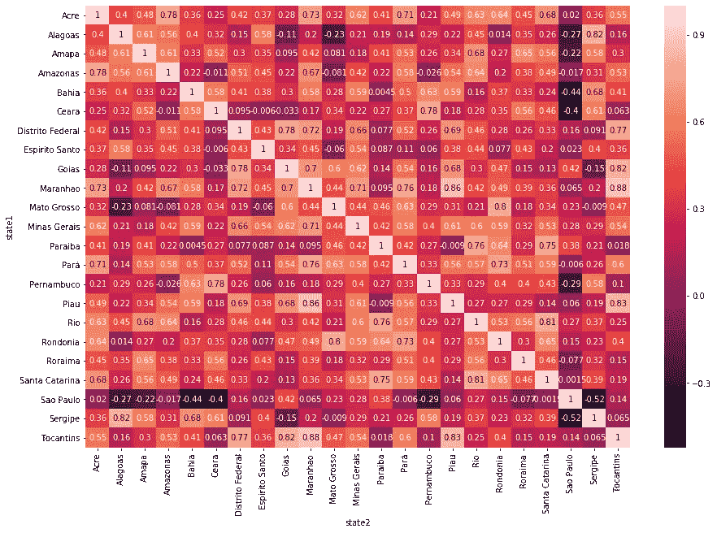

巴西任意两个州之间的相关性。

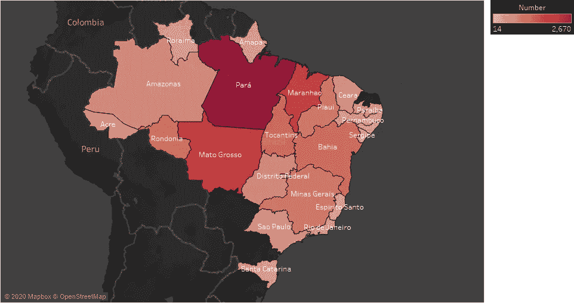

每个州的平均火灾次数

从地图上可以看出，大多数野火发生在帕拉州和马托格罗索州(巴西的两个州，也是亚马逊雨林的一部分)。随着离这两个州的距离增加，报道的野火正在消退。从热图中，我们可以说相邻的州是高度相关的(像帕拉州和马兰豪的相关值是 *0.76)* 。所以大多数火灾都是从这些州开始的。

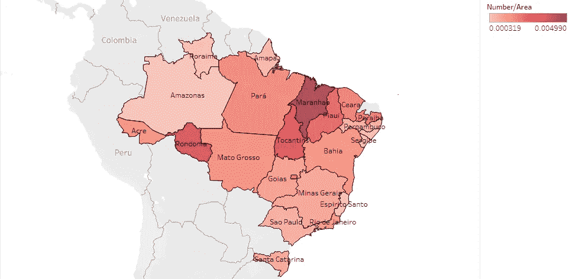

巴西地图，显示记录的每个州的平均野火数量(单位为 km)。

帕拉州记录的火灾数量最多，其次是马托格罗索州。但是受影响地区的野火在马拉尼昂州最严重，该州目睹了该地区最凶猛的火灾。

用于上述分析的 Python 代码…

剩下的 Choropleth 图是由 Tableau(一个数据可视化软件)制作的。我建议你应该试试 Tableau。

在文章的开始，很少有人提出关于巴西火灾模式/趋势的问题。通过以上分析，我们已经搞清楚了巴西森林火灾的一些趋势。

当农民们想尽可能多地清除废弃作物时，火灾就开始了。在这一点上，我们不能确定，直到更多的证据出现。一些火灾是作为每年焚烧的一部分开始的。过去的活动表明，当疏于监管时，森林火灾就会上升。通过改进政府政策，这一问题可以得到解决。