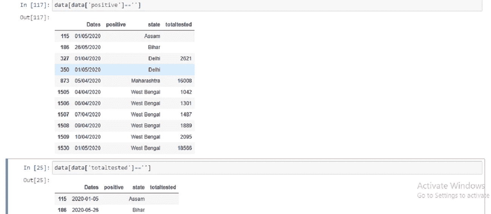
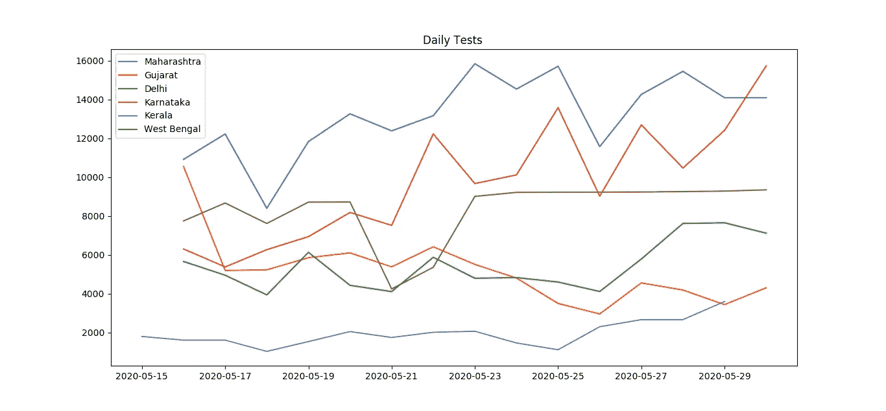
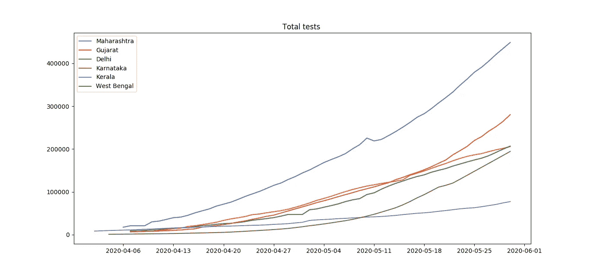
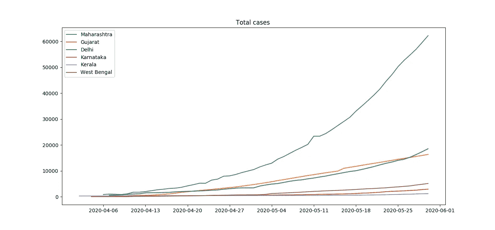
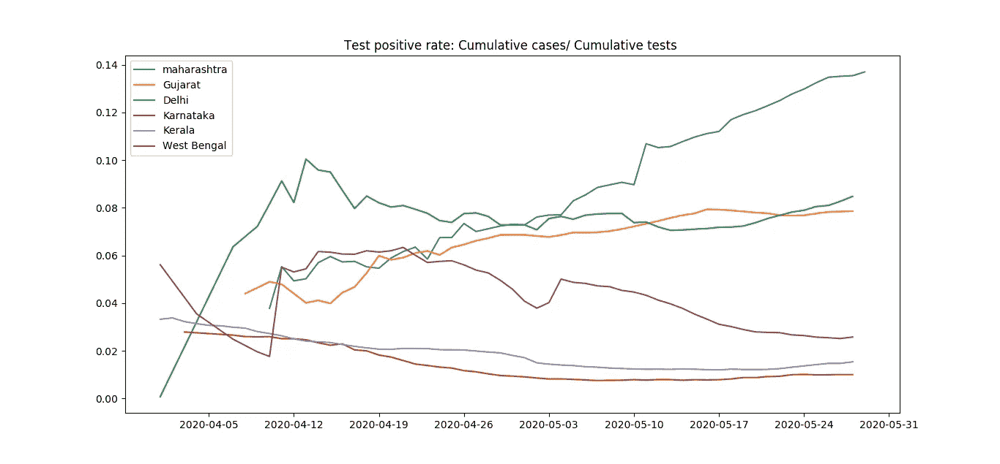
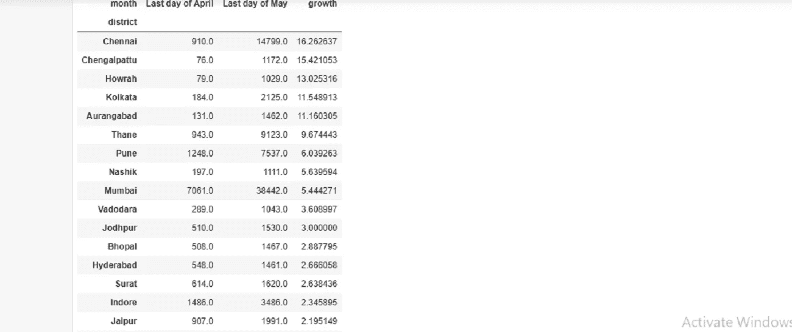
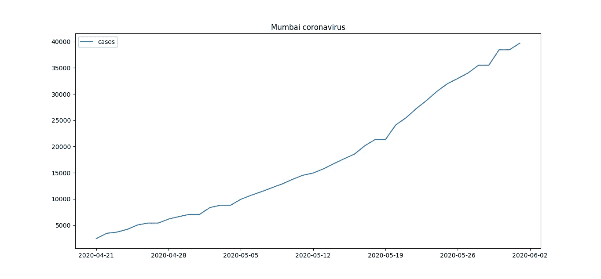

# 使用 Python 分析印度 Covid 数据

> 原文：<https://medium.com/analytics-vidhya/analysis-of-indian-covid-data-6cd043856215?source=collection_archive---------21----------------------->

在这篇文章中，我使用 python 分析了 https://www.covid19india.org/网站上的印度 covid 数据。他们在下面的 github 库开源了他们的数据库

 [## covid 19 印度/api

### 这是一个志愿者驱动的众包数据库，用于新冠肺炎统计和印度患者追踪

github.com](https://github.com/covid19india/api) 

他们在 github 存储库中以 json 格式提供 covid 数据。最有用的 api 链接如下:

1 https://api.covid19india.org/state_test_data.json

它包含 json 格式的状态测试数据。有各州案例和测试的数据。

2 https://api.covid19india.org/state_district_wise.json

它包含每个州当前病例、康复和死亡的地区分类。

3[https://api.covid19india.org/districts_daily.json](https://api.covid19india.org/districts_daily.json)

它包含印度每个地区的每日病例、死亡和康复更新。

4[https://api.covid19india.org/data.json](https://api.covid19india.org/data.json)

它包含印度每日病例、死亡和恢复的更新。

**状态测试数据**

用户可以使用请求库导入测试数据，如下所示:

请求库 get 函数返回 html 响应。我们可以使用文本方法访问网页的文本。我们可以看到它返回了一个包含 json 的字符串。

接下来使用 json 库的 loads 方法，我们可以将它解析为一个 json 对象。我们将它保存在 state_json_data 变量中。

这个 json 对象包含一个带有关键字 state_tested_data 字典，其值包含每个状态的每日更新数组。每次更新都包含累积测试和阳性病例的数量。

所以我们迭代 json，并将更新数据保存在单独的数组中。然后，我们可以将这些数组导入 Pandas 数据帧，如下所示:

dataframe 的每一列都有字符串数据类型。因此，我们必须将“日期”列转换为日期时间格式，并将“正”和“总测试”列转换为整数数据类型。

我们可以使用 pandas astype 方法将' totaltested '和' positive '列转换为整数类型。但是由于缺少值，它会抛出错误。我们可以看到它们的一些字段包含空字符串。

因此，我们可以使用 fillna 函数的 pandas forward fill 方法用前一天的值替换空字符串。然后我们可以使用 pandas 类型函数将它们转换成整数数据类型。

我们可以使用 pandas to_datetime 函数将“日期”列转换为 datetime 数据类型，如下所示:

现在，我们的数据框架包含每天的全部测试和全部阳性病例的数据。通过计算每行之间的差异，我们可以获得每日案例和测试的数量。但为此，我们需要确保数据是按州和日期排序的。

因此，首先我们使用 pandas sort_values 按状态和日期对行进行排序，然后我们使用 pandas diff 方法获得行的差异。最后，对于每个状态的第一行，我们将 difference 指定为初始值，因为我们没有之前日期的值。

现在我们可以绘制主要状态的日常测试，如下所示

马哈拉施特拉邦每天做的测试最多。然而，卡纳塔克邦在过去的两周里经历了更多的测试。

类似地，我们也可以绘制这些主要州完成的总测试:

马哈拉施特拉邦在印度做了最多的测试。德里和古吉拉特有相似的病例数，他们做了几乎相同数量的测试。西孟加拉邦最初在测试数量上落后，但现在几乎赶上了德里和古吉拉特邦。

然而，如果我们把所有的病例都画出来，就会出现不同的情况。

马哈拉施特拉邦的病例上升速度比其他邦快得多。德里和古吉拉特邦的病例数与他们的测试相同。但是卡纳塔克邦、喀拉拉邦和西孟加拉邦的病例数要低得多。

所以我画出了每个州的测试阳性率，如下图所示

德里和古吉拉特邦的检测阳性率保持稳定。然而，自 5 月初以来，马哈拉施特拉邦的检测阳性率正在上升。

**地区日期型数据**

现在我处理各区的每日数据。在 https://api.covid19india.org/districts_daily.json[有售](https://api.covid19india.org/districts_daily.json)

像上面的例子一样，我使用下面的代码转换成熊猫数据帧:

然后，我使用以下代码计算了每个地区 5 月份确诊病例数的增长率

对于在 5 月底有超过 1000 例确诊病例的地区，以下是它们在该月确诊病例的增长率:

我们可以看到，钦奈在 5 月份的增长率非常惊人。16 倍的增长意味着这个月钦奈的病例每周翻一番。

孟买的病例增加了 5.4 倍，这意味着孟买的倍增期略低于 2 周。

利用这些数据，我们还可以绘制印度任何地区的病例图表。使用 matplotlib，我为 mumbai 案例绘制了如下图形:

然而，为其他地区重复绘图是很麻烦的。

所以我用 d3 javascript 库绘制了这些数据。您可以单击并选择一个区域来绘制其曲线。你必须点击下面的结果标签，然后你可以选择地区来查看它的图表。

如果您在介质中看图表有问题。你可以在下面的链接看到它

[https://jsfiddle.net/rohitrajjsfiddle/961txdp0/10/](https://jsfiddle.net/rohitrajjsfiddle/961txdp0/10/)秀

在这篇文章中，我解释了如何访问 covidindia 网站的 API 数据，并在 python 中使用它进行分析。人们可以使用这个数据集进行更多的分析。

在下一篇文章中，我将解释如何使用 D3 库对 Covid 数据进行交互式可视化。