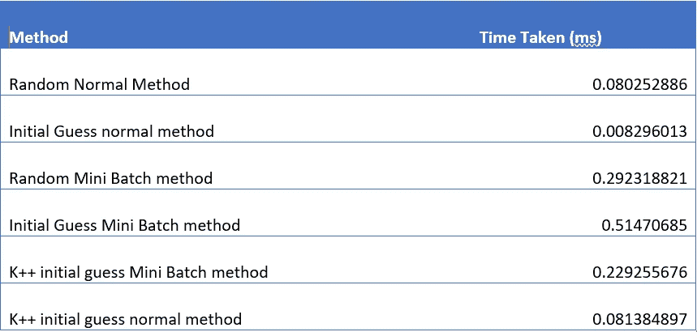

# K-Means 算法收敛时间分析

> 原文：<https://medium.com/analytics-vidhya/analysis-of-k-means-algorithm-convergence-time-using-mid-points-of-equally-divided-regions-between-2bca5b9d63a3?source=collection_archive---------9----------------------->

## 使用最小-最大值之间等分区域的中点

K-Means 是一种无监督的机器学习算法，用于将相似的数据点分组在一起。例如，假设我们有一个数据集，其中包含一个地区消费快餐的人数、该地区的气候条件(温度和降雨量)以及死亡率。现在，我们希望在数据集中找出这些变量之间具有相关性的组，例如一个组可能代表快餐消费较高的寒冷干燥地区的高死亡率。

回答这个问题的一个显而易见的方法是过滤温度和降雨量的数据，并寻找死亡率与快餐消费的趋势。根据数据集的大小和数据分析人员的能力，大约需要 10-15 分钟。如果我们在这个数据集上使用 K-Means，它会自己将数据分组到有意义的聚类中，然后可以手动或使用决策树进行聚类标记，这个过程最多需要 5 分钟！

在我们的一次机器学习讲座中，当对一维数据点应用 K-means 算法时，我注意到聚类中心收敛到最小值和最大值之间的 K 个等距点。比如我们应用 k 均值算法，k=2，对于这些数据点 0.1，0.3，0.4，0.8，0.9，我们得到的聚类中心是 0.267，0.85。这些是在将聚类中心的初始猜测取为 0.1 和 0.3 之后运行 K-Means 算法 4 次之后获得的。

将上述数据点分成 2 个相等的空间(这里 k=2)并取每个空间的中点，我们得到中点为 0.3 和 0.7。考虑将这些点作为我们的 K 均值算法的初始猜测，我们在仅仅 1 次迭代中收敛到相同的点，0.267，0.85！这促使我尝试将这种技术应用于更大的 k 值和更高维度。

对于以下每个数据集，我比较了随机初始化和初始值初始化的 K 均值算法的收敛时间。我已经使用了 sklearn 的 kmeans 函数来执行这些任务。

**距离芝加哥数据集**

这包括主要城市及其与芝加哥的距离。在对具有随机初始化和 k=4 的该数据集应用 K 均值时，我们获得以下聚类中心:[ 378.8125，815.2174，1245.5455，1960.1111]。在提供初始值作为 2148(最大值)和 92(最小值)之间的等分区域的中点时，即[349，863，1377，1891]，我们获得相同的聚类中心，因此获得相同的聚类成员。当我们比较这些方法之间的收敛时间时，初始值初始化要快 100%左右。

接下来，我尝试将 k 值增加到 15，但是正如我们在下面看到的，聚类中心略有不同，因此聚类成员也略有不同。

k=15 的初始猜测值和聚类中心，距离芝加哥数据集

随机初始化的惯性值或类内平方和为 47337.72619，初始值初始化为 53456.6984。这告诉我们，初值法还没有完全收敛，或者收敛到局部极小值。然而，初始值方法仍然要快 95%左右。

下面，我们可以在美国地图上观察 k=15 的集群成员。每种颜色代表集群成员，红色的大点代表芝加哥。该图是使用 python 中的底图包获得的。

使用底图包在美国地图上绘制城市

当我们增加距离芝加哥数据集的 k 值时，两种方法所用时间的比较

**二维数据集**

对 2D 数据集进行类似的分析，我们获得了以下结果。

对于 k=4，我们看到这里的聚类中心略有不同，但是当我们查看聚类成员时，这种差异是不可见的。随机法和初值法的惯性值分别为 138150387999424.77 和 138151320103050.34。初始值方法的惯性值也更大，但现在初始值方法快了 67%。

两种方法中 k=4 的 2D 数据的聚类中心

两种方法中 k=4 的 2D 数据的聚类隶属度

对 k=15 的类似分析将为我们提供以下结果。

两种方法中 k=15 的 2D 数据的聚类成员。

我们再次看到集群成员是不同的。现在的惯性值相差很多，随机初始化 8.9E12，初值法 20E12。

对于更高维度，可以得到类似的观察结果。n=32 的结果可以在 github repository 上找到。

**与小批量 K-means 和 K-means++播种方法的比较**

小批量 k-means 是在随机选择的固定大小的小批量数据上运行的 K-means 算法。K-means++是选择初始值的另一种方法，其中随机选择第一个中心，同时选择连续的中心，使得它们离先前选择的所有中心最远。

对于下面的分析，批处理大小固定为 10，kmeans 算法使用 python 中的 scikit learn 包实现。这里使用的数据集是如上所用的二维数据集。

k=15 时不同方法收敛时间的比较

k=15 时不同方法的结果比较

k 值范围内不同方法的总体比较

我们可以清楚地看到，这里讨论的初值法是所有方法中收敛时间最短的，但其结果也与随机初始化法有很大的不同。

初始值方法并不总是收敛到全局最小值，因为它根据最小值和最大值平均分布数据。但是，随机初始化会将点随机放置在由相应的最小值和最大值限定的超矩形(或 2D 的矩形)内。因此，与初始值初始化相比，随机初始化使我们能够更准确地捕捉数据的分布。

**参考文献:**

1.  芝加哥伊利诺伊理工大学的机器学习讲座
2.  【http://cs.joensuu.fi/sipu/datasets/ 号
3.  [https://www . geeks forgeeks . org/ml-mini-batch-k-means-clustering-algorithm/](https://www.geeksforgeeks.org/ml-mini-batch-k-means-clustering-algorithm/)

源代码可以在:[https://github . com/nikhilpmiskin/Self-Projects/tree/master/KMeansConvergenceTime](https://github.com/nikhilpmiskin/Self-Projects/tree/master/KMeansConvergenceTime)找到

**关于我**:我正在伊利诺伊理工大学攻读数据科学硕士学位，并在 IIT 孟买大学完成了学士学位。在处理一个涉及贸易金融中 ML 和 NLP 的自动化问题时，我对数据科学产生了兴趣。我对通过使用机器学习算法来理解数据中隐藏的意图感兴趣，这些算法可用于解决其他内在问题。**领英:**[https://www.linkedin.com/in/nikhilpmiskin/](https://www.linkedin.com/in/nikhilpmiskin/)