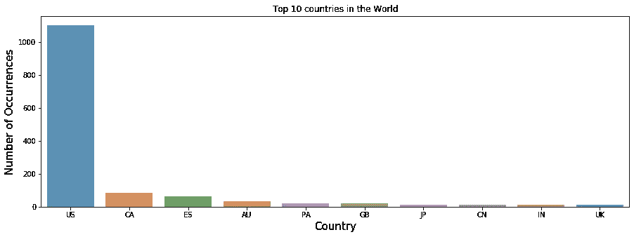
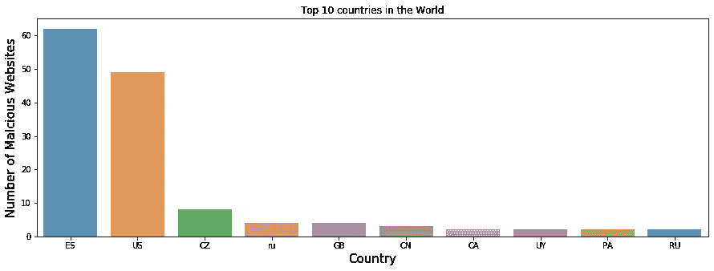
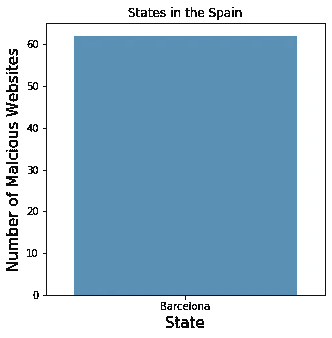
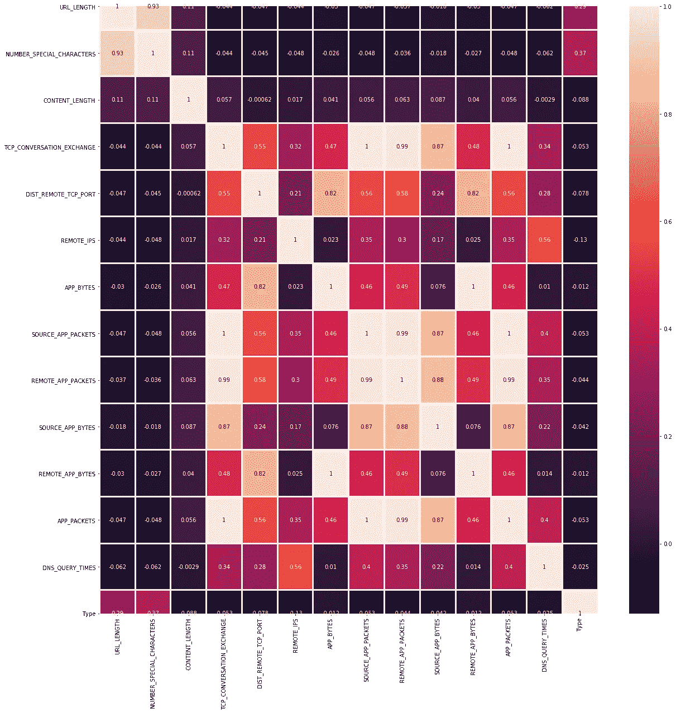
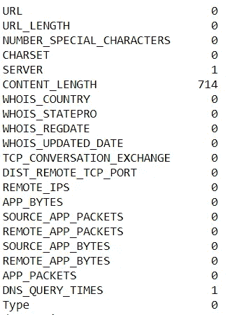
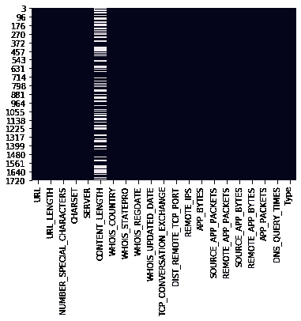

# 恶意网站的特征分析。

> 原文：<https://medium.com/analytics-vidhya/analysis-of-malicious-websites-by-its-characteristics-e202a20d9e38?source=collection_archive---------10----------------------->

恶意软件不是我们遇到的全新问题。很久以前就有了。在现代社会中，网络应用程序的安全性和安全使用，而不将我们的数据和凭证泄露给陌生人是非常重要的。但是并不是所有的网站都能让你轻松享受。有时，有人可能会植入一些网络钓鱼的东西，这样你最终会落入他们的圈套，最终向他们泄露你的信息。

许多人会无意中访问这些网页，并受到诈骗。有时浏览器扩展或 flash 更新会是我们的恶意软件出现的形式。甚至用户可能会因为点击网站中的任何链接而上当，最终陷入陷阱。因此，如果我们能够了解这些类型的网页的历史，并在以后进行分析，我们甚至可以建立一个预测器，通过指导我们了解网页的可信度来帮助我们进行访问。

因此，在这篇文章中，我试图分析恶意网站的特征(所谓的功能)。这里使用的数据集是从 Kaggle 获得的，包含大量恶意和良性数据。我们需要关注每个可用的特性，理解它们并进行分析。我们可以使用这些数据，并将它们用于进一步分类和提高应用层的安全性。

# **了解特性:**

*   **URL:** 是研究中分析的 URL 的匿名标识
*   **URL_LENGTH:** 是 URL 中的字符数
*   **NUMBER _ SPECIAL _ CHARACTERS:**URL 中标识的特殊字符的个数，如“/”、“%”、“#”、“&”、“”, "="
*   **CHARSET:** 它是一个分类值，其含义是字符编码标准(也叫字符集)。
*   **服务器:**是一个类别值，其含义是从数据包响应中得到的服务器的操作系统。
*   **CONTENT_LENGTH:** 表示 HTTP 头的内容大小。
*   **WHOIS_COUNTRY:** 这是一个分类变量，它的值是我们从服务器响应中获得的国家(具体来说，我们的脚本使用了 WHOIS 的 API)。
*   **WHOIS_STATEPRO:** 它是一个分类变量，其值是我们从服务器响应中获得的状态(具体来说，我们的脚本使用了 WHOIS 的 API)。
*   **WHOIS_REGDATE:** Whois 提供服务器注册日期，因此，该变量的日期值格式为 DD/MM/YYYY HH:MM
*   **WHOIS_UPDATED_DATE:** 通过 WHOIS，我们从被分析的服务器上获得了最后更新日期
*   **TCP _ CONVERSATION _ EXCHANGE:**这个变量是服务器和我们的蜜罐客户端之间交换的 TCP 数据包的数量
*   **DIST 远程 TCP 端口:**检测到的端口数量，与 TCP 不同
*   **REMOTE_IPS:** 这个变量有连接到蜜罐的 IP 的总数
*   **APP_BYTES:** 这是传输的字节数
*   **SOURCE_APP_PACKETS:** 从蜜罐发送到服务器的数据包
*   **远程应用包:**从服务器接收的包
*   **APP_PACKETS:** 这是蜜罐与服务器通信过程中产生的 IP 数据包总数
*   **DNS_QUERY_TIMES:** 这是蜜罐与服务器通信过程中产生的 DNS 数据包数量
*   **类型:**这是一个分类变量，其值代表被分析网页的类型，具体来说，1 代表恶意网站，0 代表良性网站

> 上述功能集基于由 Christian Urcuqui、Andrés Navarro、José Osorio、Melisa García 撰写的《IEEE 数据端口:恶意和良性网站》。您可以从这里直接获得数据集，并且**分析将完全基于该数据集**。

# **分析:**

现在我们知道了所有可用的字符以及它们的含义。现在让我们来分析它们。首先，当我们获取数据时，我们可以看到大约有 1781 行 21 列的数据。一些数据包含“无”分类国家，这对我们的分析没有多大用处。因此我们去掉了它们，最终得到 1475 行 21 列。

关于我们的数据集，我们可用的数据非常有限。因此，让我们了解每个国家的 WHOIS 是如何让我们得到回应的。

像好莱坞电影一样，美国拥有最多的网站。其次是加拿大、西班牙、澳大利亚等等。值得注意的是，数据集包含大约 45 个以上的国家，我们按照观察次数的降序排列了前 10 个国家。

但是这些数据能帮助我们吗？**大无**。这些包括恶意和良性网站，我们对良性网站不感兴趣。所以我们需要去掉它们，重新绘制图表。当我们这样做的时候，我们处理掉了将近 1324 行，这意味着只有 151 行是关于恶意网站的数据，其余的是良性的。太棒了… 让我们再画一次。

**哇..看看形势是如何转变的。与西班牙相比，美国虽然有很多恶意网站，但并不多。西班牙居首位，其次是美国、捷克、俄罗斯等等。因此，我们可以理解，西班牙是最脆弱的国家。现在我们知道了，让我们深入了解一下如何分析西班牙不同的州。**

数据集只包含西班牙的巴塞罗那，因此我们在这里有巴塞罗那的计数。我们还可以注意到，仅巴塞罗那一地的人数就超过了其他任何一个国家。现在让我们更深入地了解数据集，因此我们画出它的相关矩阵。

> 正如定义所述:相关矩阵是显示变量之间相关系数的表格。表格中的每个单元格显示了两个变量之间的相关性。相关矩阵用于汇总数据，作为更高级分析的输入，以及作为高级分析的诊断。

每一个深色的盒子都不是高度相关的。盒子越轻，其相关性越高。这里我们可以观察到 TCP_CONVERSATION_EXCHANGE 与 APP_PACKET、SOURCE_APP_PACKET 的相关性最高。类似地，我们可以在许多地方观察到高度相关的趋势。当我们进入数据预测的场景时，所有这些数据都是有用的。这就是 ML 的部分。

我们还必须注意空值条件。在国家统计的情况下，我忽略了它，因为我在分析过程中没有遇到它。但是让我们看看它们在数据帧中有多少空值。为此，我们使用 pandas 库和命令:df.isnull()。sum()。我们几乎可以为每一列生成 null 值的统计数据。

所以我们可以发现 CONTENT_LENGTH 列的 null 值最高。这大约相当于该列中一半的数据为空。因此，对于进一步的预测，完全取决于 ML 工程师，要么完全删除该列，要么用平均值或中值之类的东西对其进行估算。它还依赖于特定列中其余值。我们还观察到，这与所有其他列的相关性最低。理想情况下，最好将该列完全移除。具有空值另外两列是服务器和 DNS_QUERY_TIMES。在这里，即使发出了特定的行，也不会产生任何困难，做一些输入也是可以的。

列中空值的热图

# **结论:**

在这篇文章中，我们对恶意网站数据的数据集做了基本的分析。

1.  我们希望了解数据集，并了解恶意数据是如何来自不同国家的。
2.  我们理解了不同列之间的相关性，也理解了未来预测应该使用什么以及应该避免什么。
3.  最后，我们发现了数据集中携带的空值，并对其进行了研究，以了解为什么需要将其移除或估算。

下一个阶段是分类。ML 工程师处理这样的数据。这里的数据非常少。通常，他们会处理大量数据，并基于这些统计数据，使用适当的模型和变量来预测数据，以获得更好的业务。

> ***从这里获得完整的代码和图表:***[***https://github . com/siddharth 1698/Analysis-of-恶意网站***](https://github.com/Siddharth1698/Analysis-of-Malicious-Websites)