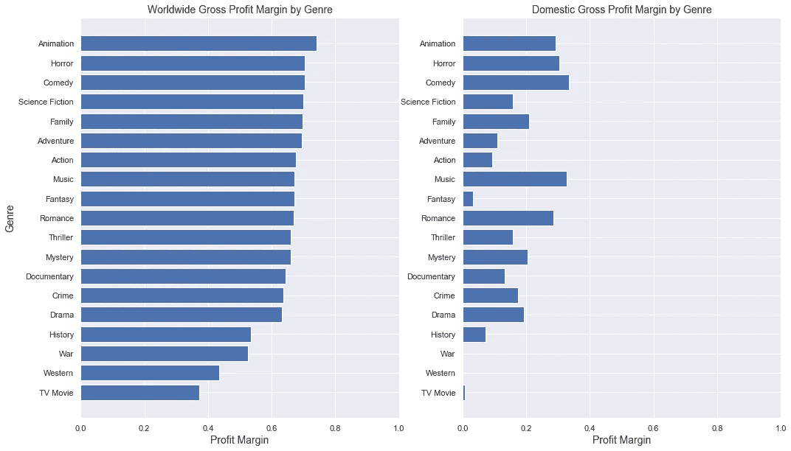
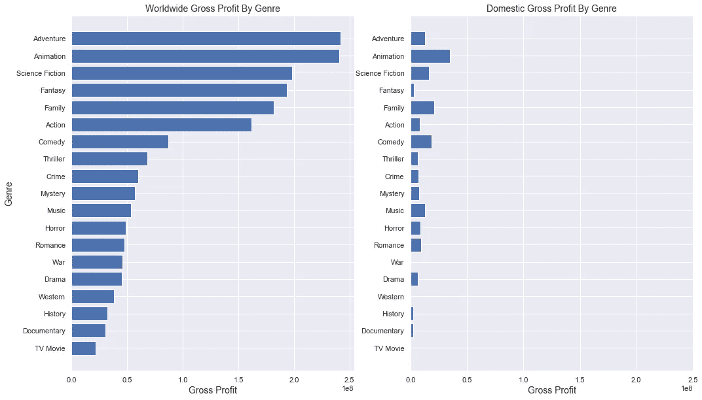
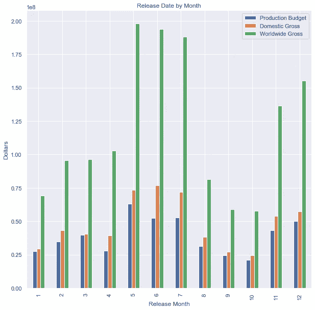

# 分析投资哪些电影

> 原文：<https://medium.com/analytics-vidhya/analysis-on-which-movies-to-invest-in-568f548388a9?source=collection_archive---------22----------------------->

**简介**

假设你想拍一部电影。现在首先想到的是这个:我应该创作什么样的电影？电影的类型对你能获得多少利润很重要吗？有没有具体的时间框架可以提高你的毛利率？用于该分析的数据集包含大约 900 个不同的电影标题。让我们来看看。

**数据探索**

我们首先从分析每个流派的毛利率开始。我们将使用他们的全球和国内毛利率来表示这些数据。

我们的数据表明，全球毛利率在多个方面远远超过国内毛利率。最好是全球上映的电影。只在国内发行电影会对你的利润率产生负面影响。除了历史、战争、西部、电视电影之外的大部分流派，利润率都在 60%以上。领先的是我们的 5 大类型:动画、恐怖、喜剧、科幻和家庭电影。

**毛利**

让我们看看另一个广泛使用的投资来源，毛利。毛利润和毛利率一起用于做出明智的投资决策。

公平地说，瞄准全球人口将产生高额利润。任何类型的电影在世界范围内的最低毛利至少可以达到 2500 万美元。排名前五的流派为每一个流派创造了超过 1.5 亿美元的超额利润。这些类型包括冒险、动画、科幻、幻想和家庭。

对比我们的毛利和毛利率图表，你会注意到恐怖片的毛利率第二高。然而，恐怖电影的毛利平均只徘徊在 5000 万美元左右。动画电影毛利率最高，毛利第二。这让我相信动画电影可能是回报率最高的最佳投资电影。

**按月发布日期**

现在电影应该什么时候上映？我们都知道这是你的电影票房表现的一个重要因素。暑期青少年不上课的时候放电影好吗？也许圣诞节的时候？让我们来看看。

从 1 月至 4 月和 8 月至 10 月，平均生产预算约为 2500 万美元。全球平均毛利在 6000 万到 1 亿美元之间。这表明制作预算大约为 2500 万美元的电影应该在前面所述的时间段内发行。从 5 月到 7 月和 11 月到 12 月，制作预算在 4000 万到 6500 万天之间。这大约是小制作预算月份投资的两倍。全球总票房也在 1-2 亿美元左右。

**结论**

制作预算在你应该何时发行一部电影中扮演着重要的角色。在 5 月至 7 月间发行的动画、冒险或科幻电影的利润率可能在第一张图中徘徊在 70%左右。这些电影类型，在大约 4000 万到 6500 万美元的高制作预算的支持下，可以产生大约 1 亿到 2 亿美元的毛利。如果一部电影的制作预算低于 2500 万美元，应该坚持 1 月至 4 月或 8 月至 10 月，以免被制作预算更高的电影淘汰。