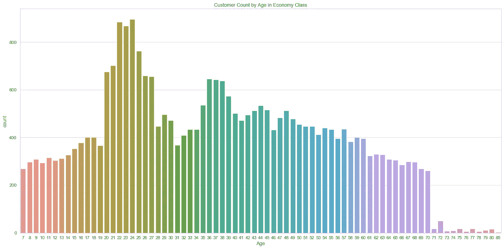
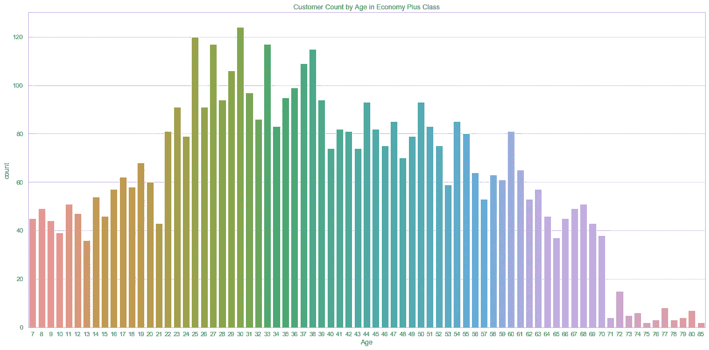
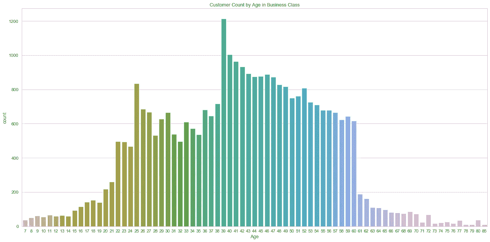
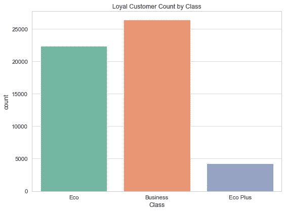
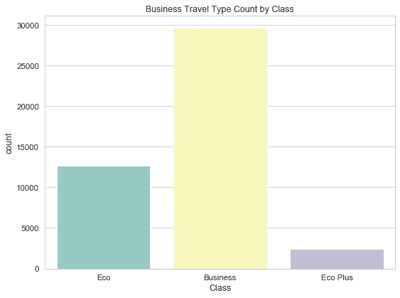
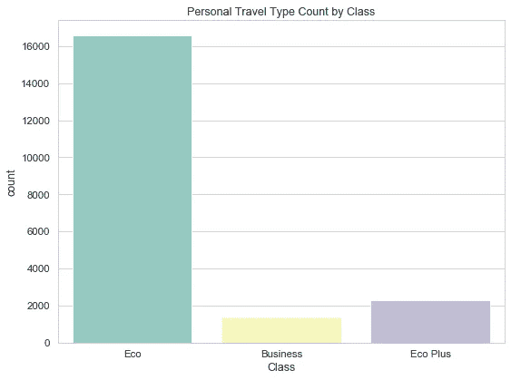
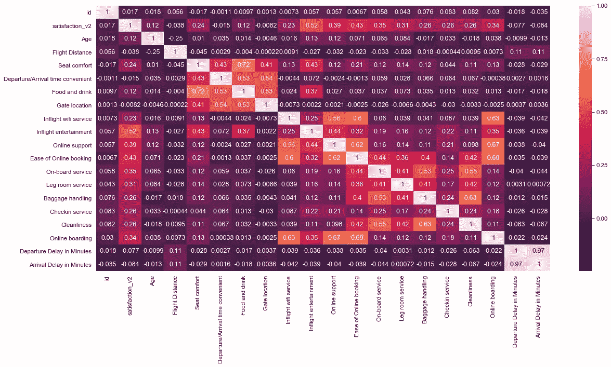
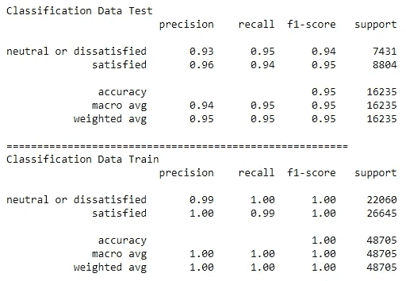
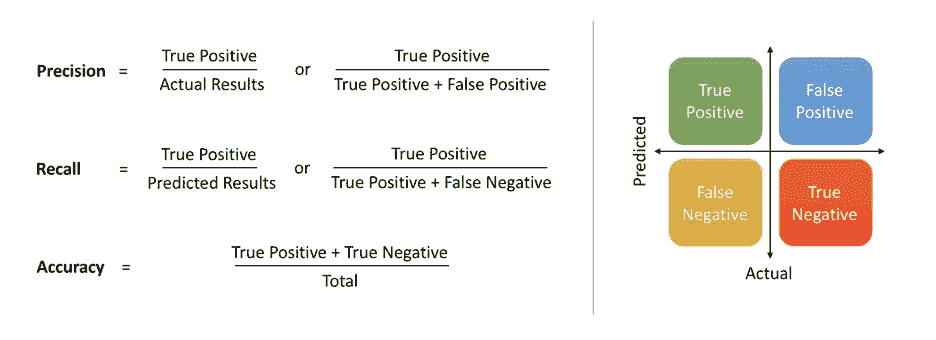
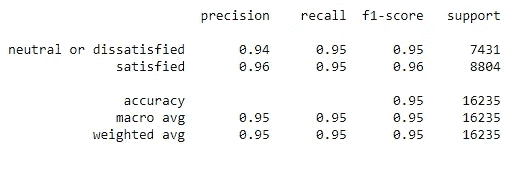

# 美国航空公司旅客满意度分析与预测:分类方法

> 原文：<https://medium.com/analytics-vidhya/analysis-passenger-satisfaction-prediction-on-us-airline-classification-method-d63332dfcd8?source=collection_archive---------2----------------------->


大家好！！现在，我想分享一下我在 kaggle 上得到的分析数据集。在我的上一篇文章中，我解释了用回归方法来预测华盛顿 DC 的住宅价格。现在，关于美国航空公司乘客满意度调查的数据集。通常，分类方法是当输出是一个类别时。例如在这种情况下，从已经完成的调查来看，客户如何感觉“满意”或“中性或不满意”。更详细的，让我们看看这个数据集中有什么！

# 关于数据的解释

这个数据集有 24 列 64940 行。我将尝试在“到达延迟分钟数”处清除填充列 nan 值的数据。很可能，我可以使用所有的特征进行预测。但是，在这部分之后，我可以总结出在探索性数据分析中热图上会使用哪些功能。

```
<class 'pandas.core.frame.DataFrame'>
RangeIndex: 64940 entries, 0 to 64939
Data columns (total 24 columns):
id                                   64940 non-null int64
satisfaction_v2                      64940 non-null object
Gender                               64940 non-null object
Customer Type                        64940 non-null object
Age                                  64940 non-null int64
Type of Travel                       64940 non-null object
Class                                64940 non-null object
Flight Distance                      64940 non-null int64
Seat comfort                         64940 non-null int64
Departure/Arrival time convenient    64940 non-null int64
Food and drink                       64940 non-null int64
Gate location                        64940 non-null int64
Inflight wifi service                64940 non-null int64
Inflight entertainment               64940 non-null int64
Online support                       64940 non-null int64
Ease of Online booking               64940 non-null int64
On-board service                     64940 non-null int64
Leg room service                     64940 non-null int64
Baggage handling                     64940 non-null int64
Checkin service                      64940 non-null int64
Cleanliness                          64940 non-null int64
Online boarding                      64940 non-null int64
Departure Delay in Minutes           64940 non-null int64
Arrival Delay in Minutes             64755 non-null float64
dtypes: float64(1), int64(18), object(5)
memory usage: 11.9+ MB
```

这是对原始数据集中每一列的解释。

```
- **Satisfaction** : Airline satisfaction level(Satisfaction, neutral or dissatisfaction).
- **Age :** The actual age of the passengers.
- **Gender :** Gender of the passengers (Female, Male).
- **Type of Travel :** Purpose of the flight of the passengers (Personal Travel, Business Travel).
- **Class : T**ravel class in the plane of the passengers (Business, Eco, Eco Plus).
- **Customer Type :** The customer type (Loyal customer, disloyal customer).
- **Flight Distance :** The flight distance of this journey.
- I**nflight Wifi Service:** Satisfaction level of the inflight wifi service (0:Not Applicable;1-5).
- **Ease of Online Booking :** Satisfaction level of online booking
- **Inflight Service :** Satisfaction level of inflight service.
- **Online Boarding :** Satisfaction level of inflight service.
**- Inflight Entertainment:** Satisfaction level of inflight entertainment.
**- Food and drink:** Satisfaction level of Food and drink.
**- Seat comfort:** Satisfaction level of Seat comfort.
**- On-board service:** Satisfaction level of On-board service.
**- Leg room service:** Satisfaction level of Leg room service.
**- Departure/Arrival time convenient:** Satisfaction level of Departure/Arrival time convenient.
**- Baggage handling:** Satisfaction level of baggage handling.
**- Gate location:** Satisfaction level of Gate location.
**- Cleanliness:** Satisfaction level of Cleanliness.
**- Check-in service:** Satisfaction level of Check-in service.
**- Departure Delay in Minutes:** Minutes delayed when departure.
**- Arrival Delay in Minutes:** Minutes delayed when Arrival.
```

# 数据预处理

首先，我检查这个数据集上的 nan 值是“到达延迟分钟数”列。我将尝试通过*出发延迟(分钟)来填充 nan 值(按舱位类型)。*

# 探索性数据分析

下一步，数据预处理后。我有一个干净的数据集，并准备好进行分析和预测功能和目标。首先，我想介绍一下机场客户的配送情况。

## 按类别和年龄划分的客户数量

旅客在机场的旅行等级除以 3 等级即*商务舱*、*经济舱加*、&、*经济舱*。本数据中年龄范围从 7 岁开始至 85 岁。旅行舱以 ***商务舱***(**47%)**&*经济舱*(**45%)**为主，其余均为 ***经济舱*** 的乘客数据。



这张图表显示了 20-27 岁的乘客占主导地位的经济舱。



这张图表显示了 22-39 岁的乘客占主导地位的经济舱和高级舱。但是这个班比其他班少。



该图显示了**商务舱**中的舱位等级，主要由 39-49 岁的乘客组成。

从所有图表中，我们可以得出结论，根据乘客的年龄，每个等级都有自己的市场份额。我们可以提供促销、优惠套餐或者免费机票，这些都是针对每一个有自己市场份额的级别的。可以与市场部分享和讨论。

## 忠诚顾客乘坐的是什么舱位？

该机场的客户类型分为 2 类，即*忠诚客户* & *不忠诚客户*。从数据来看客户类型以 ***忠诚客户* (82%)** ，为 ***不忠诚客户* (18%)** 。



几乎 90%的忠实客户使用商务舱和经济舱

## 按舱位计算旅行类型

该机场的旅行类型意味着乘客飞行的目的。出差类型除以 2 得出的类型称为*出差* & *个人出差。*从数据类型来看，以 ***商务旅行* (69%)** ，而 ***个人旅行* (31%)** 。



目的商务旅行以商务舱为主。



目的以商务舱为主的个人旅行。

## 每列的相关性

以便更好地呈现每列的相关性。我用的是热图，****热图*** *是数据的图形化表示，使用一个系统的* ***颜色编码*** *到* ***表示不同的值*** *。”——optimizely.com。*颜色越强，相关幅度越小，在此图中为深紫色。反之，颜色越亮，相关值越大，在此图中为淡奶油色。*

*从这张热图中，我想使用相关度大于 0.1 的特征，目标是乘客的满意度。*

**

*从图中可以看出，目前最大的相关性是 1，最小的相关性是 0。*

# *建模*

*最后一步，为了在这个数据集中建立模型，我将尝试使用几个分类模型，即**逻辑回归、决策树分类器**、**随机森林分类器和梯度推进分类器。**建模的步骤。*

1.  *找到预测乘客满意度的最佳算法。*
2.  *用*超参数预测最佳模型。**
3.  *具有召回率和精确度的评估。*

## *目标和功能*

*这是该建模的**目标(y)** 和**特征(x)** 。我从探索性数据分析中制作的热图中获取特征。*

1.  *目标是乘客的满意度。*
2.  ***特色**(性别、客户类型、年龄、旅行类型、舱位、
    座位舒适度、食物和饮料、飞行中 wifi 服务、飞行中娱乐、在线支持、在线预订便利、
    机上服务、腿部空间服务、行李搬运、
    值机服务、清洁度、在线登机)。*

## *特征工程*

*在中，特征工程的含义通常是将分类值(在分类列中)更改为数值。*

## *寻找最佳算法*

*在用特征工程对数据进行处理之后，数据准备好用于建模。我会试着比较四种算法，找出谁最适合预测这个数据。*

**

*随机森林分类器的结果*

*在我用过的所有算法中，召回率最好的**是**随机森林分类器**。我尝试比较数据测试和数据训练，以检测该模型是*欠拟合*还是*过拟合。*最后的结果很好，我们两个都得了高分。之前，我解释了这个算法的*超参数*。我将稍微讨论一下***。******

****

**图片来源:[https://towards data science . com/precision-vs-recall-386 cf9 f 89488](https://towardsdatascience.com/precision-vs-recall-386cf9f89488)**

*   ****真阳性:**标记为阳性但实际上是阳性的数据点。**
*   ****假阳性:**标记为阳性但实际为阴性的数据点。**
*   ****真阴性:**标记为阴性的数据点实际上是阴性的。**
*   ****假阴性:**标记为阴性但实际为阳性的数据点。**

****召回率和精确度指标****

*   ****回忆:**分类模型识别所有相关实例的能力。**
*   ****精度:**分类模型只返回相关实例的能力。**
*   ****F1 得分:**使用调和平均值结合召回率和精确度的单一指标。**

**因此，我们可以得出结论，该算法具有预测(实际上正确预测)该数据的得分，其中 **93%** 检测到*&***96%**检测到*满意*。*精度*和*回忆*对于分类方法来说极其重要。精度指的是相关结果的百分比，而召回指的是被我们的算法正确分类的相关结果的百分比。不幸的是，有些时候我们不能最大化他们的分数。对于另一种情况，可能需要权衡。用于决定是最大化*召回*分数还是*精度*。**

## **寻找最佳超参数**

**建模的下一步是找到最佳的*超参数。“在* [*机器学习*](https://en.wikipedia.org/wiki/Machine_learning) *中，一个* ***超参数*** *是一个* [*参数*](https://en.wikipedia.org/wiki/Parameter) *，其值是在学习过程开始之前设定的”——维基百科。***

**因此，我将尝试使用 GridSearchCV 为随机森林分类器(建模的最佳算法)找到最佳的*超参数*。 **max_depth** : 25，**min _ samples _ leaf**:0.000001，**min _ samples _ split**:0.000001 的模型**(RandomForestClassifier)**的结果*超参数*。**

## **最终建模**

**找到最佳*超参数后，下一步*将最佳*超参数*输入到模型中进行优化预测乘客满意度。所以，让我们开始用最好的*超参数*制作模型。**

****

**模型的结果优于默认参数**

**结论从这个数据的建模来看，*精度非常好，回忆&f1-得分 a* 与实际数据比较几乎 100%。一些参数没有包括在这个模型中，你可以找到更多更好的分数与其他参数。**

**以上都是我说的，希望你能从中领悟到这些数据。我做的每一个模型都还有很多错误和缺点。关于这些数据的更多细节，代码，和更多的可视化你可以通过点击这个链接[https://github.com/Anugrahn](https://github.com/Anugrahn)到达我的 github。随便问，让我们开始讨论家伙！**

**谢谢，我希望你们喜欢它。下一个故事再见。祝您愉快！:)**

**来源:**

1.  **来自 kaggle.com*的乘客满意度数据集***
2.  **scikitlearn 的原始文档**
3.  **关于*精度的定义，回忆，f1-分数*来自[*https://towardsdatascience.com/*](https://towardsdatascience.com/)**