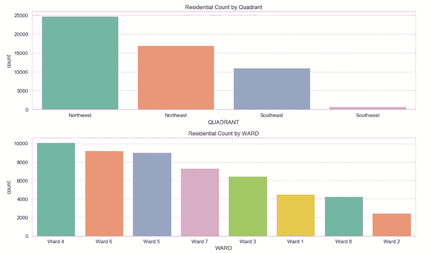

# 华盛顿 DC 住宅分析与价格预测:回归与集成方法

> 原文：<https://medium.com/analytics-vidhya/analysis-prediction-price-of-washington-dc-residential-regression-ensemble-method-8a2b2b4cf35f?source=collection_archive---------4----------------------->


大家好！！在这一刻，我会试着解释我在 kaggle 上得到的关于数据集的分析。关于华盛顿 DC 住宅的数据集。让我们从解释这些数据开始。

华盛顿特区是美国的首都。华盛顿的人口接近 70 万，在经历了半个世纪的人口下降后，自 2000 年以来一直在增长。这座城市高度隔离，生活成本很高。2017 年，该区单户家庭住宅的平均价格为 64.9 万美元。该数据集提供了对该地区住房存量的深入了解。

> 所有数据均可在开放数据中心获得..居住和地址点数据由首席技术官办公室管理

# **关于此数据的解释**

这个数据集有 158957 行 48 列。我将尝试清理数据集，因为该数据集缺少许多值。

在这个原始数据集中有预测不包括的变量。这里有一个关于这个数据的解释(data.info)。

```
<class 'pandas.core.frame.DataFrame'>
RangeIndex: 158957 entries, 0 to 158956
Data columns (total 48 columns):
BATHRM                158957 non-null int64
HF_BATHRM             158957 non-null int64
HEAT                  158957 non-null object
AC                    158957 non-null object
NUM_UNITS             106696 non-null float64
ROOMS                 158957 non-null int64
BEDRM                 158957 non-null int64
AYB                   158686 non-null float64
YR_RMDL               80928 non-null float64
EYB                   158957 non-null int64
STORIES               106652 non-null float64
SALEDATE              132187 non-null object
PRICE                 98216 non-null float64
QUALIFIED             158957 non-null object
SALE_NUM              158957 non-null int64
GBA                   106696 non-null float64
BLDG_NUM              158957 non-null int64
STYLE                 106696 non-null object
STRUCT                106696 non-null object
GRADE                 106696 non-null object
CNDTN                 106696 non-null object
EXTWALL               106696 non-null object
ROOF                  106696 non-null object
INTWALL               106696 non-null object
KITCHENS              106695 non-null float64
FIREPLACES            158957 non-null int64
USECODE               158957 non-null int64
LANDAREA              158957 non-null int64
GIS_LAST_MOD_DTTM     158957 non-null object
SOURCE                158957 non-null object
CMPLX_NUM             52261 non-null float64
LIVING_GBA            52261 non-null float64
FULLADDRESS           106040 non-null object
CITY                  106051 non-null object
STATE                 106051 non-null object
ZIPCODE               158956 non-null float64
NATIONALGRID          106051 non-null object
LATITUDE              158956 non-null float64
LONGITUDE             158956 non-null float64
ASSESSMENT_NBHD       158956 non-null object
ASSESSMENT_SUBNBHD    126406 non-null object
CENSUS_TRACT          158956 non-null float64
CENSUS_BLOCK          106051 non-null object
WARD                  158956 non-null object
SQUARE                158957 non-null object
X                     158720 non-null float64
Y                     158720 non-null float64
QUADRANT              158720 non-null object
dtypes: float64(15), int64(11), object(23)
memory usage: 59.4+ MB
```

# 数据预处理

首先，我想检查每列缺失值的百分比。


此表显示了每列缺失值的百分比

## 填充数据年模型

## **为每列降低 nan 值**

## **将列 FULLADDRESS 更改为 SUBADRESS，以便对住宅位置进行分组**

## 剔除数据价格中的异常值

如果你有时间，你可以访问我的 github，通过点击这个链接[https://github.com/Anugrahn](https://github.com/Anugrahn)来详细了解我的数据预处理。一些数据预处理在本文中没有解释。我试着为这些数据做最后的清理。

```
- The column Have 'No Data' in column HEAT (drop 'No Data')
- Drop 'Default' data in column CNDTN
- Change column AC value 0 to N
- Change column Quadrant from NE to (Northeast), NW (Northwest), SE (Southeast), SW (Southwest)
```

# 探索性数据分析

其次，第一步是数据预处理。我有一个干净的数据集，并准备好进行分析，以及用目标和功能进行预测。

这个关于华盛顿 DC 住宅销售的数据有 53317 行和 34 列。华盛顿 DC 的区域被分成几个**象限**。每个**象限**又分为**区**，每个**区**又分为**评估邻域**。

## 按象限和区域划分的住宅数量

华盛顿 DC 的象限是西北**、**东北**、**东南**、**西南**，每个象限又进一步划分为选区。**

*   **1 区由(亚当斯·摩根、哥伦比亚高地、霍华德大学、卡洛拉马等)组成**
*   ****2 区**由(伯利、唐人街、市中心、杜邦圈、联邦三角区等)组成**
*   ****3 区**由(塞维·蔡斯、克里夫兰公园、殖民地山、森林山等)组成**
*   ****4 区**由(布莱特伍德公园、克雷斯特伍德、佩特沃斯、殖民村)组成**
*   ****5 区**由(植物园、布伦特伍德、布鲁克兰、卡弗兰斯顿、密执安公园、据点等)组成**
*   **第六区由(凯普顿山、金曼公园、海军船坞、东北附近、司法广场等)组成**
*   **第 7 区由(本宁高地、本宁岭、伯维尔、中东北、绿道等)组成**
*   ****8 区**由(阿纳科西塔、巴里农场、贝尔维尤、道格拉斯、希普利台等)组成**

****

**该图从数据集中解释了华盛顿 DC 住宅区**象限西北**(4 区)&象限西南(2 区)最少的房产。**

## **按象限和区域划分的住宅数量**

**在象限和选区下面，华盛顿 DC 由**街区**和由**子地址**划分的街区划分。该数据集中记录有 **55 个邻居**和 **1186 个子地址**。**

****

**从该图中可以看出，按街区呈现的房产最多，结果是位于**老城 1** 的房产最多，位于**区 6** 的房产最多，位于**西南部的房产最多，位于**区的房产最多，位于子地址的房产最多。结果大部分房产都在**十三街**老城**1**区**6**西南**区****

## **按经度和纬度的分布样式**

**华盛顿 DC 住宅风格销售分为 17 类。这 17 种风格的住宅包括。**

*   **只有一层楼的房子**
*   **1.5 层的房子，主卧室套房在主楼层，其他卧室都在二楼。**
*   ****2 层**房子的主卧室套房和附加卧室位于房子的第二层。**
*   ****2.5 层** house 指的是带阁楼的两层楼的房子。**
*   **三层楼房是指一栋三层楼的房子，通常有一层用作生活空间和厨房。**
*   **3.5 层的房子意味着它是一栋带阁楼的 3 层房子。**
*   **房子是指一栋四层楼的房子。**
*   **4.5 层的房子是指一栋带阁楼的 4 层楼的房子。**
*   **错层住宅(又称三层住宅)是一种楼层交错的住宅风格。通常有两组短楼梯，一组向上通向卧室，一组向下通向地下室。**
*   ****错层门厅和双层**与错层相同，但在另一个不同的病房，称为。**
*   ****空置房产**是指连续四十五(45)天或以上未被合法占用和维护、未积极出售出租或未积极建设的住宅、商业、工业或混合用途房地产**
*   *****un Fin&Fin****关于放样尚未完成的含义***

**通过基于经度和纬度的地图样式，在华盛顿 DC 有可视化的住宅样式**

```
fig = plt.figure(figsize=(15,8))
sns.scatterplot(data=df, x= 'LATITUDE', y = 'LONGITUDE', hue = 'STYLE' , alpha = 0.5)
plt.tight_layout()
```

****

**从这个图表我们可以得出结论，大约最主要的风格是 2 层，几乎 80%的主导房屋风格在华盛顿 DC 住宅。**

## **华盛顿 DC 住宅区的分配价格**

**当按住宅风格分类时，DC 华盛顿州的房价的可视化。可以看出，如果 2 层风格的住宅是最占主导地位的比其他。DC 华盛顿州的三大住宅风格。**

*   **2 故事:42097**
*   **3 故事:4347**
*   **2.5 故事结局:3013**

****

**从这张图中可以看出华盛顿 DC 住宅区的房价分布，红色图标代表华盛顿市中心。华盛顿 DC 住宅平均价格为 650.000 美元。**

```
fig, ax = plt.subplots(1,1,figsize=(20,20))
sns.boxplot(data=df, x='STYLE', y='PRICE',ax=ax[0],)
ax[0].set_title('Distribution Price vs Residential Style')
plt.tight_layout()
```

****

**在华盛顿以 2 层和 3 层为主的风格住宅有最高的价格范围。**

# **建模**

**最后一步，为了制作这个数据集中的模型，我将尝试使用几个回归模型，即**随机森林回归器**、 **Lasso** 、**线性回归器**、 **Lasso** 、 **Ridge 和 XGB 回归器。**造型的步骤。**

1.  **寻找预测房价的最佳算法**
2.  **用*超参数*预测最佳模型**
3.  **用平均绝对误差、均方误差和均方根误差进行评估**

## **目标和功能**

**这是该建模的目标(y)和特征(x)。**

1.  ****目标**是住宅价格**
2.  ****特征**(象限、病房、评估小区、房间、浴室、半浴室、供暖、空调、年改造、合格住宅、总建筑面积、风格住宅、结构住宅、等级、条件、外墙、屋顶、内墙、厨房、消防场所等)**

## **寻找最佳算法**

**首先，我将尝试使用先前已经提到的六种算法的缺省参数。我做的一些过程是。**

1.  **对住宅*栏* & *条件*进行标签编码。**
2.  **比较热编码和二进制编码的建模。**
3.  **比较采用一种热编码的标准定标器与采用二进制编码的标准定标器。**
4.  **比较主成分分析(一个热编码和标准定标器)与主成分分析(二进制编码*标准定标器)。**

**经过这个过程，我找到了最佳算法。从所有算法中，模型的最佳得分将是使用 **XGBRegressor** 和处理**二进制编码** & **standardscaler。****

****

**用**二进制编码** & **standardscaler (** 默认参数)建模的结果。**

## **寻找最佳超参数**

**建模的下一步是找到最佳的*超参数。“在* [*机器学习*](https://en.wikipedia.org/wiki/Machine_learning) *中，一个* ***超参数*** *是一个* [*参数*](https://en.wikipedia.org/wiki/Parameter) *，其值是在学习过程开始前设定的”——维基百科。***

**因此，我将尝试使用 GridSearchCV 为 XGBRegressor(建模的最佳算法)找到最佳的超参数。**max _ depth = 5**&**learning _ rate = 0.1**的模型 **(XGBRegressor)** 的结果*超参数***

## **最终建模**

**在找到最佳算法和*超参数*后，将*超参数*输入到房价预测优化模型中。用于将数据集分成训练数据和测试数据。我尝试使用两种方法(训练测试分割& Kfold ),最好是使用 Kfold，这是结果的代码。**

**平均绝对误差值为 139751.85，均方根误差值为 192406.14。**

**比较这些指标:**

1.  **MAE(平均绝对误差)是最容易理解的，因为它是平均误差。**
2.  **RMSE(均方根误差)甚至比 MSE 更受欢迎，因为 RMSE 可以用“y”单位来解释。**

**所有这些都是损失函数，因为我想最小化它们。所以，MAE 和 RMSE 的值越小，意味着你的模型越好。**

## **模型的残差**

**最后，我想展示我的模型预测与数据中真实目标的残差(y_test)。**

****

***该图解释了模型与真实目标(y_test)的预测分布，结果是数据呈正态分布。***

**以上都是我说的，希望你能从中领悟到这些数据。我做的每一个模型都还有很多错误和缺点。关于这些数据的更多细节，代码，和更多的可视化你可以通过点击这个链接[https://github.com/Anugrahn](https://github.com/Anugrahn)到达我的 github。**

**随便问我任何事情。也许我们可以讨论数据，我们如何在数据中获得最佳模型，以及更多关于任何事情的信息。如果你对这些数据有任何想法，你可以回复并纠正我，因为也许我做的分析仍然有很多错误。**

**谢谢，我希望你们喜欢它。下一个故事再见。祝您愉快！:)**

**来源:**

1.  **数据集来自 kaggle.com 的华盛顿 DC 住宅**
2.  **scikitlearn & xgboost 的原始文档。**