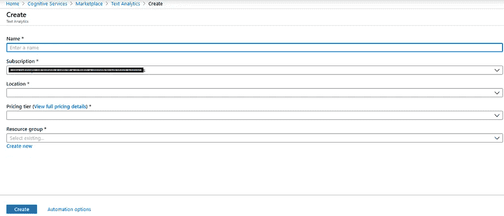

# 使用 Azure 文本分析服务分析正面或负面的新闻更新

> 原文：<https://medium.com/analytics-vidhya/analyze-news-updates-as-positive-or-negative-using-azure-text-analytics-service-2c3abeaa1c61?source=collection_archive---------20----------------------->

你有一堆新闻更新或标题(可能是一年)，你想用 Azure 文本分析服务从列表中获得正面(好消息)和负面(坏消息)标题的数量。让我们开始吧。

# 先决条件

1.  Python3 和 Flask 关于创建 API 的知识
2.  Azure 订阅
3.  Ubuntu 16.04 机器(你可以在任何操作系统上这样做，但我将使用给定的)

# 使用的技术

1.  Python3 和 Flask
2.  Azure 认知服务— Azure 文本分析
3.  面向 Azure 认知服务的 Python SDK

按照步骤开始-

1.  登录您的 Azure 订阅并搜索 Azure 认知服务
2.  创建文本分析服务。见下图-



创建 Azure 文本分析服务

3.创建后，获取您的订阅密钥和 API 端点

4.使用下面给出的代码为任何输入创建一个文本分析器服务—(确保您已经安装了所有必备的软件包)

```
import flask
from flask import request, jsonify[@app](http://twitter.com/app).route('/detect/sentiment', methods=['GET'])
def detect_sentiment():
    if 's' in request.args:
        user_string = request.args['s']
        documents = {'documents': [
            {'id': '1', 'language': 'en', 'text': user_string}
        ]}

        subscription_key = "your subscription key"
        sentiment_api_url = "[https://westcentralus.api.cognitive.microsoft.com/text/analytics/v2.0/sentiment](https://westcentralus.api.cognitive.microsoft.com/text/analytics/v2.0/sentiment)"
                headers = {"Ocp-Apim-Subscription-Key": subscription_key}
        response = requests.post(sentiment_api_url, headers=headers, json=documents)
        sentiment = response.json() sentiment_dict = sentiment['documents'][0] # Make the value in percent
        sentiment_val = float(sentiment_dict['score']) * 100 if sentiment_val < 25:
            sentiment_dict['priority'] = "Negative News"
        elif sentiment_val > 85:
            sentiment_dict['priority'] = "Positive News"
        else:
            sentiment_dict['priority'] = "Failed "

        return jsonify(sentiment_dict) else:
             return jsonify({"error": "404"})# Run the app on All IP and 8082 port
app.run(host='0.0.0.0', port=8082)
```

4.使用以下命令执行上述服务-

```
# python3 file-name.py
```

5.服务必须在 [http://localhost:8082](http://localhost:8082) 上运行。如果您有本地环境设置或者如果您有公共 IP 或域名，它必须在 [http://domain-or-ip:8082](http://domain-or-ip:8082) 上可访问

6.启动您最喜欢的浏览器，将 url 与您想要分析的消息粘贴在一起—

```
http://localhost:8082/detect/sentiment?s= The flood immediately killed over 100,000 people, and another 150,000 died of subsequent epidemic diseases and famine, bringing the total death toll to around 250,000 and making it the worst technical disaster ever
```

7.在上面的 URL 中我们正在分析下面给出的字符串是正面的还是负面的消息

```
The flood immediately killed over 100,000 people, and another 150,000 died of subsequent epidemic diseases and famine, bringing the total death toll to around 250,000 and making it the worst technical disaster ever
```

8.你会得到以下回应-

```
{
  "id": "1", 
  "priority": "Negative News", 
  "score": 0.019632428884506226
}
```

就是这样朋友们！我们已经完成了 analyzer，它可以将标题作为输入，并自动通知我们这是一条正面消息还是负面消息。留给你的是一个前端，你可以开发和使用上述逻辑做更多的新闻分析。