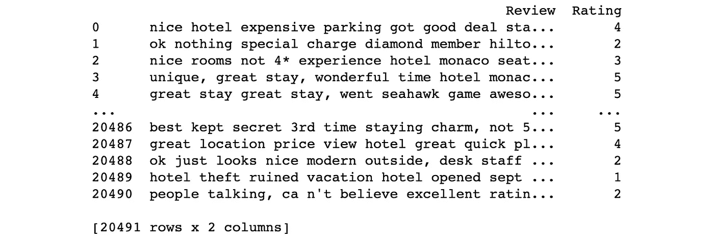
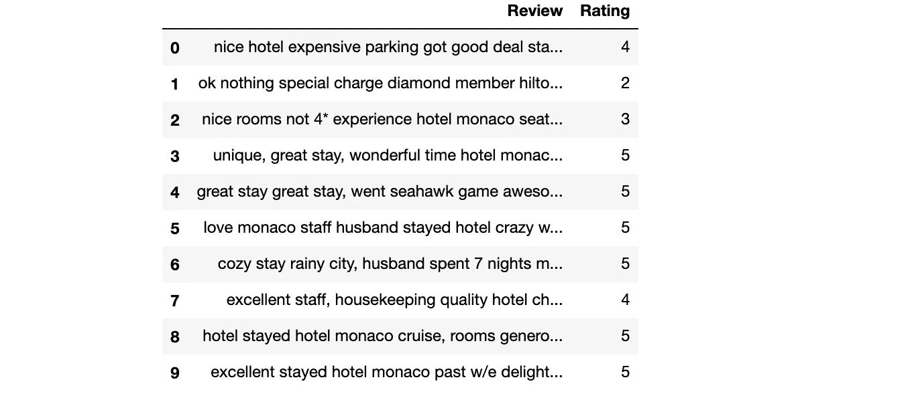
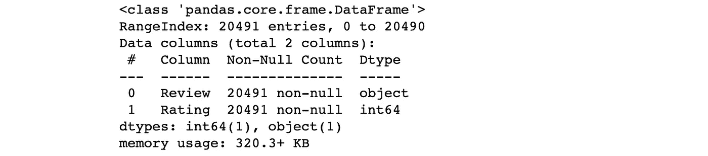
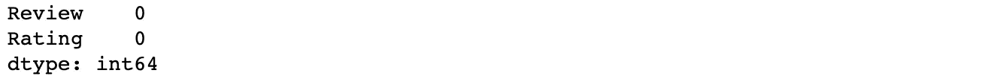
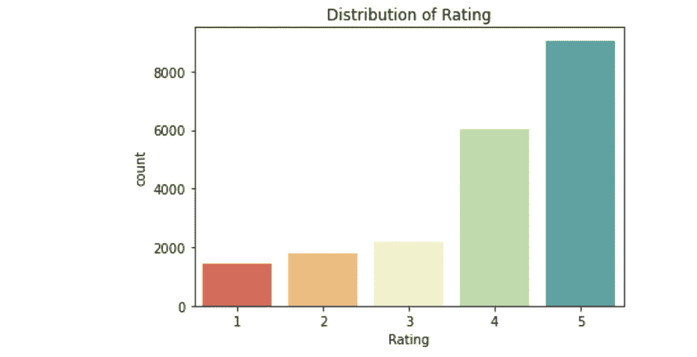
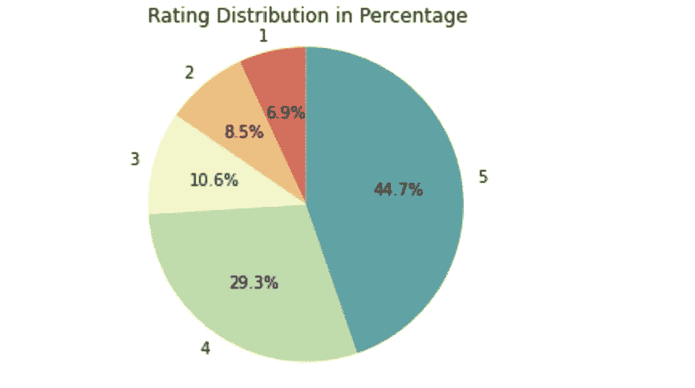
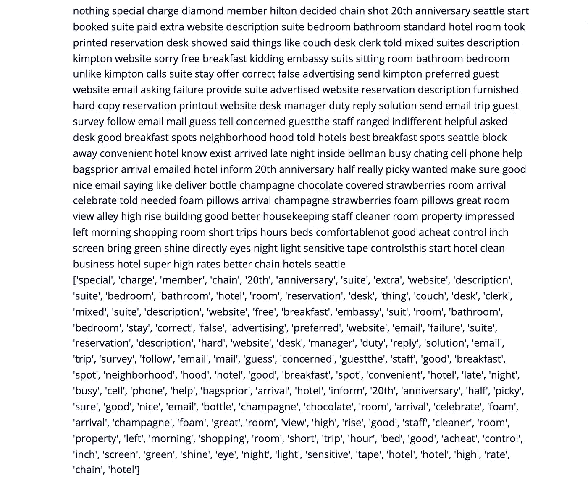
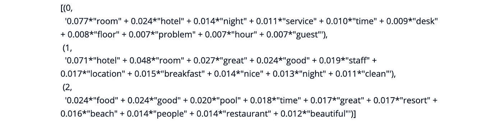
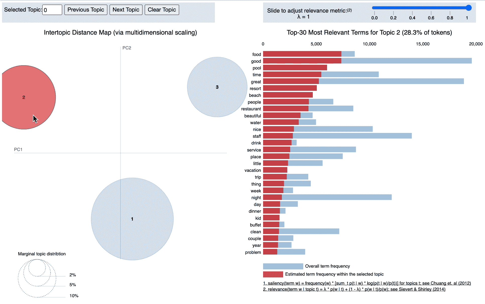

# 分析 Trip Advisor 酒店评论:LDA 主题建模

> 原文：<https://medium.com/analytics-vidhya/analyze-trip-advisor-hotel-reviews-lda-topic-modeling-2c1a56e35a09?source=collection_archive---------7----------------------->

酒店的好坏取决于什么？对旅行者来说什么是重要的？让我们找出答案。


酒店在旅行中起着至关重要的作用，随着信息的增加，选择最佳酒店的新途径出现了。
有了[这个数据集](https://www.kaggle.com/andrewmvd/trip-advisor-hotel-reviews)，由从 Trip advisor 抓取的 20k 条评论组成，我将把 LDA 应用于:

*   发现评论中提到的热门话题和关键词
*   探索决定酒店好坏的关键因素

# 潜在狄利克雷分配

[**主题模型**](https://en.wikipedia.org/wiki/Topic_model) 是一种统计**模型**，用于发现文档集合中出现的抽象“主题”。 [**潜在狄利克雷分配**](http://blog.echen.me/2011/08/22/introduction-to-latent-dirichlet-allocation/) (LDA)是主题模型的一个例子，用于将文档中的文本分类到特定主题。它建立了每个文档的主题模型和每个主题的单词模型，建模为 Dirichlet 分布。

我们开始吧！

## 导入数据集



取数据的峰值

```
df.head(10) #Return the first 10 rows
```



```
df.info()
```



## 检查空值

```
df.isna().sum()
```



## 可视化评分分布



根据评分分布，我们可以看到酒店总体表现良好。正面评价(4&5 分)占总评价的 74%。

但是决定和促成积极/消极体验的因素是什么呢？可以利用的是什么？有什么可以改进的？

通过回答这些问题，人们可以更好地了解客户，并有望发现商机和弱点。

## 准备模型


## 预处理数据

在这里，我们将执行以下操作:

*   **分词**:拆分文本，将其分割成单词。将单词小写，去掉标点符号。
*   所有的**停用词**都被删除——它们被从给定文本中删除或排除，以便将更多的注意力放在那些定义文本含义的词上。
*   单词被词条化——旨在仅移除屈折词尾，并返回单词的基本形式或词典形式。



## **潜在狄利克雷分配(LDA)**

主题建模

在这里，我将主题编号设置为 3，因为我怀疑这些评论会分为积极、中立和消极三类。您可以随意尝试这个数字。为了保证最高的相关性，你可以参考这篇文章:[寻找最佳主题数量的方法](https://www.machinelearningplus.com/nlp/topic-modeling-gensim-python/#14computemodelperplexityandcoherencescore)。

现在，对于每个主题，我们将探索在该主题中出现的单词及其相对权重。



## **这 3 个话题的关键词:**

*   话题 0:房间，酒店，晚上，服务，时间，桌子，楼层，问题，小时，小，员工，水，问题…
*   主题 1:酒店，房间，很棒，很好，员工，位置，早餐，不错，晚上，干净，友好，面积，有帮助，舒适…
*   话题 2:食物，好，游泳池，时间，棒极了，度假村，海滩，人，餐厅，美丽，水，尼斯，工作人员…

根据关键词，我们可以将它们归类为:

*   **负面的酒店体验**(主题 0)——从这一类别的关键词来看，问题似乎往往与等待时间、预订问题、肮脏和响度有关。
*   **积极的酒店体验**(话题 1)——在这个话题中，我们可以看到大多数积极的评论都提到了房间、位置、员工和早餐。这告诉我们评论所基于的标准，所以基本上对客户来说什么是重要的。我们也可以在这里注意到“有益的”这个词。这可能表明，当问题出现时，员工如何处理情况会产生真正的影响，并留下持久的记忆。
*   **积极的度假酒店体验**(话题 2)——我们了解到度假酒店必须受欢迎，而造就一个好的度假场所的因素包括位置/环境，如海滩、人、餐厅等。



## 相关性水平

```
Perplexity:  -7.163128068315959
Coherence Score:  0.3659933989946868
```

**困惑**是概率模型预测测试数据的程度的度量。主题**连贯性**通过测量主题中高得分单词之间的语义相似度来测量单个主题的得分。简而言之，通过查看困惑和连贯性得分，我们可以了解每个主题中单词的相关程度。困惑度越低越好。连贯性分数越高越好。在这种情况下，相关性相当低。

# 商业应用

## 限制

## 见识

从术语列表中，我们可以看到“房间”一词在所有类别的列表中名列前茅，因此我们可以认为这是所有旅行者都会考虑的主要产品方面。

参考:[https://www.youtube.com/watch?v=nNvPvvuPnGs](https://www.youtube.com/watch?v=nNvPvvuPnGs)

希望这是有帮助的！我期待听到任何反馈或问题。

