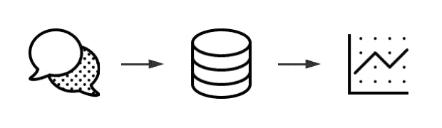
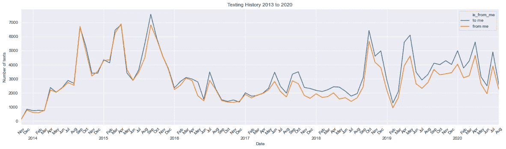
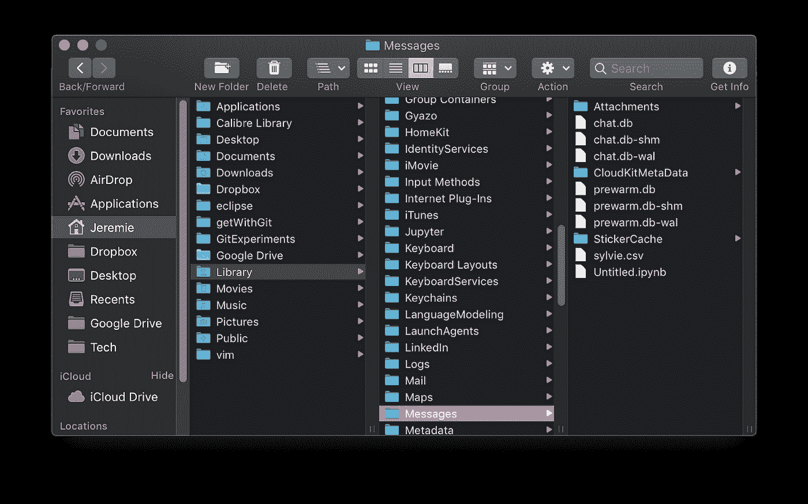
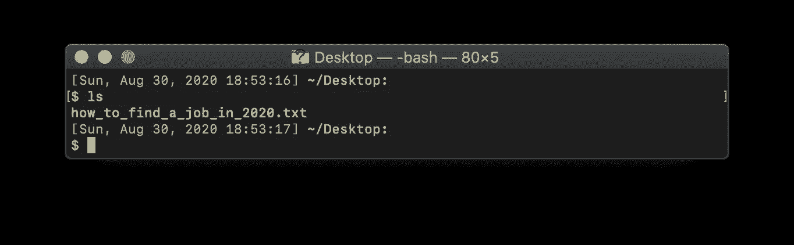
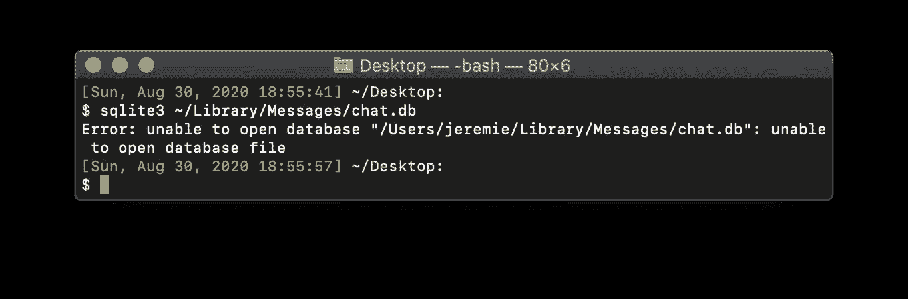
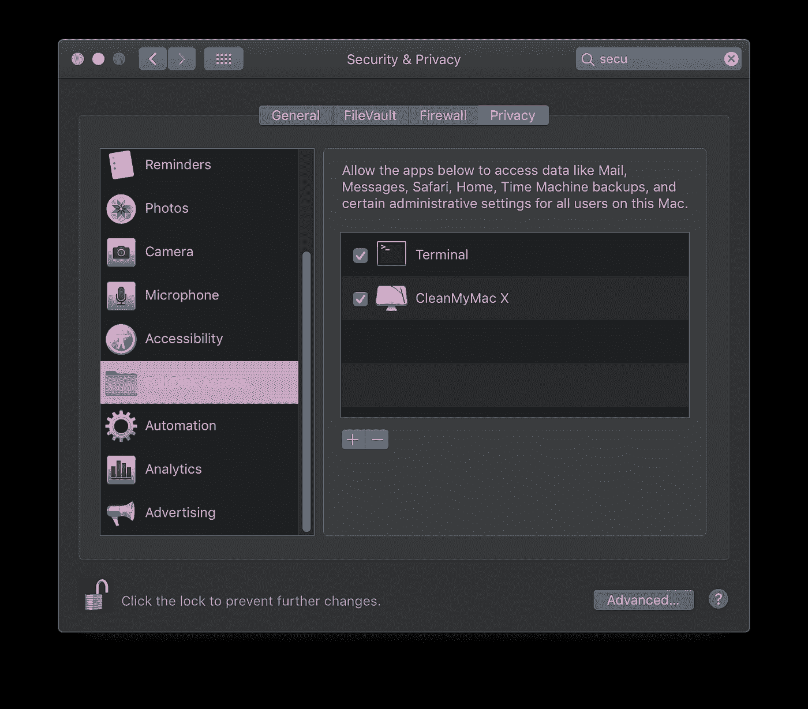
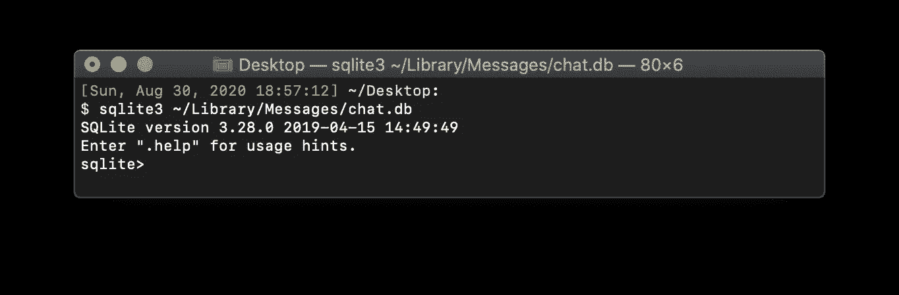
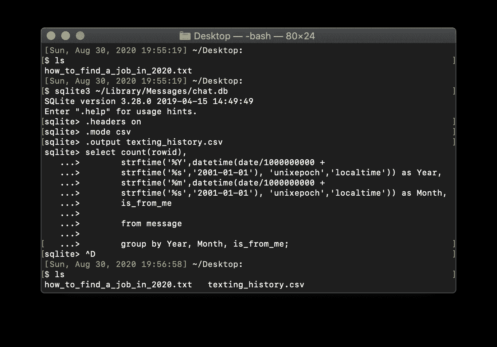
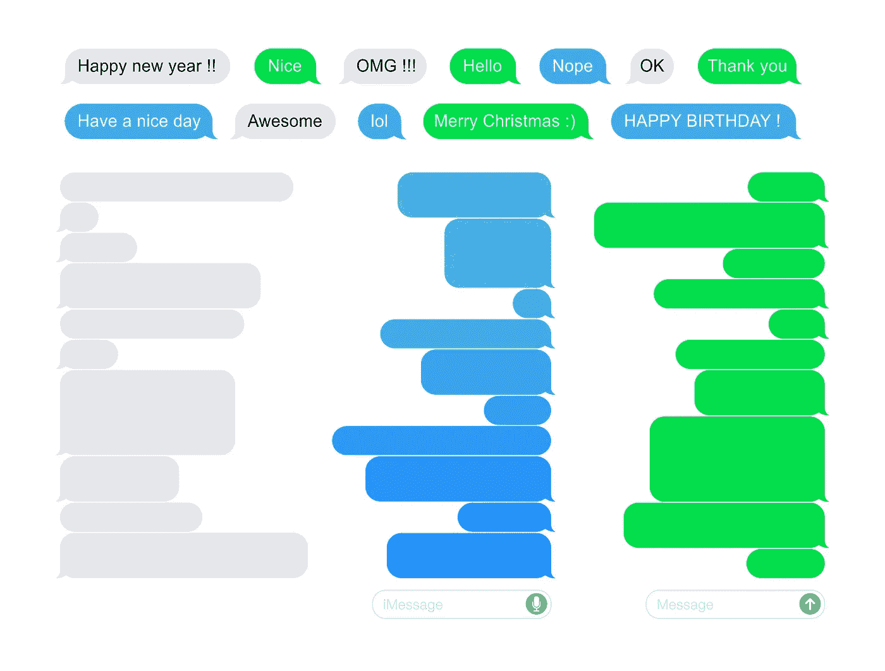

# 分析你在苹果生态系统中的短信习惯

> 原文：<https://medium.com/analytics-vidhya/analyze-your-texting-habits-using-sql-and-python-bd440de5d114?source=collection_archive---------13----------------------->

使用 Python 和 SQL 开发一个时间序列图来分析你在苹果生态系统中的短信流量和习惯。

## 介绍

寒假期间，我在 Mac 电脑上发现了两个隐藏的功能，这让我陷入了数据查询和分析的泥潭。我能够通过在终端中使用 SQLite3 来访问我的文本消息(即 iMessage)的隐藏数据库。这对我意义重大；我可以可视化和分析我的数据，以确定发短信的习惯，并希望了解自己的一些情况。

下面是我使用 SQLite3 和 Python 以及 seaborn 库得到下图的步骤。这是一次有趣的学习经历，我建议尝试一下。实际的代码文件可以在 [GitHub](https://github.com/jerall24/sql_analyze_imessage) 上找到:

**Chat.db**

[这篇文章](https://towardsdatascience.com/heres-how-you-can-access-your-entire-imessage-history-on-your-mac-f8878276c6e9)介绍了 macOS 中隐藏的聊天数据库。但是有一个问题——数据库是不可访问的。你必须用别的东西来读取和操作数据。但是这个发现对于正在学习数据分析的人来说意义重大。

chat.db 在 finder 中的位置

这个数据库保存了你发送和接收的所有文本的元数据。它会告诉你日期和时间(UTC)，你是否发送了它，文本的接收者，等等。那里有如此多的信息可以用来理解你如何与人互动。在实际尝试分析数据之前，您必须检索数据。

**端子**中的 SQLite3

上面链接的文章不仅介绍了如何访问数据库，还介绍了如何与之交互。作者使用了 SQLite3 和 Python 的组合来提取数据，并创建了熊猫数据框架。

在这个项目中，你将做一些类似的事情，但是看看你的整个历史。

## **设置好一切**

首先要做的是打开终端。通过同时按下 CMD+ENTER 在 Mac 中搜索“终端”来访问终端。一旦你打开它，你就可以开始了。

**步骤 1:导航至所需文件夹**

在本教程中，我们将从桌面工作，所以你不需要知道两个以上的命令。首先将所需的文件夹作为您的活动目录。您可以使用以下命令来完成此操作:

出于本教程的考虑，您可以简单地使用下面的命令。这将使生成的电子表格保存到您的桌面上。

使用以下命令列出当前文件夹中的文件。

这篇[文章](https://computers.tutsplus.com/tutorials/navigating-the-terminal-a-gentle-introduction--mac-3855)很好地介绍了终端以及如何使用它——第 2 步和第 5 步给了你真正需要的所有信息。

一旦成功导航，将活动目录更改为您想要工作的文件夹，您就可以开始访问数据库了。我们可以在不移动活动目录的情况下访问数据库。我们只需要在特定的数据库对象上运行 SQLite3。我们通过使用以下命令来实现这一点:

**第二步:运行 SQLite**

注意:您可能会得到如下所示的错误，提示您无法打开数据库。按照以下步骤修复此错误。

如果您收到此错误，请给予终端完全磁盘访问权限。您可以通过导航到系统偏好设置>安全与隐私>隐私选项卡来完成此操作。一旦在隐私标签，找到完整的磁盘访问部分，并启用终端复选框。你需要打开左下角的锁才能进行更改。一旦你检查了接线盒，重新锁上锁，试着再运行一次代码。

这个命令应该是通用的，除非您移动了主目录或 chat.db 文件的位置。如果 SQLite3 成功启动，您可以编写代码来提取数据。

## **查询你的聊天记录**

为了将查询导出到 excel 文档，我们必须准备一些代码。为此，请编写以下内容:

**第三步:设置导出**

将<file_name>替换为您想要的文件名。上面的代码只是说将数据导出到一个. csv 文件，并打开文件头。文件将被保存到您运行 SQLite3 函数的文件夹中(对我们来说是桌面)。</file_name>

**步骤 4:运行查询**

现在将这段代码复制到终端来执行查询:

上面的代码选择了四条信息:按月、年和收件人名称分组的文本计数，也就是你是否发送或接收了它。它将数据分组在一起，以便给出的信息显示您使用 iMessage 的每个月发送和接收的短信数量。

Apple 将日期和时间存储为一个整数值，以 2001 年 1 月 1 日之后的秒数表示。为了获得正确的时间格式，请使用 strftime()和 datetime()函数。在这里阅读 strftime()和 datetime() [。](https://www.sqlite.org/lang_datefunc.html)

通过运行这段代码，您将获得 excel 文档，其中包含您使用 iMessage 的每一年每月发送和接收的文本数量。

您的终端和桌面应该看起来像这样:

## 可视化您的数据

现在，您希望使用 Python 的 seaborn 库来可视化数据。我们将使用 Jupyter 笔记本进行安装，如果您没有，您可以在此处找到安装说明。

你需要安装 [seaborn](https://seaborn.pydata.org/index.html) 、 [matplotlib](https://matplotlib.org/) 、 [pandas](https://pandas.pydata.org/) 和 [numpy](https://numpy.org/) 库。如果不使用下面的命令。

现在下载 [GitHub repo](https://github.com/jerall24/sql_analyze_imessage.git) 中的 create _ text _ history _ chart . ipynb 并保存到你的桌面。之后，打开朱庇特笔记本。

打开 create _ text _ history _ chart . ipynb:

访问 GitHub 上的完整文件

打开文件，单击运行>运行所有单元。这将运行整个脚本并将图像保存到您的桌面。该图像将是您对下图的理解。

## **总结**

通过阅读这些数据，你可以了解到许多有趣的事情。我证实了一些关于我发短信习惯的假设，并学到了一些新东西，例如，当我在谈恋爱时，我不会发那么多短信。数据库中保存了如此多的信息，可以用来了解自己。总的来说，这是一次很好的学习经历，让我了解了自己，也学到了一些非常有用的技能。我建议你自己尝试一下；有了这个指南，你应该不会花很长时间来完成这些措施。

可以扩展的几个领域是非 iMessage 通信平台，如 Facebook Messenger、WhatsApp、微信等。这些都对我们的交流方式产生了深远的影响，并将导致人们在形象上的差异。iMessage 群聊显示我收到的短信比发送的多，这也扭曲了结果。

请随时联系我讨论这个问题。我很想听听我如何改进这一点，发现更好的方法，或者我如何阅读这些数据。

热雷米·阿拉德

[JeremieAllard.com](https://www.jeremieallard.com)|[LinkedIn](https://www.linkedin.com/in/jeremiea/)|[GitHub](http://github.com/jerall24)

