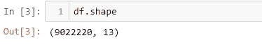

# 用 Python 分析亚马逊森林火点第 1 部分

> 原文：<https://medium.com/analytics-vidhya/analyzing-amazon-forest-fire-spots-with-python-part-1-ce9d8ba23cf0?source=collection_archive---------11----------------------->


图片由格雷戈·尼斯[https://flic.kr/p/6dhVkZ](https://flic.kr/p/6dhVkZ)拍摄

亲爱的读者，在本帖中，我将探讨我是如何使用 Python 来探索亚马逊森林中火点的数据集的。

在第 1 部分中，您将学习:

*   如何导入多个 CSV 文件到一个单一的熊猫数据框架。
*   创建一个带有自定义函数的 Python 文件，并在 Jupiter 笔记本中使用它们。
*   如何探索一个有一百万行的数据集？
*   更改列数据类型。
*   创建辅助列。

如果你是 Python 的新手，看看我关于[写你的第一个 Python 代码](/@bkexcel2014/write-your-first-python-code-using-four-mouse-clicks-no-installation-required-d60ad17f3486)的帖子，如果你是熊猫数据框[的新手，看看这篇帖子。](/@bkexcel2014/python-basic-data-cleaning-using-pandas-4fd427735e1e)要在 windows 中安装 Python 和 Jupyter notebook，您可以[观看这个 youtube 教程。](https://www.youtube.com/watch?v=dgjEUcccRwM&t=383s)

# 数据源:

数据包括 2007 年 1 月至 2019 年 8 月巴西境内亚马逊森林火点的纬度和经度。数据收集自巴西[国家空间研究所(INPE)](http://queimadas.dgi.inpe.br/queimadas/bdqueimadas) ，访问日期为 2019 年 9 月 20 日。你也可以直接从我的 Github 下载文件[。](https://github.com/berkurka/amazonfire/tree/master/Data)


INPE 基地-德达多斯-德凯马达斯

# 导入库:

```
import pandas as pd
import my_functions
```

“my_functions”是我用自定义函数创建的 python 文件，保存在与 Jupyter 笔记本相同的文件夹中。这是一种保持笔记本整洁的形式，并存储可在其他项目中使用的可重用代码。唯一需要注意的是，您需要重启笔记本内核来导入 my_functions 文件中的任何更新。为了创建 python 文件，您可以使用记事本等文本编辑器插入 Python 函数并保存文件。py 到文件名的末尾。我一直使用崇高的文本编辑器[https://www.sublimetext.com/](https://www.sublimetext.com/)和记事本++[https://notepad-plus-plus.org/](https://notepad-plus-plus.org/)。

# 导入数据:

下面的代码导入一个 CSV 文件。

```
path = './Local Data/'
file = 'filename.csv'
df = pd.read_csv(path + file, sep=';')
```

在这个项目中，数据存储在 13 个 CSV 文件中。我创建了一个自定义函数，将它们全部导入到数据框中。原来的列名是葡萄牙语的，所以该函数也重命名列并更改列类型。

在这里获取完整功能:[https://github . com/berkurka/Amazon fire/blob/master/my _ functions . py](https://github.com/berkurka/amazonfire/blob/master/my_functions.py)

使用上面的函数，我将所有的 CSV 文件导入到一个数据框中。


# 探索数据:

这些是我用来探索新数据集的一些方法。

1.  df.shape
2.  df.head()或 df.sample()
3.  df.dtypes & memory_usage
4.  df.isnull()。总和()
5.  df.describe()

**1。df.shape:** 返回数据框中的行数和列数。



**2。df.head()或 df.sample(5):** 返回前 5 行或 5 行随机样本。从下面的结果中，我们可以了解每一列的内容。


**3。df . dtypes&df . memory _ usage()**:检查表中的数据类型是否是您所期望的，这一点总是很重要。在这种情况下，Date 列是一个对象，需要转换为 DateTime。使用下面的代码，您可以检查每一列的类型和内存使用情况，注意字符串列消耗大量内存，我不会在这篇文章中处理优化内存使用的问题，但一个选项是将字符串列转换为分类。

```
pd.DataFrame({'Column Type':df.dtypes, 'Memory Usage': df.memory_usage(deep=True)}) 
```


日期列是一个字符串，为了将它从对象转换为日期时间，我使用了下面的代码。

```
df['Date'] = pd.to_datetime(df['Date'], format='%Y/%m/%d %H:%M:%S')
```

如果日期格式与`YYYY/mm/dd hh:mm:ss`不同，您需要更改 pd.to_datetime 函数中的 format 参数，所有格式选项都可以在本网站[http://strftime.org/.](http://strftime.org/.)中找到

导入 CSV 文件时，也可以转换日期列。

```
date_column_names = ['Date'] #List of columns names with date format
pd.read_csv('./file.csv', parse_dates = date_column_names)
```

将日期列转换为日期时间后:


**4。df.isnull()。sum():** 计算每列中有多少个空值。


**5。df.describe():** 创建描述性统计来汇总数据帧。根据使用的数据类型，输出会有所不同。在第一个图像中，参数`include=['float']`将只在浮动列上运行 describe 函数。


so Felix do Xingu 是观测数量最多的县。


数据来自不同的州，28 个不同的卫星，547 个县，562，618 个不同的日期时间。

# 创建辅助列:

为了方便数据探索，我创建了一些时间辅助列。

```
df['Day'] = pd.to_datetime(df['Date']).dt.normalize()
result['Month'] = result['Date'].dt.strftime('%m').astype(int)
result['Year'] = result['Date'].dt.strftime('%Y').astype(int)
```

新列是这样的:


有了蛾和年列，我可以很容易地使用`.value_counts()`:


从 9 月到 11 月，有更多的火点，这是有道理的，因为巴西的雨季高峰是在 12 月和 1 月。


sad2017 年和 2015 年是去除重复之前火点数量最多的年份。

下面的代码在不创建辅助列的情况下按年份进行计数。

```
df["Date"].dt.year.value_counts() 
df.set_index(df["Date"])['State'].resample('Y').count()
```

在我的下一篇文章中，我将尝试删除重复，因为同一个火点可能会被计数两次或更多次，我将生成一些很酷的可视化效果。

感谢阅读！