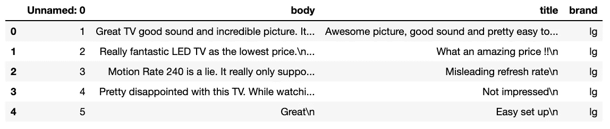
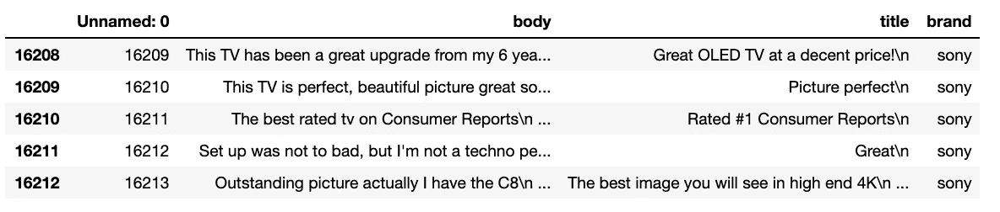
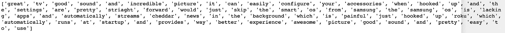
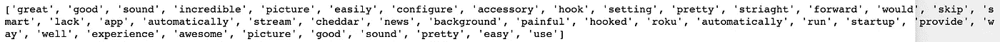
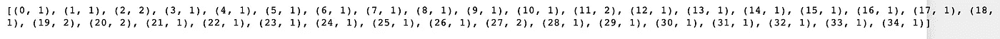
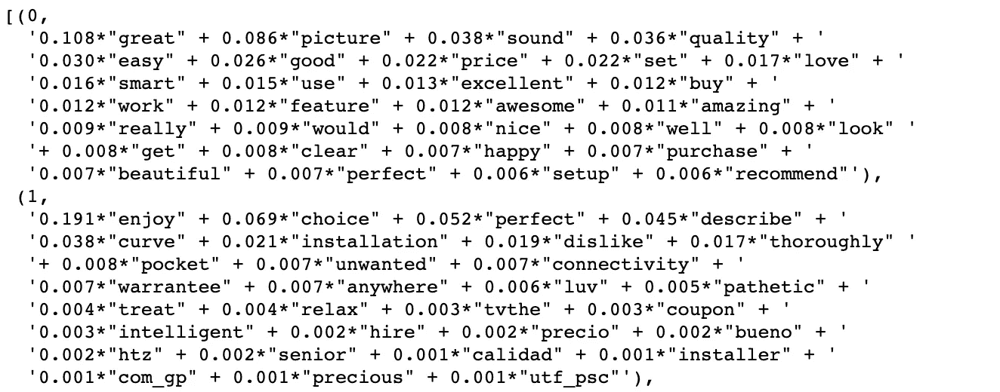
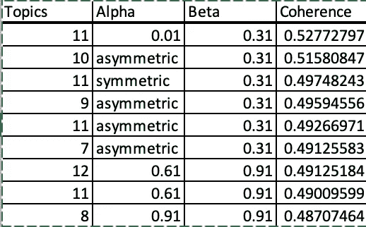
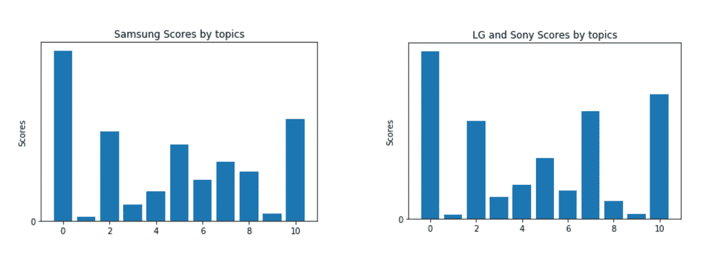
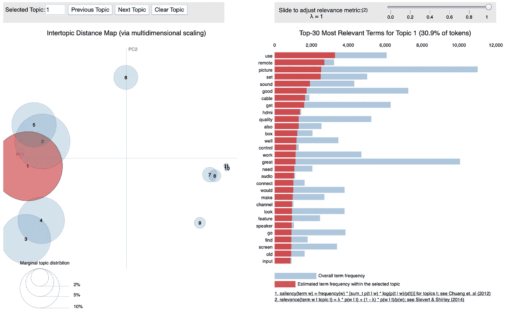

# 基于潜在狄利克雷分配的亚马逊电视评论分析

> 原文：<https://medium.com/analytics-vidhya/analyzing-amazon-tv-reviews-with-latent-dirichlet-allocation-97d19c3bb878?source=collection_archive---------3----------------------->


在本文中，我将执行并解释使用潜在狄利克雷分配进行主题建模的步骤。

这项任务的目的是在顾客评论的帮助下，比较某些品牌电视之间的质量、易用性和其他潜在关系。

当处理文本数据时，我们通常从一些固定的步骤开始，换句话说，就是预处理数据。

为了预处理数据，我们将遵循以下步骤:

1.  选择所需的栏，即评论/评论。
2.  标记句子。
3.  删除停用词。
4.  制作符号化单词的二元模型版本。
5.  对每个句子中的单词进行词条解释，并保留所需的词性。
6.  创建每个单词的词典、语料库和词频。
7.  借助于上一步中创建的用于主题建模的语料库来创建基本 LDA 模型。
8.  相干分数和超参数调谐。
9.  使用适当的技术分析和可视化您的结果。

**第一步:选择所需的栏目，即评论/评论。**

在进行任何模型拟合之前，我们首先将必要的包导入 jupyter 笔记本

```
import numpy as np
import pandas as pdimport nltk
import gensim
import pyLDAvis
import pyLDAvis.gensim
from gensim.utils import simple_preprocess
import gensim.corpora as corpora
from gensim.models import LdaMulticore
from gensim.models import CoherenceModel
from gensim.utils import ClippedCorpus
import tqdmfrom nltk.corpus import stopwordsimport warnings
warnings.filterwarnings('ignore')import spacy
from pprint import pprintimport matplotlib.pyplot as plt
%matplotlib inline
```

我们现在将导入 csv 文件并查看第一行和最后 5 行，以便对数据有所了解并继续进行预处理。

```
review = pd.read_csv('Amazon_samsung_data.csv')
review.head()
```



```
review.tail()
```



我们将连接“body”和“title”列，并创建一个名为“Comment”的单独列，稍后我们将从数据表中删除“body”、“title”和“Unnamed: 0”。

```
review['Comment'] = review[['body', 'title']].apply(lambda x: ''.join(x), axis = 1)review = review.loc[pd.isnull(review['Comment']) == False]
review = review.drop(['body','title','Unnamed: 0'], axis = 1)
```

现在我们将得到行的索引，在那里我们将把感兴趣的品牌(三星)和其他品牌(lg 和索尼)分开。

```
samsung = review.index[review['brand'] == 'samsung']
non_samsung = review.index[review['brand'] != 'samsung']
```

空白和新的行标记被删除并转换为小写，以便在下一步中进行进一步的预处理。

```
for i in range(review.shape[0]):
    sentence = review.Comment[i]
    stripped_sentence = " ".join(sentence.split())
    review.Comment[i] = stripped_sentence.strip().lower()
```

**第二步:标记句子。**

让我们把每个句子标记成单词表。在分词的过程中，我们去掉标点符号，分离出单词，并返回句子中所有单词的列表。

```
def sent_to_words(sentences):
    for sentence in sentences:
        yield(gensim.utils.simple_preprocess(str(sentence), deacc = True)) # deacc = True removes punctuationsdata = review.Comment.values.tolist()
data_words = list(sent_to_words(data))print(data_words[:][0])
```



**第三步:删除停用词。**

然后我们删除停用词。停用词是不会给句子增加任何语义的词。这降低了语料库矩阵的维数，也降低了后续步骤中计算的噪声。

```
# Getting list of stopwords
stop_words = list(stopwords.words("english"))
stop_words.extend(('tv','lg','samsung','sony'))def remove_stopwords(texts):
    return [[word for word in simple_preprocess(str(doc)) if word not in stop_words] for doc in texts]
```

**步骤 4:制作标记化单词的二元模型版本。**

Bigram 只是两个连续的单词在一起。像二元模型一样，我们可以制作三元模型、四元模型等。在我们的数据集中，我们可能会用到“电视机”、“遥控器”等词。

我们将使用 gensim 的短语模型来创建二元模型。它需要两个参数，即最小计数和阈值。

```
# Build the bigram models
bigram = gensim.models.Phrases(data_words, min_count=5, threshold=100) # higher threshold fewer phrases.# Faster way to get a sentence clubbed as a bigram
bigram_mod = gensim.models.phrases.Phraser(bigram)def make_bigrams(texts):
    return [bigram_mod[doc] for doc in texts]
```

**第五步:将每个句子中的单词进行词条释义，保留所需的词性。**

当我们处理大型语料库并且一个单词会以各种其他形式重复多次时，词汇化的过程是很重要的。例如，单词“练习”、“练习”、“练习”将被转换为练习。

```
def lemmatization(texts, allowed_postags=['NOUN', 'ADJ', 'VERB', 'ADV']):
    texts_out = []
    for sent in texts:
        doc = nlp(" ".join(sent)) 
        texts_out.append([token.lemma_ for token in doc if token.pos_ in allowed_postags])
    return texts_out# Initialize spacy 'en' model, keeping only tagger component (for efficiency)
nlp = spacy.load("en")# Do lemmatization keeping only noun, adj, vb, adv
data_lemmatized = lemmatization(data_words_bigrams, allowed_postags=['NOUN', 'ADJ', 'VERB', 'ADV'])print(data_lemmatized[:1][0])
```



**第六步:创建每个单词的词典、语料库和词频。**

在这一部分，我们将为 LDA 模型创建输入，即。语料库词典和语料库本身。

```
# Create Dictionary
id2word = corpora.Dictionary(data_lemmatized)# Create Corpus
texts = data_lemmatized# Term Document Frequency
bow_corpus = [id2word.doc2bow(text) for text in texts]# View
print(bow_corpus[:1][0])
```



Gensim 为每个单词创建一个唯一的 id，并记录该单词的词频。例如,( 0，1)表示单词 id 0 只出现了一次，而 as (11，2)表示单词 id 11 在文档中出现了两次。

**第七步:借助上一步建立的话题建模语料库，建立基础 LDA 模型。**

现在我们已经得到了适合模型的预处理数据。我们有语料库、词典、eta、alpha 等超参数。我们在之前的 ie 1/n_components 中为它们选择了默认值。对于这个数据集，我们选择了 15 个不同的主题，其中每个主题都是关键字的组合，每个关键字都对主题有一定的权重。

```
lda_model = gensim.models.LdaMulticore(corpus = bow_corpus,
                                       id2word = id2word,
                                       num_topics = 12, 
                                       random_state = 100,
                                       chunksize = 100,
                                       passes = 5,
                                       per_word_topics = True,
                                       workers = 4)
```

您可以看到每个主题的单词及其重要性。



**注**:上面只显示了 12 个话题中的两个。

**步骤 8:相干分数和超参数调整**

通过使用下面的代码来计算一致性。

```
coherence_model_lda = CoherenceModel(model=lda_model, texts=data_lemmatized, dictionary=id2word, coherence='c_v')
coherence_lda = coherence_model_lda.get_coherence()
print('Coherence Score: ', coherence_lda)
```

正如你所看到的，我们使用了*‘C _ v’*作为我们的度量标准。我们为基础模型获得了 0.46 的一致性分数。我们现在来看看超参数调整对基本模型的影响。

我们将调整超参数，即。α(a)，β(b)和主题数(n)。

我们将通过使用三个连续的 for 循环 ie 来执行这个调优过程。通过保持一个变量不变，同时获得其他两个变量的每个组合。

下面的代码说明了我们如何获得数据集的最佳超参数。

```
# LDA model and its corresponding Coherence Score
def compute_coherence_values(bow_corpus, id2word, n, a, b):
    lda_model = gensim.models.LdaMulticore(corpus = bow_corpus,
                                           id2word = id2word,
                                           num_topics = n, 
                                           random_state = 42,
                                           chunksize = 100,
                                           passes = 10,
                                           alpha = a,
                                           eta = b)

    coherence_model_lda = CoherenceModel(model=lda_model, texts=data_lemmatized, dictionary=id2word, coherence='c_v')

    return coherence_model_lda.get_coherence()grid = {}
grid['Validation_Set'] = {}# Topics range
min_topics = 5
max_topics = 13
step_size = 1
topics_range = range(min_topics, max_topics, step_size)# Alpha parameter
alpha = [0.01, 0.31, 0.61, 0.91, 'symmetric', 'asymmetric']# Beta parameter
beta = [0.01, 0.31, 0.61, 0.91, 'symmetric']model_results = {'Topics': [],
                 'Alpha': [],
                 'Beta': [],
                 'Coherence': []
                }# iterate through number of topics
for k in topics_range:
    # iterate through alpha values
    for a in alpha:
        # iterare through beta values
        for b in beta:
            # get the coherence score for the given parameters
            cv = compute_coherence_values(bow_corpus = bow_corpus, id2word = id2word, 
                                          n = k, a = a, b = b)
            # Save the model results
            model_results['Topics'].append(k)
            model_results['Alpha'].append(a)
            model_results['Beta'].append(b)
            model_results['Coherence'].append(cv)pd.DataFrame(model_results).to_csv('lda_tuning_results.csv', index = False)
```

我们可以从下面的片段中看到，alpha、beta 和数字主题的最佳值分别为 0.01、0.31 和 11，一致性得分约为 0.53。



这比以前的一致性分数提高了 15%。因此，我们现在将拟合 LDA 模型的最佳参数，并检查主题以进行进一步分析。

**第九步:用适当的技术分析和可视化你的结果。**

我们已经计算了文档中每个主题的百分比频率，并绘制了垂直条形图，主题位于 x 轴上。



我们计算了所有主题的百分比频率之间的差异，并过滤了差异大于 0.025 的主题

从上面我们可以看出，主题“主题 _5”、“主题 _7”、“主题 _8”、“主题 _10”有显著差异，需要进一步检查，以获得电视品牌之间的可比潜在因素。

通过使用下面的代码，我们使用 gensim 的 pyLDAviz 包可视化了该图

```
# Visualize the topics
pyLDAvis.enable_notebook()
vis = pyLDAvis.gensim.prepare(best_lda_model,bow_corpus , id2word)
vis
```



**结论:**

在观察了显著不同的主题和与之相关的单词后。我们将总结以下几点:

1.  与竞争对手相比，三星提供了更多智能功能，从而带来了出色的整体用户体验。
2.  LG 和索尼在真黑和高清显示方面提供了良好的画质。此外，这些品牌有相对较好的音频/音响系统。
3.  三星在软件(网飞、youtube 等)更新和适当的 wifi 连接方面面临问题，这会影响无缓冲在线流媒体。

作为我的第一篇文章，我希望得到建设性的反馈，我希望你喜欢阅读这篇文章。

以上建模的 jupyter 笔记本可以在[这里](https://github.com/Georgebob256/Machine-learning-with-Python/blob/master/Amazon%20TV%20reviews..ipynb)找到。