# Apache Spark 引擎的数据分析和性能调整

> 原文：<https://medium.com/analytics-vidhya/analyzing-data-and-performance-tuning-of-apache-spark-engine-1dfdf4e2c705?source=collection_archive---------11----------------------->

A pache Spark 是一种快速的内存处理框架，旨在支持和处理大数据。任何形式的数据都非常巨大(即 GB、TB、PB ),并且无法用标准配置的个人计算机处理，这种数据称为大数据。Spark 使用各种 API 来加载数据和执行分析。常用的两个库是 dataframe API 和 Spark SQL。

Dataframe 就像以命名列组织的数据集，相当于关系数据库中的表。Spark SQL 是 apache spark 处理结构化数据的模块。spark 与 python 编程的合作被称为 PySpark。它是 python 在 spark 上的 API，以 python 风格编写程序(类似于 pandas 库，但 spark 遵循一个懒惰的评估，我将在本文后面谈到)。

在这篇文章中，我将通过一个旧金山火警电话数据集来检索见解。此外，您将了解如何使用 spark 缓存表和 RDD 分区配置来提高查询效率。


消防部门服务电话

# **关于数据集**

**消防呼叫服务**包括所有消防单位对呼叫的响应。每个记录包括呼叫号码、事故号码、地址、单位标识符、呼叫类型和处置。还包括所有相关的时间间隔。因为该数据集基于响应，并且大多数呼叫涉及多个单元，所以每个呼叫号码都有多个记录。地址与街区号码、交叉路口或电话亭相关联，而不是特定的地址。

数据提取自[https://data.sfgov.org](https://data.sfgov.org/Public-Safety/Fire-Department-Calls-for-Service/nuek-vuh3)

# **数据分析**

*从数据源加载数据*
通过推断模式从 csv 文件创建数据帧，运行 spark 作业。执行时间为 **16s** 。

```
firedatadf = spark.read.csv(‘/xxxx/sf_open_data/fire_dept_calls_for_service/Fire_Department_Calls_for_Service.csv’, header=True, inferSchema=True)firedatadf.printSchema()
```

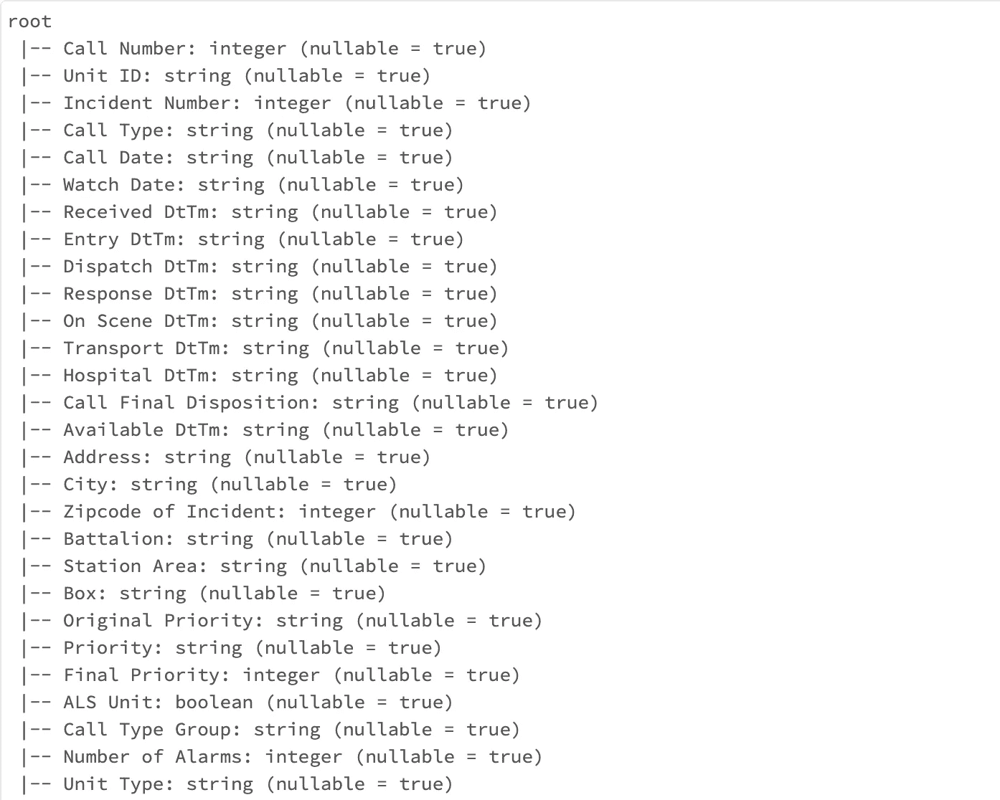

```
firedatadf.count()
len(firedatadf.columns)4091248
34#The dataset contains 4 millions rows, 34 columns
#While checking the count, it does a full scan of the table data #reading 1.6 GB of data from disk. 
#Time taken is **20s**
```

我们可以看到列名中有空格，这可能是以后保存文件时的一个问题。因此，我们将创建一个用户定义的模式，并显式地将该模式推断到该数据集。请注意，从第一步加载的 csv 花费了 **16s** ，因为它通过采样和读取来推断模式。这对于小规模的数据集来说很好，但是对于万亿字节的数据来说，最好使用定义好的模式来加快加载速度。为此，我将从 pyspark.sql.types 导入模块。

```
from pyspark.sql.types import StructType, StructField, IntegerType, StringTypeSchema_new = StructType([StructField(‘CallNumber’, IntegerType(), True),
 StructField(‘UnitID’, StringType(), True),
 StructField(‘IncidentNumber’, IntegerType(), True),
 StructField(‘CallType’, StringType(), True), 
 StructField(‘CallDate’, StringType(), True), 
 StructField(‘WatchDate’, StringType(), True), 
 StructField(‘ReceivedDtTm’, StringType(), True), 
 StructField(‘EntryDtTm’, StringType(), True), 
 StructField(‘DispatchDtTm’, StringType(), True), 
 StructField(‘ResponseDtTm’, StringType(), True), 
 StructField(‘OnSceneDtTm’, StringType(), True), 
 StructField(‘TransportDtTm’, StringType(), True), 
 StructField(‘HospitalDtTm’, StringType(), True), 
 StructField(‘CallFinalDisposition’, StringType(), True), 
 StructField(‘AvailableDtTm’, StringType(), True), 
 StructField(‘Address’, StringType(), True), 
 StructField(‘City’, StringType(), True), 
 StructField(‘ZipcodeofIncident’, IntegerType(), True), 
 StructField(‘Battalion’, StringType(), True), 
 StructField(‘StationArea’, StringType(), True), 
 StructField(‘Box’, StringType(), True), 
 StructField(‘OriginalPriority’, StringType(), True), 
 StructField(‘Priority’, StringType(), True), 
 StructField(‘FinalPriority’, IntegerType(), True), 
 StructField(‘ALSUnit’, BooleanType(), True), 
 StructField(‘CallTypeGroup’, StringType(), True),
 StructField(‘NumberofAlarms’, IntegerType(), True),
 StructField(‘UnitType’, StringType(), True),
 StructField(‘Unitsequenceincalldispatch’, IntegerType(), True),
 StructField(‘FirePreventionDistrict’, StringType(), True),
 StructField(‘SupervisorDistrict’, StringType(), True),
 StructField(‘NeighborhoodDistrict’, StringType(), True),
 StructField(‘Location’, StringType(), True),
 StructField(‘RowID’, StringType(), True)])
```

使用用户定义的模式加载数据。这次需要**0.33 秒**做一个快速计数并打印 Schema 来检查结构。

```
firedatanewDF = spark.read.csv(‘/xxx/sf_open_data/fire_dept_calls_for_service/Fire_Department_Calls_for_Service.csv’, header=True, schema=Schema_new)firedatanewDF.count()firedatanewDF.printSchema()
```

让我们检查有多少不同的呼叫类型及其计数。

```
firedatanewDF.groupBy(‘CallType’).count().orderBy(‘count’,ascending = False).show(100,False)#time: **14.25s**
```

该数据有 34 种不同的呼叫类型。看起来有 250 万个医疗急救电话，其次是结构火灾、警报和交通碰撞。

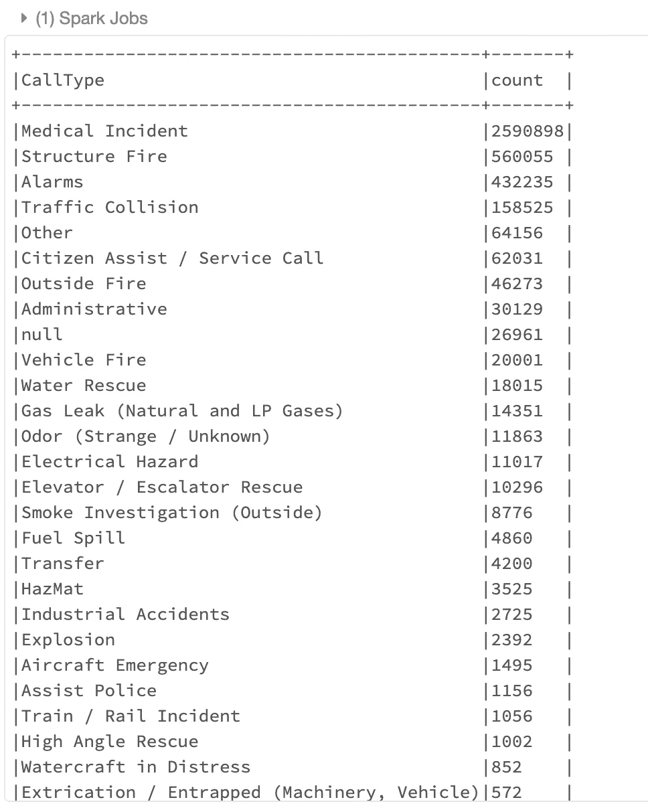

让我们看看 7 月 4 日有多少服务电话，假设由于烟花爆竹有很高的火灾事故和医疗紧急情况的概率。为了处理时间戳数据，我们必须将日期和时间列转换成时间戳。默认情况下，推断模式得到字符串格式的日期列。我将使用 unix_timestamp()函数将字符串转换为时间戳。

```
from pyspark.sql.functions import *
pattern1 = ‘MM/dd/yyyy’
pattern2 = ‘MM/dd/yyyy hh:mm:ss aa’ firedatanewTsdf = fireServiceCallsDF \
 .withColumn(‘CallDateTS’, unix_timestamp(fireServiceCallsDF[‘CallDate’], pattern1).cast(“timestamp”)) \
 .drop(‘CallDate’) \
 .withColumn(‘WatchDateTS’, unix_timestamp(fireServiceCallsDF[‘WatchDate’], pattern1).cast(“timestamp”)) \
 .drop(‘WatchDate’) \
 .withColumn(‘ReceivedDtTmTS’, unix_timestamp(fireServiceCallsDF[‘ReceivedDtTm’], pattern2).cast(“timestamp”)) \
 .drop(‘ReceivedDtTm’) \
 .withColumn(‘EntryDtTmTS’, unix_timestamp(fireServiceCallsDF[‘EntryDtTm’], pattern2).cast(“timestamp”)) \
 .drop(‘EntryDtTm’) \
 .withColumn(‘DispatchDtTmTS’, unix_timestamp(fireServiceCallsDF[‘DispatchDtTm’], pattern2).cast(“timestamp”)) \
 .drop(‘DispatchDtTm’) \
 .withColumn(‘ResponseDtTmTS’, unix_timestamp(fireServiceCallsDF[‘ResponseDtTm’], pattern2).cast(“timestamp”)) \
 .drop(‘ResponseDtTm’) \
 .withColumn(‘OnSceneDtTmTS’, unix_timestamp(fireServiceCallsDF[‘OnSceneDtTm’], pattern2).cast(“timestamp”)) \
 .drop(‘OnSceneDtTm’) \
 .withColumn(‘TransportDtTmTS’, unix_timestamp(fireServiceCallsDF[‘TransportDtTm’], pattern2).cast(“timestamp”)) \
 .drop(‘TransportDtTm’) \
 .withColumn(‘HospitalDtTmTS’, unix_timestamp(fireServiceCallsDF[‘HospitalDtTm’], pattern2).cast(“timestamp”)) \
 .drop(‘HospitalDtTm’) \
 .withColumn(‘AvailableDtTmTS’, unix_timestamp(fireServiceCallsDF[‘AvailableDtTm’], pattern2).cast(“timestamp”)) \
 .drop(‘AvailableDtTm’)
```

使用 printSchema 检查结构和数据类型

```
# Checking the period of incidents recorded in dataset.firedatanewTSdf.select(year('CallDateTS')).distinct().orderBy('year(CallDateTS)').show()# The data available is from year 2000 until 2016\. This is a big dataset.# Just for ease of readability, i created new columns with year, day # of month, month using *withColumn* functionfiredatanewTSdf2 = firedatanewTSdf1.withColumn('Year',year('CallDateTS').cast('int')).withColumn('DayOfMonth',dayofmonth('CallDateTS').cast("int")).withColumn('Month',month('CallDateTS').cast('int'))
```

查询 7 月 4 日的消防服务电话。下面的计数显示了 2016 年和 2010 年的最高通话次数

```
firedatanewTSdf2.filter(‘Month == 7’).filter(‘DayOfMonth == 4’).groupBy(‘Year’).count().orderBy(‘Year’, ascending=False).show()|Year|count|
+-----+-----+
|2016|  958| 
|2015|  850| 
|2014|  783| 
|2013|  870| 
|2012|  761| 
|2011|  791| 
|2010|  907| 
|2009|  798| 
|2008|  838| 
|2007|  703| 
|2006|  737| 
|2005|  651| 
|2004|  752| 
|2003|  734| 
|2002|  731| 
|2001|  691| 
|2000|  790|
```

进一步分析后发现，在 2016 年，医疗事故是来电的最主要原因，我们可以将这些原因与之前步骤中的来电类型联系起来。每年的这个时候都有超过 10 万次的通话。

```
firedatanewTSdf2.filter(‘year = 2016’).groupBy(‘calltype’).count().orderBy(‘count’, ascending = False).show(10,False)|calltype                       |count |
+-------------------------------+------+
|Medical Incident               |105191| 
|Alarms                         |15460 | 
|Structure Fire                 |14509 | 
|Traffic Collision              |6721  | 
|Citizen Assist / Service Call  |1895  | 
|Other                          |1834  | 
|Outside Fire                   |1764  | 
|Water Rescue                   |1118  | 
|Gas Leak (Natural and LP Gases)|651   |
```

# **加入操作——查找邻近小区的呼叫数和主要情况**

**哪个街区产生的呼叫数量最多**

```
firedatanewTSdf2.groupBy(‘NeighborhoodDistrict’).count().orderBy(‘count’, ascending = False ).show(100, False)
```

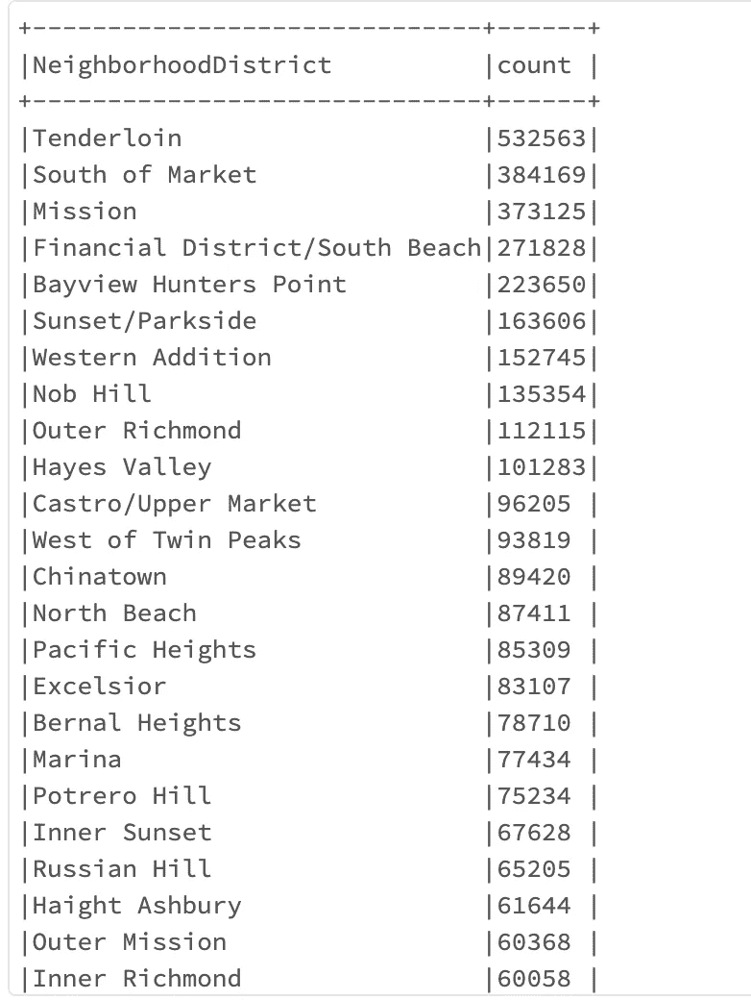

**评论**[**Yelp**](https://www.yelp.com/biz/the-tenderloin-san-francisco-5)**:**请参考链接。

旧金山的田德隆区是我们国家最危险、最肮脏、最恶心的地区之一。在**里脊**中，你很有可能会被谋杀。但是有一些漂亮的墙壁艺术。旧金山的这一部分是美国每个大城市所有错误的生动缩影。

**连接事故数据集中的数据帧，分析主要情况**

```
## reading [**incident**](https://data.sfgov.org/Public-Safety/Fire-Incidents/wr8u-xric) dataset from same sourceincidentsDF = spark.read.csv(‘/xxx/sf_open_data/fire_incidents/Fire_Incidents.csv’, header=True, inferSchema=True).withColumnRenamed(‘Incident Number’, ‘IncidentNumber’).cache()## Join dataframesjoin_DF = firedatanewTSdf2.join(incidentsDF, firedatanewTSdf2.IncidentNumber == incidentsDF.IncidentNumber)
```

**结果**

```
join_DF.filter(col(‘NeighborhoodDistrict’).like(‘Tenderloin’)).groupBy(‘Primary Situation’).count().orderBy(‘count’, ascending = False).show(10,False)
```

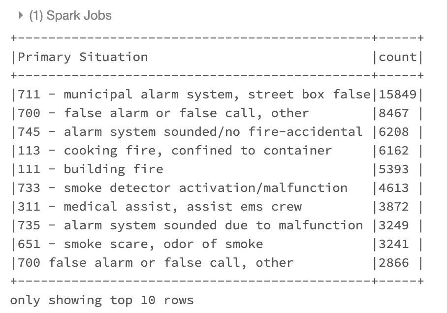

查一下旧金山富人区的电话。很好奇它们会发出什么样的叫声。参考最贵社区信息链接:[点击此处](https://www.investopedia.com/articles/personal-finance/092515/most-expensive-neighborhoods-san-francisco.asp)

```
## no. of calls from **Pacific Heights and Financial District**firedatanewTSdf2.filter(col(‘NeighborhoodDistrict’).like(‘Pacific Heights’)).groupBy(‘NeighborhoodDistrict’).count().show()firedatanewTSdf2.filter(col(‘NeighborhoodDistrict’).like(‘Financial District%’)).groupBy(‘NeighborhoodDistrict’).count().show(2,False)
```

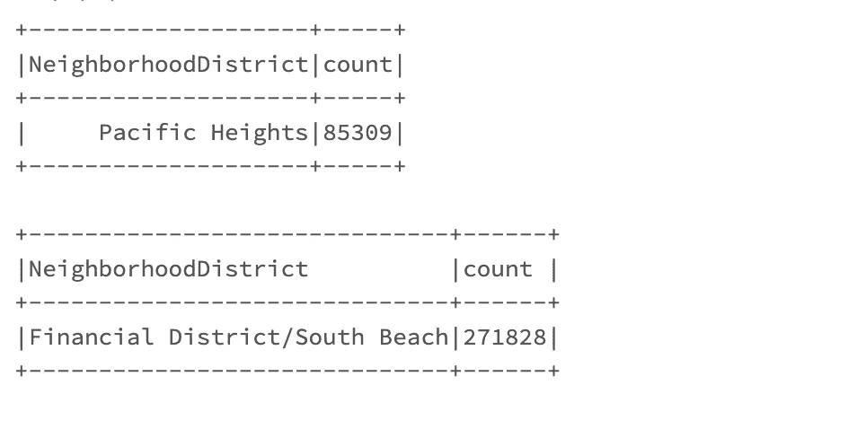

**过滤邻居小区**

```
## Filter **Pacific Heights**join_DF.filter(col('NeighborhoodDistrict').like('**Pacific Heights**')).groupBy('Primary Situation').count().orderBy('count', ascending = False).show(10,False)
```

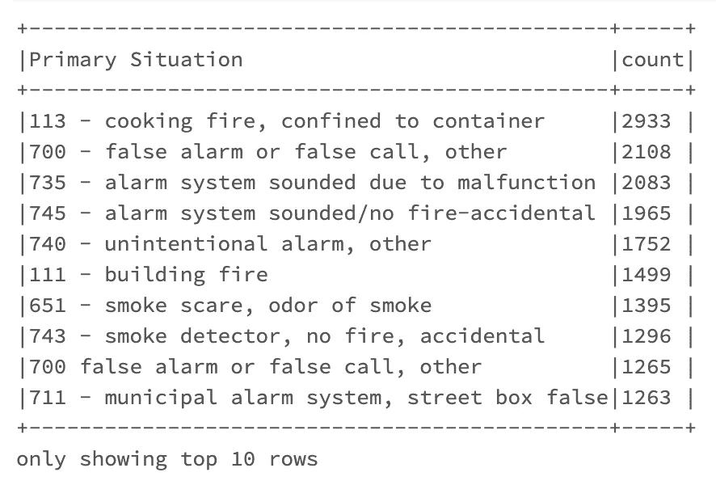

```
## Filter **Financial District**join_DF.filter(col(‘NeighborhoodDistrict’).like(‘**Financial**%’)).groupBy(‘Primary Situation’).count().orderBy(‘count’, ascending = False).show(10,False)
```

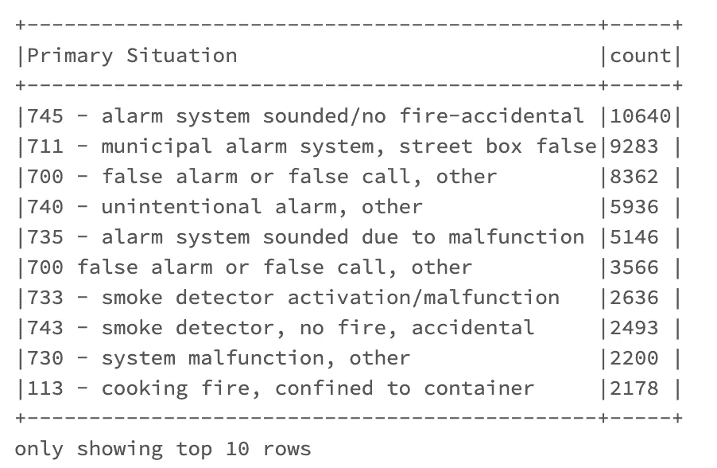

从上面的分析来看，电话似乎大多是非生命威胁或虚假警报。来自这些地区的呼叫可被视为低-中优先级。

我们使用 dataframe API 完成了初始分析。虽然我们可以通过结合与旧金山医疗事故相关的其他数据集来深入挖掘数据集以找到相关性。

# **火花发动机性能分析。**

请记住，在编写上述部分的所有输出时，我提到了 spark job 完成查询所花费的时间。现在，是时候使用缓存表和 RDD 分区来比较性能了。对于更复杂的查询，计算时间会增加。Spark 使用惰性评估，直到在转换栈上触发一个动作时才返回结果。Spark 是一个非常强大的内存计算工具，它通过在内存中缓存数据来节省时间，不像 Hadoop 文件系统那样在磁盘中写入中间排序(洗牌阶段)结果。因此，能够更快地提供结果。

Spark 围绕着*弹性分布式数据集* (RDD)的概念，这是一个可以并行操作的容错元素集合。创建 rdd 有两种方法:*并行化驱动程序中的现有集合*，或者引用外部存储系统中的数据集，如共享文件系统、HDFS、HBase 或任何提供 Hadoop InputFormat 的数据源。在本例中，我将把我的数据帧转换成 RDD，并读取分区数量。

```
firedatanewTSdf2.rdd.getNumPartitions()13
```

在 spark 内部，数据帧由分区组成，这意味着在这种情况下，默认情况下，全部数据的 13 分之一驻留在每个分区中。然而，这可能不是最佳的。如果数据足够大，您可以检查机器上运行的内核数量，并以内核数量的 2 或 3 倍的倍数配置分区。这样，每个数据块几乎大小相等，可以在一个阶段中并行运行。在这种情况下，我将把我的 RDD 重新分区成 8 个块(8 核机器)并缓存它。您可以在 *Spark UI* (执行者标签)上查看执行者的数量。在下面的查询中，我创建了我的表的视图，并缓存了我的视图。

```
firedatanewTSdf2.repartition(8).createOrReplaceTempView(‘firedataV1’)
spark.catalog.cacheTable(‘firedataV1’)
spark.table(‘firedataV1’).count()
```

缓存是懒惰的，它不缓存任何东西，直到一个动作被触发。因此，我触发了一个 count 函数调用，该函数从磁盘读取所有数据，在内存中创建一个临时数据帧，默认为 13 个分区(阶段 65)，然后重新分区为 8 个分区(阶段 66)，并将其缓存在内存中。这一步跑起来需要更长的时间 **1.93 分钟**。

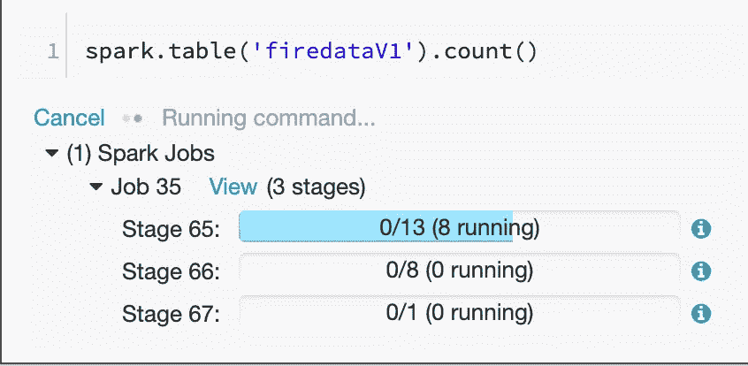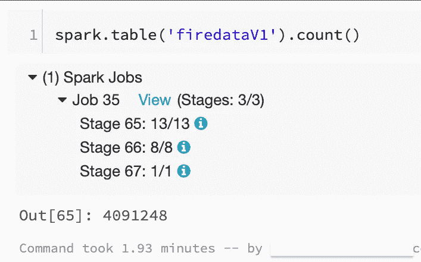

我有一台 8 核 EC2 机器，因此重新划分为 8 个。从下图中可以看到，缓存分区(RDD)为 8，100%缓存，内存大小为 645 MB。Spark 使用列压缩方法来调整文件大小，这使得内存中的存储比磁盘上的序列化数据更有效。每个分区 80 MB。这样，8 个任务可以在一个阶段的 8 个槽中运行。您可以根据集群中的数据和节点(加上核心)的大小来决定分区因子。

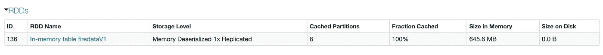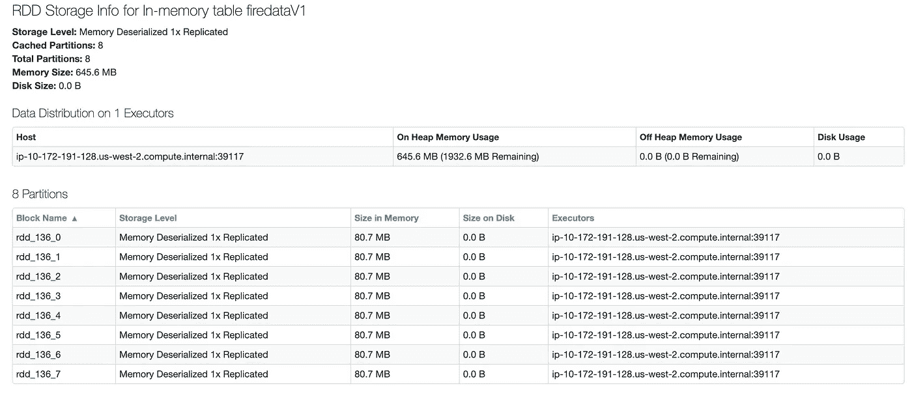

从缓存的表中读取数据帧中的数据。现在，如果我执行一个计数操作，花费的时间要少得多。Spark 作业跳过第一阶段，因为它不再需要从磁盘中读取数据，然后进入第二阶段，从内存中有 8 个分区的数据帧中读取数据。

```
firedataService_df = spark.table(‘firedataV1’)firedataService_df.count()
# time : 0.40s
```

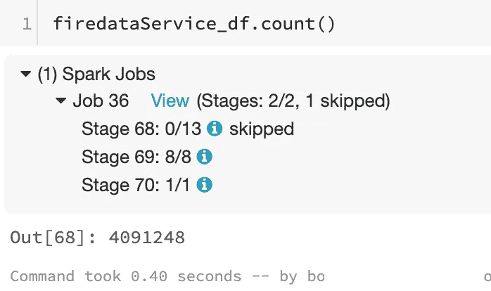

# **使用 Spark SQL 进行性能检查**

让我们使用 **Spark SQL** 从缓存的表中查询类似的数据，并比较返回结果所需的时间。我可以看到性能的提高。该查询用了 **1.81s** 返回相同的结果。
使用缓存表中的新数据帧，saprk 作业在 **1.95s** 中完成并返回相同的结果，与 **20s** 相比要好得多(参见顶部第二个块)。

```
%sql select Calltype, count(Calltype) as count from firedataV1 group by Calltype order by count(calltype) desc## %sql is a command available in databricks notebook instead of using *spark.sql* command
```

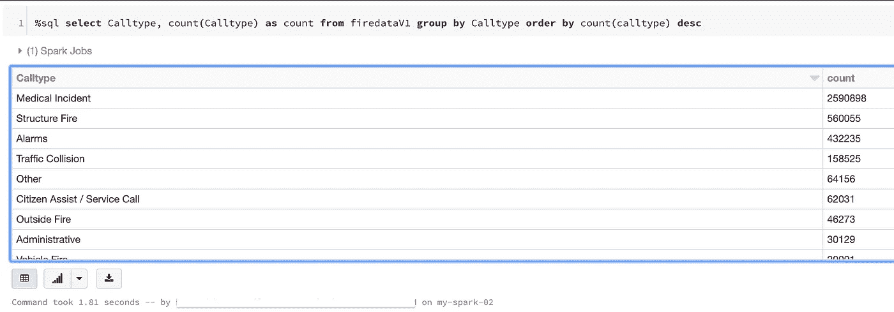

```
firedataService_df.groupBy(‘CallType’).count().orderBy(‘count’,ascending = False).show(100,False)
```

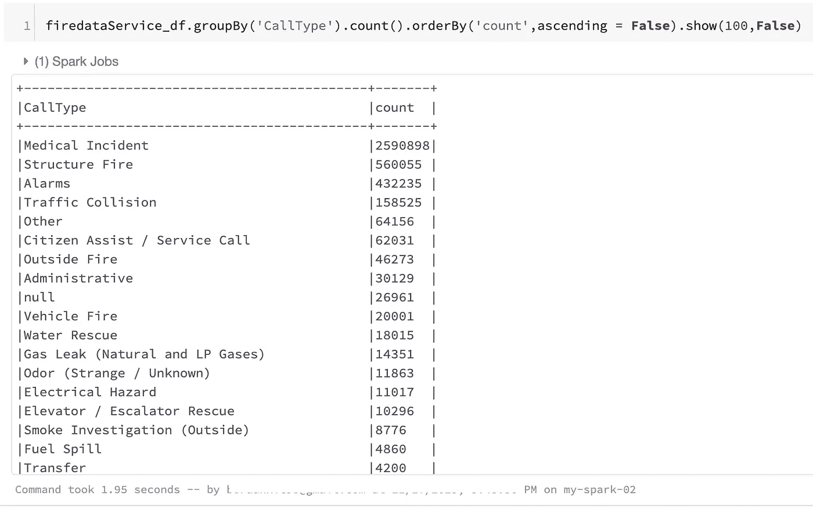

# 从拼花格式读取文件:非常高效

拼花地板是一种柱状格式，许多其他数据处理系统都支持这种格式。Spark SQL 支持读取和写入自动保留原始数据模式的 Parquet 文件。写入拼花文件时，出于兼容性原因，所有列都自动转换为可空。[参考 Spark 文档]

一旦我们在 Spark 上完成了数据的 ETL(从 csv 中提取、转换、将字符串转换成时间戳),我们就可以将文件保存为 parquet 格式，供以后分析使用。与 CSV 或 JSON 相比，它的效率非常高。它根据我们的分区将文件存储在 8 个不同的 gunzip 文件中。

```
firedataService_df.write.format(‘parquet’).save(‘/tmp/firedataService_parquet/files/’)#I am reading the parquet files from disk:
newdataDF = spark.read.parquet(‘/tmp/firedataService_parquet/files/’)#spark job took **0.52s** to read from disknewdataDF.count()
# time: **0.57s**
```

本教程描述了使用 **dataframe API** 和 **Spark SQL** 在 Spark 中操作数据的简单方法。我尝试演示了数据帧上的连接、转换和操作，对查询、以 parquet 格式读写文件的性能改进的高级概述。Spark 能够使用多节点集群处理数 TB 的数据。大部分信息可在 Apache Spark 网站的[文档](https://spark.apache.org/docs/latest/index.html)部分获得。

我使用了 databricks 笔记本和 EC2 实例来执行我的分析。你可以使用 Jupiter 笔记本，apache zeppelin，Azure HDinsight 捆绑 hadoop，spark，zeppelin 或使用 AWS EMR 等。

谢谢大家！！