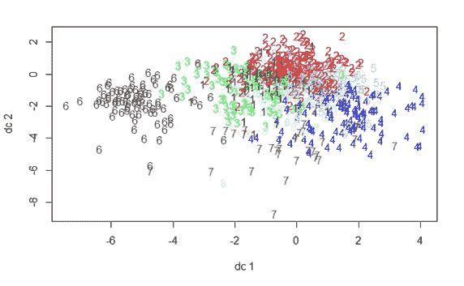

# 使用 NetworkX、Gephi 和 Node2Vec 分析疾病共现

> 原文：<https://medium.com/analytics-vidhya/analyzing-disease-co-occurrence-using-networkx-gephi-and-node2vec-53941da35a0f?source=collection_archive---------5----------------------->

## 研究

## 分析 ICU 患者的电子健康记录(EHR)并开发机器学习模型


他的分析是一个项目的一部分，该项目专注于分析 ICU 患者的电子健康记录(EHR ),并开发用于疾病早期预测的机器学习模型。在本文中，我们展示了如何使用 EHR 记录创建疾病网络，并使用疾病网络的邻接矩阵或边列表生成网络嵌入。我们使用 python、R、Gephi 软件，Node2Vec、Networkx、K-means 进行分析。我们使用 Rstudio、Spyder 和 Jupyter Notebook 作为 IDE。

*(由于 node2vec 的最新更新，2021 年 5 月 4 日做了一些小改动)*

# 数据集的预览

原始数据包含 2，710，672 个患者就诊记录，其中包含 3，933 个独特的诊断。在这些观察结果中，有 2，193，860 行标有有效的 icd10 代码。

IC D10(【https://icdcodelookup.com/icd-10/codes】)是国际疾病和相关健康问题统计分类(ICD)的第 10 版，是世界卫生组织(世卫组织)制定的医学分类清单，指明了疾病、体征和症状、异常发现、主诉、社会环境以及损伤或疾病的外部原因。

这些代码是由医院工作人员、护士和编码员在患者住院期间或之后输入的，并且具有多种用途，例如用于文档编制和医疗保险索赔归档。

# 代码:

## 第一阶段—准备数据:

首先，我们必须清理数据，并将表转换为示例边列表，如下所示(图 1):


图 1 —示例边缘列表

“pid”是包含患者 id 的列，而“icd10”是包含代表疾病的代码的列。一个病人可能同时患有多种疾病。一名患者可能不止一次患同一种疾病。该表列出了每位患者从入院到再次入院，再到出院的所有疾病或状况。

## 第二阶段—制作邻接矩阵:

邻接矩阵是一个正方形矩阵，用于显示一种疾病和所有其他疾病之间的潜在共存关系(甚至包括其自身)。由于样本边列表中存在 821 个唯一的 icd10 代码，我们期望 821*821 邻接矩阵。

下面提供了这样做的代码:

```
```
import pandas as pd******import os******import numpy as np******print (os.getcwd())******os.chdir(‘Your File Location’)******print (os.getcwd())******diag = pd.read_csv(‘pid_icd10.csv’)******## create the matrix******matrix = pd.get_dummies(diag.set_index(‘pid’)[‘icd10’].astype(str)).max(level=0).sort_index()******## transpose the matrix******diag_matrix = np.asmatrix(matrix)******diag_matrix_transpose = diag_matrix.transpose()******## multiply the matrices******final_matrix = diag_matrix_transpose.dot(diag_matrix)******network_table = pd.DataFrame(final_matrix)******## append index name******icd10 = list(diag.icd10.unique())******icd10.sort()******network_table.index = icd10******network_table.columns = icd10
```
```

运行代码后，我们得到了一个 821*821 的邻接矩阵(图 2):


图 2 —邻接矩阵的局部视图

此处，对角线元素表示数据集中疾病的流行率，即特定 icd10 代码被记录了多少次。非对角线元素 E_xy 表示 R_x 和 C_y 的同现，其中 R_x 是所有患者记录的第 x 行和第 y 列。例如，A09(传染性胃肠炎和结肠炎)和 A04.7(艰难梭菌引起的小肠结肠炎)在数据集中的 29 例患者就诊中同时出现。

关于如何生成这种疾病网络的更多信息在本文中解释:[https://ieeexplore.ieee.org/document/8194838](https://ieeexplore.ieee.org/document/8194838)。

## 第三阶段—生成 Node2Vec 特性:

在这一步，我们应用 node 2 vec(【https://cs.stanford.edu/~jure/pubs/node2vec-kdd16.pdf】)来生成节点嵌入。网络是使用我们在上一步中生成的邻接矩阵创建的。这个函数将允许我们获得两个重要的输出:一个数据集包含用于绘图目的的随机行走记录，以及一个预测疾病邻居的模型。

代码如下所示(确保您安装了 Gensim 4.0.0 或更高版本):

```
```
import networkx as nx******from node2vec import Node2Vec*** ***graph=nx.from_pandas_adjancecy(network_table)******node2vec = Node2Vec(graph, dimensions=20, walk_length=5, num_walks=200, workers=4)******model = node2vec.fit(window=10, min_count=1)
```
```

数据集的输出如下所示(图 3):


图 3—node 2 vec 的输出

该模型可用于找到特定节点(疾病)的邻居或维度值。它还可以帮助发现节点之间的相似性。下面是它的用法示例(图 4、图 5):


图 4 —读取特定节点的值


图 5 —查找节点的相似性

要将嵌入保存到 CSV 文件:

```
``` vocab, vectors = model.wv.vocab, model.wv.vectors# get node name and embedding vector index.
#index
name_index = np.array([(v[0], v[1].index) for v in vocab.items()])# init dataframe using embedding vectors and set index as node name
node2vec_output = pd.DataFrame(vectors[name_index[:,1].astype(int)])
node2vec_output.index = name_index[:,0]```***
```

**参数说明:**

*“图形”必须是“网络 x”图形。节点名必须全部是整数或字符串。*

*正如论文《node2vec:网络的可扩展特征学习》中提到的:“一旦表示的维度达到 100 左右，性能就会趋于饱和。”尽管维度的默认值是 128，我们还是决定使用 20。考虑到我们拥有的节点数量，它应该足够大。*

*walk _ length 的默认值是 80，它表示每次遍历中的节点数。num_walks 是每个节点的行走次数，默认值为 10。根据该论文，这两个参数将随着增加而提高性能。*

## 第四阶段——在 R 中使用 K-均值聚类绘制:

由于使用 k-means 对特征表示进行聚类(Grover & Leskovec，2016)，我们可以使用 k-means 聚类算法将上一步的输出作为输入，并将结果绘制在 r 中。

首先，我运行了一个快速循环，根据平方和(WSS)寻找“k”的选择。图 6 是输出结果:


图 6 — WSS 随着“k”的增加而减小

看起来“k”越大，模型的表现就越好。然而，肘方法在这种情况下不起作用，因为我在图中看不到明显的肘曲线。大概，“k=8”会是一个好的开始。然而，当我们试图绘制集群时，我们发现输出有点混乱，因为节点的数量很大(图 7):



图 7——当“k=8”时的聚类图

然后，我决定用“k=4”来代替。图 8 是输出:


图 8——当“k=4”时的聚类图

由于 Gephi 是绘制网络关系的优秀工具，所以我也用 Gephi 绘制了结果(图 9 ),以供比较:


图 Gephi 中的图

看起来 Gephi 自动将节点分配给了三个主要集群，这接近于我在 r。

出于分析的目的，这次我将使用 K-means 聚类，因为该算法将使用组号来标记节点，这样更容易分析。

## 第五阶段—推论:

为了分析结果，我运行了一个循环来对集群进行二次抽样。然后，我得了四组疾病:

**第 1 组**包括与各种烧伤/外伤、手术导致的呼吸衰竭、神经问题和传染病相关的诊断。(总共 40 个唯一诊断字符串。)

**第 2 组**包含与胃肠问题、神经问题和传染病相关的诊断。(总共 45 个独特的诊断字符串。)

**第 3 组**包含主要与毒理学和神经病学问题相关的诊断。看起来记录中出现了许多药物过量的问题。(总共 26 个独特的诊断字符串。)

**第 4 组**包含主要与心血管问题、移植情况和手术并发症相关的诊断。(总共 16 个独特的诊断字符串。)

另外，通过查看图 8，我们可以看出组 2 和组 4 彼此非常接近。组 3 和组 4 也重叠。

# 总结:

使用 node2vec 包解析数据并使用 k-means 进行绘图是揭示深藏在具有网络关系的数据中的洞察力的极好方法。该模型有可能帮助我们在入院时发现每种疾病的邻居(可能的共存疾病)。它可以帮助医生和高费用患者在未来节省大量的时间和金钱。

在这篇博客中，我介绍了如何使用网络科学分析电子医疗记录，特别是为了了解病人就诊时疾病的共现。这种探索性的分析有助于开发初步的推论以及更深入分析的起点。使用我们的分析获得的见解不仅对医疗保健专业人员有用，而且对分析大型 EHR 数据集感兴趣的数据科学家也可以使用所示的方法。

> 我在堪萨斯大学商学院商业分析助理教授 Karthik Srinivasan 博士的指导下完成了这篇博客。
> 
> 作为参考，你可以在这里找到所有的 Python/R 代码。

***请随时与我联系***[***LinkedIn***](https://www.linkedin.com/in/jinhangjiang/)***。***