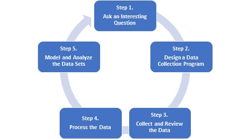

# 分析生育率数据—第 2 部分

> 原文：<https://medium.com/analytics-vidhya/analyzing-fertility-rate-data-part-2-827c1c468d75?source=collection_archive---------11----------------------->

照片由[🇸🇮·扬科·菲利- @specialdaddy](https://unsplash.com/@thepootphotographer?utm_source=medium&utm_medium=referral) 在 [Unsplash](https://unsplash.com?utm_source=medium&utm_medium=referral) 上拍摄

在本系列的[第 1 部分](/@m.rodriguezlegrand/analyzing-fertility-rate-data-part-1-9d22309dd8)中，我开始解释用 Python 分析生育率 **(FR)** 数据的过程。我们在第四步离开了。数据科学过程的一部分。

