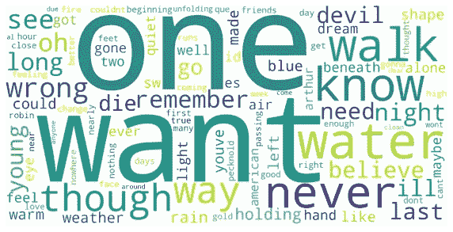

# 用 Python 分析狐狸乐队新专辑《海岸》

> 原文：<https://medium.com/analytics-vidhya/analyzing-fleet-foxes-new-album-shore-using-python-e737fc40f3ef?source=collection_archive---------19----------------------->

## 深入分析

## (另)使用 Python 编程语言对狐狸乐队的歌曲进行文本分析


海岸专辑黑胶

还记得我们都认为 2020 年会比 2019 更好的时候吗？原来今年差很多。从二月份新冠肺炎病毒开始在世界各地传播到最后几个月，这是艰难的一年。今年发生了很多事情，病毒；人们生病和死亡，乔治·弗洛伊德，科比，格伦·弗雷德利，美国总统选举，等等。

我们都同意 2020 年是一场噩梦，但每个噩梦都有一个休息的时间。2020 年可能一点也不坏，尤其是对我和你这些狐狸乐队的粉丝来说。2020 年 9 月 22 日，我最喜欢的乐队，发行了他们的新专辑《海岸》。《海岸》是狐狸乐队的第四张专辑，也是该乐队在中断三年后于 2016 年重组后的第二张专辑。

我是狐狸乐队的超级粉丝。如果你查看我的 2020 Spotify Wrapped，你可以看到四首热门歌曲是蓝岭山脉(我一直最喜欢的)，粗糙的木头，无助的布鲁斯和白色冬季赞美诗。


我的 Spotify 包装 2020

之前写过一篇关于 [**的文章，分析了狐狸乐队最喜欢的五首歌**](/analytics-vidhya/analyzing-fleet-foxess-top-5-favorite-songs-using-r-7953daa4e403) 。在这篇文章中，我将做同样的事情，但我不会分析他们最喜欢的五首歌曲，而是我想分析他们的新专辑“海岸”。


Shore 专辑曲目

在前面的分析中，我使用了 R 编程语言，但是在本文中，我将使用 Python。该分析的目的是探索包含在专辑中每首歌曲的文本文档(歌词)中的信息。专辑包含 15 首歌曲，最长曲目约 5 分钟，最短曲目约 2 分钟。

让我们跳到代码！

还是和上一篇文章一样，我使用 Genius library 从 Genius 网站数据库中获取数据，也就是歌词。我发现 Genius 不仅可以提取歌词，还可以从每首歌曲或专辑中提取元数据。这确实是一个有用的库，但是对于这个分析，我只需要每首歌的歌词和标题。

我想做的第一件事是导入我将用于分析的所有库。

## 导入库

```
import lyricsgenius
import json 
import ijson
import pandas as pd
import nltk
nltk.download('stopwords')
import re
import string
import matplotlib.pyplot as plt
%matplotlib inline
from nltk.tokenize.treebank import TreebankWordDetokenizer
from PIL import Image
from wordcloud import WordCloud
from sklearn.feature_extraction.text import CountVectorizer
from nltk.corpus import opinion_lexicon
nltk.download('opinion_lexicon')
from nltk.sentiment.vader import SentimentIntensityAnalyzer
nltk.download('vader_lexicon')
```

这是一个非常标准的文本文档情感分析库。

## 生成数据

在使用 Genius 库提取数据之前，我们需要从 Genius 网站获取令牌。您可以注册，然后生成您的令牌，之后您可以使用您的令牌，这样 API 就可以从 Genius 数据库中提取数据。

```
token = "insert your token here"
genius = lyricsgenius.Genius(token)
```

Genius library 附带了很多提取数据的函数。你可以在他们的文档[这里](https://github.com/johnwmillr/LyricsGenius)查看所有的功能。由于我想从专辑中获取每首歌的所有歌词，所以我会使用`search_album`函数，然后将提取的所有数据保存为 JSON 格式。

```
f = open('Lyrics_Shore.json') 
data = json.load(f)g = open('Lyrics_Shore.json', 'r')
parser = ijson.parse(g)
paths = sorted(set(prefix for prefix, event, value in parser if prefix))#to check the paths
for path in paths:
    print(path)
```

如果您打印路径，您会看到 Genius 不仅提取歌词，还提取歌曲的元数据。在这种情况下，我们必须从 JSON 格式中提取歌词和标题，并将它们都插入 dataframe 格式中。

```
df = []
for i in data['songs']:
    df.append({'title': i["title"], 'lyrics': i["lyrics"]})shore = pd.DataFrame(df)
```

完成后，您将得到一个包含两列的 dataframe。一个是每首歌的歌名，一个是每首歌的歌词。


数据帧包含标题和歌词

由于歌词仍然是一个*肮脏的*格式，那么我们的下一步是做清理，删除歌词中不必要的字符串。

## 清洗

我将删除标点符号，删除不必要的文本，如*诗句，合唱，结尾*，将文本转换为小写，拆分单词，然后删除停用词。

```
stopword = nltk.corpus.stopwords.words('english')
def remove_stopwords(text):
    text=[word for word in text if word not in stopword]
    return textdef remove_punctuation(text):
    no_punct=[words for words in text if words not in string.punctuation]
    words_wo_punct=''.join(no_punct)
    return words_wo_punctdef detokenize(text):
    de = TreebankWordDetokenizer().detokenize(text)
    return deshore['lyrics']=shore['lyrics'].apply(lambda x: remove_punctuation(x))
shore['lyrics'] = shore['lyrics'].str.replace(r'Verse', '')
shore['lyrics'] = shore['lyrics'].str.replace(r'Chorus', ' ')
shore['lyrics'] = shore['lyrics'].str.replace(r'Outro', ' ')
shore['lyrics'] = shore['lyrics'].str.replace(r'\n', ' ')
shore['lyrics'] = shore['lyrics'].str.replace(r'\u2005', ' ')
shore['lyrics'] = shore['lyrics'].str.replace('\d+', '')
shore['lyrics'] = shore['lyrics'].str.lower()
shore['lyrics'] = shore['lyrics'].str.split()
shore['filtered_words'] = shore['lyrics'].apply(lambda x: remove_stopwords(x))
shore['clean_lyrics'] = shore['filtered_words'].apply(lambda x: detokenize(x))
```

完成所有工作后，现在你可以使用数据进行分析，因为现在歌词是干净的，可以使用了。我想做的第一件事是统计每首歌的字数。

## 字数统计

```
shore['words_count'] = shore['lyrics'].str.len()
shore = shore.sort_values('words_count')
```

之后，我使用 Matplotlib 将其可视化。

```
shore.plot.barh(x='title', y='words_count', figsize=(9,6), colormap='summer', title='Number of Words for each Title');
```


每个标题的字数

你可以看到，Sunblind 和专辑中的其他歌曲相比字数最多，而胸腺嘧啶的字数最少。接下来我要做的是使用词汇来查找每首歌曲使用的独特单词的数量(词汇丰富度)。

## 词汇丰富度

将词汇中使用的单词数相除，我们就能衡量出每位艺术家的词汇丰富程度(即歌曲中使用的单词有多大比例是独特的)。

```
shore['filtered_words_count'] = shore['filtered_words'].str.len()
shore['lexical_richness'] = shore['filtered_words_count']/shore['words_count']*100
shore = shore.sort_values('lexical_richness')
shore.plot.barh(x='title', y='lexical_richness', figsize=(9,6), colormap='Wistia', title='Lexical Richness for each Title')
```


每个标题的词汇丰富度

如你所见，划分词汇使用的字数后的结果是， *Quiet Air/Gioia* 拥有最丰富的词汇，而 *Sunblind* 虽然拥有最多的单词，但却下降到了第四位。另一方面，即使*胸腺嘧啶*有最少的词，它实际上比专辑中的其他歌曲有更多的词汇丰富性。

## Wordcloud

一旦我们知道了每首歌中的单词数量和词汇丰富程度，现在我想可视化专辑中所有最常用的单词(所有歌曲)。我将使用 wordcloud 来可视化所有的单词，但在此之前，我必须计算每首歌的所有单词，并将其转换为一个向量。

我正在使用 sci-kit learn countvectorizer 来计算每个单词的频率。

```
X = shore['clean_lyrics']
vectorizer = CountVectorizer()
text_vec = vectorizer.fit_transform(X.values.astype('U'))
word_count = pd.DataFrame(text_vec.toarray(), columns=vectorizer.get_feature_names())word_list = vectorizer.get_feature_names()
count_list = text_vec.toarray().sum(axis=0) 
word_freq = dict(zip(word_list,count_list))
```

然后，我用 wordcloud 把它可视化。

```
wcp = WordCloud(background_color="white",width=1000,height=1000, max_words=100,relative_scaling=0.5,normalize_plurals=False).generate_from_frequencies(word_freq)
plt.figure(figsize=(9,6))
plt.imshow(wcp)
plt.axis('off')
plt.show()
```



相册中最常用的单词

“一个”和“想要”是用得最多的词，其次是“水”、“走”、“从不”。这是显而易见的，因为“水”这个词经常在前两首曲目中被提及，*涉过齐腰高的水*和*窗帘*。

## 情感分析

我将使用两种情感分析技术。首先，我将使用 Vader 情绪分析来计算极性分数，这将返回四个分数:正面、中性、负面和复合。在这个分析中，我将忽略复合分数，更多地关注正面、中性和负面分数。

对于第二个分析，我将使用 NRC 意见词典根据每个词的权重或类别来计算歌词。与朴素贝叶斯相似，这种情感分析将每个单词作为独立的特征进行计算，并忽略单词的整个上下文。

**维德情绪分析**

```
analyzer = SentimentIntensityAnalyzer()
shore['compound'] = [analyzer.polarity_scores(x)['compound'] for x in shore['clean_lyrics']]
shore['neg'] = [analyzer.polarity_scores(x)['neg'] for x in shore['clean_lyrics']]
shore['neu'] = [analyzer.polarity_scores(x)['neu'] for x in shore['clean_lyrics']]
shore['pos'] = [analyzer.polarity_scores(x)['pos'] for x in shore['clean_lyrics']]sentiment = pd.DataFrame()
sentiment = shore[['title', 'neg', 'neu', 'pos']]
sentiment.plot.bar(x='title', stacked=True, figsize=(9,6), color={'pos': 'green', 'neg': 'red', 'neu': 'blue'})
plt.show()
```


维德情感分析

我使用分析仪的三个分数。正如你在上面的堆叠条形图上看到的，红色条代表负面情绪的得分，蓝色条代表中性情绪的得分，绿色条代表正面情绪的得分。

Sunblind 的积极情绪得分最高，而 go-to-the-sun Road 的得分最低。相反，宁静空气/Gioia 的负面情绪得分最高，而 Sunblind，我不是我的季节，我能相信你也有同样低的负面情绪得分。

**NRC 意见词典**

```
pos_list=set(opinion_lexicon.positive())
neg_list=set(opinion_lexicon.negative())def sentiment(sentence):
  senti=0
  words = [word for word in sentence]
  for word in words:
    if word in pos_list:
      senti += 1
    elif word in neg_list:
      senti -= 1
  return sentishore['sentiment']=shore['filtered_words'].apply(sentiment)
shore['is_positive'] = shore['sentiment'] > -0
shore[['title', 'sentiment']].plot(x='title', kind='bar',  title='Sentiment for each Title using NRC', figsize=(9,6), legend= False, color=[shore.is_positive.map({True: 'yellow', False: 'red'})])
```


NRC 观点词典

正如你在上面的柱状图中看到的，因为 NRC 将每个单词作为一个独立的特征进行计算，所以它并不关心单词或歌词本身的上下文。从人类语言学的角度来看，句子中出现的负面分类词越多，NRC 就会假设整个句子实际上是负面的，即使实际上不是负面的。

NRC 意见词典的结果显示，专辑中有 10 首歌曲被归类为负面情绪较高的歌曲，而其余的歌曲则具有更积极的情绪。消极情绪歌曲包括《宁静的空气/Gioia》、《捷瑞》、《Maestranza》、《我能相信你吗》、《涉过齐腰高的水》以及其他几首歌曲。

## 积极和消极的话

我最不想做的事情就是对专辑中每首歌里出现的正面和负面词汇进行比较。这种比较实际上是通过对正面词和负面词进行分类，然后用 wordcloud 可视化这两种分类来建立的。

```
# pos neg words classified
pos_dic = list(pos_list)
neg_dic = list(neg_list)a = shore['filtered_words']
pos_word = []
neg_word = []
all_words = []
for sublist in a:
    for item in sublist:
        all_words.append(item)for word in all_words:
    if word in pos_dic:
        pos_word.append(word)
    elif word in neg_dic:
        neg_word.append(word)
```

Wordcloud 为**正面词**:

```
# wordcloud for positive words
unique_string=(" ").join(pos_word)
wcp = WordCloud(background_color="white",width=2000,height=1000, max_words=1000,relative_scaling=0.5,normalize_plurals=False, colormap="summer").generate(unique_string)
plt.figure(figsize=(10,8))
plt.imshow(wcp)
plt.axis('off')
plt.show()
```


积极词汇的词云

Wordcloud 为**否定词**:

```
# wordcloud for negative words
unique_string=(" ").join(neg_word)
wcp = WordCloud(background_color="white",width=2000,height=1000, max_words=1000,relative_scaling=0.5,normalize_plurals=False, colormap="RdGy").generate(unique_string)
plt.figure(figsize=(10,8))
plt.imshow(wcp)
plt.axis('off')
plt.show()
```


负面词汇的词云

正如你所看到的，狐狸乐队用“错误”、“魔鬼”、“软弱”和“无情”这样的词来描绘他们新专辑的负面。另一方面，像“温暖”、“嗯”、“安静”和“爱”这样的词在他们的新专辑中产生了积极的影响。

狐狸乐队——我能相信你吗(圣安&圣三一教堂现场直播)