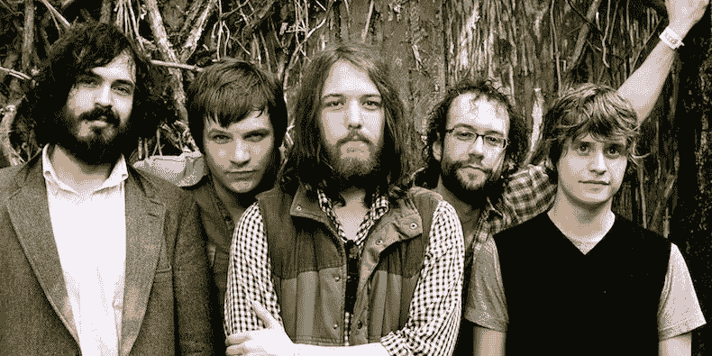
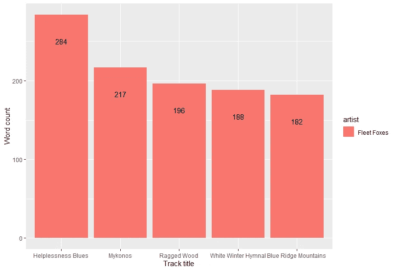
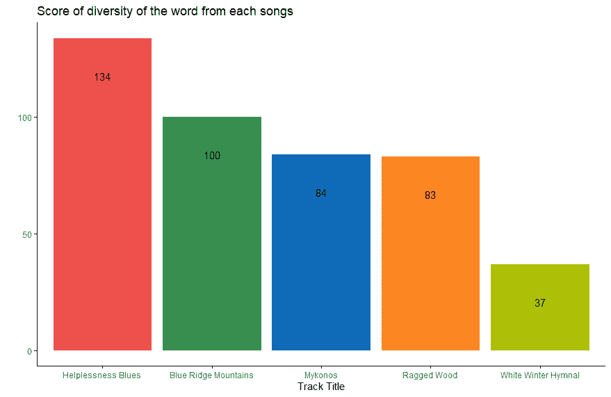
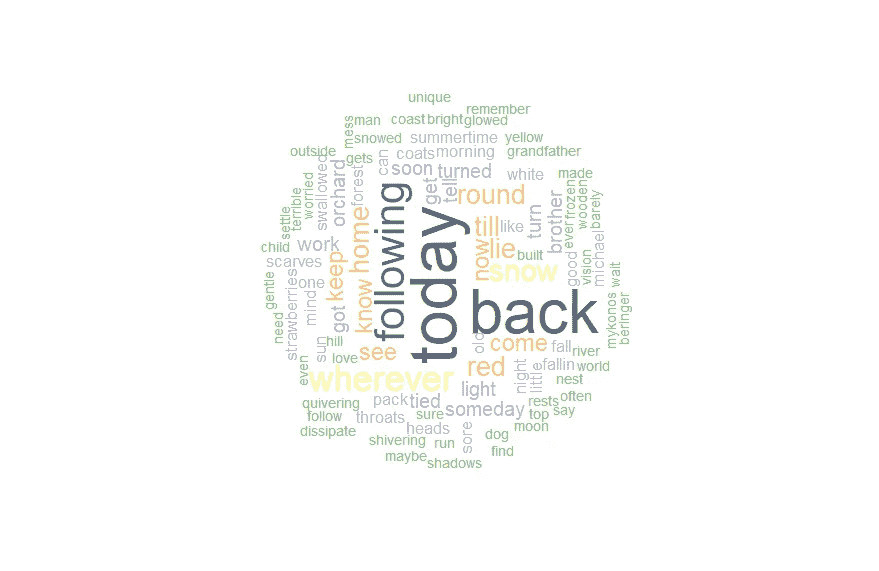
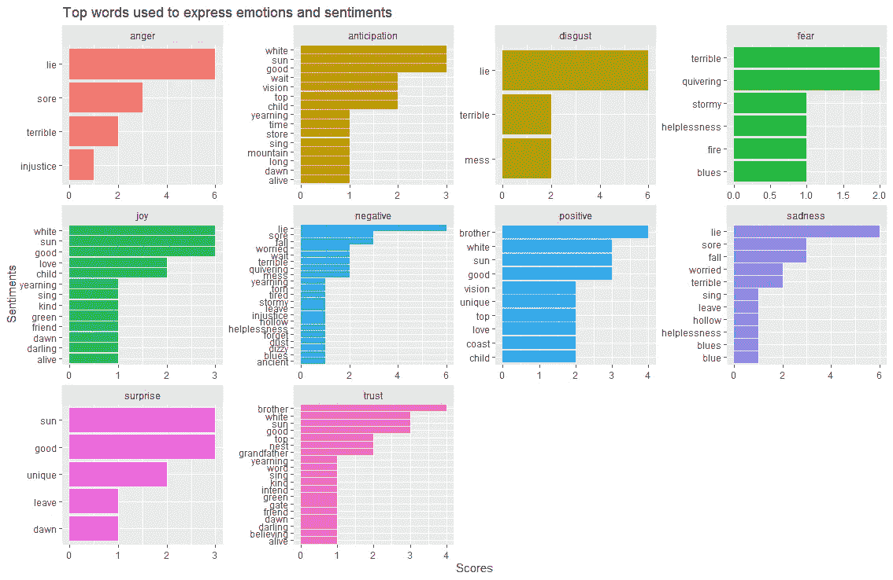
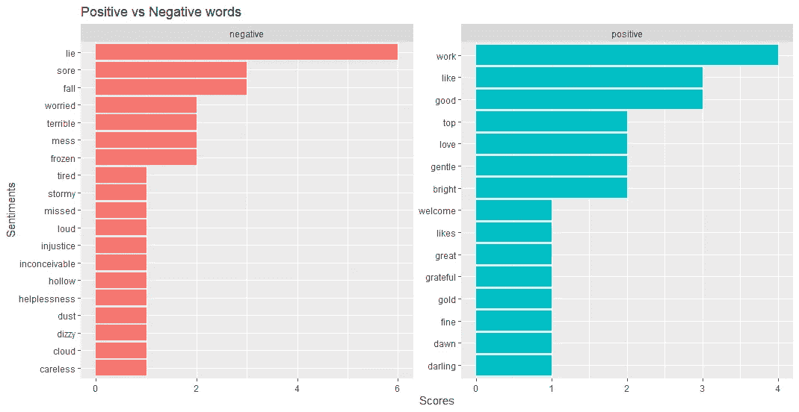
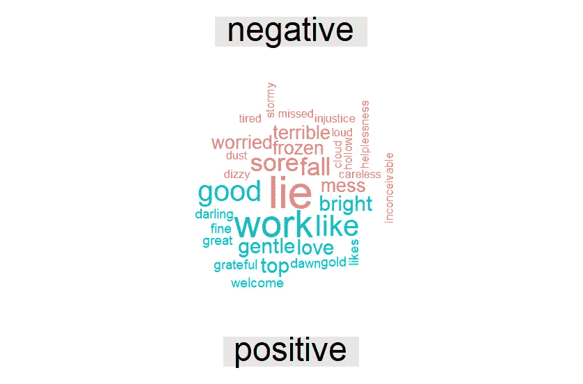

# 用 R 分析狐狸乐队最喜欢的五首歌

> 原文：<https://medium.com/analytics-vidhya/analyzing-fleet-foxess-top-5-favorite-songs-using-r-7953daa4e403?source=collection_archive---------22----------------------->

## 深入分析

## 基于 R 语言的狐狸乐队歌曲文本分析



狐狸乐队(2007 年)

我是狐狸乐队的粉丝。我认识他们不久；我记得在[的 Spotify](https://open.spotify.com/track/03CMUlyOZzrNXJnb8Vzm4l) 上偶然发现了他们的热门歌曲*《蓝岭山脉》*，从那时起，这首歌、这张专辑和乐队就成了我的最爱。

我喜欢狐狸乐队的一点是他们的歌词总是有着深刻的含义，有时能让我进入一个永恒的提神空间。他们的歌词充满了令人振奋的氛围和音调，但另一方面，他们的歌词也可能充满了悲伤和担忧。

在这篇文章中，我想探讨更多关于狐狸乐队的五首歌曲。我想知道他们是如何从每一段歌词中建立起音调和共鸣，并把它们编排成完美的旋律。我会用五首歌:*《蓝岭山脉》、《褴褛的树林》、《米克诺斯岛》、《白色的冬天圣歌》*和*无助蓝调*。

我需要做的第一件事是准备工具，这是所有可以方便我做这个分析的包。

## 加载包。

```
library(genius)
library(tm)
library(tidyverse)
library(tidytext)
library(magrittr)
library(wordcloud)
library(syuzhet)
library(igraph)
library(ggraph)
library(readr)
library(circlize)
library(reshape2)
```

如果你看到了，我正在用一个 *genius* 包从 genius 网站导入这首歌的歌词。这是一个非常好的包，所以我不必再复制和粘贴歌词到一个文件中。

## 导入数据。

```
song1 <- genius_lyrics(artist = “Fleet Foxes”, song = “Blue Ridge Mountains”) %>% mutate(artist= “Fleet Foxes”)
song2 <- genius_lyrics(artist = “Fleet Foxes”, song = “Mykonos”) %>% mutate(artist= “Fleet Foxes”)
song3 <- genius_lyrics(artist = “Fleet Foxes”, song = “White Winter Hymnal”) %>% mutate(artist= “Fleet Foxes”)
song4 <- genius_lyrics(artist = “Fleet Foxes”, song = “Helplessness Blues”) %>% mutate(artist= “Fleet Foxes”)
song5 <- genius_lyrics(artist = “Fleet Foxes”, song = “Ragged Wood”) %>% mutate(artist= “Fleet Foxes”)
all_song <- song1 %>% bind_rows(song2) %>% bind_rows(song3) %>% bind_rows(song4) %>% bind_rows(song5)
```

一旦我完全收集了所有的五首歌，接下来我想做的事情就是统计每首歌的字数。

## 数数单词。

```
all_song$length <- str_count(all_song$lyric,”\\S+”)all_song_count <- all_song %>% group_by(track_title, artist) %>%
 summarise(length= sum(length))
```

之后，我使用 barchat 可视化数据。

```
all_song_count %>%
 arrange(desc(length)) %>%
 slice(1:10) %>%
 ggplot(., aes(x = reorder(track_title, -length), length, fill = artist)) +
 geom_bar(stat= ‘identity’) + # , fill= “#EF504D”
 ylab(“Word count”) + xlab(“Track title”) +
 ggtitle(“Amount of words from each songs”) +
 theme_minimal()
```



每首歌曲的字数

如你所见，*无助蓝调*实际上比其他四首歌有更多的词。接下来我想知道的是每首歌中单词的多样性。

## 扔掉重复的单词，使它对每首歌都是独一无二的。

```
tidy_lyrics <- all_song %>% 
 unnest_tokens(word,lyric)word_diversity <- tidy_lyrics %>%
 group_by(artist,track_title) %>%
 summarise(word_diversity = n_distinct(word)) %>%
 arrange(desc(word_diversity))
```

然后，想象它。

```
word_diversity %>% 
  ggplot(aes(reorder(track_title, -word_diversity), word_diversity)) + geom_bar(stat = "identity", fill = my_colors) +
  ggtitle("Score of diversity of the word from each songs") +
  xlab("Track Title") + 
  ylab("") + geom_text(aes(label = word_diversity, vjust = 5)) +
  scale_color_manual(values = my_colors) + theme_classic()
```



每首歌曲单词多样性得分

在我扔出重复的单词并使其完全独特(只有一个)后，如你所见，*蓝岭山*成为亚军，而*白色冬季圣歌*落到最后一名。

接下来，我想知道五首歌里用的最多的词。为此，我必须转换数据(歌词)并使其尽可能干净，这样我就可以对出现频率最高的单词进行排序。

## 使它整洁。

```
docs <- tidy_lyrics$word
docs <- Corpus(VectorSource(tidy_lyrics$word))
toSpace <- content_transformer(function (x , pattern ) gsub(pattern, “ “, x))
docs <- tm_map(docs, toSpace, “/”)
docs <- tm_map(docs, toSpace, “@”)
docs <- tm_map(docs, toSpace, “‘“)
docs <- tm_map(docs, toSpace, “‘“)
docs <- tm_map(docs, toSpace, “\\|”)
docs <- tm_map(docs, content_transformer(tolower))
myStopwords <- stopwords(“english”)
docs <- tm_map(docs, removeWords, myStopwords)
dtm <- TermDocumentMatrix(docs)
m <- as.matrix(dtm)
v <- sort(rowSums(m),decreasing=TRUE)
d <- data.frame(word = names(v),freq=v)
lyrics_ff_wc <- d[1:100,]
```

正如你在上面看到的代码，我试着扔掉标点符号和停用词(常用词)，这样我就可以只留下歌词和文本，然后我用 wordcloud 可视化它。

```
wordcloud(words = lyrics_ff_wc$word, freq = lyrics_ff_wc$freq,
          min.freq = 1, max.words=100, random.order=FALSE, rot.per=0.35, colors=brewer.pal(8, "Accent"))
```



狐狸乐队最常用的词

***【今天】*** 是狐狸乐队在他们的歌曲中使用最多的词，但当我们再次检查时， *Mykonos* 是唯一一首出现了 18 次“ ***【今天】*** 的歌曲，而“ ***【回来】*** 一词则经常出现在热播的*无助蓝调*和*碎木*中。

我想做的最后一件事是计算每首歌的情绪。我将使用由赛义夫·穆罕默德和彼得·特尼提出的 *nrc* 词汇情感函数。

## 计算情绪。

```
song_wrd_count <- tidy_lyrics %>% count(track_title)lyric_counts <- tidy_lyrics %>%
  left_join(song_wrd_count, by = "track_title") %>% 
  rename(total_words=n)

lyric_sentiment <- tidy_lyrics %>% 
  inner_join(get_sentiments("nrc"),by="word")

lyric_sentiment %>% 
  count(word,sentiment,sort=TRUE) %>% 
  group_by(sentiment)%>%top_n(n=10) %>% 
  ungroup() %>%
  ggplot(aes(x=reorder(word,n),y=n,fill=sentiment)) +
  geom_col(show.legend = FALSE) + 
  facet_wrap(~sentiment,scales="free") +
  xlab("Sentiments") + ylab("Scores")+
  ggtitle("Top words used to express emotions and sentiments") +
  coord_flip()
```

这是我得到的:



用来表达情感和观点的热门词汇

我还使用了由刘兵和他的合作者使用的词典情感函数来简化判断单词是正面的(好的)还是负面的(坏的)。

```
lyric_sentiment <- tidy_lyrics %>% 
 inner_join(get_sentiments(“bing”),by=”word”)

lyric_sentiment %>% 
 count(word,sentiment,sort=TRUE) %>% 
 group_by(sentiment)%>%top_n(n=10) %>% 
 ungroup() %>%
 ggplot(aes(x=reorder(word,n),y=n,fill=sentiment)) +
 geom_col(show.legend = FALSE) + 
 facet_wrap(~sentiment,scales=”free”) +
 xlab(“Sentiments”) + ylab(“Scores”)+
 ggtitle(“Positive vs Negative words”) +
 coord_flip()
```

这是我得到的:



积极和消极的词

我最不想做的事情是让它变得更简单，所以我在消极和积极的词之间做了一个比较，然后我在 wordcloud 上可视化它。

```
sentiment_word_bing <- tidy_lyrics  %>%
  inner_join(get_sentiments("bing")) %>%
  count(word, sentiment, sort = TRUE) %>%
  acast(word ~ sentiment, value.var = "n", fill = 0) %>%
  comparison.cloud(colors = c("#F8766D", "#00BFC4"), #c("#F8766D", "#00BFC4") max.words = 200)
```



消极与积极词汇对比

正如你所看到的，狐狸乐队用像*谎言、*疼痛和*跌倒这样的词描绘了他们歌曲的负面。另一方面，像*工作、光明*和*温柔*这样的词对他们的歌曲产生了积极的影响。*

狐狸乐队-无助蓝调(现场演出)