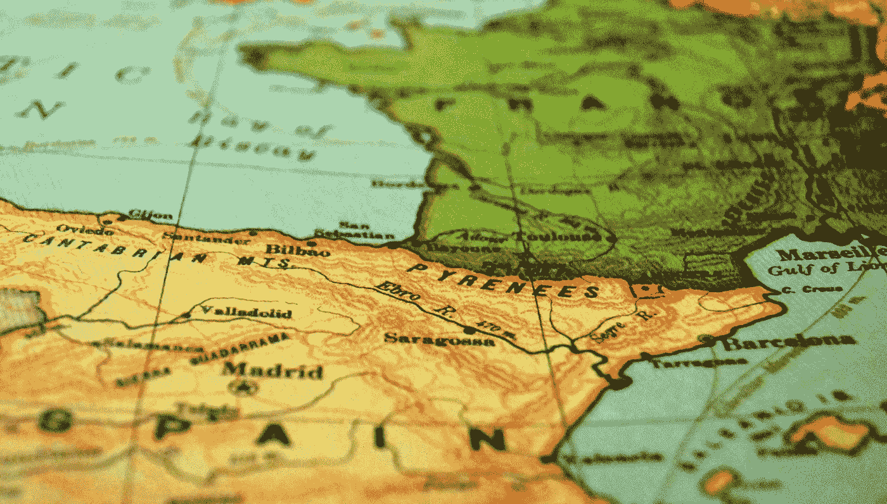
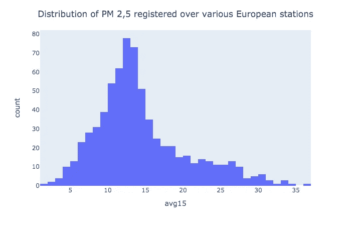
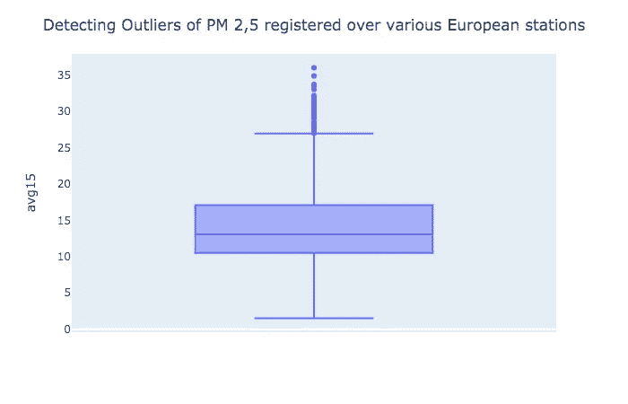
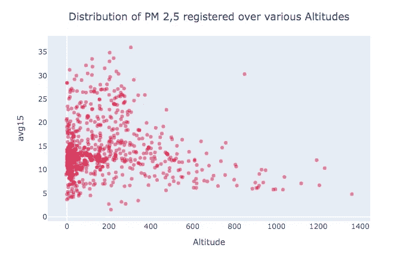
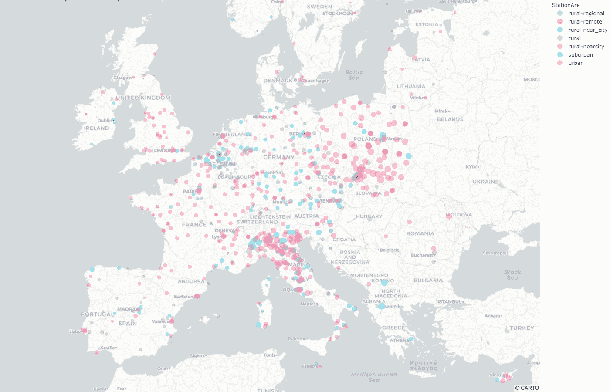
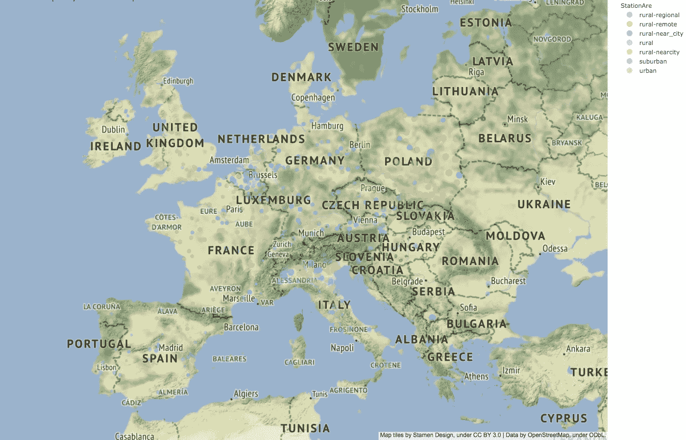
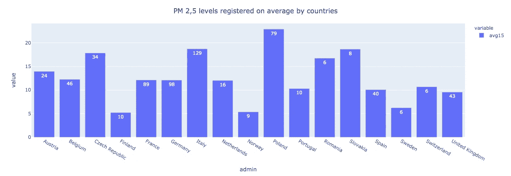
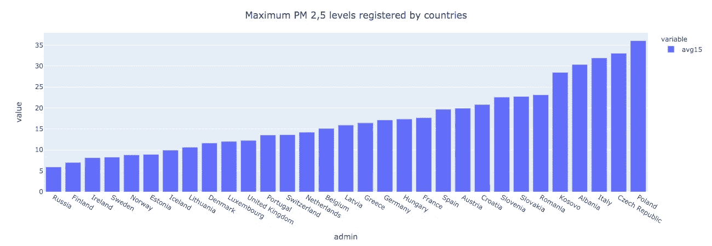
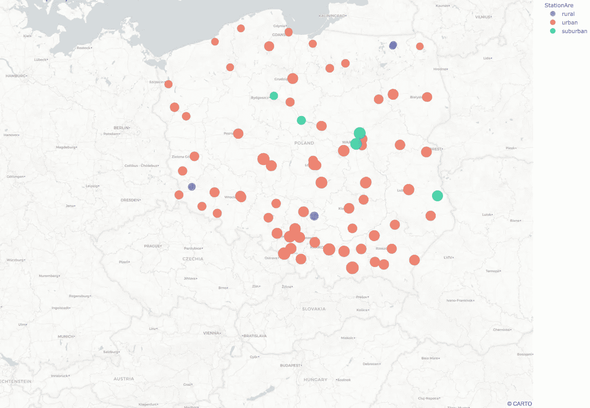

# 使用 Plotly Express 和 GeoPandas 分析地理空间环境数据

> 原文：<https://medium.com/analytics-vidhya/analyzing-geospatial-enviromental-data-using-plotly-and-geopandas-c568eba96ac6?source=collection_archive---------6----------------------->

伊恩在 [Unsplash](https://unsplash.com/s/photos/geo-map?utm_source=unsplash&utm_medium=referral&utm_content=creditCopyText) 上的照片

# 介绍

在本文中，我将使用 GeoPandas 库中的内置方法分析 python 中的地理空间环境数据，并使用 Plotly 库绘制几个地理散点图、直方图、箱线图和条形图。

GeoPandas 库可以用来读取格式为**的文件。shp** 或**。geojson**

我使用了 geojson 格式的**欧洲空气质量**数据，还使用了另一个包含欧洲所有国家地图的 geojson 文件。

描述可以在[这里](http://opendata.esri.es/datasets/datos-de-calidad-del-aire?geometry=146.718%2C88.176%2C11.718%2C90.000)找到

# 索引

*   获取数据
*   导入必要的库来承担这个项目
*   利用 **GeoPandas 库**的内置方法计算空气质量数据的基本统计量
*   生成直方图并了解 PM 2,5 的分布
*   创建盒状图以检测异常值
*   用相关图和散点图检验空气质量与海拔的关系
*   对数据的进一步检查
*   绘制地理散点图
*   将国家数据框与空气质量数据框合并
*   所有国家 PM 2,5 水平合计平均值的柱状图
*   PM 2,5 水平最大值记录的所有国家的柱状图
*   标出污染程度高的国家

# 获取数据

首先，我将使用 Curl 命令获取数据，并将其保存在一个名为 data.geojson 的文件中

下载数据的链接是[这里](https://opendata.arcgis.com/datasets/784fc60a00fa41cb9babb52023cb2db3_0.geojson)

我还使用了所有欧洲国家的 geojson 地图数据[这里](https://geojson-maps.ash.ms/)

# 导入必要的库来承担这个项目

我们将使用名为 Plotly express 的新 Plotly API。

# 使用内置方法 GeoPandas 数据框计算基本统计数据

**让我们一起探索空气质量数据集**

GeoPandas 使我们能够通过它的 **read_file** 命令读取任何 geojson 文件

没有列表示车站的国家，发现有必要将此数据框与包含所有欧洲国家位置的数据框连接起来。

每个 GeoPandas 数据框都有一个名为 **geometry 的列。**我用 CRS 方法找到了这个几何列的属性。可以看出，该数据帧的 EPSG 是 4326。EPSG 4326 表示数据以**经纬度**的形式存在。

**在制作地质散射图之前，让我们探索一下其他地块的特征，以了解 PM 2,5 的分布**

# 生成直方图并了解 PM 2,5 的分布

这里我用了 Plotly express 的**直方图**函数。

**有点偏右。**

# 创建盒状图以检测异常值

这里我用了 Plotly express 的**框**功能。

**高于 27 的值被视为异常值。**

# 用相关图和散点图检验空气质量与海拔的关系

**让我们看看海拔和 PM 2,5 水平之间是否有很强的相关性。**

**有一周负相关。**

**散点图也将证实这一点。**

下面是我用 Plotly express 的**散点**功能。

对于高海拔地区，空气质量比低海拔地区好得多，这是因为通常低海拔地区人口较多。

# 对数据的进一步检查

大多数车站在哪里？

但是在城市地区，PM 2,5 水平可能高达 36！

# 绘制地理散点图

让我们绘制地理散射图。

我使用 plotly express 的**散点 _ 地图框**功能绘制了欧洲所有站点的位置，气泡的大小表示 PM 2,5 的水平。我将不透明度设置为 0.4。

通过选择 mapbox_style 到**雄蕊-地形**聚焦地形

**在海拔较低的地区可以发现较大的气泡**

# 将国家数据框与空气质量数据框合并

现在，我将阅读包含每个欧洲国家地理空间数据的 geojson 文件，并对其进行简要分析。

此 GeoPandas 数据框中的几何列由一个多边形组成，而不是空气质量数据框中的点。

现在，我将把它与包含空气质量信息的 GeoPandas 数据帧合并，这样就可以得出每个站点对应的国家。

> **注意** -在合并任何两个地理熊猫数据框之前，确保它们具有相同的 EPSG。为了那个用途**。crs** 命令并查看 EPSG 值。如果它们不相同，则可以使用 data_frame_1.to_crs(epsg= "第二个数据帧的 epsg ")更改其中一个数据帧的 EPSG，以匹配另一个数据帧的 EPSG

在本例中，两个数据帧的 EPSG 相同，因此需要进行任何更改。

# 描述每个国家 PM 2,5 水平平均值的柱状图

但我只会为那些至少有 5 个电视台的国家绘图。

**平均而言，空气质量最差的监测站位于波兰、意大利和斯洛伐克。**

# 描述每个国家登记的 PM 2,5 最大值的柱状图

这里我包括了所有国家。

一些空气质量最差的监测站位于波兰、捷克共和国和意大利。

# 绘制污染程度高的国家

我将首先绘制一张波兰地图，我将把参数**“zoom”指定为 6** ，这样当地图生成时我们只能看到波兰，我还增加了参数 **size_max** 以获得更好的对比度

**位于波兰南部的监测站似乎空气质量相对较低。**

我希望这篇文章能帮助你完成自己的任务，点击这里查看整个笔记本[我会写更多关于这个话题的帖子:)](https://github.com/rajatprasad1995/European_Air_quality/blob/master/Europe_Air_quality.ipynb)