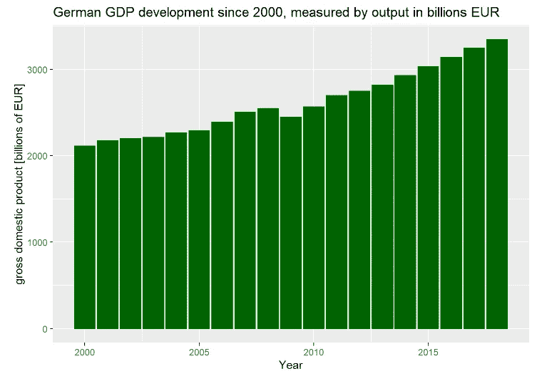
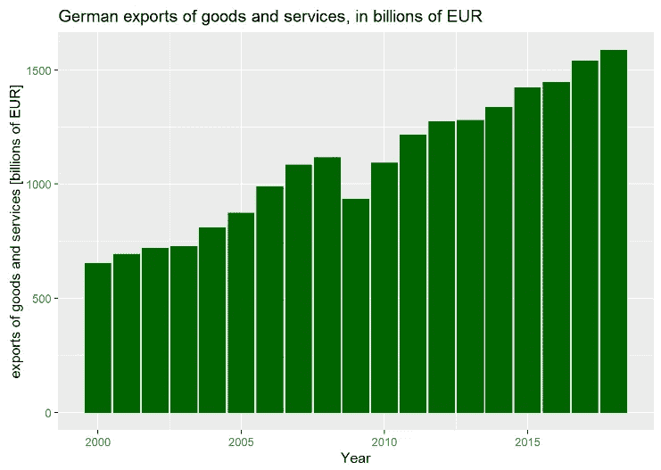
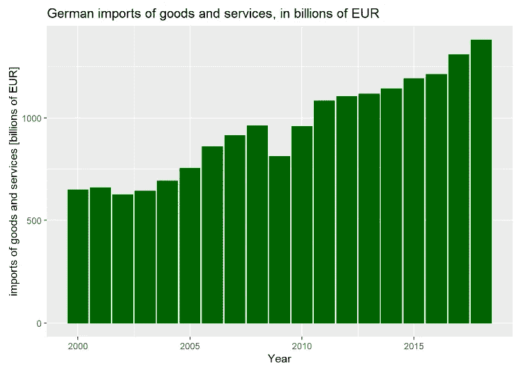
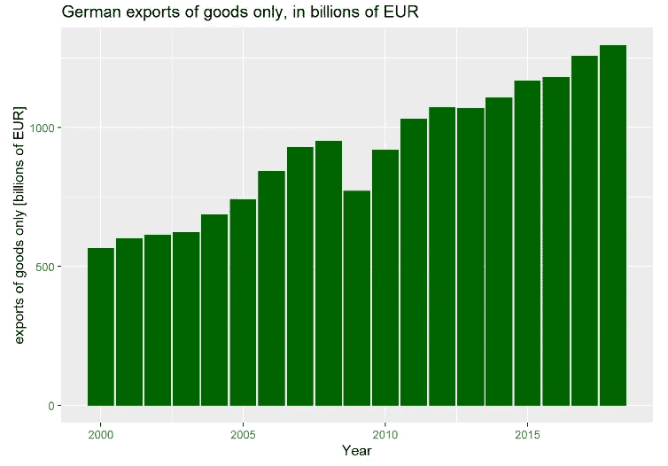
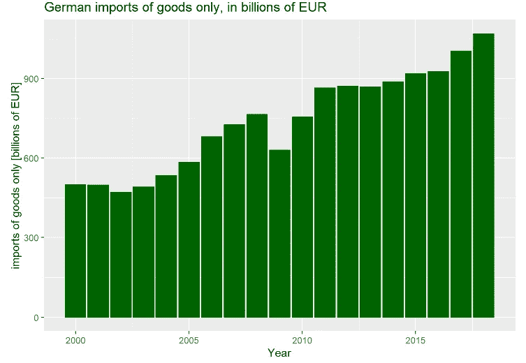
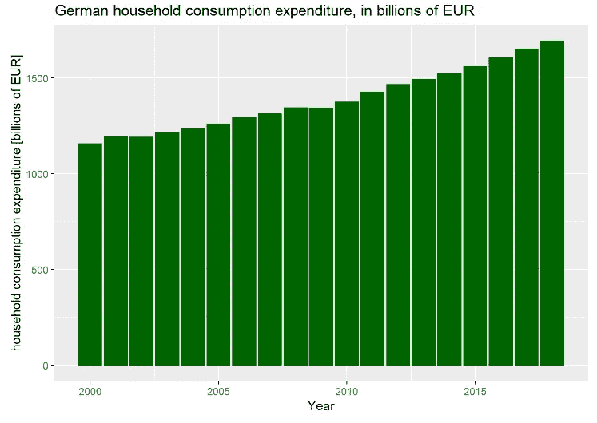
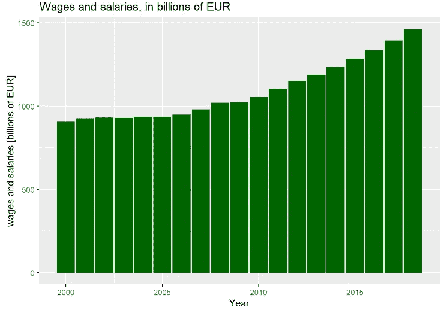
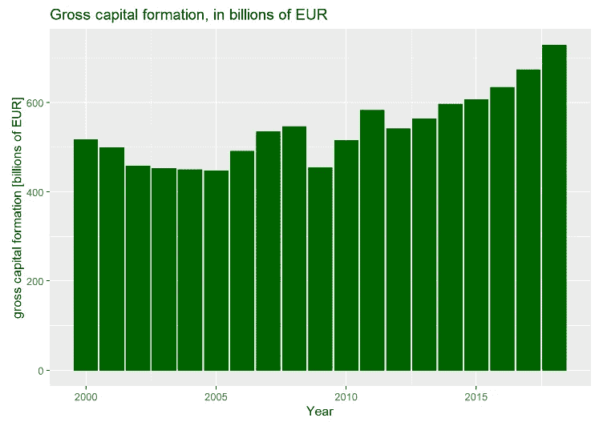

# 2000-2019 年指标分析中的德国经济

> 原文：<https://medium.com/analytics-vidhya/analyzing-german-economy-in-r-2000-2019-indicator-analysis-a0d5f7fee661?source=collection_archive---------25----------------------->

## 分析德国 GDP、消费、进出口和资本形成


在 [Unsplash](https://unsplash.com?utm_source=medium&utm_medium=referral) 上由 [Ansgar Scheffold](https://unsplash.com/@ansgarscheffold?utm_source=medium&utm_medium=referral) 拍摄的照片

**我利用经合组织的数据分析了德国的主要经济指标。我总结了德国在今年经济停滞和衰退之前的主要发展。我们的分析周期是 2000 年至 2018 年。特别是，我发现:—在 2000 年至 2018 年期间，除了 2009 年至 2010 年期间，可以观察到强劲而稳定的国内生产总值增长—德国家庭消费支出在所有年份都是正增长—总资本形成直到 2006 年都是负的，并且除了 2009 年至 2010 年危机期间，一直沿着快速增长的道路发展—直到 2018 年，可以观察到工资和薪金的强劲增长，这可能推动了消费的稳定增长**

我们的结果表明，德国消费的积极趋势有助于以前主要以出口为导向的德国经济的新的稳定。然而，德国薪资和工资的强劲和稳步增长对历史上强劲的德国出口构成了风险，但可能进一步推动强劲的消费增长。德国 GDP 发展(用产出法衡量)

从 2000 年到 2018 年，除了 2009 年(全球危机)，德国的 GDP 增长强劲。2009 年危机后的发展非常积极，令人惊讶地积极。德国经济表现超出预期和预测。

```
**library**(ggplot2)*# The following TRANSACT keys will be relevant for filtering:*
*# B1_GA: GDP measured with output approach*
*# P6: Exports of goods and services*
*# B11: External balance of goods and services*
*# D11: Wages and salaries*
*# P7: Imports of goods and services*
*# P61: Exports of goods*
*# P71: Imports of goods*
*# P31S14: Final consumption expenditure of households*
*# P5: Gross capital formation*ggplot(filter(data_df,TRANSACT == "B1_GA")) + 
  geom_col(mapping = aes(x = obsTime,y = obsValue/1000), col = "darkgreen", fill = "darkgreen") + 
  ggtitle("German GDP development since 2000, measured by output in billions EUR") + ylab("gross domestic product [billions of EUR]") +
    xlab("Year")
```



图 1:2000 年以来德国的国内生产总值

# 德国商品和服务出口相对于进口的发展

2000 年至 2018 年期间的 GDP 增长是由强劲的出口推动的；在某些年份，出口增长趋势甚至超过了国内生产总值的增长。

```
*# The following TRANSACT keys will be relevant for filtering:*
*# B1_GA: GDP measured with output approach*
*# P6: Exports of goods and services*
*# B11: External balance of goods and services*
*# D11: Wages and salaries*
*# P7: Imports of goods and services*
*# P61: Exports of goods*
*# P71: Imports of goods*
*# P31S14: Final consumption expenditure of households*
*# P5: Gross capital formation*ggplot(filter(data_df,TRANSACT == c("P6"))) + 
  geom_col(mapping = aes(x = obsTime,y = obsValue/1000), fill = "darkgreen", color = "darkgreen") + 
  ggtitle("German exports of goods and services, in billions of EUR") + ylab("exports of goods and services [billions of EUR]") +
    xlab("Year")
```



图 2:2000 年以来德国出口发展

2010 年左右，商品和服务进口增长缓慢，但 2017 年和 2018 年进口增长强劲。

```
*# The following TRANSACT keys will be relevant for filtering:*
*# B1_GA: GDP measured with output approach*
*# P6: Exports of goods and services*
*# B11: External balance of goods and services*
*# D11: Wages and salaries*
*# P7: Imports of goods and services*
*# P61: Exports of goods*
*# P71: Imports of goods*
*# P31S14: Final consumption expenditure of households*
*# P5: Gross capital formation*ggplot(filter(data_df,TRANSACT == c("P7"))) + 
  geom_col(mapping = aes(x = obsTime,y = obsValue/1000), fill = "darkgreen", color = "darkgreen") + 
  ggtitle("German imports of goods and services, in billions of EUR") + ylab("imports of goods and services [billions of EUR]") +
    xlab("Year")
```



图 3:2000 年以来德国的进口发展

# 仅货物进出口:2000 年以来的发展

2010 年后，商品出口快速增长。2010 年至 2019 年，货物出口增长速度较为稳定。

```
*# The following TRANSACT keys will be relevant for filtering:*
*# B1_GA: GDP measured with output approach*
*# P6: Exports of goods and services*
*# B11: External balance of goods and services*
*# D11: Wages and salaries*
*# P7: Imports of goods and services*
*# P61: Exports of goods*
*# P71: Imports of goods*
*# P31S14: Final consumption expenditure of households*
*# P5: Gross capital formation*ggplot(filter(data_df,TRANSACT == c("P61"))) + 
  geom_col(mapping = aes(x = obsTime,y = obsValue/1000), fill = "darkgreen", color = "darkgreen") + 
  ggtitle("German exports of goods only, in billions of EUR") + ylab("exports of goods only [billions of EUR]") +
    xlab("Year")
```



图 4:2000 年以来德国纯商品出口的发展

虽然 2009 年危机后进口增长稳定强劲，但商品进口在 2010 年后停滞不前，仅在 2017 年和 2018 年强劲增长。

```
*# The following TRANSACT keys will be relevant for filtering:*
*# B1_GA: GDP measured with output approach*
*# P6: Exports of goods and services*
*# B11: External balance of goods and services*
*# D11: Wages and salaries*
*# P7: Imports of goods and services*
*# P61: Exports of goods*
*# P71: Imports of goods*
*# P31S14: Final consumption expenditure of households*
*# P5: Gross capital formation*ggplot(filter(data_df,TRANSACT == c("P71"))) + 
  geom_col(mapping = aes(x = obsTime,y = obsValue/1000), fill = "darkgreen", color = "darkgreen") + 
  ggtitle("German imports of goods only, in billions of EUR") + ylab("imports of goods only [billions of EUR]") +
    xlab("Year")
```



图 5:2000 年以来德国纯商品进口的发展

# 2010 年后德国家庭消费支出的发展

纵观这些年，德国最终家庭消费支出稳步增长(仅在 2008-2010 年期间出现停滞):

```
*# The following TRANSACT keys will be relevant for filtering:*
*# B1_GA: GDP measured with output approach*
*# P6: Exports of goods and services*
*# B11: External balance of goods and services*
*# D11: Wages and salaries*
*# P7: Imports of goods and services*
*# P61: Exports of goods*
*# P71: Imports of goods*
*# P31S14: Final consumption expenditure of households*
*# P5: Gross capital formation*ggplot(filter(data_df,TRANSACT == c("P31S14"))) + 
  geom_col(mapping = aes(x = obsTime,y = obsValue/1000), fill = "darkgreen", color = "darkgreen") + 
  ggtitle("German household consumption expenditure, in billions of EUR") + ylab("household consumption expenditure [billions of EUR]") +
    xlab("Year")
```



图 6:2000 年以来德国家庭消费支出的发展

# 德国消费的增长是由工资和薪水的增长推动的吗？

在很长一段时间里，薪水和工资增长很少。然而，劳动力成本在期末(2017 年、2018 年)快速增加。

```
*# The following TRANSACT keys will be relevant for filtering:*
*# B1_GA: GDP measured with output approach*
*# P6: Exports of goods and services*
*# B11: External balance of goods and services*
*# D11: Wages and salaries*
*# P7: Imports of goods and services*
*# P61: Exports of goods*
*# P71: Imports of goods*
*# P31S14: Final consumption expenditure of households*
*# P5: Gross capital formation*ggplot(filter(data_df,TRANSACT == c("D11"))) + 
  geom_col(mapping = aes(x = obsTime,y = obsValue/1000), fill = "darkgreen", color = "darkgreen") + 
  ggtitle("Wages and salaries, in billions of EUR") + ylab("wages and salaries [billions of EUR]") +
    xlab("Year")
```



图 7:2000 年以来德国工资和薪金的发展

# 最后:2000-2019 年期间总资本形成发展分析:

直到 2006 年，总资本形成偏离了国内生产总值的积极趋势。2006 年至 2007 年期间，总资本形成最终有所回升，但在 2009 年至 2010 年的危机期间遭受了重大打击。自那以后，德国总资本形成每年都出现强劲增长。

```
*# The following TRANSACT keys will be relevant for filtering:*
*# B1_GA: GDP measured with output approach*
*# P6: Exports of goods and services*
*# B11: External balance of goods and services*
*# D11: Wages and salaries*
*# P7: Imports of goods and services*
*# P61: Exports of goods*
*# P71: Imports of goods*
*# P31S14: Final consumption expenditure of households*
*# P5: Gross capital formation*ggplot(filter(data_df,TRANSACT == c("P5"))) + 
  geom_col(mapping = aes(x = obsTime,y = obsValue/1000), fill = "darkgreen", color = "darkgreen") + 
  ggtitle("Gross capital formation, in billions of EUR") + ylab("gross capital formation [billions of EUR]") +
    xlab("Year")
```



图 8:2000 年以来德国总资本形成的发展

欲了解更多有关经合组织数据分析的信息，请访问[SupplyChainDataAnalytics.com](http://www.supplychaindataanalytics.com)