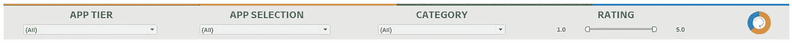

# 使用 Tableau 分析谷歌 Play 商店数据

> 原文：<https://medium.com/analytics-vidhya/analyzing-google-play-store-data-using-tableau-e0a8b77a860c?source=collection_archive---------11----------------------->

在开发仪表板时，如何通过简单地关注小细节来提高可视化技能。

Tableau 公共

让我们从数据开始，数据是任何分析的核心部分。在这里，我使用的是从 [Kaggle](https://www.kaggle.com/lava18/google-play-store-apps) 获取的 Play Store 数据。这是数据点的样子:

来自 Kaggle

请注意，与 Google Play 相比，这里的数据可能不精确到当前的数据点，但这里的**想法是实现一个简单而迷人的仪表板风格**。

一旦你理解了需求和数据，计划如何执行过程是非常重要的。你应该想出答案(因为这是你不能谷歌的):

**观众是谁？**

它将是可交互的还是仅仅是一个强大的单页传呼机？

**此案例的 KPI 是什么？**

**胡说**。

许多开发人员喜欢勾画他们的想法，这样粗略的工作可以事先加强过程(最初你可能不知道你将如何实现结果，但相信我，它最终会有帮助)。

这是我画的:

(糟糕笔迹的一个好例子)

一旦我脑海中有了这个粗略的想法，我就有了很好的答案:

**观众**:未知，所以我可以控制剧情

**结构**:可交互但单一的仪表板，可能很长

**过滤器**:都在一个地方

**颜色**:基于 Google Play 的品牌

**字体**:三种类型 A 标题，B 标题，C 正文

**仪表板尺寸**:超长尺寸

在创建了精美的图表和复杂的可视化之后，我删除了许多使报告复杂化的图表/表格。并且只保留相关的、相关的和有助于创作故事的视觉化图像。过了一会儿，我准备基于我开发的表创建一个**仪表板**(我不会讨论创建可视化的方法，因为有很多关于如何做的指南)。

# 正在创建仪表板…

由于我决定创建一个很长的仪表板，我可以固定宽度(appx 1200 px)并在末尾添加一个空白对象，然后开始创建它(我认为这是一个非常好的方法，因为我的报告有一个未知的受众和 n 个工作表)。从平铺布局到浮动布局的选择也是一个重要的方面。如果你不确定，那么结合使用它们(手动计算每个像素位置)。

当你在网上展示你的报告时，选择字体真的很难。尤其是在 Tableau 中，因为不支持非标准字体。

由于我想遵循 Google Play 的品牌指导方针，我决定使用 [Roboto](https://fonts.google.com/specimen/Roboto) 。但我注意到它在 Tableau Public 上不受支持。所以我找到了一个变通办法，将标题(带有自定义字体)转换成图像(PNG 格式),并在仪表板中使用它们，这样它就提供了一个圆滑的设计和感觉。

**字体 A(标题)** : Roboto(但作为图像)

**字体 B(标题)**:表格加粗(内置字体)

**字体 C (Body)** : Tableau Book(内置字体)

请注意，上面的想法来自草图，所以很有帮助！

# 过滤器…

基于每个工作表之间的数据和关系，必须找到可以用作过滤器的公共元素。我把它们叫做**全局滤镜**(请不要起诉我)。

全局过滤器

当我使用 Excel 时，很多时候我找不到我想要的，然后我不得不谷歌它。这也是因为许多可选择的项目被放在一个地方，这给寻找它们造成了困难。因此，我利用了大量的空间在我的过滤器部分。此外，还使用了 Google Play 的一条细线标志来创建一个虚拟书架。

# 主要材料…

对于选定的工作表，我必须仔细决定仪表板中每个元素的位置和顺序。因为我想根据它们的功能性、相关性和可用性将它们分开。

这是结果:

一个部分

b 部分

你看，我为每个部分使用了相似的颜色，因为它分别代表相似的数据。但是请注意，这里的中性色是灰色(代表底层元素)，而高亮颜色不同(蓝色、橙色等)。).

在每一节中，用图像代替标题。这是因为我们不能使用自定义字体。作为解决办法，我前面提到过，你可以通过在 PowerPoint 中创建标题，并将其转换为图像(或者只使用 Photoshop)来实现。

你说为什么要如此关注标题和题目呢？我不知道，但它确实有帮助，一些研究这样说。

# 更多内容…

一旦您在仪表板中覆盖了所有需要的表和元素，现在是时候进行[审查](https://i.imgflip.com/14ixr4.jpg)了。你可以一遍又一遍地重复你在第一天开始的整个过程，但这里重要的是你想作为一个故事传达什么，以及它与你的仪表板有多接近。

例如，这里我想展示 Android 版本是如何支持 Android 应用程序的。

你喜欢吗？

创建这个部分是一个漫长的过程，因为我必须从 Android.com 手动收集所有的图像，然后调整它们的大小来可视化。虽然可能有一种简单的方法来表现这一点，但选择不同的方法会有所帮助，因为观众可能只想看到熟悉和喜欢的东西(比如 Android 版本的徽标，谁不喜欢它们呢？).有时，无论分析多么重要和准确，查看增长、分布或一些相当复杂的统计数据可能会令人厌烦。

所以吸引观众很重要！

# 结论…

[在野外](https://s.yimg.com/ny/api/res/1.2/lXco4_KKjJf7zRsNOspmLg--~A/YXBwaWQ9aGlnaGxhbmRlcjtzbT0xO3c9MTI4MDtoPTk2MA--/http://media.zenfs.com/en-US/homerun/uproxx_tv_739/adf7d89f11733aef7177c2c71f7cc0a6)，没有结论。只要有创意，在你的报告中有更多的细节。

如果你感兴趣，那么看看[仪表盘](https://public.tableau.com/profile/idlerahim#!/vizhome/GooglePlayStore-AppScorecard/Apps)。