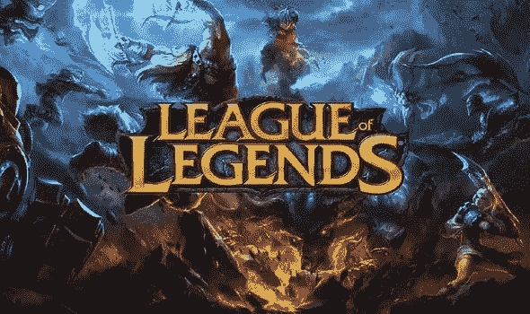
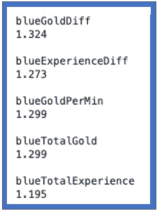
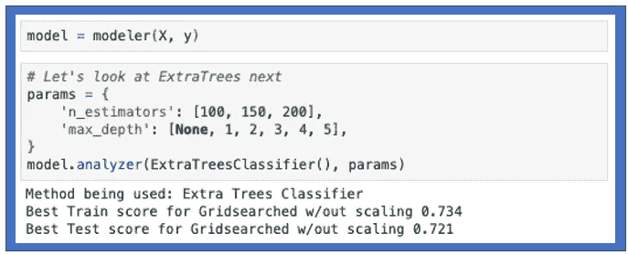

# 用分类模型分析英雄联盟

> 原文：<https://medium.com/analytics-vidhya/analyzing-league-of-legends-bacc71f45026?source=collection_archive---------27----------------------->

图 1:英雄联盟标志

英雄联盟(LoL)是由 Riot Games 开发并发布的多人在线视频游戏。我不会用规则来烦你，但本质上这是一场 5v5 比赛，每个队的目标是摧毁对方的基地(红队对蓝队)。用于此分析的数据来自 [Kaggle](https://www.kaggle.com/bobbyscience/league-of-legends-diamond-ranked-games-10-min) ，这意味着数据是干净的，可以进行分析。这不是一个很难的问题，但是因为我玩这个游戏很久了，我很好奇我对这个游戏的看法和数据是如何匹配的。这个项目的所有 EDA 和分析都可以在我的 [github 页面](https://github.com/JaredDelora/LeagueofLegendsAnalysis)上找到。

一场典型的比赛大约 30 分钟。Kaggle 提供的数据给出了比赛开始 10 分钟时的统计数据，以及最终的获胜者。这个分析中考虑的玩家等级都比较高，所以他们肯定了解游戏的来龙去脉。

要回答的主要问题:在一场 LOL 比赛开始十分钟后，我们能多好地预测谁会赢？

10 分钟对于一场 LOL 比赛来说太早了，10 分钟后会发生很多事情。LOL 游戏的绝对最短时间是 15 分钟，但他们通常会达到 40 分钟或更长。我进行这项分析的偏见是，在比赛开始 10 分钟的时候，我无法预测出获胜者，我想最多可能是 60%。

图 2:增加最大胜算的特性

图 2 显示了几个模型特征的逻辑回归概率。我们可以看到，增加团队获胜机会的特征是黄金和经验相关的。有了黄金，玩家可以购买让他们的玩家变得更强的物品，有了经验，玩家可以获得更高的等级来增强他们的力量。因此，在比赛开始 10 分钟时，资金和经验最丰富的球队最有可能获胜是有道理的。

但是可能性有多大呢？我们能多好地预测谁会赢？

图 3:树外分类器 R2 分数

我写了一个叫做**建模器**的 python 类，用一个叫做**分析器**的方法让我可以很容易地尝试不同的模型和参数。除了上面提到的逻辑回归模型，我还构建了 KNN、随机森林和额外树木分类模型。对这些模型中的每一个都进行了网格搜索，以找到最佳参数。图 3 显示了额外树分类模型的一些参数。我构建的所有模型都有相似的准确度分数，搜索了一下后，我发现这个数字大约是大多数 LOL 分析的结果。

最初提出的问题是:在一场 LOL 比赛开始十分钟后，我们能多好地预测谁会赢？

从我的分析来看，如果你领先 10 分钟，胜算肯定对你有利，比我原先想的要大得多。在我们的例子中，准确率为 0.73，这意味着在比赛开始 10 分钟时，我们能够预测谁将赢得大约 73%的时间。所以在一场 LOL 比赛开始 10 分钟后，如果你落后了，你可能会输。