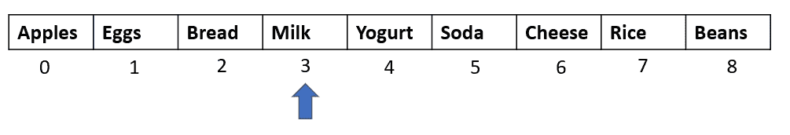
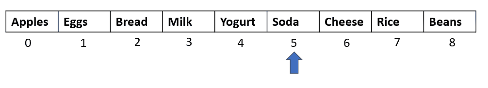

# 分析线性和二分搜索法算法

> 原文：<https://medium.com/analytics-vidhya/analyzing-linear-and-binary-search-algorithms-e20f0113089f?source=collection_archive---------40----------------------->


搜索可以被认为是一个软件产品拥有良好用户体验的最重要的特征之一。例如，每当我们登录亚马逊，我们可以直接进入搜索栏，输入我们希望购买的产品，而不是一个接一个地浏览所有产品！

随着数据量的增加，搜索算法可能会变得非常复杂，编写高效算法的关键是首先理解基础知识。今天，我们将研究两个简单的搜索算法，它们都适用于数组数据结构。这将让您了解如何执行搜索操作，以及当输入数据增加时对效率的影响。

**线性搜索**

顾名思义，线性搜索一个接一个地遍历数组中的所有元素，直到找到想要的元素。

假设我们有以下数组，它存储了添加到在线杂货购物车中的产品列表:


结账时，我们决定把苏打水从单子上去掉。为了做到这一点，我们首先需要在列表中找到“苏打水”的确切位置。

线性搜索将如下进行:

**第一步:**从索引 0 开始。物品是“汽水”吗？


不，这不是苏打水。继续下一个元素

**第二步:**索引 1 处的项目是“苏打水”吗？


没有。继续下一个元素

**第三步:**索引 2 处的物品是“汽水”吗？


没有。继续下一个元素

**第四步:**索引 3 处的物品是“汽水”吗？



没有。继续下一个元素

**第五步:**索引 4 处的物品是“汽水”吗？


没有。继续下一个元素

**第六步:**索引 5 的物品是“汽水”吗？



是啊！终于！唷！

通过我们的线性搜索算法，在数组中的索引 5(或位置 6)找到了项目 soda。为了在第 6 个位置找到一个项目，算法采取了 6 个步骤。如果 Soda 出现在位置 7，那么算法将采取 7 个步骤。因此，我们可以说线性搜索将花费 n 步来寻找第 n 个位置的元素。换句话说，算法的复杂度是 O(n)或 n 阶。

**用 C#实现**

下面是线性搜索算法在 C#中的实现:

```
public void LinearSearchProduct()
        {
            string[] cart = new string[] { "Apples", "Eggs", "Bread", 
                             "Milk", "Yogurt", "Soda", "Cheese", "Rice", 
                             "Beans" };
            string item = "Soda";
            bool found = false; //For loop will go over each element of the array
            for(int i=0; i < cart.Length; i++)
            {
                if(cart[i] == item)
                {
                    found = true;
                    Console.WriteLine("Product found at index: " + i);
                    break;
                }
            } if(found == false)
            {
                Console.WriteLine("Product not found");
            }
        }
```

**增长分析**

在我们的例子中，我们只有一个包含九个元素的数组。想象一下，如果数组包含数千个元素。更糟糕的是，想象一下如果我们感兴趣的项在数组的最后一个位置！因为线性搜索算法需要遍历整个数组，所以当我们有大量数据时，它可能不是一个很好的选择。

正如我们在下表中看到的，对于添加到数组中的每个新元素，线性搜索将需要一个额外的步骤来查找一个项目，其增长复杂度为 O(n):


**二分搜索法**

二分搜索法算法比线性搜索快得多。唯一需要注意的是，二分搜索法希望我们的数组中的数据是有序的。换句话说，二分搜索法算法作用于*有序数组。一旦我们理解了算法的工作原理，这将变得更有意义。*

该算法通过每步消除或忽略数组中的一半元素来工作，直到我们找到所需的元素。

首先，它从查看数组的*中间元素*开始。如果要搜索的项目等于中间的元素，我们得到我们的结果。

否则，它检查要搜索的项目是小于还是大于中间元素。

如果该项小于中间的元素，那么它考虑数组的前半部分用于下一步，而忽略后半部分。

如果该项大于中间的元素，那么它考虑数组的后半部分，忽略前半部分。

无论选择哪一半，它都会通过检查中间的元素并将其与要搜索的项目进行比较，再次重复上述所有步骤。

我们这样做，直到我们得到想要的元素。

让我们回到我们的例子来直观地看看它是如何工作的:


我们希望在上面的数组中搜索“Soda”项。

*第一步是按照自然顺序对这个数组*进行排序(如果是字符串，按升序或字母顺序)。所以下面是我们的输入数组。


**第一步:**找到上面数组的中间元素。如果数组的长度是 n，那么如果 n 是偶数，中间的元素将是 n/2，如果 n 是奇数，中间的元素将是(n+1)/2。

这里，数组的长度是 9。所以我们的中间元素应该在位置(9+1)/2 = 5。(这将是索引 4，因为数组从索引 0 开始)


中间元素是不是=“苏打”？没有。

“苏打”是小于还是大于中元素？大于(按字母顺序，苏打水在鸡蛋之后)

**步骤 2:** 选择数组的后半部分，找到新的中间元素:


这个新数组的长度是 4，所以中间的元素应该在第二个位置(4/2)——这里是索引 6

中间元素是不是=“苏打”？没有。

“苏打”是小于还是大于中元素？大于(按字母顺序，汽水排在米饭之后)

**步骤 3:** 选择数组的后半部分，找到新的中间元素:


这个新数组的长度是 2，所以中间的元素应该在第一个位置(2/2)——这里是索引 7。

中间元素是不是=“苏打”？是啊！返回元素。

因此，我们可以看到，二分搜索法算法只用了 3 个步骤就找到了想要的商品。

**增长分析**

需要注意的一点是，每走一步，我们要研究的元素数量就会减少一半。让我们从另一个角度来看这个问题，也就是说，二分搜索法会为多少新的元素采取额外的步骤？


因此，我们可以看到，每当数组中的元素增加一倍时，二分搜索法就会多走一步来查找该项。这就是二分搜索法时间复杂度的增长。由于这种增长可以用对数表示，所以二分搜索法的复杂度是 O(logn)或 log(n)的阶。

**实施**

二分搜索法在 C#中的实现如下:

```
public void BinarySearchProduct()
        {
            string[] cart = new string[] { "Apples", "Eggs",      "Bread", 
                            "Milk", "Yogurt", "Soda", "Cheese", "Rice", 
                             "Beans" };
            string item = "Soda";
            bool found = false; //we need to sort cart to implement binary search
            Array.Sort(cart); int start = 0;
            int end = cart.Length - 1; while(start <= end)
            {
                int len = end - start + 1;
                int mid = start + (len / 2); if (item == cart[mid])
                {
                    Console.WriteLine("Element found at index: " + mid);
                    found = true;
                    break;
                }
                else if (item.CompareTo(cart[mid]) > 0)
                {
                    start = mid + 1;
                }
                else
                {
                    end = mid - 1;
                }
            } if(found == false)
            {
                Console.WriteLine("Element not found in array");
            }
```

**总结**

1.  线性搜索遍历整个数组，一次一个元素，直到找到所需的项
2.  线性搜索的时间复杂度为 O(n)
3.  二分搜索法处理一个排序的数组
4.  二分搜索法每走一步就消除一半的元素，从而加快搜索速度。
5.  二分搜索法的时间复杂度为 O(logn)

【https://www.pexels.com/@pixabay】特征图片来源:[](https://www.pexels.com/@pixabay)