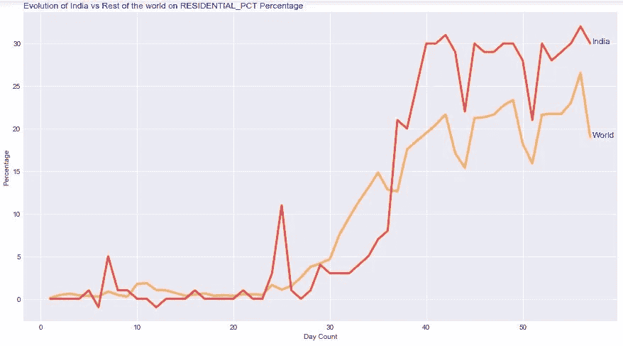
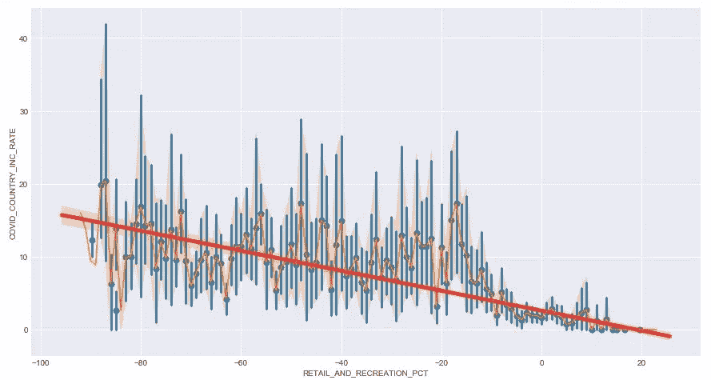
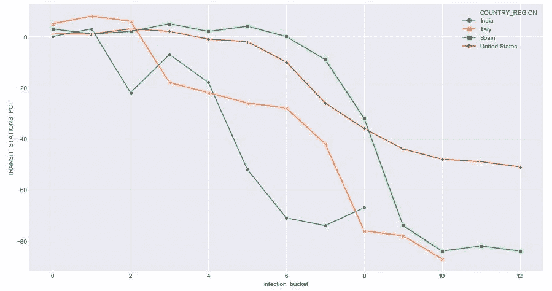

# 使用 python 可视化和 PivotTable.js 分析人类历史上最大的“封锁”:世界上最大的民主国家印度

> 原文：<https://medium.com/analytics-vidhya/analyzing-mankinds-biggest-lockdown-in-history-using-python-visualization-and-pivottable-js-ff3b2c6166bf?source=collection_archive---------32----------------------->


大约一半的全球人口处于“锁定”状态，这比两次世界大战期间的人口还多。**印度，**这个世界上最大的民主国家能够管理好它的 1，380 万人口，用数百万的多样性和混乱来维持从一开始就锁定的疫情在国内的蔓延。在本文中，我们将比较六个流动性因素，并试图找出印度与世界相比以及与受新冠肺炎影响最严重的国家相比是如何动员的。此外，我们将通过使用 python 和 pivottable.js 的数据分析和可视化方法，尝试了解移动性因素是否有助于延长感染率(通过“感染桶”分析)

结构表格数据已从 google、apple 和其他开源位置移动数据中提取，可在 Gitlink 中获得:

[https://github . com/deep startup/新冠肺炎-社区-移动性-数据集/blob/master/world _ Mobility _ with _ covid _ infection _ count . CSV](https://github.com/deepstartup/COVID-19-Community-Mobility-Dataset/blob/master/world_mobility_with_covid_infection_count.csv)

日期范围从 2020 年 2 月 16 日到 2020 年 4 月 11 日(57 天)。该导出数据集已用于以下分析:

# ~ Pythonic 视图:

导入必要的库并加载数据集:

```
import pandas as pd
import seaborn as sns
import matplotlib.pyplot as plt
from matplotlib.pyplot import figure
df=pd.read_csv('/data/csv_corona/world_mobility_with_covid_infection_count.csv')
```

描述列:

```
print(df.columns)
```


数据框列

移除空值和异常值:

```
df.dropna()
Q1 = df.quantile(0.15)
Q3 = df.quantile(0.85)
IQR = Q3 - Q1
#outlier count across all columns
dfOutliners=((df < (Q1 - 1.5 * IQR)) | (df > (Q3 + 1.5 * IQR))).sum()
#removing outliers 
df = df[~((df < (Q1 - 1.5 * IQR)) |(df > (Q3 + 1.5 * IQR))).any(axis=1)]
```

移动系数列:

1.零售和娱乐:餐馆、咖啡馆、购物中心、主题公园、博物馆、图书馆和电影院等场所的移动趋势。
2。杂货店和药房:杂货店、食品仓库、农贸市场、专业食品店、药店和药房等场所的移动趋势。
3。PARKS_PCT:地方公园、国家公园、公共海滩、码头、狗公园、广场和公园等地的移动趋势。
4。TRANSIT_STATIONS_PCT:地铁、公交和火车站等公共交通枢纽的移动趋势。
5。工作场所百分比:工作场所百分比
6。住宅 _PCT:居住地的流动性趋势。

与世界其他地区相比，印度在移动趋势方面的表现:

```
#Dataframe for India
dfInd=df[(df['COUNTRY_REGION']=='India')]
#Removing the object columns from main DataFrame
x=pd.DataFrame(df.dtypes)
lst=[]
for r in x.itertuples():
    if r[1]!='object':
        lst.append(r[0])
#average on world data
dfavg=df.groupby(['DAY_CT']).mean()
dfavg.reset_index(inplace=True)
```

在折线图中可视化数据:(**杂货店和药店百分比** )
X 轴:从 2010 年 2 月 16 日到 2010 年 4 月 11 日的天数
Y 轴:百分比，其中 0 表示平均正常百分比。

```
plt.style.use('seaborn-darkgrid')
my_dpi=96
plt.figure(figsize=(480/my_dpi, 480/my_dpi), dpi=my_dpi)plt.plot(dfavg['DAY_CT'], dfavg['GROCERY_AND_PHARMACY_PCT'], marker='', color='orange', linewidth=3, alpha=0.7)plt.plot(df['DAY_CT'], dfInd['GROCERY_AND_PHARMACY_PCT'], marker='', color='red', linewidth=3, alpha=0.7)plt.text(57.2,dfavg.GROCERY_AND_PHARMACY_PCT.tail(1),'India',horizontalalignment='left',size='large' ,color='Blue')plt.text(57.2,dfInd.GROCERY_AND_PHARMACY_PCT.tail(1),'World',horizontalalignment='left',size='large' ,color='Blue')plt.title("Evolution of India vs Rest of the world on GROCERY AND PHARMACY Percentage", loc='left', fontsize=12, fontweight=0, color='blue')
plt.xlabel("Day Count")
plt.ylabel("GROCERY AND PHARMACY_PCT Percentage")
```


“锁定”:印度与世界杂货店和药店比较

以上显示，印度在餐厅、咖啡馆、购物中心、主题公园、博物馆、图书馆和电影院等场所的移动趋势方面比世界做得更好。

同样，让我们来比较一下印度人呆在家里的时间:

```
plt.plot(dfavg['DAY_CT'], dfavg['**RESIDENTIAL_PCT**'], marker='', color='orange', linewidth=3, alpha=0.7)plt.plot(df['DAY_CT'], dfInd['**RESIDENTIAL_PCT**'], marker='', color='red', linewidth=3, alpha=0.7)plt.text(57.2,dfavg.**RESIDENTIAL_PCT**.tail(1),'India',horizontalalignment='left',size='large' ,color='Blue')plt.text(57.2,dfInd.**RESIDENTIAL_PCT**.tail(1),'World',horizontalalignment='left',size='large' ,color='Blue')
```



印度 vs 世界**住宅市场“锁定”**

就居住地的流动性趋势而言，印度的比例高于世界！
让我们比较一下**零售 _ 娱乐 _ 百分比和公园 _ 百分比:**


带公园的零售和娱乐活动百分比

最后比较**公交 _ 车站 _ 百分比**和**工作场所 _ 百分比:**


印度交通和工作场所 vs 世界“封锁”

现在让我们把这六个参数放在一起:

```
#all in one #LockDown India beat the world
lst_params=['RETAIL_AND_RECREATION_PCT','GROCERY_AND_PHARMACY_PCT','PARKS_PCT','TRANSIT_STATIONS_PCT','WORKPLACES_PCT','RESIDENTIAL_PCT']for x in lst_params:
    plt.plot(dfavg['DAY_CT'], dfavg[x], marker='', color='orange', linewidth=3, alpha=0.6)
    plt.text(57.7, dfavg[x].tail(1),'World '+x,horizontalalignment='left',size='large' ,color='Orange')
    plt.plot(dfInd['DAY_CT'], dfInd[x], marker='', color='red', linewidth=3, alpha=0.7)
    plt.text(57.2, dfInd[x].tail(1),'India '+x,horizontalalignment='left',size='large' ,color='Red')plt.xlabel("Day Count")
plt.ylabel("Percentage")
```


印度与世界一级防范禁闭比较

以上显示了封锁对印度人口整体社会流动性的影响。这表明印度在阻止新冠肺炎病毒传播方面做得很好。

现在，我们可以将增加的移动百分比汇总在一起，并查看:
(增加的移动是与前一天相比移动百分比的变化)

```
#all in one #LockDown India beat the world
lst_params=['INC_RETAIL_AND_RECREATION_PCT','INC_GROCERY_AND_PHARMACY_PCT','INC_PARKS_PCT','INC_TRANSIT_STATIONS_PCT','INC_WORKPLACES_PCT','INC_RESIDENTIAL_PCT']
for x in lst_params:
    plt.plot(dfavg['DAY_CT'], dfavg[x], marker='', color='orange', linewidth=3, alpha=0.6)
    plt.plot(dfInd['DAY_CT'], dfInd[x], marker='', color='red', linewidth=3, alpha=0.7)
plt.xlabel("Day Count")
plt.ylabel("Percentage")
```


图表显示，印度在改变流动性方面比世界其他国家反应更为积极，并且在防范禁闭方面更加自律。

# “封锁”真的会让印度受益吗？

如果你正在读这一行，意味着你已经看到印度的交通限制比世界其他地方的平均水平要好。但是这真的能抑制感染吗？

让我们通过比较数据框架“COVID_COUNTRY_INC_RATE”中的一列来找出答案，即每天新增病例的百分比是多少:

```
plt.plot(dfavg['DAY_CT'], dfavg['COVID_COUNTRY_INC_RATE'], marker='', color='orange', linewidth=3, alpha=0.7)
plt.text(57.7, dfavg['COVID_COUNTRY_INC_RATE'].tail(1),'World '+x,horizontalalignment='left',size='large' ,color='Orange')
plt.plot(dfInd['DAY_CT'], dfInd['COVID_WORLD_INC_RATE'], marker='', color='red', linewidth=3, alpha=0.7)
plt.text(57.2, dfInd['COVID_WORLD_INC_RATE'].tail(1),'India '+x,horizontalalignment='left',size='large' ,color='Red')
plt.xlabel("Day Count")
plt.ylabel("Percentage")
```


新冠肺炎新感染增长率

印度的感染增长率很低！

# **流动性因素对降低感染率是否有效？**

例如，现在让我们分析一下，是否任何一个流动性因素(这里是零售和娱乐百分比)有助于使用 seaborn 来最小化和限制感染:

```
sns.regplot(x=df["RETAIL_AND_RECREATION_PCT"], y=df["COVID_COUNTRY_INC_RATE"], #logistic=True,
x_bins=1000,line_kws={"color":"r","alpha":0.7,"lw":5})
ax = sns.lineplot(x="RETAIL_AND_RECREATION_PCT", y="COVID_COUNTRY_INC_RATE",  markers=True,data=df)
```

X(零售和娱乐百分比)v/s Y(国家感染增加百分比)显示，当流动性降低且感染增加率回归线设法保持低斜率时，感染无指数增长。X 与 1000 个箱的线性函数显示:



具有 1000 个箱 X 值


显示了所有点

```
jplot=sns.jointplot(x='TRANSIT_STATIONS_PCT', y='COVID_CNTY_NEW_CASES', data=df)
```


# **新冠肺炎病毒(感染桶)传播的流动性:**

计算双倍感染的天数:

```
dfctry=df.groupby(['COUNTRY_REGION']).max()
dfctry.reset_index(inplace=True)
dfcctrycode=dfctry['COUNTRY_REGION']
xDF=pd.DataFrame()
for x in dfcctrycode:
    dffltr=df[df['COUNTRY_REGION']==x].sort_values(by=['DAY_CT'])
    dffltrday=dffltr[['DAY_CT','COVID_CONFIRMED','COVID_CNTY_NEW_CASES','COUNTRY_REGION']]
    lstVal=0
    for y in dffltrday.itertuples():
        if y[1]!=1:
            if lstVal*2 <= y[2] and y[2]!=0 and y[3]!=0:
                xDFtmp=df[(df['COUNTRY_REGION']==y[4]) & (df['DAY_CT']==y[1])]
                if len(xDF)==0:
                    xDF=xDFtmp
                else:
                    xDF=pd.concat([xDF,xDFtmp],ignore_index=True)
                lstVal=y[2]
        else:
            lstVal=0
#calculating no of days difference on doubling  the infection spread            
xDF['Double_Infection_Days'] = xDF['DAY_CT']-xDF.groupby(['COUNTRY_REGION'])['DAY_CT'].shift(1)
xDF['infection_bucket'] = xDF.groupby(['COUNTRY_REGION']).cumcount()
```

“感染 _ 水桶”是新冠肺炎病毒感染病例数量翻倍的阶段。印度和美国的例子:


在印度传播

```
xDFir=xDF[['COUNTRY_REGION','DATE_VAL','DAY_CT','Double_Infection_Days','COVID_CONFIRMED','infection_bucket']][xDF['COUNTRY_REGION']=='India']
```


在印度传播

```
x = sns.lineplot(x="infection_bucket", y="Double_Infection_Days",  markers=True,data=xDFir,hue='COUNTRY_REGION')
```

到第 57 天，即 2020 年 4 月 11 日，印度处于感染桶 8，但美国处于 12。下面显示了美国的传播


在美国传播


在美国传播

现在比较印度与大多数 Covid19 受影响国家(美国、意大利、西班牙)的感染传播和流动性:

```
ax = sns.lineplot(x="infection_bucket", y="Double_Infection_Days",
                  hue="COUNTRY_REGION", style="COUNTRY_REGION",
                  markers=True, dashes=False, data=xDFi)
```


将新冠肺炎在印度的传播与受新冠肺炎病毒影响的前三个国家进行比较

上图显示，在感染第 8 阶段(直到 2010 年 4 月 11 日数据可用)，印度平均用了更长的时间才使感染数翻倍。

现在，我们来看看与新冠肺炎 toppers 相比，铲斗 8 的移动百分比是多少:

1.  零售和娱乐百分比:


印度零售业和娱乐业的流动性较低，感染百分比为 8

```
ax = sns.lineplot(x="infection_bucket", y="RETAIL_AND_RECREATION_PCT",
                  hue="COUNTRY_REGION", style="COUNTRY_REGION",
                  markers=True, dashes=False, data=xDFi)
```

2.杂货店和药房百分比:


印度的移动性食品杂货和药房感染百分比低于第 8 桶

```
ax = sns.lineplot(x="infection_bucket", y="GROCERY_AND_PHARMACY_PCT",
                  hue="COUNTRY_REGION", style="COUNTRY_REGION",
                  markers=True, dashes=False, data=xDFi)
```

3.公园百分比:


印度的移动性低于公园百分比感染桶 8

```
ax = sns.lineplot(x="infection_bucket", y="PARKS_PCT",
                  hue="COUNTRY_REGION", style="COUNTRY_REGION",
                  markers=True, dashes=False, data=xDFi)
```

4.公交车站百分比:



印度的公共交通流动性不足百分比感染第 8 桶

```
ax = sns.lineplot(x="infection_bucket", y="TRANSIT_STATIONS_PCT",
                  hue="COUNTRY_REGION", style="COUNTRY_REGION",
                  markers=True, dashes=False, data=xDFi)
```

5.工作场所百分比:


印度流动性较低的工作场所感染百分比第 8 桶

```
ax = sns.lineplot(x="infection_bucket", y="WORKPLACES_PCT",
                  hue="COUNTRY_REGION", style="COUNTRY_REGION",
                  markers=True, dashes=False, data=xDFi)
```

6.住宅 _ 百分比:


印度的留在家里的居民比例在感染桶 8 以下

```
ax = sns.lineplot(x="infection_bucket", y="RESIDENTIAL_PCT",
                  hue="COUNTRY_REGION", style="COUNTRY_REGION",
                  markers=True, dashes=False, data=xDFi)
```

上面的图表也证明了流动性降低如何延长了感染率。

## 相互关联:

从加载的数据框中获取印度数据集与世界前三名的相关系数:

```
coffDf=df.corr()
coffDf=coffDf[['DAY_CT']]
coffDf.rename(columns={"DAY_CT": "WORLD"},inplace=True)
country_list=['Spain','Italy','United States','India']
for xntry in country_list:
    xfilter=df[(df['COUNTRY_REGION']==xntry)]
    xfilter=xfilter.corr()
    xcorrctry=xfilter[['DAY_CT']]
    xcorrctry.rename(columns={"DAY_CT": xntry},inplace=True)
    coffDf=pd.concat([coffDf,xcorrctry],axis=1)
print(coffDf)
d=sns.heatmap(coffDf)
```


世界和前 3 个国家的数据集对象的关联表


关联 Hitmap

# ~PivotTable.js:

用 PivotTable.js 分析数据集不需要编码，只需要下载上述数据并加载到页面中。下面是一个例子:

从[https://github . com/deep startup/新冠肺炎社区移动数据集/blob/master/world _ Mobility _ with _ covid _ infection _ count . CSV](https://github.com/deepstartup/COVID-19-Community-Mobility-Dataset/blob/master/world_mobility_with_covid_infection_count.csv)下载后，将数据集加载到[https://pivottable.js.org/examples/local.html](https://pivottable.js.org/examples/local.html)

**新冠肺炎增加率:**

将“DATE_VAL”和“DAY_CT”拖放到 X 轴，将“COUNTRY_REGION”拖放到 Y 轴。在列“COVID _ CNTY _ 新案例”上选择聚合运算符“sum”:


将新冠肺炎移动数据集加载到 PivotTable.js

从“国家/地区”下拉列表中选择国家/地区(目标国家/地区)后，将图表类型选择为折线图。(在此示例中，选择了“印度”、“美国”、“西班牙”、“意大利”、“英国”、“德国”):


新新冠肺炎每个国家每个日期的新病例

选择传染增长率的图表选项为面积图


全国范围内的感染率

有趣的是，几乎每个县在增长率下降之前都遭受过一次高峰冲击！

在这个平台上，有很多其他选项可以使用数据集。

# 示例实现的源代码:

用 Jupyter 笔记本的文章源代码可以找到:[https://github . com/deep startup/新冠肺炎-社区-移动性-数据集/blob/master/analysis _ world _ Mobility _ and _ covid _ infection . ipynb](https://github.com/deepstartup/COVID-19-Community-Mobility-Dataset/blob/master/analysis_world_mobility_and_covid_infection.ipynb)

[](https://github.com/deepstartup/COVID-19-Community-Mobility-Dataset/blob/master/analysis_world_mobility_and_covid_infection.ipynb) [## deep startup/新冠肺炎社区移动数据集

### permalink dissolve GitHub 是 4000 多万开发人员的家园，他们一起工作来托管和审查代码，管理…

github.com](https://github.com/deepstartup/COVID-19-Community-Mobility-Dataset/blob/master/analysis_world_mobility_and_covid_infection.ipynb) 

数据来源:[https://github . com/deep startup/新冠肺炎-社区-移动性-数据集/blob/master/world _ Mobility _ with _ covid _ infection _ count . CSV](https://github.com/deepstartup/COVID-19-Community-Mobility-Dataset/blob/master/world_mobility_with_covid_infection_count.csv)

> 代码使用数据集进行编辑和创建新的维度，以供读者进行进一步分析，可在 kaggle 笔记本的以下链接中找到:

## [T3【https://www.kaggle.com/arghadeep/kernel627d11466f/edit】T5](https://www.kaggle.com/arghadeep/kernel627d11466f/edit)

# 总结:

以上是从关于新冠肺炎局势的各种公开来源提取和导出的数据的技术分析视图。随着时间的推移，世界将获得更多关于该主题的数据，在相同观点和源代码的帮助下，我们可能会获得有益的结果，这不仅有助于解决这种感染，而且有助于为印度和世界未来未知的疫情疫情提供经验教训。

# 学分:

1.  谷歌移动数据集:

[](https://www.google.com/covid19/mobility/) [## 新冠肺炎社区流动性报告

### 随着全球社区对新冠肺炎做出反应，我们从公共卫生官员那里听说，同样类型的聚集…

www.google.com](https://www.google.com/covid19/mobility/) 

2.苹果移动数据集:

[](https://www.apple.com/covid19/mobility) [## COVID-19-移动趋势报告-苹果

### COVID-19 国家/地区和城市的移动趋势。报告每天发布，反映对…的要求

www.apple.com](https://www.apple.com/covid19/mobility) 

3.约翰·霍普斯金大学新冠肺炎数据集:

[](https://coronavirus.jhu.edu/data/new-cases) [## 世界各国新增新冠肺炎病例

### 曲线变平了吗？世界各国都在努力“拉平”冠状病毒疫情的曲线…

coronavirus.jhu.edu](https://coronavirus.jhu.edu/data/new-cases)