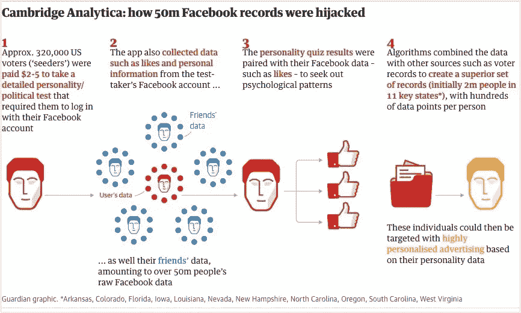
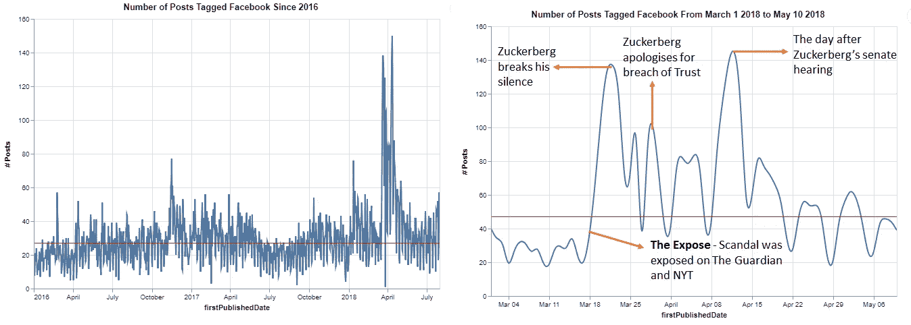
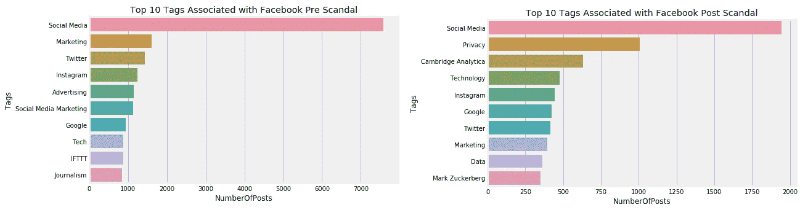
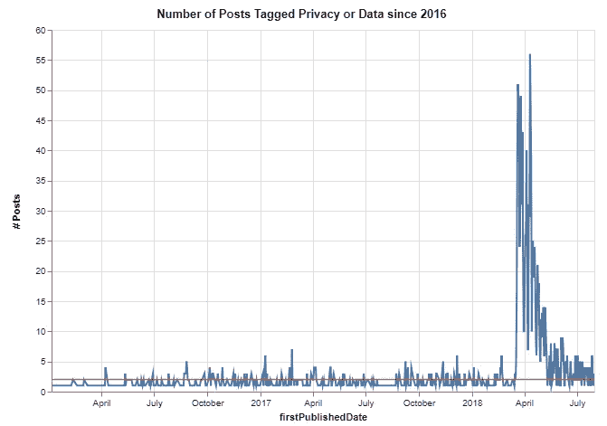
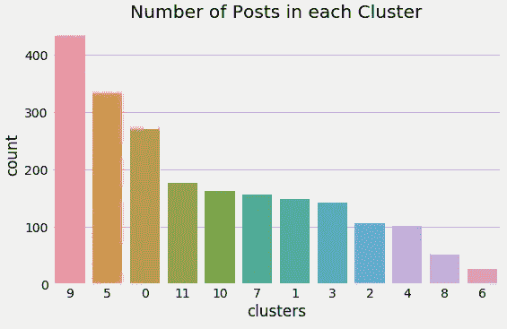
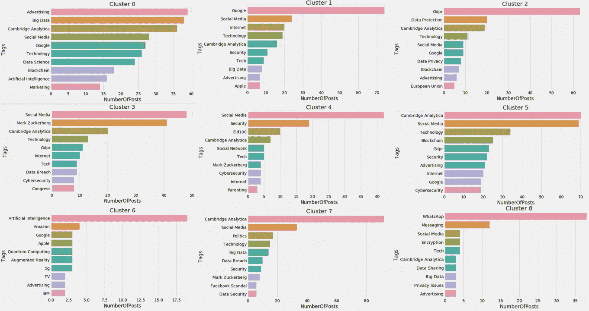
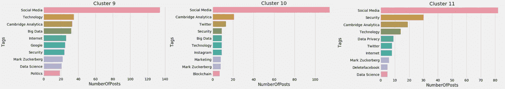
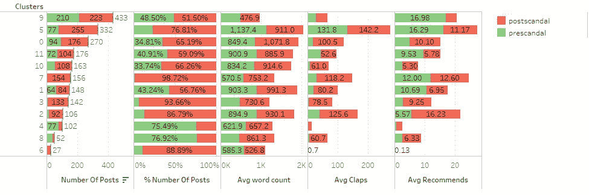

# 分析媒体帖子，了解剑桥分析丑闻的影响

> 原文：<https://medium.com/analytics-vidhya/analyzing-medium-posts-to-understand-impact-of-cambridge-analytica-scandal-5841f46703d6?source=collection_archive---------1----------------------->

## 丑闻发生后，人们的注意力转移到隐私方面了吗？

当剑桥分析公司-脸书丑闻出现时，与科技公司滥用用户数据有关的文章随处可见。提出的与隐私相关的问题让我想了解丑闻对人们对脸书的看法的影响，以及自丑闻以来他们对脸书的看法有何变化。

丑闻——概述

我查阅了媒体的档案，收集了所有贴有“脸书”标签的帖子。你可以在 GitHub 上找到代码来抓取媒体上特定标签的数据[在这里](https://github.com/AiswaryaSrinivas/Scraping-Medium-and-Data-Analysis/blob/master/medium_scrapper_tag_archive.py)以及如何从媒体上抓取数据的细节在[使用 Scrapy](/@aiswaryar/scrapping-medium-posts-using-scrapy-d5e8251dc008) 抓取媒体帖子中。

# **设置舞台**

这项分析考虑了 2016 年 1 月 1 日至 2018 年 7 月 31 日之间以英语发布的 27，317 篇带有“脸书”标签但不是回复的帖子。从帖子的整体分布来看(见下文)，你可以观察到 2018 年 3 月至 4 月期间帖子数量的巨大飙升，这与丑闻爆发的时间相吻合。

下一步是了解帖子数量的增加是否发生在特定的日子，如果是，看看它们如何与丑闻的时间线对应起来。提取 2018 年 3 月 1 日至 2018 年 5 月 10 日期间发布的标记为“脸书”的帖子显示，帖子数量的增加与脸书-剑桥分析公司丑闻的时间线相关(见下文)。这个分析的代码可以在[这里](https://github.com/AiswaryaSrinivas/Scraping-Medium-and-Data-Analysis/blob/master/A%20Facebook%20Analysis.ipynb)找到。

标记为脸书的帖子分布在中等(红线是帖子的中位数)

# **隐私争论的兴起**

这一丑闻引发了一场关于隐私和用户数据侵权的严肃辩论。我想核实一下，这一丑闻是否敲响了警钟，让人们开始理解像脸书这样的社交媒体上的隐私问题，需要理解这篇文章。

在 Medium 上，一种方法是使用与帖子相关的标签。标签是媒体上的主题标识符。它们允许用户检索特定主题的所有故事。

数据显示的情况与我的预期相符——丑闻之前，与脸书相关的前 10 个标签中有 4 个与广告和营销有关，这是脸书的主要收入来源之一。在 2016 年 1 月至 2018 年 3 月 16 日期间，带有“隐私”标签的帖子数量只有 481 个，但在 2018 年 3 月 17 日至 7 月 31 日期间，此类帖子有 1005 个。

丑闻前后与脸书相关的十大标签

在媒体上发布带有隐私或数据标签的帖子

从上面的图片来看，丑闻似乎是一个警钟，人们一直没有意识到或忽视他们的数据的使用及其潜在影响。从上图中我们可以看到，每天与隐私相关的帖子数量比丑闻发生前要高。

# **隐私主题**

我们在上面看到，丑闻发生后，贴有隐私或数据标签的帖子数量有所增加，但它没有给出帖子的中心思想或背景。为此，我们使用 Scrapy 通过传递每个帖子的 URL 来提取帖子的内容。Medium 不直接为我们提供帖子的链接，所以我们将“【https://medium.com/s/story/】”和帖子的唯一 slug 连接在一起以获得 URL。

为了理解具有“隐私”或“数据”标签的帖子的主题，我们计算 TF-IDF 矩阵并使用基于余弦距离的 K-Means 聚类文档。TF-IDF 表示一个单词在文档集合中的重要性。词频(tf)计算一个单词在文档中出现的次数。逆向文档频率(idf)计算一个单词在整个语料库中出现的频率。如果一个单词出现在语料库的每个文档中，那么它就不是一个稀有或重要的单词。使用这种技术，我们确定了 12 个集群。

集群分布

在识别集群时，我们需要了解每个集群的主题，因此对于每个集群，我们得到了前 10 个标签，不包括“脸书”、“隐私”和“数据”。很少有集群主题脱颖而出——集群 9 拥有大多数帖子，是关于社交媒体、技术和数据科学及其对政治的影响。第 0 组是关于丑闻的影响以及脸书的广告模式如何影响隐私。第二组的中心主题是 GDPR 加入欧洲联盟。第 7 类帖子与数据泄露和丑闻有关，第 3 类帖子与扎克伯格的证词有关。我们还发现了一个集群，它的标签是“Eid 100”——这个标签是关于获取数字技术的工作知识。集群 6 关于隐私的更新技术，如增强现实，人工智能。第八组是关于 Whatsapp 及其加密的隐私问题。然而，在所有聚类中，除了聚类 6，其他所有聚类的前 10 个标签中都有“Cambridge Analytica”。这是另一个证据，证明了我们作为用户在丑闻发生前一直忽视隐私。

与不同集群相关联的标签

# **了解跨主题的用户参与度**

我们观察了与隐私或数据相关的帖子中出现的不同主题，我们还看到丑闻发生后此类帖子的数量有所增加。现在是时候看看用户参与度(鼓掌、推荐)在这个主题上是如何变化的了——用户对阅读什么更感兴趣，以及它与丑闻前和丑闻后有什么不同。

跨隐私主题的用户参与

关于脸书的广告模式如何影响隐私的第 0 集已经失去了用户的参与。GDPR 的介绍(第 2 组)在丑闻后获得了高推荐和好评。关于 Whatsapp 及其加密的 Cluster 8 在丑闻发生后获得了更多的掌声和推荐，尽管 77%的帖子是在丑闻发生前发布的。第 3 类和第 7 类主要发生在丑闻之后。总的来说，丑闻发生后，用户对隐私的兴趣激增。

# **结束注释**

随着社交媒体和技术变得无处不在，数据和隐私问题将会增加。防止我们的数据被滥用的责任不仅在于技术公司，也在于用户。作为数据科学家或分析师，防止数据滥用的责任更多地落在我们身上。在进行分析之前，了解影响、道德含义并提出正确的问题有助于防止数据滥用。整个分析的代码可以在[这里](https://github.com/AiswaryaSrinivas/Scraping-Medium-and-Data-Analysis/blob/master/A%20Facebook%20Analysis.ipynb)找到。一如既往，任何关于如何进一步改进这一分析的建设性批评或想法都将受到欢迎。