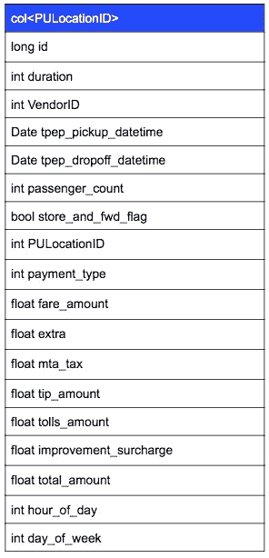

# 使用 GridDB 和 NodeJS | GridDB 分析纽约市出租车开放数据:面向物联网的开源时间序列数据库

> 原文：<https://medium.com/analytics-vidhya/analyzing-nyc-taxi-open-data-with-griddb-and-nodejs-griddb-open-source-time-series-database-for-86850008da5d?source=collection_archive---------46----------------------->


在这篇博客中，我们将看看由
纽约市出租车委员会提供的一些公开数据，并展示一些简单的脚本来摄取和分析数据。这里显示的原则
适用于许多不同类型的问题。

如果您还没有设置 GridDB 服务器，请遵循这个[快速入门](https://griddb.net/en/blog/griddb-quickstart/)。如果你需要为 Node.js 设置 GridDB，这个[博客](https://griddb.net/en/blog/nodejs-client/)会帮你设置并运行。您可以在[纽约市开放数据网站](https://data.cityofnewyork.us/Transportation/2018-Yellow-Taxi-Trip-Data/t29m-gskq)上下载并找到关于纽约市出租车数据的更多详细信息。

# 数据模型

```
VendorID,tpep_pickup_datetime,tpep_dropoff_datetime,passenger_count,trip_distance,RatecodeID,store_and_fwd_flag,PULocationID,DOLocationID,payment_type,fare_amount,extra,mta_tax,tip_amount,tolls_amount,improvement_surcharge,total_amount
2,03/13/2018 02:58:38 PM,03/13/2018 03:00:22 PM,1,0.31,1,N,132,132,2,3.5,0,0.5,0,0,0.3,4.3
1,03/13/2018 02:34:11 PM,03/13/2018 02:40:35 PM,1,2.3,1,N,132,132,1,9,0,0.5,1.95,0,0.3,11.75
1,03/13/2018 02:42:12 PM,03/13/2018 03:21:44 PM,1,17.5,2,N,132,230,1,52,0,0.5,5,5.76,0.3,63.56
1,03/13/2018 02:36:05 PM,03/13/2018 03:04:08 PM,1,10.5,1,N,230,138,1,32.5,0,0.5,7.8,5.76,0.3,46.86
1,03/13/2018 02:41:52 PM,03/13/2018 02:45:41 PM,1,0.7,1,N,264,264,2,5,0,0.5,0,0,0.3,5.8
1,03/13/2018 02:47:40 PM,03/13/2018 02:55:06 PM,1,1.3,1,N,264,264,1,7,0,0.5,2,0,0.3,9.8
1,03/13/2018 02:27:57 PM,03/13/2018 02:48:45 PM,1,4.8,1,N,142,13,1,18.5,0,0.5,3.85,0,0.3,23.15
1,03/13/2018 02:03:27 PM,03/13/2018 02:10:51 PM,1,0.6,1,N,164,100,1,6,0,0.5,1.36,0,0.3,8.16
1,03/13/2018 02:12:58 PM,03/13/2018 02:25:04 PM,1,1,1,N,100,230,2,8.5,0,0.5,0,0,0.3,9.3
```

开放数据有 17 个字段，因此我们的第一个决定是确定如何将数据拆分到多个容器中。
理想的方法是将来自每辆出租车的数据放入单独的容器中，但由于数据是匿名的，因此没有为每辆出租车提供唯一的
标识符。下一个最好使用的字段是
`PULocationID`，它是一个从 1 到 265 的整数，代表每个纽约
MTA 街区的唯一标识符。

由于不同的出租车可能在完全相同的时间在完全相同的街区搭载乘客，
`tpep_pickup_datetime`不是一个好的主键。取而代之的是，我们必须使用一个唯一的整数，它随着每一行的增加而递增。

我们还添加了几个计算字段:`hour_of_day`和`day_of_week`，它们将在出租车数据的
分析中有用。

```
var colInfo = new griddb.ContainerInfo({
    'name': "col"+data['PULocationID'],
    'columnInfoList': [
        ["id" , griddb.Type.LONG],
        ["duration" , griddb.Type.INTEGER],
        ["VendorID", griddb.Type.INTEGER ],
        ["tpep_pickup_datetime", griddb.Type.TIMESTAMP ],
        ["tpep_dropoff_datetime", griddb.Type.TIMESTAMP ],
        ["passenger_count", griddb.Type.LONG],
        ["store_and_fwd_flag" , griddb.Type.BOOL],
        ["PULocationID", griddb.Type.INTEGER],
        ["DOLocationID", griddb.Type.INTEGER],
        ["payment_type", griddb.Type.INTEGER],
        ["fare_amount", griddb.Type.FLOAT],
        ["extra", griddb.Type.FLOAT],
        ["mta_tax", griddb.Type.FLOAT],
        ["tip_amount", griddb.Type.FLOAT],
        ["tolls_aount", griddb.Type.FLOAT],
        ["improvement_surcharge", griddb.Type.FLOAT],
        ["total_amount", griddb.Type.FLOAT], 
        ["hour_of_day", griddb.Type.INTEGER], 
        ["day_of_week", griddb.Type.INTEGER]],
   'type': griddb.ContainerType.COLLECTION, 'rowKey': true
});
```



# 摄取

使用 [csv 解析器 npm
模块](https://www.npmjs.com/package/csv-parser)，实际的摄取过程非常简单。数据从 CSV 解析器流出并由 CSV 解析器处理，然后我们将它转换成一个简单的数组，这个数组被
放入适当的 GridDB 容器中。

```
var griddb = require('griddb_node');
var fs = require('fs');
var csv = require('csv-parser')

let factory = griddb.StoreFactory.getInstance();
let store = factory.getStore({
    "host": '239.0.0.1',
    "port": 31999,
    "clusterName": "defaultCluster",
    "username": "admin",
    "password": "admin"
});

let cols = {}
let count=0

fs.createReadStream('data.csv')
  .pipe(csv())
  .on('data', (data) => {
    let row = []
    row[0] = count++;
    row[1] = parseInt(Date.parse(data['tpep_dropoff_datetime'])-Date.parse(data['tpep_pickup_datetime']))/1000)
    row[2] = parseInt(data['VendorID'], 10);
    row[3] = Date.parse(data['tpep_pickup_datetime'])
    row[4] = Date.parse(data['tpep_dropoff_datetime'])
    row[5] = parseInt(data['passenger_count'], 10)
    if(data['store_and_fwd_flag'] == 'Y')
        row[6] = true
    else
        row[6] = false
    row[7] = parseInt(data['PULocationID'])
    row[8] = parseInt(data['DOLocationID'])
    row[9] = parseInt(data['payment_type'])
    row[10] = Number(data['fare_amount'])
    row[11] = Number(data['extra'])
    row[12] = Number(data['mta_tax'])
    row[13] = Number(data['tip_amount'])
    row[14] = Number(data['tolls_amount'])
    row[15] = Number(data['improvement_surcharge'])
    row[16] = Number(data['total_amount'])
    let date = new Date(row[3])
    row[17] = date.getHours()
    row[18] = date.getDay()

    var colInfo = . . . snipped above . . .
    store.putContainer(colInfo, false)
        .then(cont => {
            cont.put(row)
            console.log(row[0])
        })
    .catch(err => {
        if (err.constructor.name == "GSException") {
            for (var i = 0; i < err.getErrorStackSize(); i++) {
                console.log("[", i, "]");
                console.log(err.getErrorCode(i));
                console.log(err.getMessage(i));
            }
        } else {
            console.log(err);
        }
    });

});
```

# 分析

有许多不同的查询可以产生有趣的结果；最长的一次旅行是什么？最贵的？哪个地区最繁忙？

```
// standard boilerplate
var griddb = require('griddb_node');
var fs = require('fs');
var csv = require('csv-parser')

// our Cluster's credentials
let factory = griddb.StoreFactory.getInstance();
let store = factory.getStore({
    "host": '239.0.0.1',
    "port": 31999,
    "clusterName": "defaultCluster",
    "username": "admin",
    "password": "admin"
});

let promises = []
let results = {}

var iterate = function(locID) {
        return function(rowset) {
            if(rowset != null) {
                if (rowset.hasNext()) {
                    row = rowset.next();
                    results[locID] = row;
                    // if result is an aggregation use this instead
                    // results[locID] = row..get(griddb.GS_TYPE_LONG);
                }
        }
    }

}

var query = function (locID) {
    return function(cont) {
        if(cont != null) {
            q = cont.query("SELECT * ORDER BY fare_amount DESC LIMIT 1 ");
            return q.fetch()
        }
    }
}

for (let i=0; i < 100; i++) {
    var locID = i
    promise = store.getContainer("col"+i)
    .then(query(i))
    .then(iterate(i))
    .catch(err => {
        if (err.constructor.name == "GSException") {
            for (var i = 0; i < err.getErrorStackSize(); i++) {
                console.log("[", i, "]");
                console.log(err.getErrorCode(i));
                console.log(err.getMessage(i));
            }
        } else {
            console.log(err);
        }
    })
    promises.push(promise)
}

Promise.all(promises).then(values => {

    var retval=null;
    console.log("sorting...")
    for (var k in results) {
        if (retval == null || results[k][10] > retval[10])
            retval=results[k]
    }
    console.log(retval)
})
```

上面的代码找到了 3 月 22 日最贵的旅行，时间超过 3 小时，总共花费了 475 美元:

```
[ 1725438,
  true,
  2,
  2018-03-22T06:43:13.000Z,
  2018-03-22T09:59:34.000Z,
  1,
  false,
  93,
  265,
  1,
  450,
  0,
  0,
  0,
  24.760000228881836,
  0.30000001192092896,
  475.05999755859375,
  6,
  4 ]
```

由于 Node.js 的异步特性，需要两个技巧:首先是确定查询参数是什么
(locationID)。这个问题有点棘手，它被放在一个承诺链中，并借助于[curry](https://en.wikipedia.org/wiki/Currying)来解决，这是一个在 then()调用
中指定的函数，如下所示:

```
for (let i=0; i < 100; i++) { promise=store.getContainer("col"+i) .then(query(i)) .then(iterate(i))
        ... }
```

由于所有查询都在后台同时执行，我们需要等待它们完成。
首先我们将查询 promise 添加到一个列表中:

```
promises.push(promise)
```

然后我们可以等待所有的承诺完成:

```
Promise.all(promises).then(values => {
  // display results
}
```

为了对最长的旅程进行修改，您需要将“fare_amount”更改为“duration ”,并将最终比较关键字从“10”更改为
“1”:

```
...

            q = cont.query("SELECT * ORDER BY duration DESC LIMIT 1 ");

...

        if (retval == null || results[k][1] > retval[1])

...
```

如果您对最繁忙的位置感兴趣，将需要使用聚合查询，这也将改变
结果获取和最终排序。

```
...

var iterate = function(locID) {
        return function(rowset) {
            if(rowset != null) {
                if (rowset.hasNext()) {
                    row = rowset.next();
                    results[locID] = row.get(griddb.GS_TYPE_LONG);
                }
        }
    }
}

var query = function (locID) {
    return function(cont) {
        if(cont != null) {
            q = cont.query("SELECT COUNT(*)");
            return q.fetch()
        }
    }
}

...

Promise.all(promises).then(values => {
        var items = Object.keys(results).map(function(key) {
          return [key, results[key]];
        });

        items.sort(function(first, second) {
         return second[1] - first[1];
        });

        console.log(items.slice(0, 10))
})
```

输出如下，我们可以看到 161 区(曼哈顿中城)是最繁忙的，有 156727 次出行。

```
[ [ '161', 156727 ],
  [ '237', 153388 ],
  [ '162', 144923 ],
  [ '230', 143784 ],
  [ '186', 136234 ],
  [ '236', 136093 ],
  [ '170', 134533 ],
  [ '48', 131547 ],
  [ '234', 130747 ],
  [ '79', 115052 ] ]
```

# 更复杂的分析

上面的简单查询提供了有趣的见解，但是更复杂的查询，比如“在一天的某个给定时间，哪些区域最忙？”允许出租车公司决定如何调配他们的出租车，以实现利润最大化。

为了做到这一点，我们可以使用多个
查询来确定在一天中给定的时间里从每个邻近地区进行了多少次旅行。对于每个位置和每个小时，运行一个简单的计数聚合。

结果被放入一个二维字典中以供进一步处理。

```
var iterate = function(locID, hour ) {
        return function(rowset) {
            if(rowset != null) {
                while (rowset.hasNext()) {
                    row = rowset.next();
                    results[hour][locID] = row.get(griddb.GS_TYPE_LONG)
                }
        }
    }

}

var query = function (locID, hour) {
    return function(cont) {
        if(cont != null) {
            q = cont.query("SELECT count(*) where hour_of_day = "+hour);
            return q.fetch()
        }
    }
}

for(let hour=0; hour < 24; hour++) {
    results[hour] = {};
    for (loc=0; loc < 265; loc++)
        results[hour][loc] = 0

    for (let i=0; i < 265; i++) {
        var locID = i
        promise = store.getContainer("col"+i)
        .then(query(i, hour))
        .then(iterate(i, hour))
        .catch(err => {
            if (err.constructor.name == "GSException") {
                for (var i = 0; i < err.getErrorStackSize(); i++) {
                    console.log("[", i, "]");
                    console.log(err.getErrorCode(i));
                    console.log(err.getMessage(i));
                }
            } else {
                console.log(err);
            }
        })
        promises.push(promise)
    }
}
```

然后，脚本等待所有查询承诺，然后进行最终处理，打印 10 个最繁忙的位置。

```
Promise.all(promises).then(values => {

    for (hour=0; hour < 24; hour++) {
        var items = Object.keys(results[hour]).map(function(key) {
          return [key, results[hour][key]];
        });

        items.sort(function(first, second) {
          return second[1] - first[1];
        });

        locations = items.map(function(item) {
            return item[0]
        })

        console.log(hour+": "+locations.slice(0, 10))
    }
})0: 79,230,48,249,148,234,132,161,164,114
1: 79,148,48,230,249,114,164,132,234,68
2: 79,148,48,114,249,68,230,164,158,234
3: 79,148,68,48,230,249,114,164,158,144
4: 79,48,230,148,68,164,249,186,107,114
5: 48,100,132,186,79,230,170,236,107,263
6: 186,48,100,132,236,170,162,68,107,263
7: 186,236,48,170,100,237,141,162,107,140
8: 236,237,170,186,48,141,162,107,140,239
9: 236,237,170,162,186,48,141,239,138,161
10: 237,236,186,138,162,170,161,48,230,142
11: 237,236,161,162,186,170,138,230,142,234
12: 237,236,161,162,186,170,230,234,239,138
13: 237,161,236,162,170,186,234,239,163,230
14: 237,161,236,162,234,170,239,163,138,186
15: 237,161,236,162,234,138,170,186,239,142
16: 161,237,236,162,138,234,132,170,230,239
17: 161,237,162,230,236,234,170,138,163,186
18: 161,162,237,230,234,236,170,163,186,142
19: 161,162,234,237,170,230,186,163,138,142
20: 161,162,234,230,170,237,79,186,48,138
21: 230,161,162,234,48,79,186,138,170,142
22: 230,161,48,79,234,186,162,142,164,138
23: 230,79,48,142,234,161,138,249,132,186
```

结果显示，79 区(东村)在清晨最繁忙，而 237 区(上东区)在中午最繁忙，161 区(曼哈顿中城)在傍晚和晚上最繁忙。

将最终处理更改为基于百分比计算旅行次数，或者修改上面的查询
查找潜在的最大收入，这很简单。

完整版本的脚本可以从[这里](https://griddb.net/en/download/26412/)下载

*原载于 2020 年 4 月 6 日 https://griddb.net*[](https://griddb.net/en/blog/nyc-taxi-open-data-node-js/)**。**