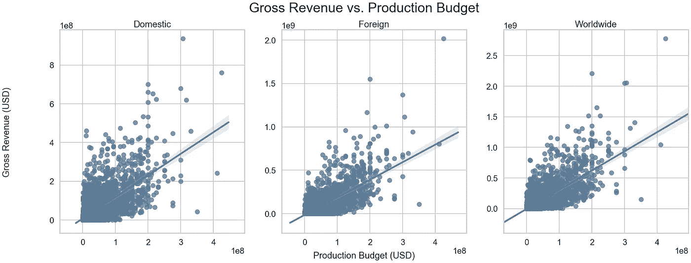
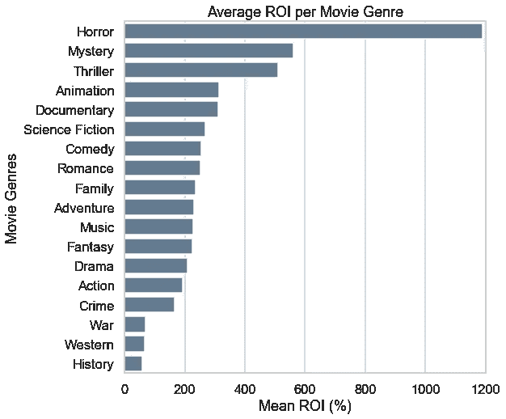
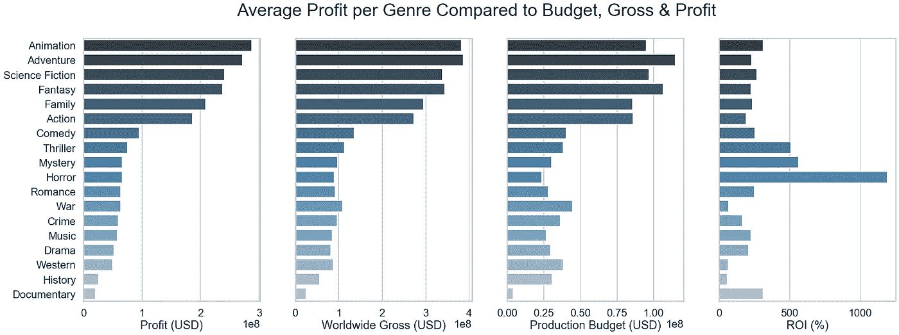
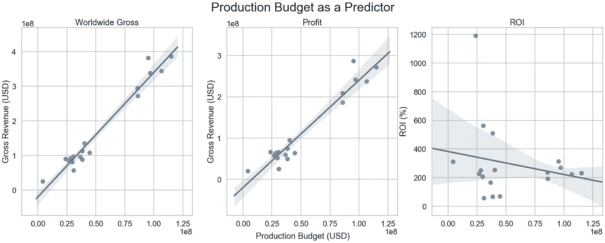
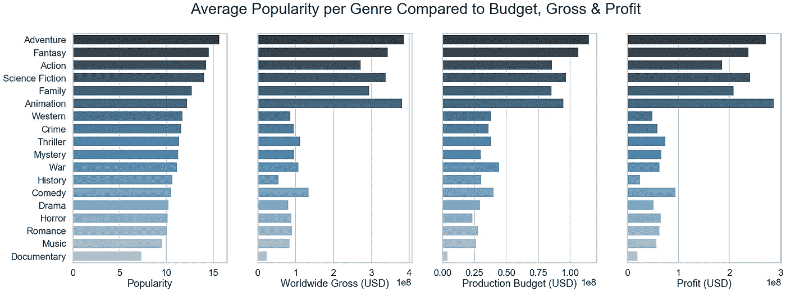

# 分析票房机会

> 原文：<https://medium.com/analytics-vidhya/analyzing-opportunities-at-the-box-office-25ed75aa1426?source=collection_archive---------10----------------------->

## 什么类型的电影票房最好？对于一个新的电影工作室来说，什么类型的电影最适合专注于创作？一份分析。

二十世纪福克斯的阿凡达

票房成功的定义是什么？它是最高的票房收入(最高的总收入)，最高的投资回报率(投资回报率)，或者可能是最赚钱的吗？

我决定看看这三个。

首先，我想看看生产预算和总收入之间是否有关系。

我们可以看到，在各种类型和预算中，制作预算和总收入之间似乎存在正相关关系。这是有道理的，因为预算越高，演员、编剧、制片人、电影布景和制作电影的其他一切就越好。虽然一些高预算电影表现不佳(想想漫威的《黑凤凰》)，一些低预算电影表现出色(想想布莱尔女巫计划)，但我们可以看到预算和总收入之间存在总体线性关系。

## 投资收益率

让我们修正预算，看看哪种类型的电影投资回报率最高。在这里，我平均投资回报率的所有电影在一个流派。需要注意的是，大多数电影都有多种类型，为此我把一部电影分成了不同的类型。

我们可以看到，平均投资回报率最高的类型是恐怖片、悬疑片和惊悚片。这些可能提供最大的投资回报率，但他们也提供最大的利润或门票销售总收入吗？如果不是，那是什么类型呢？

## 利润

我们可以在这里看到，最高利润的类型是不同的，它们似乎与门票销售和制作预算的总收入密切相关。我们可以看到，最高投资回报率的类型往往有更低的平均生产预算。而利润和票房最高的类型往往有更高的预算。

让我们来看看这些关系的相关图。这些数据是跨流派的平均值，与上面的数据相同。

## 生产预算

使用皮尔逊方法，这些图的 r 值分别为 r=0.9815、r=0.9654 和 r=-0.2115。

我们可以看到全球总收入和制作预算之间的关系，以及总收入和跨流派制作预算之间的关系是密切相关的。我们可以看到投资回报率和生产预算之间没有明显的相关性。

## 流行

那么，为什么有这么多钱花在平均投资回报率较低的电影类型上呢？我看了一下来自 TMBd 的人气数据。需要注意的是，这些不是票房数据，而是根据他们网站上任何一天任何一部电影的点击量和保存量计算出来的数据。他们如何计算这里的。

受欢迎程度与生产预算 r=0.5997、全球毛收入 r=0.6292 和利润 r=0.5931 相关。

我们可以看到，什么类型的电影最受欢迎，什么电影工作室投资最多(制作预算)，什么电影票房最大(全球总票房)以及利润之间存在显著的相关性。

因此，电影公司对这些电影投入如此之多是有道理的，尽管投资回报率较低，但平均回报却更高。

需要注意的是，大多数电影都有多种类型。最卖座的电影往往是 3-4 部的组合，其中至少有 2-3 部来自票房最高的类型。想想《阿凡达》，它集动作、冒险、幻想和科幻于一身。

## **结论**

如果我建议一家新的电影公司关注什么类型的电影，如果预算很低，我会推荐投资回报率最高的类型:恐怖片、悬疑片和惊悚片。如果预算高的话，我会推荐票房最高、利润最大、最受欢迎的:冒险、动作、奇幻、家庭、动作、动画，利润最高。再次注意到大多数电影是各种类型的结合。

## 进一步研究

看看是否以及有多少受欢迎的主角对一部电影的成功做出了贡献，以及一年中上映的时间是否对一部电影的成功做出了贡献，这也是很好的。

## 用于此分析的数据

1.  The-Numbers.com
2.  【https://developers.themoviedb.org/3/discover/movie-discover 
3.  [https://www.imdb.com/interfaces](https://www.imdb.com/interfaces/)

## 用于此分析的软件

1.  计算机编程语言
2.  Jupyter 笔记本