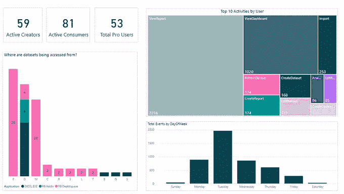

# 分析 Power BI 审计日志

> 原文：<https://medium.com/analytics-vidhya/analyzing-power-bi-audit-logs-8ec84bd26a52?source=collection_archive---------5----------------------->

作为贵组织的 Power BI 租户管理员，您希望监控的是活动和非活动用户的数量、他们正在执行的活动类型、容量使用情况、常用报告/仪表盘以及最常用的消费媒介。当然，与 Power BI 管理员可以分析的大量信息相比，这些只是一些见解，以便了解其组织租户的详细使用情况，并采用策略和实践以受治理的方式管理这些信息。

Power BI 服务作为管理门户的一部分，已经在使用指标下提供了一些见解。然而，这仅限于管理门户中可用的高级可视化，并且对于自定义报告，其底层数据集是不可访问的。

要采用 Power BI 使用情况报告的替代方案，我们需要知道在哪里可以访问捕获这些活动的日志。所有 Power BI 活动都记录在**[**Office 365**](https://protection.office.com/unifiedauditlog)中，并且可以通过有权使用这些日志的帐户(全局管理员或在 Exchange Online 中被分配了审核日志或仅查看审核日志角色)进行访问。**

****

**Office 365 日志—过滤 PowerBI**

**如果您仅过滤 PowerBI 活动的日志，您将能够看到捕获的 Power BI 日志。最多可以查看 90 天的日志，即从当前日期开始，您可以查看 90 天之前的日志。如果审计是在最近才打开的，那么日志将只在打开后才可用。但是，从该 GUI 导出的记录数量有限，有时会花费很长时间。**

**提取 Power BI 的 Office365 日志的一个有效方法是通过 [**Powershell**](https://docs.microsoft.com/en-us/power-bi/service-admin-auditing#use-powershell-to-search-audit-logs) 脚本。您可以使用有权访问审核日志的帐户的凭据连接到 exchange online。您可以输入要提取日志的时间段范围，以及同一[(附上脚本供参考)](https://github.com/PrekshaPunwani/PowerBI-PowerShell/blob/master/ExtractPowerBIAuditLogs)的文件夹/文件路径。**

**一旦您将审计日志提取到 CSV 文件中，就可以使用 Power BI Desktop 开始对其进行报告。**

****

**从审计日志中获取数据 CSV 提取并编辑查询**

**通过 PowerBI Desktop 中的查询编辑器实施的几个步骤:**

1.  **删除顶部 1 行**
2.  **使用第一行作为标题**

****

**应用前两步**

**3.将“AuditData”列转换为 JSON**

****

**正在应用第三步**

**4.单击转换后的“AuditData”列，并选择它下面的所有属性，以获得详细信息(以附加列的形式)，包括工作区、数据集、报告、用户连接类型(导入/直接查询)以及许多对审计日志记录有用的属性。**

****

**正在应用第 4 步**

**属性将以列的形式展开。**

****

**审计数据已扩展**

**使用审核日志信息，您可以构建自定义的可视化工具，提供深入的分析。没有明确的视觉效果数量，您可以根据自己的要求定制您的报告。**

**下面是一些视觉效果的例子。**

************