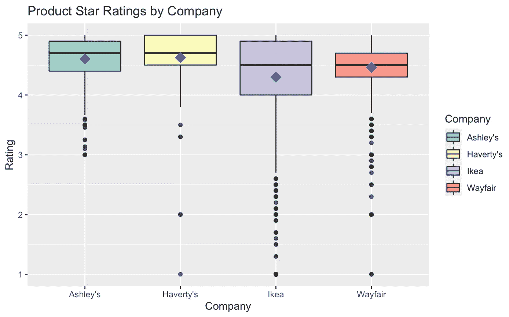
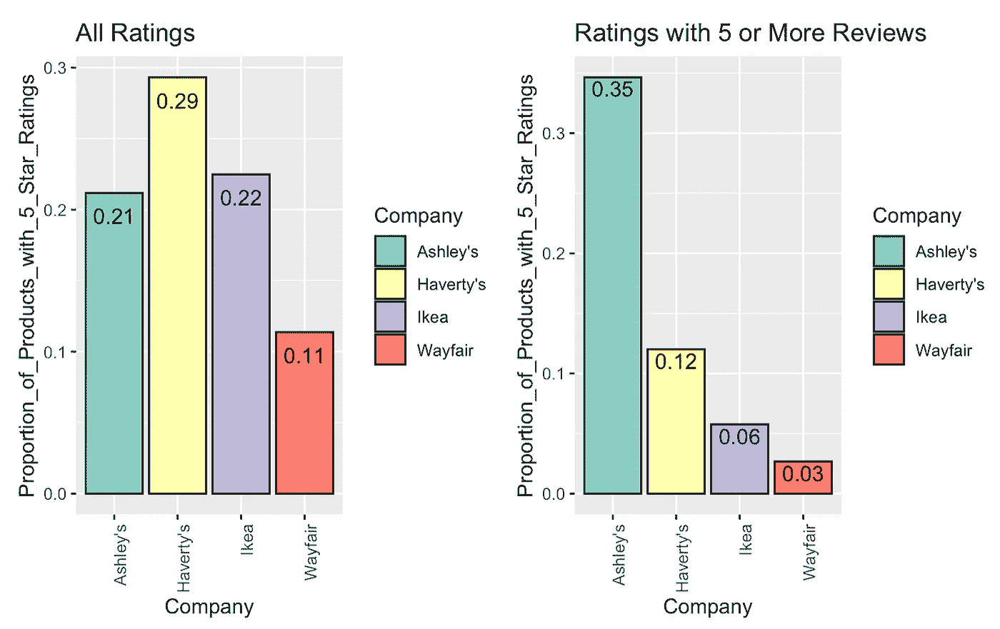
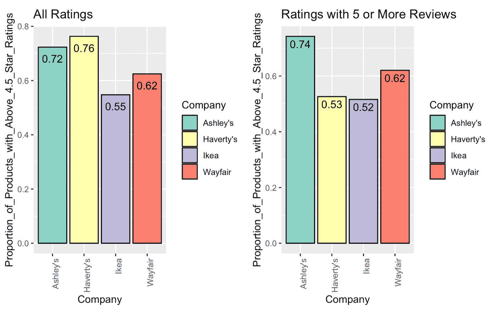
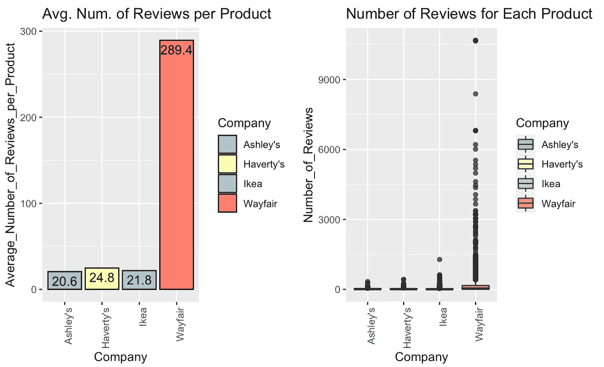
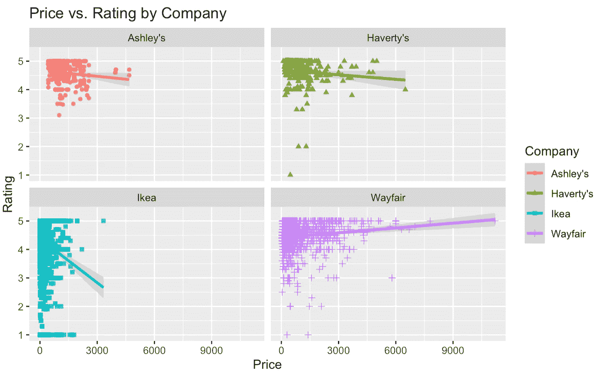
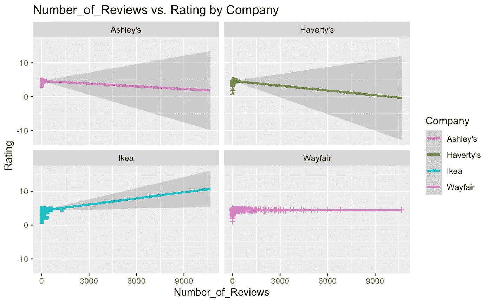

# 分析不同家具公司的产品评级和评论

> 原文：<https://medium.com/analytics-vidhya/analyzing-product-reviews-for-various-furniture-companies-vendors-310ee30dbdf3?source=collection_archive---------20----------------------->

Apartments.com 供图:[https://images 1 . apartments . com/I2/kob KF 5 euhwgcj 6 onivyt-bfia 0 _ fdziunx 6 u 8m _ Vnkk/111/stone gate-luxury-officed-apartments-mesa-az-1-bedroom . jpg](https://images1.apartments.com/i2/KOBkf5EUHWgcJ6oNIvyT-BFIA0_fDZiunX6u8M_Vnkk/111/stonegate-luxury-furnished-apartments-mesa-az-1-bedroom.jpg)

想象一下，你刚买了梦想中的房子，但它完全是空的。有一块完全空白的画布来工作，并能够把你的新房子变成你能想象的任何样子，这似乎令人兴奋；然而，这个过程会很快变得令人望而生畏。在谷歌上简单地搜索宜家、Wayfair 或 Ashley's Furniture，就可以很容易地发现有多少选择，而且在短时间内布置新家的过程可能会变得令人不知所措。

除了所有的选择，如果不亲自尝试和测试，很难知道哪些产品是最好的。然而，亲自去商店可能会使整个过程比事先更令人厌倦。在线产品评论有助于缓解这一问题，因为它们让其他客户从可能购买产品的人那里了解产品的不同方面。然而，有时很难知道哪些评论值得信任，也很难跨平台比较评分和评论。

这篇文章分析了宜家、Wayfair、Ashley's Furniture 和 Haverty 的顾客产品评论数据，以帮助你更容易地缩小家具搜索范围，并更好地理解这些评论的真正含义。

## **1。跨网站的产品评级分布**

客户评论每天都变得越来越受欢迎，因为客户要求公司方面有更多的透明度，而公司试图提供这种透明度以保持竞争力。随着越来越多的公司提供对产品的评论见解，区分它们变得越来越难。最重要的是，很难知道一个给定的星级对产品到底意味着什么。例如，5 分中的 4 分在一个网站上可能意味着一件事，但在另一个网站上可能意味着完全不同的事情。此外，很难知道一个给定网站的 4 分(满分 5 分)是好是坏，因为不同网站的平均评分差异很大。

按公司列出的产品星级评定箱线图(蓝色菱形代表该公司的平均产品等级)

看看 Ashley's Furniture、Haverty's、Ikea 和 Wayfair，我们可以看到它们的产品评级肯定相差很大。从图中可以明显看出，Haverty's 的平均产品评级最高，其次是 Ashley's、Wayfair，最后是 Ikea。这些差异可能意味着两件事:平均而言，其中一些公司只是提供比其他公司更好的产品，或者这些网站上的评论存在系统性差异。查看每个公司的产品评级分布可能会给我们一些启示。

Haverty's 和 Ashley's 网站上的产品评级都很低，而宜家和 Wayfair 的产品评级都很低。有可能宜家和 Wayfair 有一些不好的产品；然而，鉴于这两家公司的成功，似乎更有可能的是，宜家和 Wayfair 的顾客更有可能在产品值得的时候给出差评，这使得他们的好评更有意义。另一方面，Ashley 和 Haverty 的客户似乎很少对产品留下差评，这使得他们的好评不那么重要，因为 Ashley 和 Haverty 几乎肯定有一些劣质产品出售。

## 2.五星评级和“好”产品的频率

深入查看产品评论，特别是 5 星评论，可以注意到在不同网站上获得 5 星评级的产品百分比有很大差异。当检查所有评论(左图)时，我们可以看到 Haverty's 的 5 星评级比例最高。然而，当我们查看有 5 个或更多评论的产品评级时(右图)，我们可以看到，只有 12%的 Haverty 产品有 5 星评级。因此，我们可以更好地理解，Haverty 的许多 5 星评级是由于一小部分人的产品评论，因此可能不是很可靠。

按公司列出的所有评分为 5 星的评分比例条形图(左)和只有 5 个或 5 个以上评价的评分比例条形图(右)

我们可以看到，宜家和 Wayfair 网站上的产品评论与 Haverty 的趋势相似，have rty 认为他们的一些五星评级是由于一些狂热的粉丝，而不是大众的认可。然而，Ashley's Furniture 与其他三家公司的趋势背道而驰，当只考虑有 5 个或更多评论的产品时，他们网站上 5 星评级的比例实际上有所增加。这表明 Ashley 的许多 5 星产品评级得到了广泛认可，并且比任何其他公司的 5 星评级都更可靠。此外，这意味着阿什利网站上的许多糟糕的产品评级来自少数人，表明这些评级可能只是基于一些糟糕的经历，可能不太可靠。

进一步分析，我们还可以调查类似的趋势是否适用于“好”产品(被认为是评级高于 4.5 星的产品)。下图提供了这种分析。

按公司列出的所有评分(左)和只有 5 个或更多评价的评分(右)中高于 4.5 星的评分比例条形图

正如我们所看到的，Haverty's 再次在其网站上拥有最高比例的“好”产品；然而，当只检查那些有超过 5 个评论的产品时，他们遭受“好”产品比例的最大下降。这告诉我们，“好”Haverty 的产品评级很可能是不可靠的，不太值得信赖。另一个值得注意的有趣现象是，当只看有 5 个或更多评价的产品时，宜家和 Wayfair 的五星评级大幅下降，但它们的“好”产品评级总体上没有遵循相同的趋势，因为它们的比例仅略有下降或保持不变。这表明，他们的非 5 星评级的“好”产品评论总体上比 5 星评级更值得信赖，在客户中更常见。最后，我们可以看到，如果只看有 5 个或更多评论的产品，Ashley 的“好”产品评级比例再次增加，这表明这些高评级在他们的许多客户中得到很好的分享。

## 3.所有产品评级是否同样值得信赖/在客户群中共享？

简单明了，答案是否定的。在这些公司的网站上留下评论的人数有很大的差异，无论是每个产品的平均评论数，还是为不同公司的不同产品留下评论的人数的分布。

每个产品的平均评论数条形图(左)和每个产品的评论数箱线图(右)

从上面的图表中，我们可以看到，Ashley's、Haverty's 和 Ikea 在其网站上对每件产品的评论数量相似，平均最多相差 5 人。然而，仔细观察它们在右边的分布，我们可以看到宜家有更多产品的评论数量高于 Ashley 或 Haverty，因为宜家每件产品的评论数量分布高于其他两个分布。

我们在上图中注意到的主要差异:然而，与其他所有方式相比，Wayfair 更好。在这项分析中，Wayfair 的平均评论人数是其他家具店的 10 倍以上。我们还可以看到右边的 Wayfair 分布远远高于其他三个分布，这表明 Wayfair 有许多产品，有大量的评论。这可能部分是由于 Wayfair 都是在线的，这使得人们在网上留下评论更加方便。然而，这也很可能部分是因为 Wayfair 的客户对他们公司的产品更加直言不讳。

不管原因是什么，Wayfair 网站上有如此多的评论这一事实使得他们的产品评级比其他公司的产品评级更值得信赖。如果一家公司付钱让人写评论，那么在你的网站上获得每件产品 300 条评论的成本要比每件产品 25 条评论的成本高得多。因此，Wayfair 网站上的评论数量使他们的产品评级更值得信赖和可信。

## 4.价格影响评级吗？

不管是否令人惊讶，取决于你是否相信人们会将产品的价格纳入他们的评论中，简单的答案是肯定的。更复杂的答案是肯定的，具体方式取决于公司。从下面的图表中，我们可以看到，产品的价格会对其评级产生非常不同的影响，这取决于出售产品的公司。

覆盖线性回归的产品价格与公司产品评级散点图

对于 Ashley 的家具和 Haverty 的家具，价格对评级的影响不大，但如果有什么影响的话，平均来说，产品价格越高，评级越低。另一方面，价格对宜家和 Wayfair 的产品评级影响更大，尽管方向相反。对宜家来说，越贵的产品评级越低；然而，这主要是因为宜家的许多较贵产品都有很多一星评价。在这四家公司中，Wayfair 是唯一一家产品价格越高，产品评级似乎就越高的公司。因此，在这四家公司中，Wayfair 似乎是唯一一家你可以花更多钱，而且不用担心被敲竹杠的公司，就像你在其他任何一家公司购物一样。

## 5.产品评论的数量决定了它的评分吗？

同样，简单的答案是肯定的，更复杂的答案是肯定的，但不同的公司有不同的方式。

公司的评论数量与产品评级散点图，覆盖了线性回归

上图清楚地显示，在这项研究中，对四家公司来说，产品评论的数量以非常不同的方式影响给定产品的评级。对于 Ashley's 和 Haverty's 来说，给定产品的评论越多，该产品的平均评级就越低。然而，由于 Ashley's 和 Haverty's 对其任何产品都没有太多评论，这种负面关系的强度对于大量评论的外推来说非常弱，正如当你看到大量评论时这两家公司斜率的大置信区间所示。

对宜家而言，评论数量和产品评级之间的关系似乎是正相关的。这种关系对于大量综述的外推也不是最强的，如大量综述的大置信区间所示；然而，它比阿什利或哈弗蒂的关系更强。

最后，Wayfair 与大量评论的外推关系最为密切，因为它有大量关于其产品的评论。虽然 Wayfair 的关系是数据中最明确的，因为它的产品评论数量相对于其他公司的分布要大得多，但 Wayfair 的产品评级似乎完全不受产品评论数量的影响。

为了确定在每个网站上购买什么，我们将查看每个产品类别的总体客户评论，然后将公司在每个类别的表现与所有产品的平均表现进行比较。客户平均评分高于自己平均评分的类别将被视为最适合在该公司网站上购物的类别。

## 数据和方法

为了这个项目，我从[宜家](https://www.ikea.com/us/en/)、 [Wayfair](https://www.wayfair.com/) 、 [Ashley's Furniture](https://www.ashleyfurniture.com/) 和 [Haverty's](https://www.havertys.com/furniture) 那里搜集了 1000 多个产品评级。除了搜集他们的产品评级，我还搜集了一些信息，如产品的评论数量、产品价格，以及每种类型(1 星、2 星、3 星等)的评论数量的具体分类(如果有的话)。

刮除之后，我使用 Tableau Prep 和 r 中的各种技术清理数据。

> 我叫 Jason Liebmann，是宾夕法尼亚大学沃顿商学院的大四学生，学习商业分析，辅修数据科学。