# 通过 Airbnb 数据分析旧金山租房市场

> 原文：<https://medium.com/analytics-vidhya/analyzing-san-francisco-rental-market-through-airbnb-data-7e0f1a80be9d?source=collection_archive---------25----------------------->

我开始了成为数据科学家的旅程，作为我的第一个数据分析项目，我通过 Airbnb 数据分析了旧金山的租赁市场。我使用这个分析主要是为了习惯 Pythons 库和操作真实数据，所以这个报告涵盖了很多数据分析的基本过程。我使用了 Pandas、Matplotlib 和 Seaborn 图书馆，在我的分析结束时，我使用 leav 图书馆创建了该城市的租赁价格 choropleth 地图。作为我的第一份数据分析，这份报告相当不错。希望你喜欢。

需要强调的是，本分析中使用的所有数据都来自冠状病毒爆发前的一段时间，因此本分析当然不能代表当今的现实。

图 1:旧金山和金门大桥。

Airbnb 被认为是世界上最大的酒店公司之一，没有一家酒店。

该网站将愿意出租公寓或房间的房东与旅行者联系起来。通过这种方式，Airbnb 为大城市的住宿提供了一个有趣的替代选择。

截至 2018 年底，这家成立仅 10 年的创业公司已经**在全球接待了超过 3 亿人**，真正挑战了传统连锁酒店。

Airbnb 的一项伟大举措是让世界上一些最大城市的数据可用。可以从 Airbnb 内的网站[获得真实数据，以开发数据科学项目和解决方案。](http://insideairbnb.com/get-the-data.html)

本报告旨在让您习惯于使用常见 Python 库的基本命令来操作真实数据。获得了良好的见解和相关信息。创建旧金山租金价格的 choropleth 地图证明了叶图书馆的强大。

图 2: Airbnb。

# 获取数据

本报告中使用的所有数据均取自 Airbnb 内部的[。](http://insideairbnb.com/get-the-data.html)

在此分析中，使用了以下档案:

*   `listings.csv` - *旧金山列表的汇总信息和指标(有利于可视化)。*

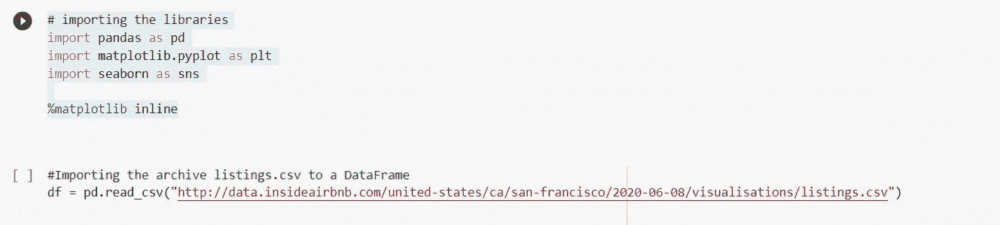

图 3:导入库和数据集。

# **变量名**

*   `id` -物业 id
*   `name` -物业名称
*   `host_id` -业主 id
*   `host_name` -主持人姓名
*   `neighbourhood_group` -该列没有值
*   `neighbourhood` -小区名称
*   `latitude` -房产纬度坐标
*   `longitude` -房产经度坐标
*   `room_type` -提供的房间类型
*   `price` -租赁价格
*   `minimum_nights` -客人可预订的最少住宿天数
*   `number_of_reviews` -酒店获得的点评数量
*   `last_review` -最近一次审查的日期
*   `reviews_per_month` -每月审核次数
*   `calculated_host_listings_count` -主人拥有的财产数量
*   `availability_365`-365 天中的可用天数

在开始分析之前，让我们检查数据集的前 5 行。

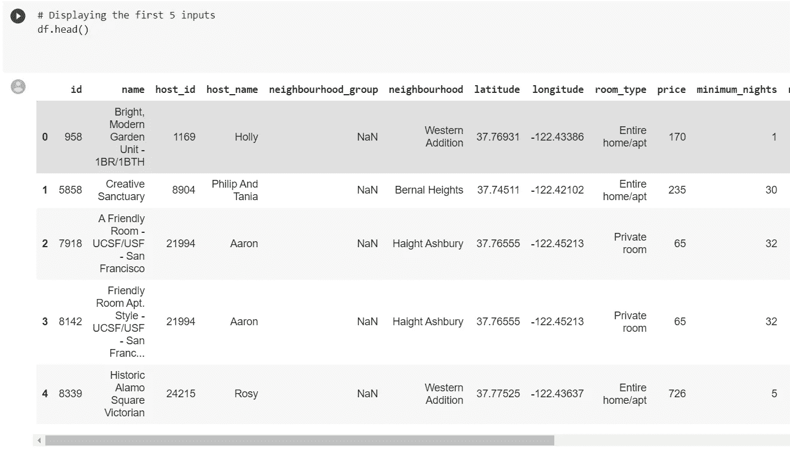

图 4:数据集的第一眼。

# 知道我们数据集的大小。

我的数据集有多少变量和输入？数据集中有哪些类型的变量？

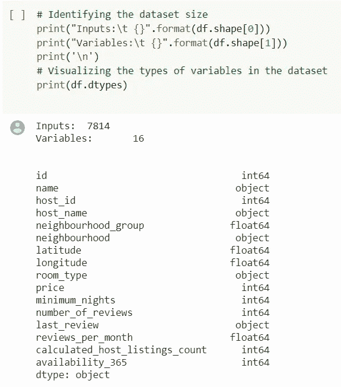

图 5:数据集信息。

# 数据集有多完整？

下一步是查看数据集显示了多少空值。数据集质量与空值的数量直接相关。理解空值与输入总数相比有多重要很重要。

*   可以看到，整个`neighbourhood_group`列呈现 100%的空值。
*   变量`reviews_per_month`和`last_review`表示大约 23%的空值。

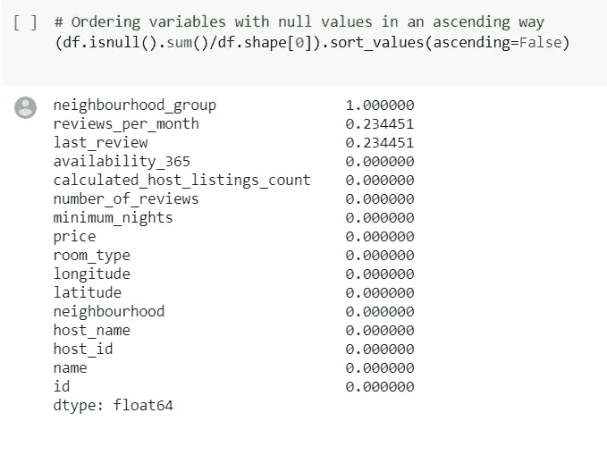

图 6:数据集变量和空变量。

# 分析变量分布

直方图是显示变量分布的好方法。让我们看看这个分析中的变量是如何表现的。

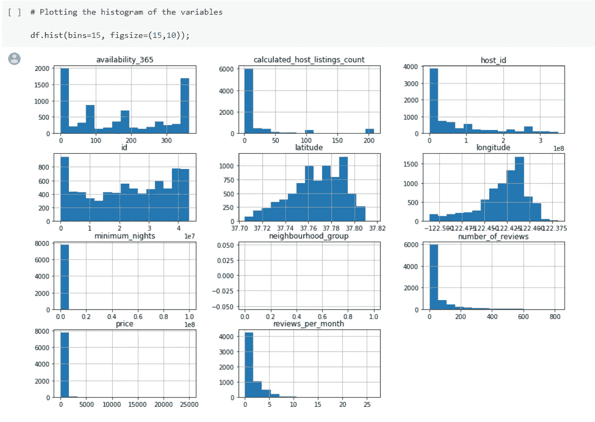

图 7:变量分布。

# 有离群值吗？

基于上面的直方图分析，可以说肯定存在异常值。这些值扭曲了分布，并不代表本报告中要分析的值。有两种方法可以证明异常值的存在:

*   通过`describe()`方法统计汇总。
*   绘制变量的`boxplots`。

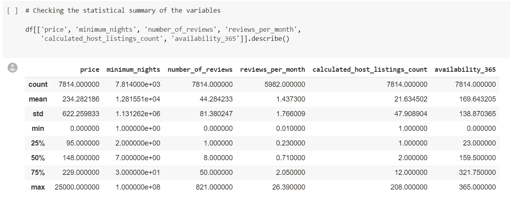

图 8:数据集统计。

以下是从这一简要分析中得出的一些结论:

*   75%的变量`price`低于 229，但其最大值是 25000。
*   `minimum_nights`的最大值在一年 365 天以上。

## 最小 _ 夜的箱线图

箱线图是发现异常值的好工具。让我们看看是否有一些最小夜数的变量。

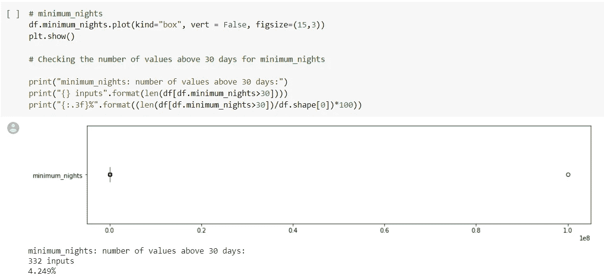

图 9:箱线图和异常值。

这个简单的分析告诉我们，有一个值破坏了我们的分析。它需要移除。

## 价格箱线图

让我们对变量`price`进行同样的操作。

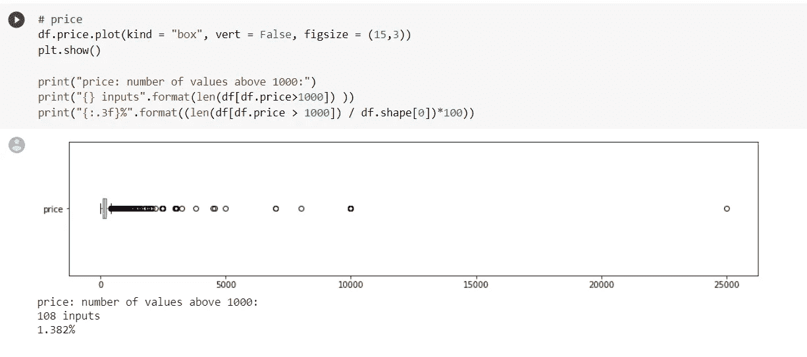

图 10:箱线图和异常值。

## 无异常值的直方图

以下程序将从我们的分析中移除异常值，然后绘制更新的直方图。

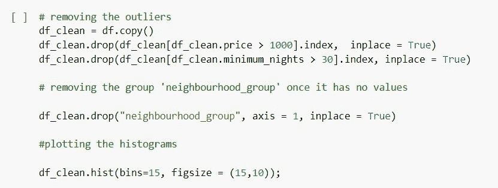

图 11:异常值去除。

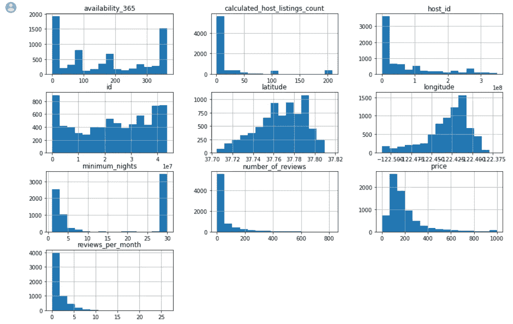

图 12:数据清理后的变量分布。

# 变量相关性

**相关性**或**相关性**是两个变量之间的统计关系。我们的目标是在我们的数据集中找到它。

这种关系是可以测量的，相关系数的目的是确定这种关系有多强。只有两个程序来识别这些变量中存在的相关性:

*   生成相关矩阵。
*   使用`seaborn`库从该矩阵创建热图。

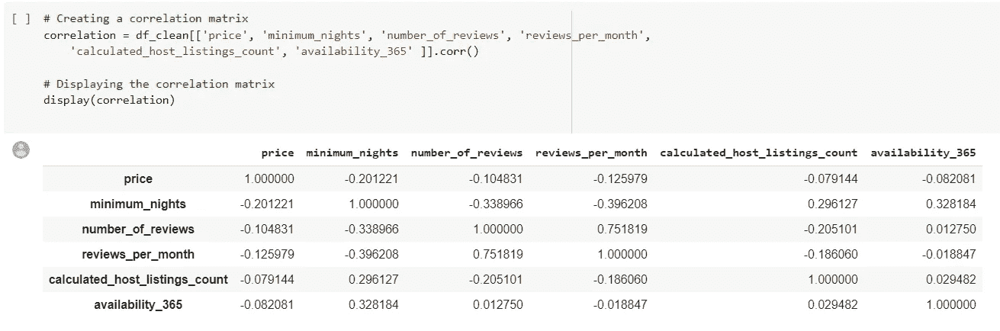

图 13:相关矩阵。

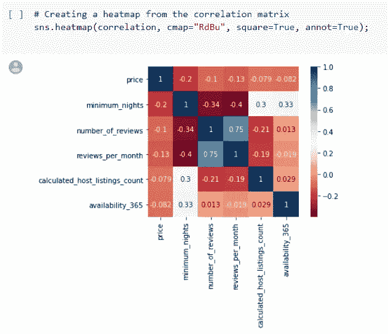

图 14:关联矩阵的热图。

# 最好的出租物业是什么？

如果你已经使用过 Airbnb 服务，你可能知道有不同类型的房间。从整栋房子到合租公寓。为了了解最常出租的房产类型，我们将对变量`romm_type`使用`value_count()`方法，并计算每种房间的租金数量。

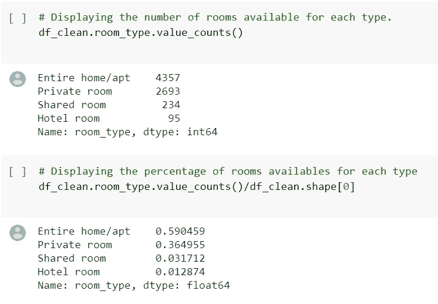

图 15:数据集信息。

基于这一分析，可以说大多数可用房间(约 60%)是整个家庭/公寓，而酒店房间仅占可用房间总数的 1.2%。

# 旧金山生活成本最高的地区是哪里？

使用操作`groupby()`可以比较变量 a。在这种情况下，我们的想法是根据租金价格来比较各个社区。结果显示，太平洋高地、格伦公园和码头是旧金山生活成本最高的三个街区。

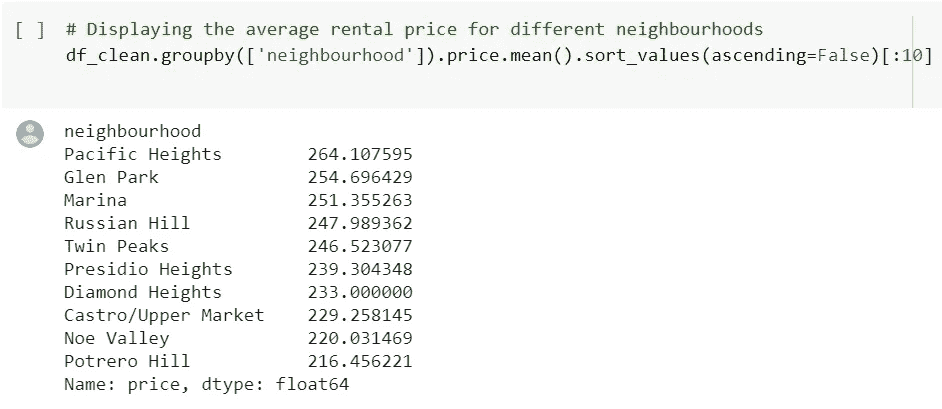

图 16:旧金山最昂贵的社区。

因为数据集表示属性的纬度和经度，所以可以绘制每个坐标。

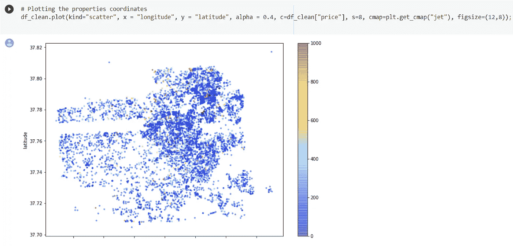

图 17:房产位置和租金价格。

# 通过 leav 可视化地图中的属性位置

Folium 是一个强大的库，它结合了 Python 处理数据的效率和 JavaScript map 库`Leaflet`。然而，为了使用谷歌地图找到少数几个合适的酒店，我们需要绘制 7814 个酒店的地图。`Folium`为其提供了合适的解决方案。

第一步是导入叶库。

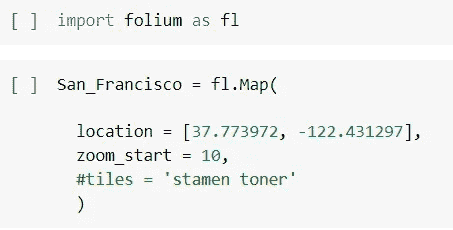

图 18:创建一个叶子地图。

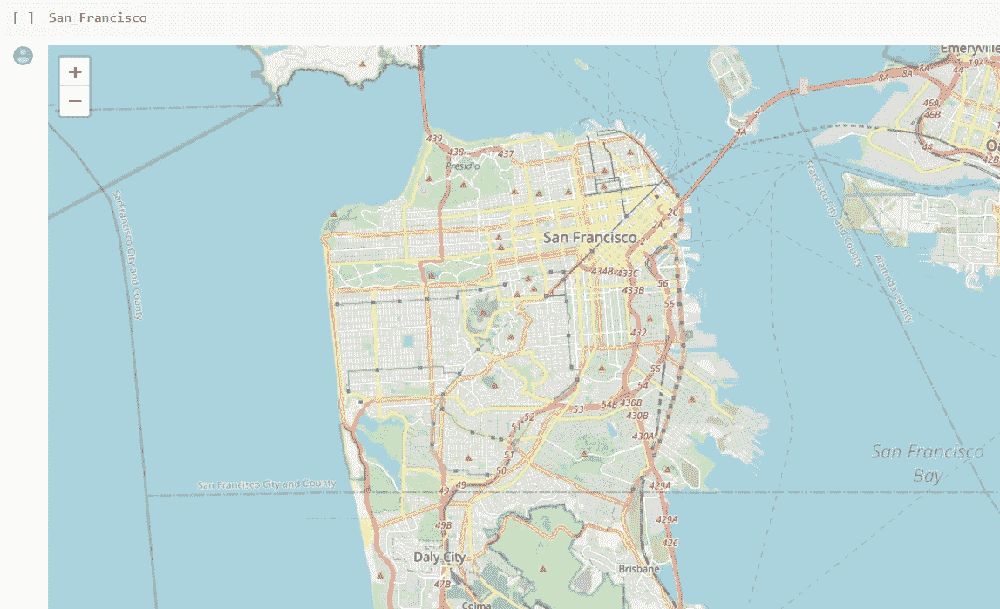

图 19:旧金山树叶地图。

可以看出这个库是多么的简单和强大。我们已经有了一张来自旧金山的好地图。尽管如此，如果能有一张地图显示城市每个地区的消费水平，那就太好了。这可以通过`Cloropleth`使用热图来完成。因此，要完成这项任务，有必要知道这些房产的邮政编码。我们的数据集不提供这些信息，因此将使用更完整的数据。这个数据集也可以在 Airbnb 的[上找到。](http://insideairbnb.com/get-the-data.html)

已经完成了许多清理数据的过程，但是这里不打算介绍它们。关于代码的更多细节，完整的分析可以在我的 GitHub 库中找到。

太好了！现在考虑到我们的数据集是绝对干净的，让我们用**叶绘制地图。**

为此，我们将执行以下步骤:

*   创造一个形象
*   创建地图
*   创建 Choropleth 地图。
*   在地图上创建一些标记，指向旧金山的一些著名景点。
*   显示地图

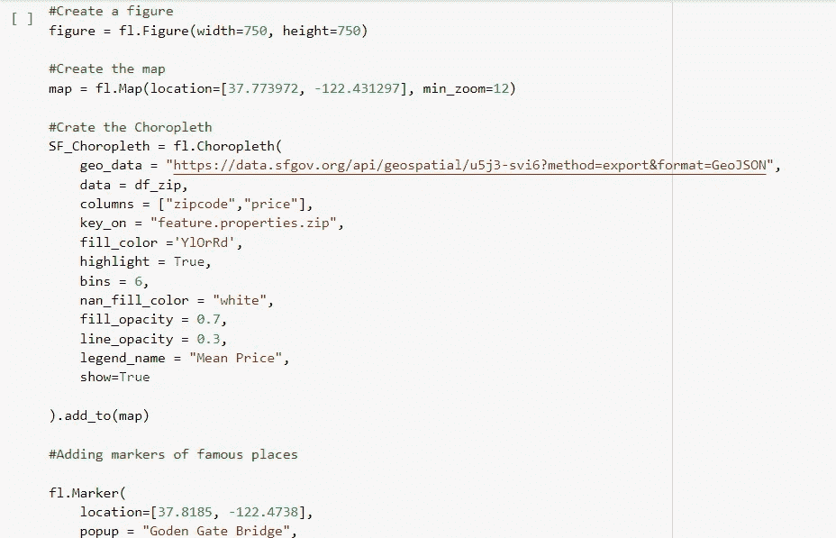

图 20:通过 leav 库创建 choropleth 图。

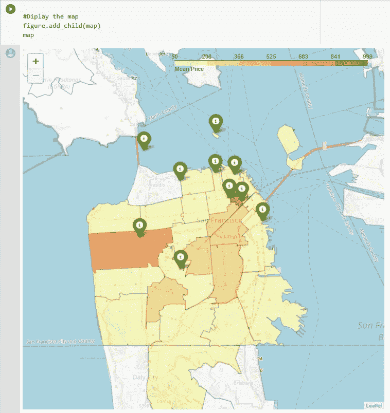

图 21:choropleth 地图上的旧金山租金价格。

一些旅游景点(如金门大桥、渔人码头、金门公园和美国电话电报公司公园)已在地图上标出。

整个分析，包括交互式的叶子地图，都可以在我的 [*GitHub 存储库中找到。*](https://github.com/JoaoSiqueiraDS/Joao_Siqueira_Portifolio)

# 结论

首先，本分析的主要目标已经实现，即使用基本的 Python 命令来操纵真实数据并从中获得洞察力，并了解这些命令有多么有用和强大。

关于分析本身，结果表明，基于对 Airbnb 数据集的这种肤浅分析，有可能看到离群值如何干扰分析。然而，旧金山生活成本最高的 10 个地区在价格上并没有太大差异(最贵地区和第十贵地区之间的价格差距只有 50 美元左右)。对 choropleth 地图的分析指出，最昂贵的租赁位于旅游景点附近。

最后，此分析中使用的数据集不是完整的版本，因此它只对表面分析有用。为了更好地理解和更彻底地研究，建议使用更完整的数据集，包括 106 个属性。