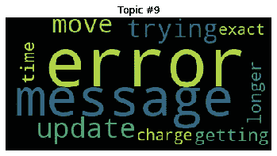
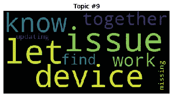
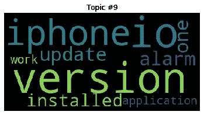
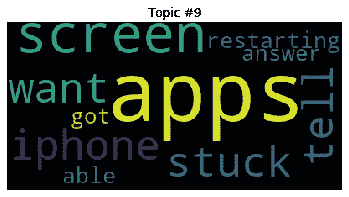

# EDA 用于分析 Twitter 上客户推文的观点和主题建模

> 原文：<https://medium.com/analytics-vidhya/analyzing-sentiments-and-topic-modelling-for-customer-tweets-on-twitter-df9a121aae9d?source=collection_archive---------27----------------------->

以下是我在这篇文章中要解决的问题:

> 可以做话题聚类来寻找相关话题吗？我们能通过这种见解改进在社交媒体上开展的活动吗？
> 
> 我们能否确定有多少客户不满意，他们不满意的是什么？

# 为了回答上述两个问题，采取了以下步骤:

1.在数据帧中只获取和存储 tweets(文本列)数据。

2.选择单个作者 id 或公司进行分析:例如，苹果或亚马逊或优步。

3.整个方法一直保持通用，这样，在更改公司名称后，我们就可以获得所需的洞察力。

# 数据预处理:

1.  转换成小写。
2.  删除尾随空格，停用词，结束行，标点符号。
3.  目前，url 已被删除，但它可用于进一步挖掘。
4.  目前，表情符号已被删除，但可以转换为文本。
5.  现在汉语或其他语言已经被删除，但它们可以被翻译。
6.  删除数字，数字。
7.  BOW 文本的符号化和引理化。

# 情感分析:

1.  因为我们主要关注的是负面推文，所以只保留负面推文是有意义的。
2.  使用 NLTK vader 库查找预处理数据的情感分数。
3.  对于整个代码，只选择那些具有情感分数(<0) i.e. negative tweets.

# Feature Extraction and Selection

1.  To feed the text into model features need to get converted into vectors called vectorisation.
2.  Chose Count vectoriser instead of Tf-idf vectorise since data is unsupervised and LDA is a probabilistic model that tries to estimate probability distributions for topics in documents and words in topics. The weighting of TF-IDF is not necessary for this.

# Topic Clustering:

1.  For finding topics and words distribution inside the topics LDA works well.
2.  LDA works well because it expresses competing sparsity between the topic distribution of documents and the word distribution of topics.

# Cluster Analysis.

1.  Probablity of words for each topic has been plotted for each cluster(topics).
2.  Word cloud gives us the clear picture of what happening in each cluster

Word-cloud for words present in each Topics (cluster)

More detailed analysis in coming story.

Please refer to my [github](https://github.com/amitfire/EDA-for-Data-Science-Projects/blob/EDA-Branch/Eclerx_Solution_AmitBhardwaj/Eclerx%20Challenge%20Solution.ipynb) 的数据点。

# 谢谢！