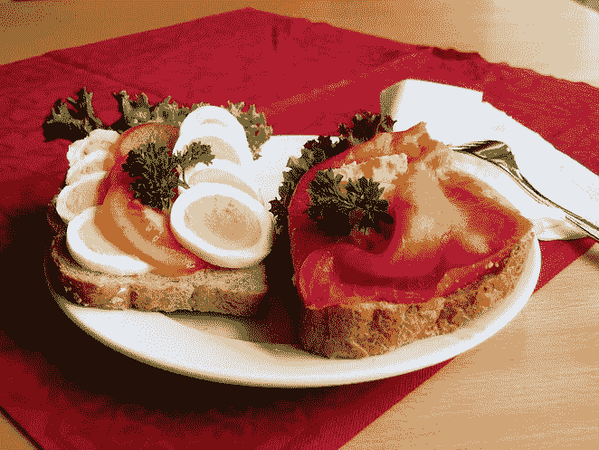
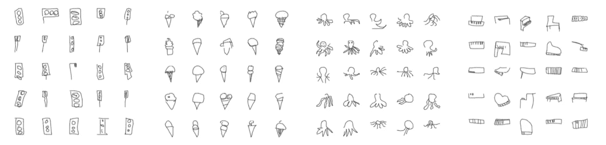
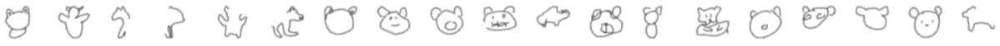
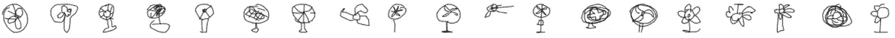

# 使用 sketch-rnn 分析世界各地的草图

> 原文：<https://medium.com/analytics-vidhya/analyzing-sketches-around-the-world-with-sketch-rnn-c6cbe9b5ac80?source=collection_archive---------8----------------------->

快，画个三明治！它看起来像什么？如果你来自韩国，你可能会加入腌黄瓜，或者如果你来自瑞典，你可能会画一个*smrg OS*即开面三明治。我们画画的方式反映了我们的环境和文化。我探索使用一种[神经表征](https://arxiv.org/abs/1704.03477)来分析来自世界各地的[数千份草图，发现它揭示了各国之间令人着迷的差异。我进一步研究了从绘画中预测国家，发现哪些国家有最独特的绘画，哪些绘画类别显示了最多的地理差异。](http://quickdraw.withgoogle.com/data)

左图:用 sketch-rnn 平均绘图。右图:不同国家的普通三明治草图。

三明治在美国、韩国和斯堪的纳维亚很受欢迎。

# **背景**

## **数据**

[Ha 和 Eck](https://arxiv.org/pdf/1704.03477.pdf) 从 [*Quick，Draw 构造了*](http://quickdraw.withgoogle.com) *[QuickDraw](https://github.com/googlecreativelab/quickdraw-dataset) 数据集！* ，玩家在不到 20 秒的时间内画出一个提示，谷歌的 AI 一猜出提示就停止。QuickDraw 由超过 5000 万个草图组成，包括对象类别标签(狗、树、钢琴等)、原产地，甚至线条绘制的确切顺序和方向。

*数据格式的例子:(* [*来源*](https://github.com/tensorflow/magenta/tree/master/magenta/models/sketch_rnn) *)。左边的每一次笔的移动都对应右边图中相同颜色的直线段。*格式为[∏x，∏y，表示笔是否离开纸张的二进制值]。

自从数据免费向公众发布以来，[许多有趣的研究](https://github.com/googlecreativelab/quickdraw-dataset#projects-using-the-dataset)已经在其上完成，主题从[画狗和猫的对比图需要多长时间](http://vallandingham.me/quickdraw/)到[自动识别涂鸦](http://colinmorris.github.io/blog/bad_flamingos)。

## 问题:如何比较成千上万的图纸？

到目前为止，对 QuickDraw 数据集中国家间差异的分析还很有限。你如何把每个国家成千上万不同的草图浓缩成一个可以很容易比较的东西？Ha，t .和 Sonnad 计算了顺时针和逆时针画简单形状的人的分布，但是很难总结这些画的更复杂的方面，比如结构或风格。一种方法是叠加图画: [Jana 和 Lovejoy](https://ai.googleblog.com/2017/08/exploring-and-visualizing-open-global.html) 通过叠加发现，在不同的国家，人们倾向于画朝向不同方向的椅子，而 [Forma Fluens](http://formafluens.io/) 的 Martino，Strobelt 等人发现各国在画西瓜和雪人方面存在差异。

*不同国家的图纸之间的差异有时可以通过简单地以低不透明度叠加它们而显现出来(* [*来源*](http://formafluens.io/) *)。*

这对于一些简单的对象类来说效果很好，但是对于大多数来说，叠加十几个草图的结果是难以理解的模糊(这种现象在 Forma Fluens 中被描述为“发散”)。这是因为人们画每条线的地方有太多的可变性(例如，昆虫张开的腿，或者手臂弯曲的角度)，即使他们画的是相同的整体。

*手臂**、*背包*、*蚊子 *(* [*来源*](http://formafluens.io/) *)的图纸叠加。*

如何对大量“分散”的图纸集合进行总结，以捕捉其质量特征？

## 我的方法是:分析特征而不是像素

我决定使用 [sketch-rnn](https://research.googleblog.com/2017/04/teaching-machines-to-draw.html) 将草图的定性特征编码成矢量。分析这些向量可以让我们总结草图，而不会被低层次细节中的高度可变性所“分心”。操纵矢量后，我们甚至可以将它们解码回草图，以便于解释，因此为了对草图进行平均，我们可以对它们的矢量编码进行平均，然后对结果进行解码:

*编码器用于为许多草图生成潜在向量，对潜在向量进行平均，并将结果解码回“平均草图”。*

**草图介绍-rnn**

变型自动编码器 [sketch-rnn](https://research.googleblog.com/2017/04/teaching-machines-to-draw.html) 可以将一幅画(表示为一系列笔的移动)编码成一系列浮点数，称为*潜在向量*。这个向量只捕获草图的定性特征，因此解码它会给出一个新的草图，它具有相似的结构(例如，腿或胡须的存在)，但与原始草图不相同(例如，尾巴稍长)。解码器产生一系列短的笔运动，确保清晰的图像。

一个非常简化的草图-rnn 示意图(左)，以及编码然后解码人类猫草图的例子(右)。

增加和减去向量进一步表明它们可以捕捉图形中的高级概念。在下面的每张图片中，黑色的图画被编码成矢量，经过算术运算后，得到的矢量被解码成蓝色的图画([来源](https://ai.googleblog.com/2017/04/teaching-machines-to-draw.html)):

*猫头+(猪头&身体—猪头)=猫头+身体=猫头&身体*

*猪头&身体+(猫头—猫头&身体)=猪头&身体—身体=猪头*

这一特性之前在单词的矢量编码中得到了证明——例如 [Mikolov 等人](https://www.aclweb.org/anthology/N13-1090)的观察，即 *King — Man + Woman = Queen* 表明习得的表征捕捉到了“有意义的句法和语义规则”。因此，将所有的图画编码成向量似乎是一种很有前途的方法，可以找到每个国家的共同特征。

# 结果

对于 64 个对象类别(小胡子、帽子、企鹅等)中的每一个，我在 10，000 张图纸上训练了一个新的 sketch-rnn 模型(25 个国家中的每一个都有 400 张，数据充足)，然后我用它将所有的图纸编码成潜在向量。这里报告的结果都来自对这 640，000 个向量的分析。

## 生成平均草图

在我最初的分析中，我忽略了关于每幅画来自哪个国家的数据，只是使用编码向量来生成平均的画。

**那个“万能”图纸？**

对于每个对象类，我对所有 10，000 个潜在向量进行平均，然后使用其对应的 sketch-rnn 模型将平均向量解码回绘图中。由于每个国家的绘画数量相等，一个好的平均值可以揭示一个对象的普遍描述，不受文化特质的影响。我将结果与 [Forma Fluens](http://formafluens.io/) 中叠加像素生成的图像(来自 34 个国家的 1000 张图纸)进行了比较。

对于许多对象类别，解码的平均向量是清晰的图像，清楚而简单地表示其类别。与会聚重叠图像相比，矢量方法似乎可以保留大多数绘画中常见的细节，但由于章鱼触角的位置等差异，重叠图像会变得模糊。

sketch-rnn 解码了 10，000 幅绘画(400 幅来自 25 个国家)的平均向量，这些绘画来自对象类别:交通灯、冰淇淋、章鱼、钢琴。

[34，000 幅图画的像素覆盖图](http://formafluens.io/)(1000 幅来自 34 个国家)

[原图](https://quickdraw.withgoogle.com/data/)的随机样本

另一件要注意的事情是，在素描中很少出现的细节往往根本不会出现在草图中——比如冰淇淋蛋筒上的纹理，章鱼的脸或钢琴上的腿。似乎 sketch-rnn 平均保留了平均图中的**最大公分母**。一个例外是冰淇淋平均有两勺——但是我们可以把稍偏右上方的较小曲线解释为冰淇淋上的广义“浇头”,而不是具体的一勺，在这种情况下，这并不罕见。有关 sketch-rnn 平均值的进一步研究，请参见末尾的补充说明。

# “失败”案例

然而，对于某些对象类，sketch-rnn 的“通用平均值”并没有直观的意义。

*熊*、*电话*、*龙。*

*当有多种结构上非常不同的方式来画一些几乎同样常见的东西时，这种情况似乎就会发生。例如，有一些人甚至混合在一起，只画一只熊的头而不是整个身体，或者把一部电话画成听筒、旋转式电话或移动电话。*

****

**Raw QuickDraw* [*熊*](https://quickdraw.withgoogle.com/data/bear) *和* [*电话*](https://quickdraw.withgoogle.com/data/telephone) *图纸来自世界各地。**

*在“头”和“全身”之间求平均，缺乏有意义的解；大卫·哈通过在猪的头部和全身的绘图向量之间进行插值并解码向量来演示*

**

**对猪头(黄色)和整头猪(蓝色)的矢量进行插值然后解码的结果:由两者(绿色)均匀混合而成的平均图是无意义的。修改自* [*来源*](https://ai.googleblog.com/2017/04/teaching-machines-to-draw.html) *。**

*这种类型的差异与 Forma Fluens 发现的差异在另一个层面上，在 Forma Fluens 的研究中，图形在像素叠加中无法很好地对齐:没有一致的方式来表示对象类的主题。在本文的其余部分，我称之为*表示发散*，叠加发散用*像素发散*表示。有关这些不同类型差异的进一步分析，请参见补充说明。*

# *国家分析*

## *你能从图上猜出这个国家吗？*

*如果草图在不同的国家有很大的不同，而潜在向量可以捕捉到这些差异，那么就有可能从潜在向量中猜出原产国。我试着训练简单的分类器来做到这一点，从零开始训练每个对象类(细节在补充说明中)。*

*计算每个对象类别的准确度(在保留测试数据上的 f1 分数)并取平均值，我发现所有国家的准确度都大于 20%——远远高于随机概率(25 分之 1 = 4%)。这意味着这些图确实显示了国家之间的差异。*

**

**即使在最坏的情况下，也有可能比随机机会(4%)更好地从抽奖中预测国家。**

*通过检查来自多个类别的绘图，最终的准确性可能会高得多，所以我开发了一个 20 个问题风格的绘图游戏，猜测你的国家(在本文的[中有所描述)。](/@dayanalyssa/playing-20-questions-with-sketches-a850c8730d77)*

## *为什么法国和瑞典的图纸辨识度这么高？*

*为什么法国的绘画如此容易辨认，准确率高达 96%？检查他们的一些对象类显示，在大多数情况下，他们的绘画(上图)比全球平均水平(下图)简单得多，倾向于用一笔就画出大部分画面(见夹克、校车和 UFO)。*

****

*Sketch-rnn 仅包括法国的图纸(上图)和所有 25 个国家的图纸(下图)的平均值。*

*一旦谷歌的人工智能正确地猜出了对象类别，玩家就不能继续画画了——如果有机会，法国的参与者可能会添加更多细节，但他们真的很擅长只用最初的几笔就捕捉到提示的本质。*

*与此同时，识别度第二高(90%的准确率)的国家——瑞典，由于相反的原因而显得与众不同:*

****

*Sketch-rnn 仅来自瑞典(上图)和所有 25 个国家(下图)的平均图。*

*我没有时间来分析笔画顺序，但有可能瑞典的参与者以一种不寻常的顺序画画，在画出整体轮廓之前添加细节，这样一来，当他们的画被认出来时，它们已经相当复杂了。*

## *哪些国家的图纸最相似？*

*为了了解不同国家的绘画之间的相似性，我们可以使用分类器将它们彼此混淆的程度。*

*我观察了 A 被预测为 B 的频率，作为 A 被正确预测为自身的频率的一部分(A->B/A->A)，然后将其与反方向(B->A/B->B)进行平均，以获得一种形式的“相互混淆”。基于相互混淆的等级聚类显示了经常混淆的整个国家组(参见完整混淆矩阵的补充说明)。*

**

*基于相互混淆的国家等级聚类。y 轴是聚类之间的距离，用[增量算法](https://docs.scipy.org/doc/scipy/reference/generated/scipy.cluster.hierarchy.linkage.html)计算。*

*最常混淆的三对国家是波兰/罗马尼亚、芬兰/俄罗斯和菲律宾/泰国。除了明显的地理联系，波兰和罗马尼亚是奥匈帝国的一部分，而芬兰在 WW1 之前的一个世纪里是俄罗斯帝国的一部分。可以推测，相似的绘画风格可以反映共同的文化——学校里教授绘画的方式，或者更普遍的看世界的方式:一个物体的哪些特征是最重要的，当绘画提示有多种版本或解释时，首先想到的是什么。但是除了前三名之外，还有一些配对和分组的国家没有明显的联系。解读留给读者！*

# *对象类别分析*

## *哪种类型的绘画最能揭示问题？*

*我计算了每个物体类别在所有国家的平均准确度，发现平均起来最能揭示原产国的所有类别都是复杂的人造物体:*小号* (49%)，*钢琴* (45%)，*电话* (42%)，*火车* (42%)。*

**

**按对象分类的绘图分类器的准确性，在所有国家/地区中取平均值。绘制了六个最高和最低精度等级；请参阅所有对象的补充部分。**

*这可能是因为简单物体的图画包含的线条太少，无法预测，自然事物在世界上任何地方看起来都一样，但人造物体可以有不同的设计，这可能在不同的国家或多或少受欢迎。Jana 和 Lovejoy 还观察到，自然出现的物体的涂鸦在不同文化中看起来更相似。*

*另一种解释是，谷歌的*快，快！*神经网络更擅长识别自然物体，因此它会猜测类别，并在玩家可以添加更多可能给出他们国家线索的细节之前保存图画。*

## *为什么小号这么暴露？*

*查看原始小号草图，可以看到各种各样的形状，钟的直径和圆度、管子的厚度、吹口或调音滑块的存在、手指按钮的数量等都有所不同。事实上，[有许多不同类型的小号，看起来都有些不同](https://www.normans.co.uk/blog/2017/07/different-types-of-trumpet/)，这可能有助于图纸上的多样性。*

**

*小号草图的随机样本([来源](https://quickdraw.withgoogle.com/data/trumpet))。*

*国家平均值显示了相似的多样性，表明不同类型的小号在不同的国家更受欢迎。尽管各国之间存在许多差异，但全球平均水平很简单，显示了绝大多数国家绘画的共同点:一个顶部带按钮的长管。*

**

**各国小号平均图(*[ISO 3166-1 alpha-2](https://en.wikipedia.org/wiki/ISO_3166-1_alpha-2)国家代码)。*

## *为什么粉丝最通用？*

*分类器最难处理的对象类是平均准确率仅为 27%的*粉丝*。粉丝是复杂的人造物体，为什么对预测国家如此无益？检查一下草图，人们画扇子的方式似乎有很多不同。*

**

*原始风扇草图的随机样本([来源](https://quickdraw.withgoogle.com/data/fan))。*

*然而，国家平均值都显示了相同的简单组件:围绕同心圆的刀片，可能还有一个支架。这表明，虽然有许多种绘制粉丝的方法，但不同国家之间每种方法的受欢迎程度没有太大差异。*

**

**各国平均风扇图纸(*[ISO 3166–1 alpha-2](https://en.wikipedia.org/wiki/ISO_3166-1_alpha-2)国家代码)。*

# *只是为了好玩*

## *小胡子:浓密 vs 卷曲？*

*看起来小胡子可能是二维的，也可能是卷曲的，但不可能两者都是。也许非卷曲的小胡子需要额外的维度来区别于山脉或波浪？*

**

*平均胡子从最厚到最薄。*

**

*从最直到最卷曲的平均胡子。*

## *一份三明治*

**

*匈牙利的三明治最平，而美国的三明治最厚、最有层次感，俄罗斯的三明治三角形最大。三明治形状最有趣的国家是韩国和瑞典，这可以用*smrgs*即瑞典的开放式三明治的流行来解释，同时韩国的三明治通常含有腌黄瓜。*

# ***杂项***

**

*不同国家的普通内衣画谱。*

**

*猫头鹰*

**

*灯笼*

**

*企鹅*

# *讨论*

*每个国家每个物品类别随机选择的 400 张草图可能不足以得出任何明确的结论。然而，我认为这个项目展示了一个有趣的新方法来可视化和分析大量的绘画作品。*

*未来潜在的工作可能是深入研究潜在的媒介。通过聚集矢量(类似于[涂鸦地图](http://formafluens.io/doodlemap.html)聚集像素图像)是否可以识别绘制对象类的所有模式？每一个潜在的空间维度代表每一个物体类别的什么？有多少维度代表单一的“直观”特征，不同对象类别所代表的特征类型之间是否存在共性？*

# *承认*

*感谢 IBM 视觉人工智能实验室为我主持和指导这个项目，特别是 Hendrik Strobelt、Daniel Weidele、Evan Phibbs 和 Mauro Martino。*

# *补充说明*

## *表示和像素发散的进一步分析*

*我发现 sketch-rnn 不能为一些对象类产生有意义的平均值，并将这些*表示称为发散的*类。与此同时，我调用了像素覆盖未能给出清晰图像的对象类*像素发散*。*

*我注意到熊类是代表性的分歧，这可能是因为仅仅一个熊的脸就像整个身体一样经常被绘制。一般来说，必须画出整个身体才能被识别的动物似乎没有这个问题，例如老虎需要背上有条纹，松鼠需要毛茸茸的尾巴，章鱼需要触角。*

**

**来自*[*quick draw*](http://quickdraw.withgoogle.com/data)*(上)的*老虎*、*松鼠*和*章鱼*图纸的随机样本及其由 sketch-rnn 生成的重建平均值。**

*有趣的是，表示差异的对象类并不总是表现为像素差异。对于代表不同的电话类别，有触摸屏智能手机、带键盘的手机、无线或有线手机，甚至老式的旋转拨号变体。然而，像素覆盖似乎只是一个触摸屏智能手机，这可能会产生误导。这可能是因为触摸屏智能手机是唯一的会聚表示(因为它是一个简单的矩形形状，总是面向观众绘制)，而其他表示通过平均化被模糊掉。*

**

**随机* [*采样*](http://quickdraw.withgoogle.com/data) *草图(左)、* [*像素叠加*](http://formafluens.io/) *(中)和草图——rnn 平均(右)来自世界各地的电话图纸。**

*仅从印度打来的电话来看，结果差异甚至更大。从草图样本来看，智能手机不太常见，但仍然有其他表现形式的混合。在这种情况下，像素覆盖看起来像老式的对接手机，但 sketch-rnn 平均是一个自由浮动的手机。*

**

**随机* [*采样*](http://quickdraw.withgoogle.com/data) *草图(左)、* [*像素叠加*](http://formafluens.io/) *(中)和草图-rnn 平均(右)仅来自印度的电话图纸。**

*来自印度的电话的重叠显示对接的手机表示也是收敛的。我推测它在全球覆盖图中看不到，因为它没有手机那么集中，而手机在全球绘画收藏中也很常见。更一般地说，从这些观察中我会推测出*当* ***多种常见的描绘*** *共存时*:*

*   ***覆盖图显示了最接近像素的描绘**。这将解释为什么当所有 3 种表示都存在时，只有最集中的触摸屏是可见的，而停靠的手机描绘仅在没有触摸屏时出现(例如，来自印度的绘图)。停靠表示可能不如触摸屏收敛，因为对于其正面(旋转拨盘或小键盘)和周围形状(圆形、方形、梯形)几乎没有共识。但是它通常是面向观看者绘制的，所以它比可以在任何角度浮动的免费手机更加像素会聚(类似于像素发散的[臂](http://formafluens.io/img/interface/arm.jpg))。如果根本没有像素收敛的共同描绘(即，在像素发散类中)，则图像是模糊的。*
*   ***Sketch-rnn 一般保持最高公分母**(加减几个小细节)。传统的对接电话和免费手机描绘都包含一个手机，所以素描-rnn 平均印度电话是手机。但当触摸屏被加入到全球平均水平的组合中时，最高的公分母只是圆形和长曲线。类似地，尽管人们画钢琴体的方式不同，但所有的画都包括一个键盘，所以钢琴的草图平均是键盘部分。请注意，在头部和整个身体平均的情况下，头部不会被平均保留，因为当绘制整个动物时，头部通常以不同的、更简单的方式表示(例如，查看熊的图片)。*

## *国家分类器详细信息*

*对于每个对象类，我使用每个国家 320 张图片进行训练，80 张图片进行测试。使用的分类器是多项式逻辑线性回归和高斯朴素贝叶斯，使用 [scikit-learn](http://scikit-learn.org/) 的实现和默认超参数值。对于每一类，报告了分类器达到的最大测试准确度。报告的准确性是 f1 分数，这是一种考虑真阳性和假阳性的准确性度量。*

***国家预测混乱矩阵***

*我在(A 行，B 列)绘制了来自 A 国的提款被预测为来自 B 国(表示为 A->B)的频率。观察每行中只有几个明亮的细胞-这表明每个国家通常只与少数几个其他国家混淆。另外，请注意，该图是关于对角线对称的——这表明 A->B and B->A 具有大约相同的频率。*

**

*第 I 行第 j 列的值是某个绘图被预测为来自 j 国而实际上来自 I 国的频率。*

**

**所有对象类别的绘图分类器的精确度，在所有国家/地区进行平均。**