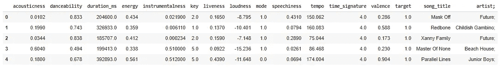
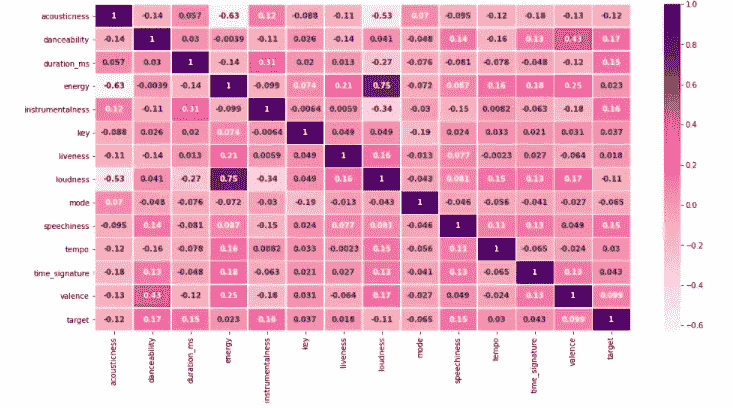
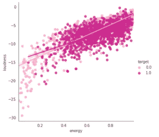
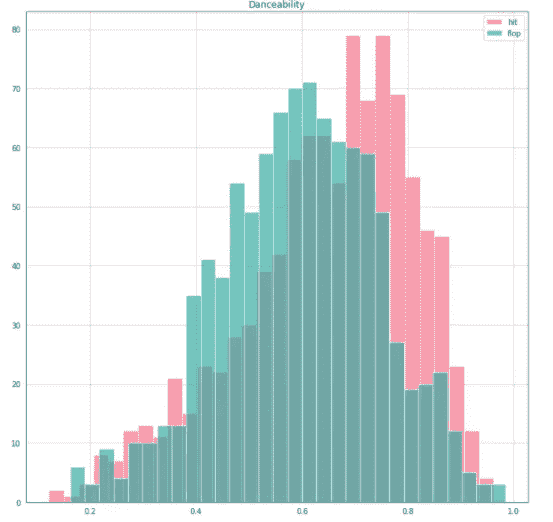
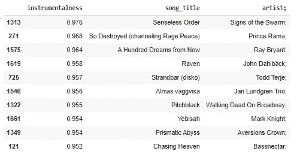
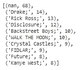
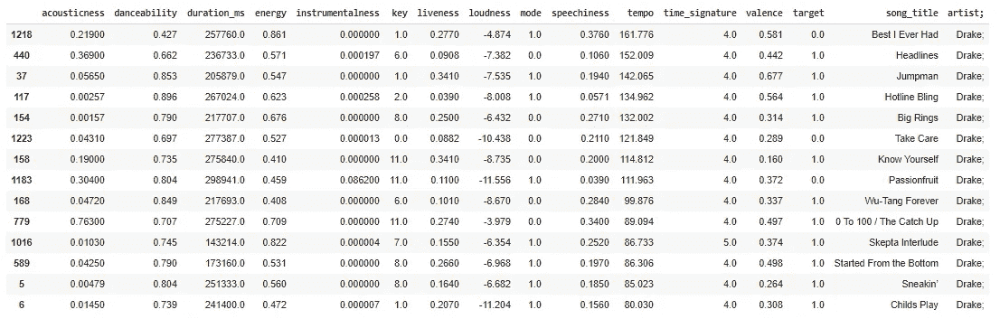

# 用 Python 实现 Spotify 数据集的 EDA 方法

> 原文：<https://medium.com/analytics-vidhya/analyzing-spotify-dataset-with-python-6ba9cb82a486?source=collection_archive---------8----------------------->

大家好！以下是我对 Spotify 数据集的分析。

我将在使用 Python 的 Spotify 数据集的探索性数据分析方法中解释我的分析。在 Kaggle 上可以获得数据集。对了，我用的是 Google Colab。

首先，我在 Google Colab 中导入 csv 文件，如下所示。

```
from google.colab import files
uploaded = files.upload()
```

我已经创建了代表我的数据框的“df”函数。数据框有助于查看按行和列排列的数据集。第一个变量是未命名的，该列只显示行号，然后我删除了它。这些步骤如下所示。

```
import pandas as pd
import io
import numpy as npdf = pd.read_csv(io.BytesIO(uploaded[‘spotify_data.csv’]))
df = df.drop(“Unnamed: 0”, axis=”columns”)
df.head()
```

我的数据集中有 2017 行 x 16 列。前 5 行，如图 1 所示。你可以在[这里](https://developer.spotify.com/documentation/web-api/reference/tracks/get-audio-features/)找到变量的描述。



图 1

我做了一个热图，看看哪些变量相关性最高。你可以在下面看到我的代码。图 2 中的热图显示响度和能量之间的相关性最高。

```
import matplotlib.pyplot as plot
import seaborn as sns
import matplotlib.ticker as tickercorr = df.corr()
fig1 = plot.figure(figsize=(16, 8))
sns.heatmap(df.corr(), annot=True, annot_kws={'weight':'bold'},linewidths=.5, cmap='RdPu')sns.lmplot(y='loudness',x='energy',data=df, hue='target',palette='RdPu')
```



图 2

根据图 3 中的目标，我创建了一个散点图和趋势线来查看响度和能量之间的关系是最高的。淡粉色线表示目标为 0 时响度和能量的关系。另一行显示了目标为 1 时的关系。

PS:如果目标为 1，则表明该曲目已命中。如果它是 0，这意味着轨道是翻牌的。



图 3

然后，我创建了一个直方图，显示了可跳舞性变量对目标的影响。粉色的是打，蓝色的是翻。通过查看图 4 中的直方图，我们可以说，当可跳舞性增加时，被击中的几率很高。可以对其他变量尝试类似的直方图。

```
hit_danceability = df[df[‘target’]==1][‘danceability’]
flop_danceability = df[df[‘target’]==0][‘danceability’]
palette = sns.color_palette(“husl”, 2)
fig = plot.figure(figsize=(12,12))
plot.title(“Danceability”)
hit_danceability.hist(alpha = 0.7, bins = 30, label = ‘hit’)
flop_danceability.hist(alpha = 0.7, bins = 30, label = ‘flop’)
plot.legend()
```



图 4

在这些图表之后，我根据最高水平的工具性对我的数据进行了分类。我限制为 10 个，然后添加了歌曲标题和艺术家列，如图 5 所示。

```
df.sort_values(‘instrumentalness’, axis = 0, ascending = False).head(10)[[“instrumentalness”,”song_title”,”artist;”,]]
```



图 5

让我们找出最常出现的 10 位艺术家。结果如图 6 所示。

```
from collections import Counter
c = Counter(df[‘artist;’])
c.most_common(10)
```



图 6

最后，我把德雷克的歌按节奏分类。正如我们在图 7 中看到的，我所拥有的最好成绩有着最高的节奏。

```
df[(df[‘artist;’] == “Drake;”)].sort_values(‘tempo’, axis = 0, ascending=False)
```



图 7

PS:真的建议用 Google Colab。首先，我用 PyCharm 编码，但是它给出了一个错误，因为库和 Python 不是同一个版本。Google Colab 让这个过程变得更加简单。