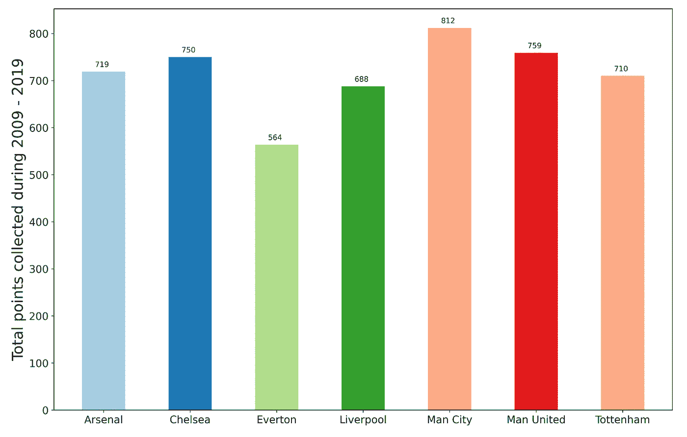

# 英超近十年分析

> 原文：<https://medium.com/analytics-vidhya/analyzing-the-last-decade-of-the-english-premier-league-a0669a4c5301?source=collection_archive---------15----------------------->

足球迷通常会记得他们喜爱的球队在过去几年的表现。然而，他们中没有多少人知道整个联盟在过去十年中是如何发展的。本文是对英超联赛过去 10 个赛季(2009-2019)数据的可视化研究。

从 2009 年到 2019 年，EPL 总共举办了 3800 场比赛。在此期间，英格兰足球顶级联赛的参赛球队数量为 36 支。阿森纳、切尔西、埃弗顿、利物浦、曼城、曼联和热刺是参加了全部 10 个赛季的球队。

2009-2019 年在 EPL 的比赛总数

## 主队赢了一半的比赛

这种说法听起来可能令人惊讶，但统计数据显示 **46%的比赛是主队**获胜。你只有三分之一的机会在客场获胜。

匹配结果

## 卷土重来的胜利很少

只有在**的 153 场比赛**中，半场失利的球队扭转了局面，在全场获胜。2012-2013 赛季见证了最多的复出胜利，共有 21 场。统计数据显示，半场获胜的球队有 96%的机会在比赛结束时至少获得一分。

每个赛季的复出胜率

## 征服你的对手并不容易

这里的“统治”一词仅代表一个主要的净胜球(以 3 球或更多的优势获胜)。433 场比赛主队取得了压倒性的胜利，而只有 215 场比赛主队以 3 个或更多的净胜球获胜。这总共只占比赛总数的 16.6%，这清楚地表明 EPL 是一个非常有竞争力的联赛。曼城以 88 场精彩表演领先，紧随其后的是利物浦(75 场)和切尔西(65 场)。

主场 3 球或以上的胜利

客场 3 球或以上的胜利

## **客场**球队招致更多**牌**

球队通常在客场犯更多的犯规，因此在客场拿到更多的牌。

主队和客队之间的卡片分配

看下面的图表，我们可以确认大多数球队在客场收到的卡数更高。

每场比赛的平均黄牌，主场(绿色)和客场(橙色)

每场比赛的平均红牌，主场(蓝色)和客场(红色)

## “当游戏给你机会时，充分利用它们”

在过去十年中，获得和失去的角球之间的差异在车队的表现中发挥了重要作用。角球的差距越大，球队的整体表现越好。与客场比赛相比，主场获得的角球和失球的差距要大得多。看看那些在英格兰顶级联赛中存活了 10 个赛季的球队，我们清楚地看到，他们在每场比赛平均获得和失球的角球数量上有着更大的差异。

每场比赛的平均得分和失分

## 裁判发挥了他们的作用

在过去的十年里，有 30 名裁判执法了 EPL 的比赛。麦克·迪恩执法了 291 场比赛，位居榜首，其次是马丁·阿特金森，执法总数为 280 场。他们两人还以总共 2061 张黄牌和 99 张红牌领先于大多数黄牌和红牌。总黄牌数的 16.7%和总红牌数的 17.8%是从这两名裁判的口袋中抽出的。

执法比赛总数

## 谁赢得了“EPL 十年杯”？

按照“得分多的人赢得奖杯”的标准规则，我们有一个明确的赢家，曼城。他们在过去十年中以 812 分的成绩高居榜首。紧随曼城之后的是 759 分的曼联和 750 分的切尔西。

2009–2019 年总积分

让曼城成为冠军的不仅仅是分数。他们还在进球总数、总进球数、更好的转换率、总角球数、统治性表现等方面领先。除了第一季(2009-2010)之外，其他所有赛季都保持在前 4 名。

每个赛季的积分

除此之外，曼城在过去十年中赢得了 4 次 EPL，紧随其后的是切尔西(3 次)、曼联(2 次)和莱斯特城(1 次)。

过去十年的 EPL 冠军

考虑到上述所有事实，我们可以很轻松地宣布**曼城**为“EPL 十年杯”的**冠军。**

关于 EPL 的过去十年已经做了很多分析，本文只列出了一些结果/可视化。如果你有兴趣看更多的结果，请点击下面的链接访问我在 Kaggle 中创建的笔记本。非常欢迎你的改进建议。
[https://www.kaggle.com/aj7amigo/epl-data-analysis-2009-2019](https://www.kaggle.com/aj7amigo/epl-data-analysis-2009-2019)

如果您有兴趣对数据集进行 on 分析，可以在下面的链接中找到完整的数据集。
[https://www . ka ggle . com/aj7 amigo/English-premier-league-data-2009-2019](https://www.kaggle.com/aj7amigo/english-premier-league-data-2009-2019)

感谢您抽出时间阅读这篇文章。非常欢迎您的反馈。

**谢谢**