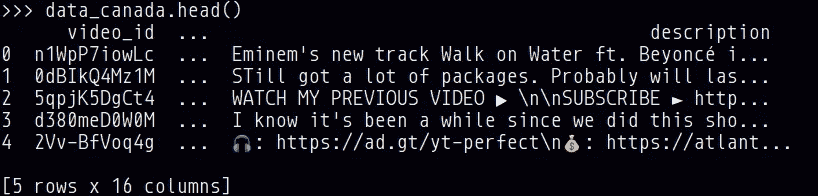
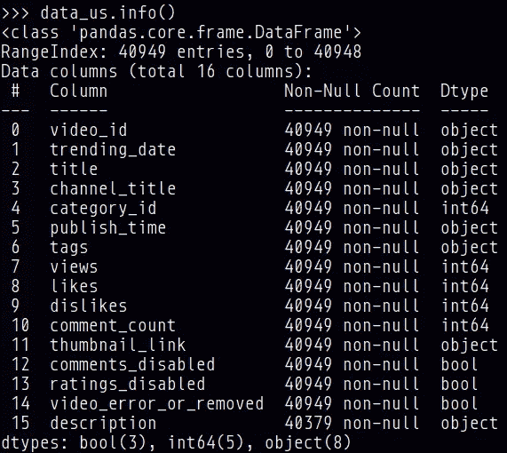
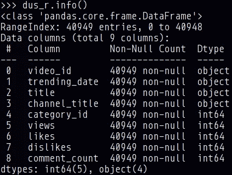
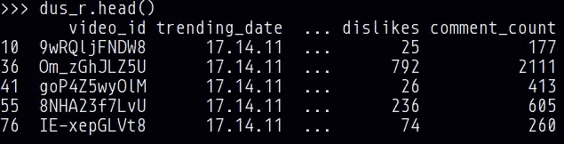
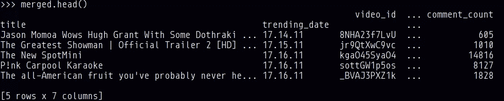
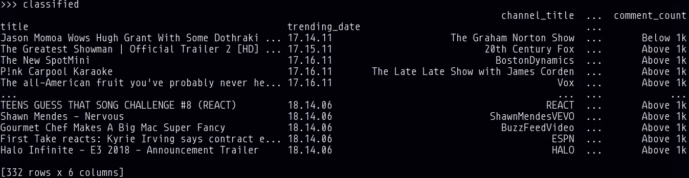
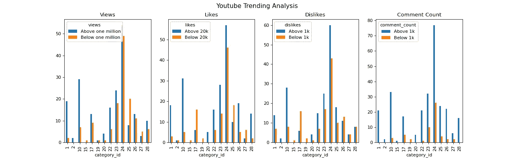

# 用 Python 和熊猫分析热门 YouTube 视频

> 原文：<https://medium.com/analytics-vidhya/analyzing-trending-youtube-videos-with-python-and-pandas-6e676f31ba02?source=collection_archive---------6----------------------->


Kon Karampelas 在 [Unsplash](https://unsplash.com?utm_source=medium&utm_medium=referral) 上拍摄的照片

今天，YouTube 几乎无处不在，从教育到娱乐，它可以通过笔记本电脑、智能手机和其他数字设备访问。根据 [Omnicore 的 YouTube by the Numbers (2020)](https://www.omnicoreagency.com/youtube-statistics/) 的数据，全球 95%的互联网人口观看 YouTube，而该平台上有 5000 万创作者。

由于有人观看内容，有相当多的人拥有 YouTube 频道，希望获得大量的订阅者、喜欢者和观看者。我自己有一个 YouTube 账户，我希望它能流行起来。

在这篇文章中，我们将分析 YouTube 上的热门视频，看看我们能从中学到什么。

# 数据

[Kaggle](https://www.kaggle.com/) 是一个机器学习和数据科学社区，拥有大量数据集、笔记本和有用的数据科学知识，但我们在这里要使用的是 [Mitchell J 的趋势 YouTube 视频统计数据](https://www.kaggle.com/datasnaek/youtube-new)。更具体地说，CAvideos 和 USvideos 数据集。

# 数据采集和提炼

该项目使用 [Pandas](https://pandas.pydata.org/) 、 [NumPy](https://numpy.org/) 和 [Matplotlib](https://matplotlib.org/) 。

## 进口

```
import pandas as pd
import matplotlib.pyplot as plt
import numpy as np
```

## 数据读取

```
data_canada = pd.read_csv('CAvideos.csv', encoding='utf8')
data_us = pd.read_csv('USvideos.csv', encoding='utf8')
data_canada.head()
```



## 数据细化

现在数据集已经加载到 Pandas 数据框架中，为了找到我们将在项目中使用的列，可以使用 info 函数。



在这个项目中，有一些列不适合分析，更具体地说是发布时间、标签、缩略图的链接、分级是否被禁用、视频是否在某个时候被删除及其描述。目标列可以用 [iloc](https://pandas.pydata.org/pandas-docs/stable/reference/api/pandas.DataFrame.iloc.html) 过滤。

```
dc_r = data_canada.iloc[:, [0, 1, 2, 3, 4, 7, 8, 9, 10]].copy()
dus_r = data_us.iloc[:, [0, 1, 2, 3, 4, 7, 8, 9, 10]].copy()
dus_r.info()
```



然而，在数据集中，单个视频可以在不同日期的行中重复。为了获得每个视频的单个条目，在按照视频的 id 对条目进行分组之后，可以获得视频的 [max](https://pandas.pydata.org/pandas-docs/stable/reference/api/pandas.core.groupby.GroupBy.max.html) 行。之后，我们删除重复的值(转换后的值)。

```
grc = dc_r.groupby(['video_id'])
gru = dus_r.groupby(['video_id'])dc_r.update(grc.transform("max"))
dus_r.update(gru.transform("max"))dc_r = dc_r.drop_duplicates("video_id", keep='last')
dus_r = dus_r.drop_duplicates("video_id", keep='last')dus_r.head()
```



# 数据组合和转换

## 组合数据

现在来自加拿大和美国的数据已经准备好了，所以是时候使用 merge 将它们合并到一个数据框架中了。Merge 类似于数据库风格的联接，因为它通过一个键组合两个数据帧。如果没有指定参数 how，合并的类型将是内部的。更多信息，包括例子，可以在[熊猫文档页面](https://pandas.pydata.org/pandas-docs/stable/reference/api/pandas.DataFrame.merge.html)找到。

```
left = dc_r.set_index(['title', 'trending_date'])
right = dus_r.set_index(['title', 'trending_date'])cols_to_use = right.columns.difference(left.columns)merged = pd.merge(left=left, right=right[cols_to_use], on=['title', 'trending_date'])merged.head()
```



## 转换数据

为了用二进制、可读的输出对数据进行分类，定义了视图、喜欢、不喜欢和评论计数列的函数。为了将该函数应用于 DataFrame 的每个元素，使用了 [apply](https://pandas.pydata.org/pandas-docs/stable/reference/api/pandas.Series.apply.html) 函数，通过参数传递函数。一旦函数被应用到元素上，分类就被连接到一个新的数据帧 classified 中，使用 Pandas 的 [concat](https://pandas.pydata.org/pandas-docs/stable/reference/api/pandas.concat.html) 函数。

```
def classify_views(element):
  if element > 1000000:
    return 'Above one million'
  else:
    return 'Below one million'def classify_likes(element):
  if element > 20000:
    return 'Above 20k'
  else:
    return 'Below 20k'def classify_dislikes(element):
  if element > 1000:
    return 'Above 1k'
  else:
    return 'Below 1k'def classify_comments(element):
  if element > 1000:
    return 'Above 1k'
  else:
    return 'Below 1k'views_c = merged['views'].apply(classify_views)
likes_c = merged['likes'].apply(classify_likes)
dislikes_c = merged['dislikes'].apply(classify_dislikes)
comments_c = merged['comment_count'].apply(classify_comments)classified = pd.concat([merged.loc[:, ["channel_title", "category_id"]], likes_c, dislikes_c, views_c, comments_c], axis=1)classified
```



# 测绘

现在已经有了一个关于观点、喜欢、不喜欢和评论数量的分类数据框架，是时候绘制它了。条形图将提供一个很好的方法来可视化数据。

```
fig, ax = plt.subplots(nrows=1, ncols=4, figsize=(16, 5))classified.groupby(["category_id", "views"]).size().unstack().plot.bar(title="Views", ax=ax[0])
classified.groupby(["category_id", "likes"]).size().unstack().plot.bar(title="Likes", ax=ax[1])
classified.groupby(["category_id", "dislikes"]).size().unstack().plot.bar(title="Dislikes", ax=ax[2])
classified.groupby(["category_id", "comment_count"]).size().unstack().plot.bar(title="Comment Count", ax=ax[3])fig.suptitle("Youtube Trending Analysis", fontsize=14)plt.savefig("output/youtube-trending-analysis.png", dpi=80)
```



## 类别

```
1: Film & Animation
2: Autos & Vehicles
10: Music
15: Pets & Animals
17: Sports
19: Travel & Events
20: Gaming
22: People & Blogs
23: Comedy
24: Entertainment
25: News & Politics
26: Howto & Style
27: Education
28: Science & Technology
```

# 结论

从图中可以看出，最明显的类别是娱乐，上面结果最多的类别是音乐。来自旅游和活动的少数视频仅获得以下结果，而宠物和动物仅获得 1k 评论。

所以，想在 YouTube 上领先一步吗？娱乐和音乐似乎是未来的发展方向。喜剧和电影&动画也是不错的选择，因为它们有很多的浏览量和高达 100 万和 20，000 的点击率。

在我的 GitHub 上可以找到这个项目，以及运行它的说明。

# 参考

[](https://www.kaggle.com/datasnaek/youtube-new) [## 趋势 YouTube 视频统计

### 热门 YouTube 视频的每日统计数据

www.kaggle.com](https://www.kaggle.com/datasnaek/youtube-new) [](https://www.omnicoreagency.com/youtube-statistics/) [## * YouTube by the Numbers (2020):统计、人口统计和有趣的事实

### 网址:https://www.youtube.com 成立于:2005 年 2 月首席执行官:苏珊·沃西基总部:加州圣布鲁诺员工:2000+…

www.omnicoreagency.com](https://www.omnicoreagency.com/youtube-statistics/) [](https://pandas.pydata.org/) [## 熊猫

### pandas 是一个快速、强大、灵活且易于使用的开源数据分析和操作工具，构建于…

pandas.pydata.org](https://pandas.pydata.org/) [](https://numpy.org/) [## NumPy

### 为什么是 NumPy？强大的 n 维数组。数值计算工具。可互操作。表演。开源。

numpy.org](https://numpy.org/) [](https://matplotlib.org/) [## Matplotlib: Python 绘图- Matplotlib 3.3.2 文档

### Matplotlib 是一个全面的库，用于在 Python 中创建静态、动画和交互式可视化…

matplotlib.org](https://matplotlib.org/) [](https://github.com/murilobnt/youtube-trending-analysis) [## murilobnt/YouTube-趋势分析

### 此时您不能执行该操作。您已使用另一个标签页或窗口登录。您已在另一个选项卡中注销，或者…

github.com](https://github.com/murilobnt/youtube-trending-analysis)  [## pandas.concat - pandas 1.1.3 文档

### 沿特定轴连接 pandas 对象，沿其他轴连接可选的集合逻辑。也可以加一层…

pandas.pydata.org](https://pandas.pydata.org/pandas-docs/stable/reference/api/pandas.concat.html)  [## 熊猫。系列.应用-熊猫 1.1.3 文档

### 对序列值调用函数。可以是 ufunc(适用于整个系列的 NumPy 函数)或 Python…

pandas.pydata.org](https://pandas.pydata.org/pandas-docs/stable/reference/api/pandas.Series.apply.html)  [## 熊猫。DataFrame.merge - pandas 1.1.3 文档

### 用数据库样式的联接合并数据框架或命名系列对象。联接是在列或索引上完成的。如果加入…

pandas.pydata.org](https://pandas.pydata.org/pandas-docs/stable/reference/api/pandas.DataFrame.merge.html)