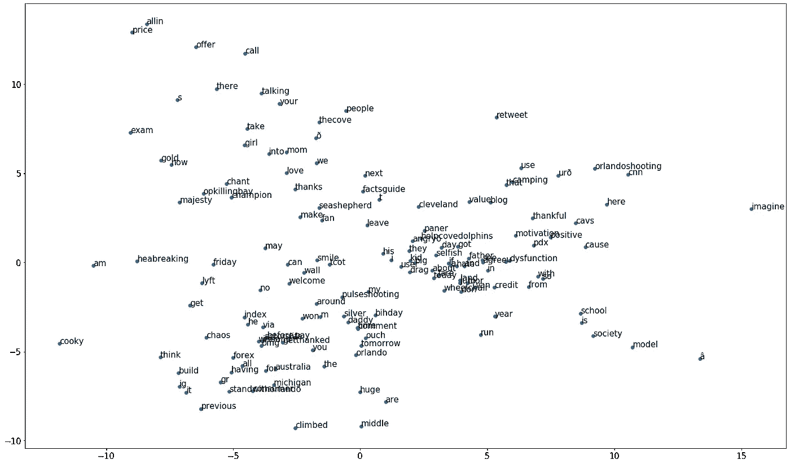
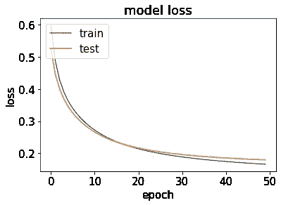

# 利用词嵌入分析推文的语义

> 原文：<https://medium.com/analytics-vidhya/analyzing-tweets-semantic-using-word-embedding-9463e6fbeadb?source=collection_archive---------14----------------------->


社交媒体改变了世界，让个人有机会被倾听并对社会产生影响。在过去的几年里，我们目睹了越来越多始于社交媒体的运动、抗议和现象。

这个机会也有不利的一面。社交媒体可以提供一个传播仇恨、种族主义、性别歧视的平台，并具有伤害他人的真实潜力。言论自由很重要，但有时，检测和阻止这类内容的发布是必须的。

监控社交媒体内容的问题在于，浏览每一篇帖子、每一条推文和每一张图片，并检查其语义是不可能的。据大卫·赛思称，每天有 5 亿条推文被发布。这就是机器学习算法发挥作用的地方。

使用 [Kaggle](https://www.kaggle.com/arkhoshghalb/twitter-sentiment-analysis-hatred-speech#train.csv) ，我提取了分为仇恨推特和普通推特的推特。在这种情况下，仇恨推文被认为是带有种族主义和性别歧视背景的推文。我的意图是训练一个模型，它将有能力分析推文并有效地标记它。


数据分布包括 29720 条非仇恨推文和 2242 条仇恨推文

一个大的挑战是否定语义可能是隐含的。像[弓](/greyatom/an-introduction-to-bag-of-words-in-nlp-ac967d43b428)这样的技巧在这种情况下可能没什么用。幸运的是，单词嵌入正是完成这项任务的工具。

单词嵌入是一种 NLP 技术，其中每个单词被表示为具有 n 维的向量，该向量表示单词在向量空间中的投影。在训练模型时，给定单词的位置是根据它周围的其他单词来决定的。

用来创建这种模型的两种最常见的方法是:Word2Vec 和 GloVe。

我使用 Word2Vec 对我在数据集中的所有 tweets 中的单词训练了一个 100 维向量的模型(可以随意选择任何大小并测试结果)。

```
# training the model on clean and tokenized tweets
model = Word2Vec(df['tokenized_tweets'], size = 100, window = 20, min_count = 2, negative = 20, iter=25, workers=multiprocessing.cpu_count())
```

一旦你训练好了你的模型，你可以表演一些非常好的技巧，比如这个-

```
# the model words vocabulary
word_vectors = model.wv#finding the most similar words to a given word
word_vectors.similar_by_word(“hate”)>>>output[('hateful', 0.5506447553634644),
 ('stupid', 0.5302757024765015),
 ('blame', 0.5247147083282471),
 ('kill', 0.505715012550354),
 ('lie', 0.48834866285324097),
 ('murderer', 0.48504817485809326),
 ('violence', 0.48261135816574097),
```

如你所见，在训练模型之后，使用模型词汇我们可以搜索单词和它们最近的邻居。搜索与“恨”最相似的词，我得到了一些很好(嗯，不是很好)的词，它们之间的关系非常清楚。

您可以使用 PCA 和 Pyplot 执行的另一个好技巧是绘制模型词汇的 2D 表示:

```
#create a plot for the 150 most frequent words
X = model[model.wv.index2entity[:150]]pca = PCA(n_components=2)
result = pca.fit_transform(X)[:150]# create a scatter plot of the projection
pyplot.figure(figsize=(25,15))
pyplot.rcParams.update({'font.size': 15});
pyplot.scatter(result[:, 0], result[:, 1]);
words = list(model.wv.vocab)[:150]
for i, word in enumerate(words):
 pyplot.annotate(word, xy=(result[i, 0], result[i, 1]))
```

这创建了下面的图表，显示了一些单词以及它们与其他单词的交互(其中一些对我来说不太清楚):



我们可以保存我们训练的模型，并将其用于其他 NLP 任务。

我做的下一件事是将数据中的每个单词转换为一个常数，这样它将适合我要创建的神经网络模型。我还需要为模型提供具有相同列数的数据，因此，我创建了一个填充文档:

```
texts = df['clean_tweets']
tokenizer = Tokenizer(nb_words=14225)
tokenizer.fit_on_texts(texts)
sequences = tokenizer.texts_to_sequences(texts)word_index = tokenizer.word_index
print('Found %s unique tokens.' % len(word_index))
>>>
Found 37391 unique tokens.data = pad_sequences(sequences, maxlen=280)# split the data into a training set and a validation set
VALIDATION_SPLIT = 0.2
indices = np.arange(data.shape[0])
np.random.shuffle(indices)
data = data[indices]
labels = labels[indices]
nb_validation_samples = int(VALIDATION_SPLIT * data.shape[0])x_train = data[:-nb_validation_samples]
y_train = labels[:-nb_validation_samples]
x_val = data[-nb_validation_samples:]
y_val = labels[-nb_validation_samples:]
```

正如您所看到的，我已经决定我的数据将包含 14，225 个最常用的单词，并将有 280 个列\单词(尽管 tweets 的长度被限制为 280 个字符，但为了安全起见，我想将其分为训练和验证子集)。

现在，使用我创建的 Word2Vec 模型，我将训练一个嵌入矩阵，这是一个单词与其相应向量的字典，将用于 NN 模型中的嵌入层:

```
embeddings_index = {}
f = open('Word_2_Vec_sentiment_analysis.txt')
for line in f:
    values = line.split()
    word = values[0]
    coefs = np.asarray(values[1:], dtype='float32')
    embeddings_index[word] = coefs
f.close()print('Found %s word vectors.' % len(embeddings_index))
>>>
Found 14226 word vectors.embedding_matrix = np.zeros((len(word_index) + 1, 100))
for word, i in t.word_index.items():
 embedding_vector = embeddings_index.get(word)
 if embedding_vector is not None:
  embedding_matrix[i] = embedding_vector
```

我们现在可以进入有趣的部分了！使用嵌入矩阵和我创建的填充数据，我可以训练一个神经网络模型，并开始对推文进行分类！

对于此任务，我将使用 Keras 库，它提供了一个嵌入式层，我将构建一个非常简单的顺序模型:

```
model_2 = Sequential()
e = Embedding(vocab_size, 100, weights=[embedding_matrix], input_length=data_length, trainable=False)
model_2.add(e)
model_2.add(Flatten())
model_2.add(Dense(1, activation=’sigmoid’))opt = Adam(lr=0.00001)model_2.compile(loss=’binary_crossentropy’,
 optimizer=opt,
 metrics=[‘accuracy’])model_2.summary()
```

让我们看看我们的模型总结:

```
Model: "sequential_55"
_________________________________________________________________
Layer (type)                 Output Shape              Param #   
=================================================================
embedding_56 (Embedding)     (None, 280, 100)          3739200   
_________________________________________________________________
flatten_40 (Flatten)         (None, 28000)             0         
_________________________________________________________________
dense_48 (Dense)             (None, 1)                 28001     
=================================================================
Total params: 3,767,201
Trainable params: 28,001
Non-trainable params: 3,739,200
```

现在我们可以运行它并查看结果:

```
history = model_2.fit(x_train, y_train, validation_data=(x_val, y_val),
 epochs=50, batch_size=120)>>>
Train on 25570 samples, validate on 6392 samples
Epoch 1/50
25570/25570 [==============================] - 3s 103us/step - loss: 0.5978 - accuracy: 0.6869 - val_loss: 0.5253 - val_accuracy: 0.7894
Epoch 2/50
25570/25570 [==============================] - 2s 83us/step - loss: 0.4881 - accuracy: 0.8296 - val_loss: 0.4470 - val_accuracy: 0.8656
Epoch 3/50
25570/25570 [==============================] - 2s 84us/step - loss: 0.4281 - accuracy: 0.8799 - val_loss: 0.4003 - val_accuracy: 0.8944
Epoch 4/50
25570/25570 [==============================] - 2s 84us/step - loss: 0.3895 - accuracy: 0.9038 - val_loss: 0.3683 - val_accuracy: 0.9110
Epoch 5/50
25570/25570 [==============================] - 2s 85us/step - loss: 0.3615 - accuracy: 0.9142 - val_loss: 0.3443 - val_accuracy: 0.9182
Epoch 6/50
25570/25570 [==============================] - 2s 93us/step - loss: 0.3397 - accuracy: 0.9202 - val_loss: 0.3254 - val_accuracy: 0.9222
```

我只捕获了 50 个纪元中的 6 个，但是正如你所看到的，从第四个纪元开始，我们达到了 90%的准确率。随着纪元的增加，训练分数的准确性不断上升，而验证集的准确性分数保持在 93%左右(一点也不差！)，但为了防止过度拟合，我们就此打住。



我们可以将我们的预测添加到原始数据框架中，以便更仔细地查看结果:

```
#taking our predictions 
predictions = model_2.predict_classes(x_val)#extracting our dataframe rows that match the validation set
df_eval = df.ix[list(y_val.index.values)]#adding a new column with our predictions to the dataframe
df_eval['predictions'] = predictions#print only rows which we predicted as hate tweets
df_eval[df_eval['predictions'] ==1]
```

看了结果之后，似乎这个模型在分类这些数据方面做得很好。甚至一些被错误归类为仇恨的推文也有一些负面的内容。

还有什么？我还使用了一个预先训练的 Word2Vec 模型(您可以在下面我的完整代码的链接中找到它)来做同样的预测，它提供了几乎相同的准确性分数，但学习速度更快，而且-将其他层与 NN 模型结合起来，并调整模型的参数可能会给你带来更好的结果。

我希望你阅读这篇短文，我将非常高兴听到你的想法和想法，以改善这个 NLP 任务！

[在 GitHub 上链接到我的完整代码](https://github.com/Natialuk/Analyzing-tweets-semantic-using-Word-Embedding)

# 信用和证明人:

[](https://www.kaggle.com/arkhoshghalb/twitter-sentiment-analysis-hatred-speech#train.csv) [## 推特情感分析

### 检测仇恨推文，由分析 Vidhya 提供

www.kaggle.com](https://www.kaggle.com/arkhoshghalb/twitter-sentiment-analysis-hatred-speech#train.csv) [](https://nlp.stanford.edu/projects/glove/) [## GloVe:单词表示的全局向量

### GloVe 是一种无监督学习算法，用于获取单词的矢量表示。培训在…进行

nlp.stanford.edu](https://nlp.stanford.edu/projects/glove/) [](/greyatom/an-introduction-to-bag-of-words-in-nlp-ac967d43b428) [## 自然语言处理中的词袋介绍

### 这篇文章将带你深入自然语言处理。在你继续前进之前，确保你已经…

medium.com](/greyatom/an-introduction-to-bag-of-words-in-nlp-ac967d43b428) [](https://machinelearningmastery.com/use-word-embedding-layers-deep-learning-keras/) [## 如何用 Keras 使用单词嵌入层进行深度学习——机器学习掌握

### 单词嵌入提供了单词及其相关含义的密集表示。它们比…有所改进

machinelearningmastery.com](https://machinelearningmastery.com/use-word-embedding-layers-deep-learning-keras/)  [## 在 Keras 模型中使用预先训练的单词嵌入

### 在本教程中，我们将带您了解使用预先训练的 word 解决文本分类问题的过程…

blog.keras.io](https://blog.keras.io/using-pre-trained-word-embeddings-in-a-keras-model.html) [](/@jonathan_hui/nlp-word-embedding-glove-5e7f523999f6) [## NLP —单词嵌入和手套

### BERT 是为句子创建矢量表示的一个重要里程碑。但是它没有告诉我们…的确切设计

medium.com](/@jonathan_hui/nlp-word-embedding-glove-5e7f523999f6)