# 使用人工智能和 Python 分析 Twitter 趋势。

> 原文：<https://medium.com/analytics-vidhya/analyzing-twitter-trends-using-ai-python-e0aee72fde87?source=collection_archive---------4----------------------->

Twitter 分析名人的最高呼声，即谁在 Twitter 上发布的关于主题和问题的信息最多。

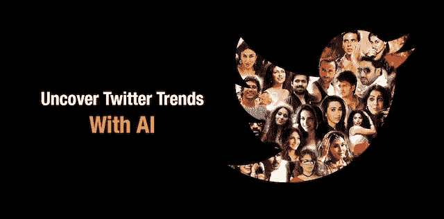

> 这篇文章的内容是基于我所做的项目，我发现它既有用又有趣。我的 github“[https://github.com/SuryaGovind/Twitter-Trend-Analyzer](https://github.com/SuryaGovind/Twitter-Trend-Analyzer)上有。

# 简介:

欢迎来到社交媒体故事的人工智能世界。很久以来，twitter 一直是一个活跃的社交媒体平台，旨在分享关于问题、行动等的想法。twitter 用户每天都要面对基于许多领域的不同类型的数据。分析如此大量的数据并发现最新的趋势几乎就像做梦一样。每条推文都有一定的目的，谈论一个问题或讨论。通过对 twitter 数据的分析，大多数公司都可以破解当今世界的成功密码，他们可以很容易地获得关于今天发生了什么的信息。所以这样一来，我们就能理解 twitter 趋势分析的重要性了。

## 这个项目的目标:(Python 3 编程)

构建一个 twitter 趋势分析器，使用人工智能和文本处理技术来分析一组推文。趋势分析器将对宝莱坞上的一组给定推文进行处理，以生成:

1.  一个标签云描述了 Twitter 上谈论的话题或名人。
2.  显示与宝莱坞相关的标签趋势的图表(标签是以# eg #ShahrukhKhan 开头的单词或短语
3.  一份声音图表，显示哪些名人主导了 Twitter 上的对话。

## 交付成果:

a)基于推文生成词云。

b)显示标签的相对受欢迎程度。

c)显示哪个名人拥有最大的发言权。你可以对以下名人进行分析:阿莉雅·布哈特、沙鲁克·汗、萨尔曼·可汗、阿米尔·可汗、安努丝卡·夏尔马、兰比尔·卡普尔、赫里希克、迪皮卡·帕度柯妮等。

## 使用的库和包:

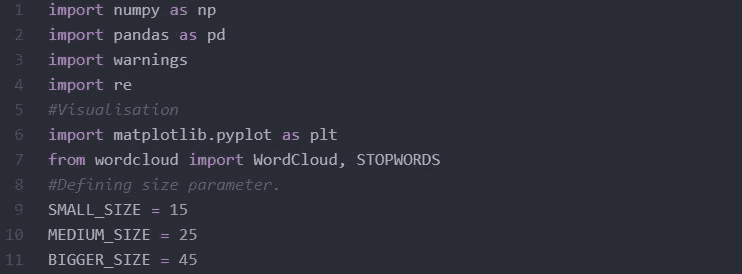

1.  NumPy[数组操作]， **NumPy** 是一个 **Python** 包，代表‘数值型**Python**’。它是科学计算的核心库，包含一个强大的 n 维数组对象，提供集成 C、C++等的工具。它在线性代数、随机数能力等方面也很有用

2.Pandas【制作可视化数据框架】， **pandas** 是一个为 **Python** 编程语言编写的用于数据操作和分析的软件**库**。特别是，它提供了数据结构和操作来操作数字表和时间序列。它是在三条款 BSD 许可下发布的自由软件。

3.Re【用于提取 URL 数据集】，在 **Python** 中，一个**正则表达式**表示为 **RE** (REs，regexes 或 **regex** 模式)通过 **re** 模块嵌入。 **re** 模块包含在 **Python** 中，主要用于字符串搜索和操作。也经常用于网页“抓取”(从网站中提取大量数据)

4.Matplotlib【用于图形和图表中的数据可视化】， **matplotlib** 。 **pyplot** 是一个绘图库**，用于 **python** 编程语言中的**2D 图形。它可以在 **python** 脚本**中使用**，shell、web **应用**服务器以及其他图形用户界面工具包

5.**警告**【忽略不想要的警告】，警告消息通常是在对程序中的某些情况向用户发出警告有用的情况下发出的，在这种情况下(正常情况下)不需要引发异常并终止程序。例如，当程序使用过时的模块时，可能需要发出警告。是否发布警告信息的决定由**警告过滤器**控制，它是一系列匹配规则和动作。可以通过调用 **filterwarnings()将规则添加到过滤器中。**

6.Wordcloud【用于绘制最常用词的词表】，一个 **Wordcloud** (或**标签云**)是**文本数据**的可视化表示。它显示一个单词列表，每个单词的重要性用字体大小或颜色显示。这种格式对于快速理解最重要的术语非常有用。 [Python](https://www.python.org/) 适合绘制这种表示，这要感谢 [Andreas Mueller](http://amueller.github.io/) 开发的 [wordcloud 库](https://github.com/amueller/word_cloud)。

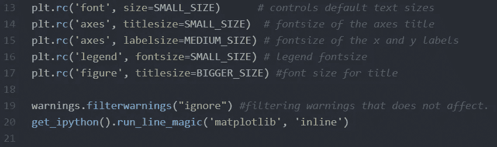

**大小和字体大小的云正在这里进行。**

为每个结果文本定义不同的大小将有助于区分结果中的因素，我正在使用“熊猫”数据分析库来分析 twitter 数据集，这将有助于我们确定 wordcloud。推特现在并不神秘，甚至我们刚睡醒就发推特，下面的热图显示的也是一样:

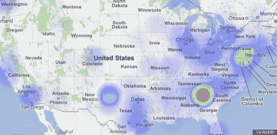

推特热图显示谁一醒来就发推特说“早上好”。

## 方法:

1.  **获取 twitter 数据集进行分析:**【https://github.com/SuryaGovind/Twitter-Trend-Analyzer 。提供的数据集属于关于印度宝莱坞名人的推特之声。
2.  **这个网址为我们提供了一个数据集，用于分析 twitter 用户的推文。**

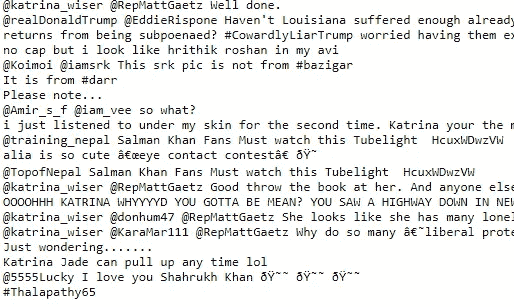

**数据集内的样本数据**

**2。数据预处理和显示 Wordcloud:**

生成**单词云在 Python 中，** **单词云**是一种用于表示文本数据的数据可视化技术，其中每个**单词**的大小表示其出现的频率或重要性。使用**文字云**可以突出显示重要的文本数据点。

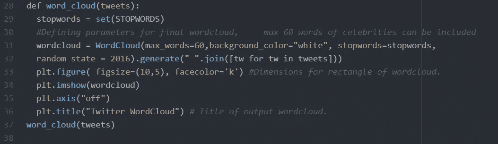

**注释中提到了语句的工作和功能。**

数据预处理包括从所有推文中删除不需要的字符串或字符以及频繁使用的“停用词”。使用“Matplotlib”和“Wordcloud”库，我们生成单词云。这可以根据不同的背景风格、字数、图形大小等进行修改。下面你可以看到一个单词云:

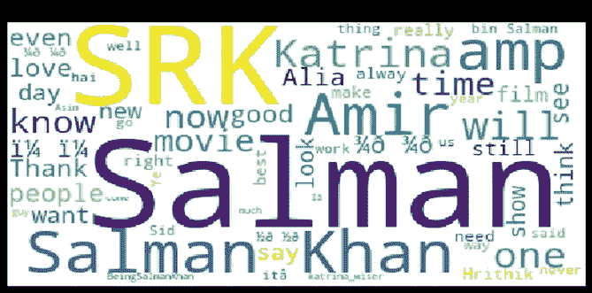

## 观察结果:

在上面的 wordcloud 中，我们看到“萨尔曼”一词在用户推文中使用频率最高，其次是“SRK”，其他演员如 Katrina、Alia 和 Aamir 几乎同样被 twitter 用户提及。

## 从数据集确定热门趋势标签并可视化条形图:

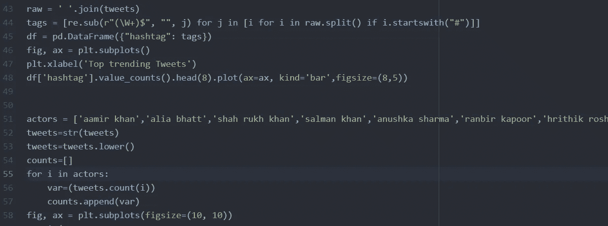

热门推文的条形图由每个演员单独的受欢迎程度定义。

正如我们所知，标签以' # '开始，所以使用正则表达式库进行模式匹配，我们确定所有的标签，找到最常用的标签，并确定它们的流行度。通过比较每个热门标签发布的 tweets 数量，可以用一个条形图来直观地显示这一点。

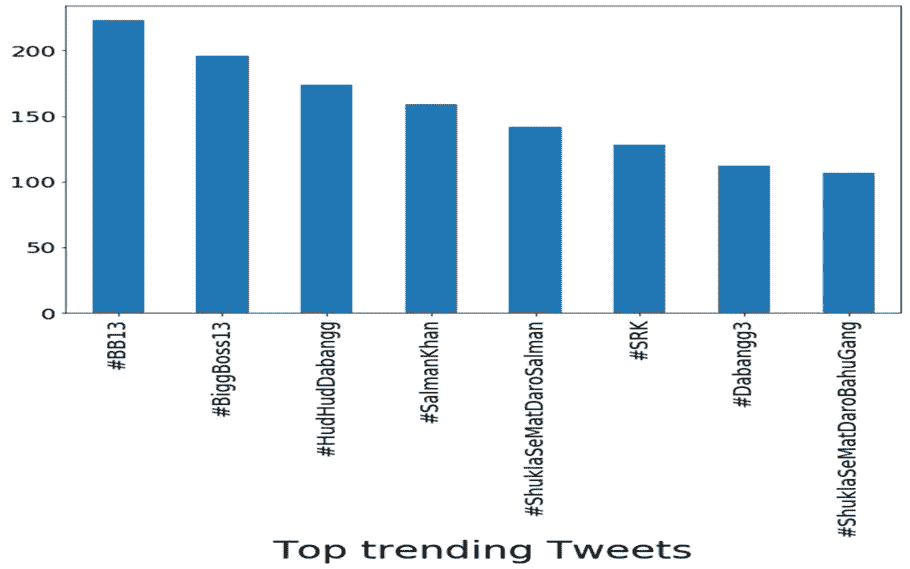

## 观察结果:

从上图中，我们可以看到#BB13 在 Twitter 上的趋势是最多的。此外，如果我们分析这些标签，大部分都与萨尔曼·可汗或他的银幕作品有关，比如《大老板》、《达邦格》。

## 确定哪个演员在分析的推文中拥有最大的发言权:

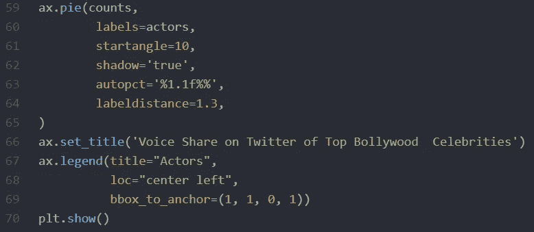

为该项目分析的演员:**【阿莉雅·布哈特、沙鲁克·汗、萨尔曼·可汗、阿米尔·汗、安努丝卡·夏尔马、兰比尔·卡普尔、赫里希克、迪皮卡·帕度柯妮】。为了相互比较以上演员名单，最好使用饼状图。它们没有显示出随时间的变化。他们不仅可以可视化，还可以确定标签(演员推文)在可视化中所占的百分比。这有助于绘制比较统计数据。**

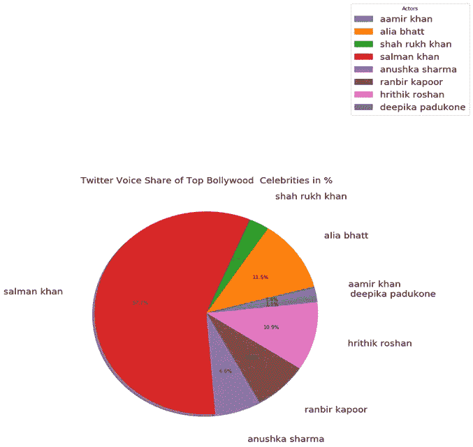

## 观察结果:

萨尔曼·可汗分享了支配所有其他印度名人的最大声音。他有 57%的声音份额，迪皮卡·帕度柯妮只有 1.1%的最低推特用户谈论她，考虑到她是这个国家的顶级女演员之一，并有大量的推特粉丝，这是非常令人震惊的。

## 了解趋势如何运作:

上面的图表显示，无论谁在推特上发布更多关于某个特定话题的消息，他在推特上都有一个热门的名字，无论哪个话题被发布的次数最多，都会成为最热门的话题。简而言之，如果你在推特上发布更多关于某个话题的消息，并且转发的频率更高，那么你就会成为热门。

## 结论:

我们刚刚在 twitter 上探讨了一个有趣的话题，毫无疑问，twitter 永远不会失去它在用户中的价值。但是考虑到 twitter 每天产生的大量信息在很多方面都是有用的。我不认为任何人会对分析数据感兴趣，以便为组织或个人获得更多的利润和知识。人工智能一天比一天强大，所以很快，我想每个人都会接受人工智能带来的好处。人工智能的能力在未来也不可忽视。

如果您有兴趣运行或检查本文中使用的所有代码，可以在我的 [Github 资源库](https://github.com/SuryaGovind/Twitter-Trend-Analyzer)中找到。

## 快乐学习家庭！