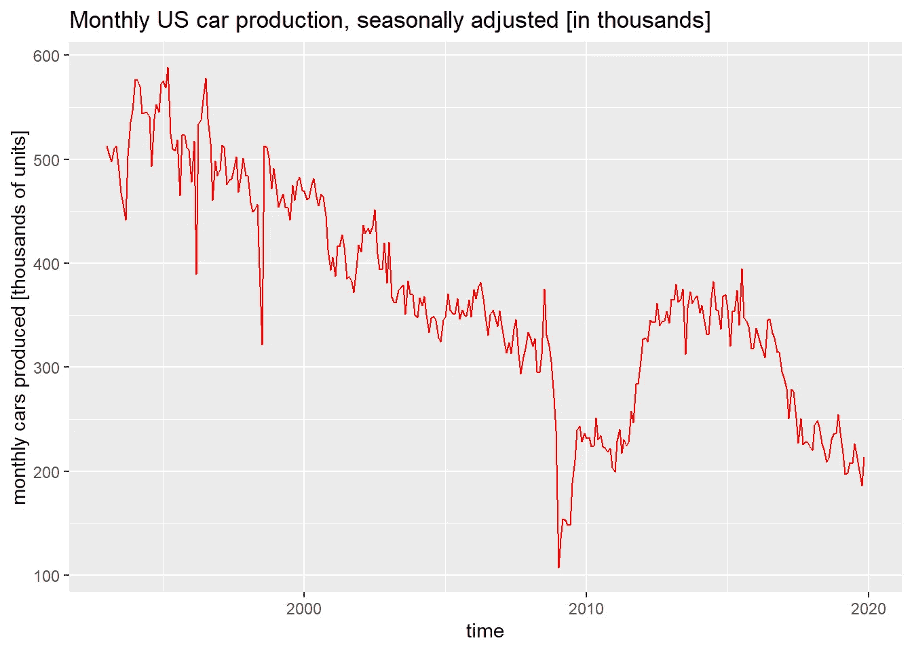
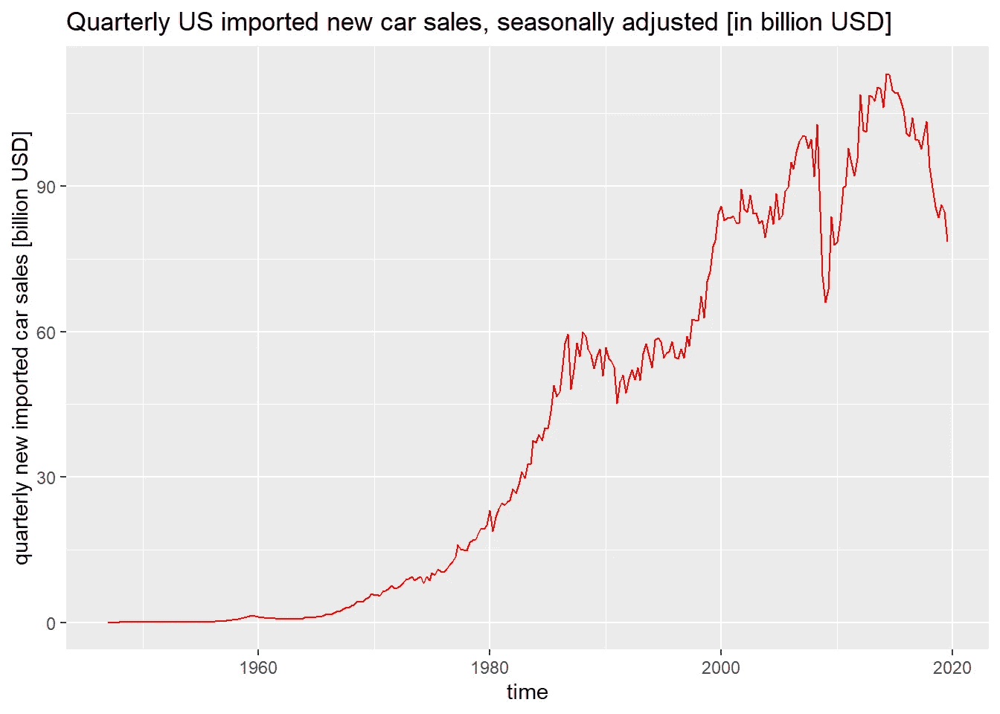

# 用 R 中的 FRED 软件包 fredr 分析美国汽车工业

> 原文：<https://medium.com/analytics-vidhya/analyzing-us-automotive-industry-using-fredr-a-fred-package-in-r-f17ccd94fd00?source=collection_archive---------22----------------------->


在 [Unsplash](https://unsplash.com?utm_source=medium&utm_medium=referral) 上由 [Carlo D'Agnolo](https://unsplash.com/@carlodagnolo?utm_source=medium&utm_medium=referral) 拍摄的照片

利用公开的弗雷德数据，我分析了美国汽车市场的历史数据，显示了美国汽车市场的历史趋势。

FRED 是美国美联储系统的缩写，它在一个在线数据库中提供与美国经济相关的公共数据。该数据库包括与经济研究相关的各种指标。例如，关于美国国内汽车生产、汽车销售、汽车进口以及更多与美国汽车市场相关的时间序列数据。

下面我使用可用的 fredr 包设置了 FRED API 键，用于在 R 中检索 FRED 数据。我继续在数据库中搜索“汽车生产”。使用这个搜索词，fredr_series_search_text 函数返回一个列表，其中包含与 FRED US 汽车生产数据相关的数据集摘要。

```
*# install fredr package directly from CRAN*
*#install.packages("fredr")*
*# load package*
**library**(fredr)## Warning: package 'fredr' was built under R version 3.6.2*# set fredr API key*
fredr_set_key(api_key) *# api_key string must be retrieved from* [*https://research.stlouisfed.org/useraccount/apikey*](https://research.stlouisfed.org/useraccount/apikey)*# search database for a car production series*
search_ls <- fredr_series_search_text("car production")*# view column names of series search result list*
colnames(search_ls)##  [1] "id"                        "realtime_start"           
##  [3] "realtime_end"              "title"                    
##  [5] "observation_start"         "observation_end"          
##  [7] "frequency"                 "frequency_short"          
##  [9] "units"                     "units_short"              
## [11] "seasonal_adjustment"       "seasonal_adjustment_short"
## [13] "last_updated"              "popularity"               
## [15] "group_popularity"          "notes"
```

下图是基于 FRED 时间序列数据生成的，访问搜索结果包含的一个数据集。该图表以千辆为单位总结了经季节性调整的美国国内汽车产量的历史月度发展情况。可视化是在 R 中使用 ggplot2 包完成的。

```
*# loading ggplot2 R-package*
**library**(ggplot2)*# DAUPSA is id for seasonlly adjusted monthly domestic car production in units*
series_ls <-fredr_series_observations(series_id = "DAUPSA") *# convert series list to dataframe*
series_df <- do.call(cbind.data.frame, series_ls)*# plotting data*
ggplot(series_df) + geom_line(mapping = aes(x=date,y=value), 
                              color = "red") +
  ggtitle("Monthly US car production, seasonally adjusted [in thousands]") + 
  xlab("time") + 
  ylab("monthly cars produced [thousands of units]")
```



图 1:经季节性调整的美国国内汽车月生产量[来源:弗雷德数据库]

以上时间序列数据始于 1993 年。此后，国内汽车产量下降。

公开的 FRED 数据库还包括美国新进口汽车季度销售的时间序列数据。下图显示了以十亿美元计的历史销售趋势，考虑了进口到美国的新车的季度销售。

```
*# B149RC1Q027SBEA is id for US domestic sales of imported new cars, seasonally adjusted and in billions of USD*
series_df <-do.call(cbind.data.frame,
  fredr_series_observations(series_id = "B149RC1Q027SBEA"))*# plotting data*
ggplot(series_df) + geom_line(mapping = aes(x=date,y=value), 
                              color = "red") +
  ggtitle("Quarterly US imported new car sales, seasonally adjusted [in billion USD]") + 
  xlab("time") + 
  ylab("quarterly new imported car sales [billion USD]")
```



图 2:美国新进口汽车季度销量[来源:弗雷德数据库]

进口汽车的销量长期以来一直在增长。这一趋势直到最近才转为负面(2009 年—全球金融危机，过去 2-3 年—美国汽车需求的负面趋势)。

这个简单的例子说明了如何在 R 中直接检索和处理 FRED 数据，例如作为一些主要工作流或分析的一部分。这种方法对于一些复杂的多步分析程序来说很方便，在这些程序中必须考虑多个数据源。直接从 R 脚本访问 FRED 数据的可能性简化了这些任务。

关于如何在 R 中使用 FRED(或例如 OECD)数据的更多编码示例，请访问 SupplyChainDataAnalytics.com