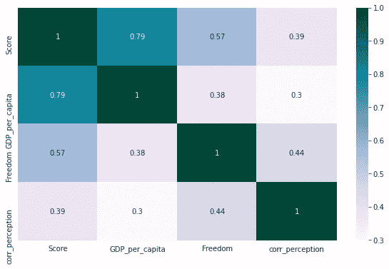

# EDA 关于世界幸福指数报告

> 原文：<https://medium.com/analytics-vidhya/analyzing-world-happiness-index-report-890aedeb138?source=collection_archive---------8----------------------->

# 你的国家是最幸福的国家之一吗？


[混合动力](https://unsplash.com/@artbyhybrid?utm_source=unsplash&utm_medium=referral&utm_content=creditCopyText)在 [Unsplash](https://unsplash.com/s/photos/smile?utm_source=unsplash&utm_medium=referral&utm_content=creditCopyText) 上拍照

《世界幸福报告》是一项具有里程碑意义的全球幸福状况调查，根据 156 个国家的公民对自己的幸福程度进行排名。《世界幸福报告》根据主观幸福感对世界各地的城市进行了排名，并更深入地探讨了社会、城市和自然环境如何共同影响我们的幸福。

与此相关的数据通过[盖洛普世界民意测验](https://www.gallup.com/analytics/318875/global-research.aspx)收集，报告由[可持续发展解决方案网络](https://www.unsdsn.org/)每年发布。我对 2015 年、2017 年和 2019 年的《世界幸福报告》数据集进行了探索性数据分析。每个数据集都有下面的列，我已经对它们进行了简单的描述。

1.  **幸福排名**——某一特定年份任何国家的排名。
2.  **国家** -国家的名称。
3.  **得分** -数据集中所有数字列的幸福得分之和。
4.  **信任度**——量化民众对政府的信任度。
5.  **慷慨度**——根据本国投票者对慷慨度的感受估计的数值。
6.  **社会支持**——评估人们对朋友和家人满意度的指标。
7.  自由——对自由的感知被量化了。
8.  反乌托邦——假设是世界上最悲伤的国家。

加载数据集:

```
*#loading the datasets y1,y2,y3 corresponding to 2017,2015 and 2019*
y1_df=pd.read_csv('/kaggle/input/world-happiness/2017.csv',index_col=1)
y2_df=pd.read_csv('/kaggle/input/world-happiness/2015.csv',index_col=2)
y3_df=pd.read_csv('/kaggle/input/world-happiness/2019.csv',index_col=0)
```

看一下 2015 年的数据集:(其他数据集显示类似形式)


除了国家和地区之外，每一列都有一个浮点数据类型

之后，我方便地重命名了所有 3 个数据集中的列。代码可以在我的 [**Kaggle 笔记本**](https://www.kaggle.com/nalinrajput/world-happiness-report) **查看。**关于最后一个专栏‘反乌托邦残余’，有一点需要解释，内容如下:

反乌托邦是一个假想的国家，由最不快乐的 T2 人组成。它的形成是为了创造一个基准来比较其他国家的幸福分数。反乌托邦残余的计算方法如下(反乌托邦分数+相应国家的残余)。这里，残差是为每个国家生成的值，它表明这 6 个变量是否解释了特定年份每个国家的寿命评估不足或过度。

我们现在开始分析:

# **1。比较 2015 年和 2017 年、2017 年和 2019 年不同国家的幸福得分**。

```
plt.figure(figsize=(10,6))
a=10
plt.hist(y2_df.Score,a,label=’2015',alpha=0.3,color=’red’)
plt.hist(y1_df.Score,a,label=’2017',alpha=0.5,color=’skyblue’)
plt.ylabel(‘No. of countries’,size=13)
plt.legend(loc=’upper right’)
plt.title(“Distribution of Happiness scores across 2015,2017”,size=16)
```


与 2015 年相比，人们在 2017 年是否更幸福？

从堆叠直方图中观察到，2017 年的极值已略微向左移动，我们可以得出结论，生活水平创下了新低。与此同时，与 2015 年相比，2017 年得分在 5-6 分之间的国家数量显著增加，而 2015 年的数字较低。

我们可以有把握地得出结论，中等幸福的国家在 2017 年变得更加幸福，生活水平在极值时有所下降。


人们什么时候相对更快乐？

堆积直方图显示，幸福得分在极值点有所增加，因为在 2019 年似乎向右移动。观察到得分在 4-5 之间的国家数量显著增加。这可能意味着 2019 年人民的生活水平和对生活及政府的满意度相对更高。

我们可以得出结论，与 2017 年相比，人们在 2019 年更加幸福。

因此，生活水平在过去 5 年中有了显著提高。

# **2。将特征与 3 年的幸福分数相关联**

幸福得分与以下因素之间是否存在显著的线性关系:

1.  **信任**
2.  **人均国内生产总值**
3.  **自由**

绘制上述 3 个特征和幸福指数之间的相关热图。

```
#correlation values for 2015 dataset
#creating a copy of the dataset with 4 columns.y2=y2_df.copy()
y2.drop([‘Social support’,’life_expectancy’,’Generosity’,’dystopia_residual’],axis=1,inplace=True)#creating a correlation matrix between numeric columns
c2=y2.corr(method=’pearson’)
plt.figure(figsize=(10,6))
sns.heatmap(c2,annot=True)
```


2015 年


2017 年



对于 2019 年

1.**GDP 和幸福得分有什么关系？**

从热图来看，人均 GDP 与得分之间的相关系数在所有 3 年中都为~ 0.79，这表明公民对 GDP 的满意度与幸福得分之间存在很强的正相关关系。GDP 是一个国家经济增长的跟踪器。经济增长率为正的国家的人们往往更幸福，因为这将带来更高的收入和生活水平。因此，我们的结论是，一个国家的国内生产总值应该是确保满意度的首要任务之一。

2.**自由与幸福得分的关系？**

在所有 3 年中，自由和得分之间的相关系数恰好为 0.57，表明自由的感知和一个国家的幸福得分之间存在适度的正相关关系。概括这种对自由的理解是一项艰巨的任务，因为根据研究，来自世界不同地区的人有不同的感受。然而，它仍然是一个国家幸福指数的重要组成部分。

3.**对腐败的认知如何影响幸福指数？**

在所有三年中，corr_perception(信任)与得分之间的相关系数约为 0.4。这表明对腐败的看法和一个国家的幸福指数之间存在微弱的正相关关系。

在我的 [Kaggle 笔记本](https://www.kaggle.com/nalinrajput/world-happiness-report)中显示了类似的慷慨度和家庭指标与幸福指数的分析。

# 3.分析预期寿命

预期寿命是分析一个国家人口健康状况的关键指标之一。就人类而言，它被定义为人类预期的平均寿命。

```
plt.figure(figsize=(10,6))
a=10
plt.hist(y2_df.life_expectancy,a,label=’2015',alpha=0.3,color=’red’)
plt.hist(y1_df.life_expectancy,a,label=’2017',alpha=0.5,color=’skyblue’)
plt.ylabel(‘No. of countries’,size=13)
plt.legend(loc=’upper right’)
plt.title(“Satisfaction with Life expectancy across 2015,2017”,size=16)
```


让我们看看预期寿命得分最低的国家。

```
#sorting values in 2017 dataset with ascending values of Life expectancy.
y1_df.sort_values(‘life_expectancy’,axis=0,ascending=True)
```


莱索托是所有国家中预期寿命得分最低的。

我们观察到，莱索托在预期寿命方面对幸福得分的贡献最小，得分为 0。这表明该国的预期寿命非常低。莱索托的平均预期寿命为 52 岁。这一统计数字是世界上所有国家中最低的之一。

**这可能是什么原因？**

*   **不受控制的疾病传播**:缺乏适当的卫生设施和 1:20000 的医生与患者比例导致了疾病传播的增加。该国约 20%的人无法获得干净的水源，这也导致了疾病的传播。
*   **不卫生的生活条件**:莱索托的死亡率非常高。这是由于莱索托大多数人口生活条件差，生活极端贫困。无法获得医疗设施使这些人无依无靠。
*   **健康食品来源不足**:农业用地覆盖了莱索托极小的一部分。这造成了食物短缺。因此，营养素和维生素的消费量很低，这导致了该国不幸的低预期寿命。


照片由[梅丽莎·艾斯丘](https://unsplash.com/@melissaaskew?utm_source=unsplash&utm_medium=referral&utm_content=creditCopyText)在 [Unsplash](https://unsplash.com/s/photos/poverty-africa?utm_source=unsplash&utm_medium=referral&utm_content=creditCopyText) 上拍摄

**世界是如何帮助莱索托的？**

由哈里王子创办的非营利组织 Sentebale 一直为被诊断患有各种疾病的儿童提供护理，并收留孤儿。资助该国将使他们能够开放更多的医疗设施，为人民确保更好、更清洁的环境，并开放教育机构。

该国已宣布小学教育免费，这导致入学率大幅上升。由于大多数人付不起学费，中学的学费正在讨论降低。受过更多教育的人会对环境和疾病有更好的了解和认识，并会提高国家的整体精神。

像为人们修建水坝和水井的水利工程这样的组织正在提供清洁的水源。

显然，不仅莱索托，而且世界上每一个不发达国家都需要帮助，以提高生活水平。

**预期寿命得分最高的国家？**

```
y1_df.sort_values(‘life_expectancy’,axis=0,ascending=False)
```


我们在这里观察到新加坡的预期寿命得分最高。这表明人们对自己国家的预期寿命感到满意。虽然长寿不一定会带来更多的幸福，但大多数人都希望活得更长。在这里，我们来看看延长人类寿命的因素。

*   适当的医疗保健设施:政府已投入大量资金创建高质量的医疗保健设施，提供不受限制的卫生设施。此外，健康相关技术的进步也使人们受益。
*   更好的生活条件:保持卫生，减少污染和获得营养食品，使公民身体健康。

最后但并非最不重要的一点是，政府将健康问题视为国家的重中之重，并一直在促进卫生部门的研究和发展。这些是导致人们寿命延长的一些原因。

# 4.比较不同地区的幸福指数

```
#creating a new series consisting of mean of happiness scores taken across different regions as specified.
#Converting this series into a dataframe
region=y2_df.groupby([‘Region’]).Score.mean()
region_df=pd.DataFrame(data=region)
reg=region_df.sort_values(by=’Score’,ascending=False,axis=0)plt.figure(figsize=(10,7))
plt.title('Happiness Scores across different regions')
sns.barplot(x='Score',y=reg.index,data=reg,palette='mako')
```


代码片段中创建的“reg”数据帧


条形图显示，北美、大洋洲和西欧的国家平均幸福指数最高，而撒哈拉以南非洲和亚洲的国家幸福指数最低。

# 5.不同地区人均国内生产总值

```
#creating a new dataset from y2_df comprising of means of gdp_per_Capita score per region.
gdpc=y2_df.groupby([‘Region’])[‘Economy (GDP per Capita)’].mean()
gdpc_df=pd.DataFrame(data=gdpc)
gdp=gdpc_df.sort_values(by=’Economy (GDP per Capita)’,ascending=False,axis=0)plt.figure(figsize=(10,7))
plt.title('Satisfaction with gdp in different regions')
sns.barplot(x='Economy (GDP per Capita)',y=gdp.index,data=gdp,palette='rocket')
```


“国内生产总值”数据框架


据观察，北美对国家经济的满意度最高，而撒哈拉以南非洲的满意度最低。要理解为什么不同地区的满意度如此不同，请查看本文。

# **6。将不同地区的信任可视化**

```
trust=y2_df.groupby(['Region'])['Trust (Government Corruption)'].mean()
trust_df=pd.DataFrame(data=trust)
tru=trust_df.sort_values(by='Trust (Government Corruption)',ascending=False,axis=0)
```


“真”数据帧


# 7.将不同地区的自由形象化

```
freedom=y2_df.groupby([‘Region’])[‘Freedom’].mean()
freedom_df=pd.DataFrame(data=freedom)
free=freedom_df.sort_values(by=’Freedom’,ascending=False,axis=0) plt.figure(figsize=(10,7))
plt.title(‘Freedom score across different regions’)
sns.barplot(x=’Freedom’,y=free.index,data=free,palette=’rocket_r’)
```


“自由”数据框架


自由可以被认为是公民在不违反法律的情况下行使赋予他们的基本权利的自由程度，无论他们是否意识到当局对他们的任何这种压迫。

我们观察到大洋洲的自由度最高，东欧国家的平均自由度最低。

快乐是每个人生活中非常重要的品质。它给那些需要它的人带来希望，并确保维持大众之间的和谐与爱。不仅仅是政府的责任，我们作为公民也有责任为我们国家的幸福因素做出贡献。

如果这些可视化和解释激起了你对这些快乐报告的兴趣，你可以查看我在我的 [**Kaggle 笔记本**](https://www.kaggle.com/nalinrajput/world-happiness-report) **中写的代码的进一步情节。**

数据集可以从我的 g [ithub 库](https://github.com/dedpool-glitch)中获得。

我希望你喜欢这篇文章！