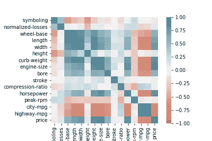

# 分析您的数据

> 原文：<https://medium.com/analytics-vidhya/analyzing-your-data-e71489fea111?source=collection_archive---------23----------------------->

分析你的数据可以被认为是解决任何机器学习问题的第一步。我们将使用一个数据集，通过各种可用的功能来预测汽车的成本。让我们导入数据集。

```
import pandas as pd
df= pd.read_csv(‘https://raw.githubusercontent.com/drazenz/heatmap/master/autos.clean.csv')
df.head()
```

下面可以看到前几行:


**方框图:**

```
import seaborn as sns 
sns.boxplot(x=”drive-wheels”,y=”price”,data=df)
```


箱形图给我们的信息是，每个箱形图中从 x 轴开始的五条线分别代表最小值、25%、50%、75%和最大值。最低线是最低价格，最高线代表最高价格。在第一个方框中，17000 是中间价格，25%的汽车价格低于 13000，75%的汽车价格低于 22000。最高价 36000，最低价 7000。

**散点图:**

散点图基本上表示 2D 平面中两个特征之间的关系。

```
import matplotlib.pyplot as plt
x=df["engine-size"]
y=df["price"]
plt.scatter(x,y)
plt.xlabel("engine-size")
plt.ylabel("price")
plt.title("Scatter plot")
```


**相关性:**
**皮尔逊系数** —根据**相关系数**和 **p 值**检查两个特征之间的相关性。
相关系数如果其值几乎等于 1，则具有+ve 关系，如果其值几乎等于-1，则具有-ve 关系，如果其值几乎等于 0，则没有关系。
p 值小于 0.001 表示强确定性，小于 0.05 表示中等确定性，小于 0.1 表示弱确定性，大于 0.1 表示不确定性。
相关系数接近 1 或-1，p 值小于 0.001 被认为是强相关。

```
import seaborn as sns
ax = sns.heatmap(df.corr(), vmin=-1, vmax=1, center=0, cmap=sns.diverging_palette(20, 220, n=200), square=True)
```



上面给出了每个特征与每个特征的相关系数值。颜色越深的方框越相关，因此必须作为一个特征使用。

**分布图:**

这基本上是用来检查我们的结果，并一起可视化训练输出和测试输出，以便更好地理解。
x 轴有 y/yhat 输出值，y 轴有频率

```
import seaborn as sns
from sklearn.linear_model import LinearRegression
lm = LinearRegression()
X = df[[“horsepower”, “curb-weight”, “engine-size”, “highway-mpg”]]
Y = df[“price”]
lm.fit(X, Y)
Yhat = lm.predict(X)
axl = sns.distplot(Y, hist=False, color=”r”, label=”Actual Value”)
sns.distplot(Yhat, hist=False, color=”b”, label=”Fitted Values”, ax=axl)
```


我们使用线性回归来拟合我们的训练集。从下图中，我们可以清楚地看到价格是如何变化的。此外，我们可以知道在什么样的价格下，训练前后的频率更高或更低。

谢了。

你可以通过[邮件](http://ashishgusain12345@gmail.com)、 [linkedIn](https://www.linkedin.com/in/ashish-gusain-257b841a2/) 、 [github](https://github.com/AshishGusain17) 联系我。