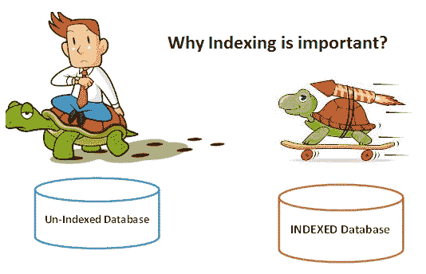
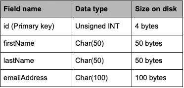
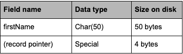
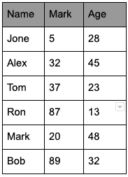
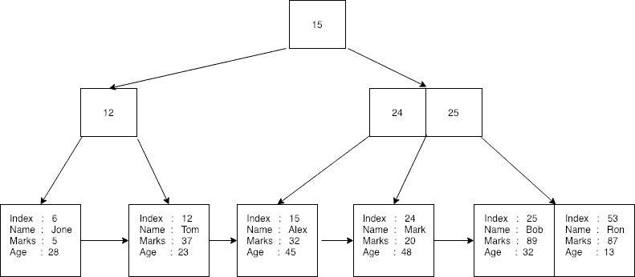
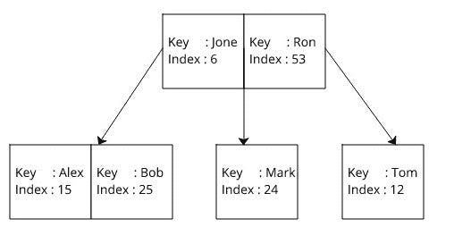

# 剖析:关系数据库中的索引

> 原文：<https://medium.com/analytics-vidhya/anatomy-index-in-relational-db-a1425f2d8a02?source=collection_archive---------15----------------------->

根据维基百科，一个**数据库**是一个 ) 数据的有组织的集合，通常通过计算机系统以电子方式存储和访问。

DBMS 是一个复杂的软件或数据库，处理大量的数据，有时数量级高达数十亿。一旦我们将这些数据存储在任何数据库管理系统中，如 Oracle、MySQL、PostgreSQL 等。它有责任为我们提供获取数据的便捷方法。随着我们的数据规模的增长，我们可以理解这种责任变得越来越混乱，但数据库仍然能够熟练地处理它。在本文中，我将尝试解释如何处理这种复杂性的方法之一。

# ***数据是如何存储的？***

但首先，让我们看看数据是如何存储在数据库中的，因为我们许多人可能已经知道数据最终存储在磁盘中(在文件中)，然而，数据库隐藏了许多内部功能。简而言之，我们可以说每行数据被视为一条记录，这些记录被进一步放入页面，然后由数据库管理。这些页面然后被存储在文件或文件系统中，页面有助于减少获取某些数据所需的 I/O 操作。这些页面可以像操作系统页面一样被缓存，以进一步减少 I/O 负载。如果你想彻底了解数据存储，请阅读这篇[文章](https://www.red-gate.com/simple-talk/sql/database-administration/sql-server-storage-internals-101/)。

现在我们对数据存储有了一个非常简单的了解，我们知道数据最终是以页面的形式存储在文件系统中的。由于从这样的系统中获取数据需要执行 I/O 操作，并且随着数据量的增加，这些操作的成本会变得非常高，因此我们需要一种更好的机制来获取数据。这个更好的机制是索引。

# **指标的重要性**

假设不存在索引，并且有一个包含数百万行学生数据的表，我们需要找到注册编号为 1001 的学生，在这种情况下，数据库必须扫描整个数据集，即记录页，以找到所需的数据。

然而，如果我们将我们的算法 101 投入使用，我们知道如果该数据集被排序，我们可以使用类似二分搜索法的机制来搜索所需的数据，这可以在对数标度中执行，即，O(logN)与具有无序数据集的 O(N)相反。

这就是索引对我们的帮助，它以排序的方式存储指定的数据，然后可以使用这些数据来有效地执行读取操作。

索引是对多个字段中的大量记录进行排序的一种方式。在表中的字段上创建索引会创建另一个数据结构，它保存字段值和指向记录的指针。然后对这个索引结构进行排序，允许对它执行二进制搜索。

# **例子**

感谢[这个](https://stackoverflow.com/questions/1108/how-does-database-indexing-work)来自我们心爱的 Stack Overflow 的回答，我们可以用一个例子来阐述这个问题，

让我们概述一个示例数据库表模式；

**注意** : char 被用来代替 varchar，以保证磁盘值的准确大小。这个示例数据库包含五百万行，并且没有索引。现在将分析几个查询的性能。其中一个查询使用了 *id* (一个排序的关键字字段)，另一个查询使用了*名字*(一个非关键字的未排序字段)。

> ***例 1*** — *排序与未排序字段*

假设我们的样本数据库有 r = 5，000，000 条固定大小的记录，记录长度为 R = 204 字节，它们存储在使用 MyISAM 引擎的表中，该引擎使用默认的块大小 B = 1，024 字节。该表的阻塞因子将是 bfr = (B/R) = 1024/204 =每个磁盘块 5 条记录。保存该表所需的总块数为 N = (r/bfr) = 5000000/5 = 1，000，000 个块。

如果 id 字段是一个关键字段，对 id 字段进行线性搜索平均需要 N/2 = 500，000 次块访问才能找到一个值。但是因为 id 字段也被排序，所以可以进行二分搜索法，平均需要 log2 1000000 = 19.93 = 20 次块访问。我们可以立即看到这是一个巨大的进步。

现在, *firstName* 字段既不是排序字段也不是关键字段，因此二分搜索法是不可能的，值也不是唯一的，因此该表将需要搜索到最后，以获得确切的 N = 1，000，000 次块访问。索引旨在纠正这种情况。

假设索引记录只包含索引字段和指向原始记录的指针，那么它必然会小于它所指向的多字段记录。因此索引本身比原始表需要更少的磁盘块，因此需要更少的块访问来迭代。*名字*字段上的索引模式概述如下；

**注意**:MySQL 中的指针长度根据表的大小有 2、3、4 或 5 个字节。

> ***例 2*** — *分度*

假设我们的示例数据库有 r = 5，000，000 条记录，索引记录长度为 R = 54 字节，使用默认的块大小 B = 1，024 字节。索引的阻塞因子是 bfr = (B/R) = 1024/54 =每个磁盘块 18 条记录。保存索引所需的总块数为 N = (r/bfr) = 5000000/18 = 277，778 块。

现在，使用 *firstName* 字段的搜索可以利用索引来提高性能。这使得索引的二分搜索法平均为 log2 277778 = 18.08 = 19 次块访问。为了找到实际记录的地址，这需要进一步的块访问来读取，使总数达到 19 + 1 = 20 个块访问，这与在非索引表中找到*名字*匹配所需的 1，000，000 个块访问相差甚远。

# **利弊指数**

我们已经看到了索引在数据库中的优势，然而，如果我们开始滥用它，任何好处都可能变成变相的祸害。

不用说，数据库上的索引应该小心使用。

使用索引最明显的缺点是，这些索引需要已经超载的磁盘上的额外空间，因此过多的索引会导致文件系统大小限制引起的问题。

另一个不利因素是写时间受到索引增加的影响。向没有索引的表中添加新行很简单。数据库在表中找到下一个可用空间来添加新条目并添加它，就这样。但是，当向具有一个或多个索引的表中添加新行时，数据库会向表中添加一个新条目，然后它必须向该表上的每个索引中添加一个新条目，确保将条目插入索引中的正确位置，以确保数据得到正确排序。这种性能下降适用于表的创建、更新和删除。因此，应该避免在表上添加不必要的索引，并且应该删除不再使用的索引。

由于索引仅用于加快在记录中搜索匹配字段的速度，因此，当执行插入或删除操作时，仅用于输出的索引字段只会浪费磁盘空间和处理时间，因此应该避免。考虑到二分搜索法的性质，数据的基数或唯一性也很重要。对基数为 2 的字段进行索引会将数据分成两半，而基数为 1，000 的字段会返回大约 1，000 条记录。基数如此之低，效率就降低到线性排序

# **用于索引的数据结构类型。**

索引中最常用的数据结构是 B+树或 B-树的某种变体。假设你已经知道了 B 树。下面是一篇文章的摘录，这篇文章将 B 树描述为数据库索引。

当 B 树用于数据库索引时，这个数据结构变得有点复杂，因为它不仅有一个键，而且还有一个与键相关联的值。该值是对实际数据记录的引用。键和值一起被称为有效载荷。

假设下面的三列表需要存储在数据库中。

首先，数据库为每个给定的记录创建一个唯一的随机索引(或主键),并将相关的行转换成一个字节流。然后，它存储每个键，并在 B+树上记录字节流。这里，随机索引用作索引的键。密钥和记录字节流统称为有效载荷。产生的 B+树可以表示如下。

*数据库页面上的 B+树*

在这里，您可以看到所有记录都存储在 B+树的叶节点中，索引用作创建 B+树的键。没有记录存储在非叶节点上。每个叶节点都有一个对树中下一个记录的引用。数据库可以通过使用索引来执行二分搜索法，或者通过仅遍历叶节点来搜索每个元素来执行顺序搜索。

如果没有使用索引，那么数据库会读取这些记录中的每一条来查找给定的记录。启用索引时，数据库为表中的每一列创建三个 B 树，如下所示。这里的键是用于索引的 B 树键。索引是对实际数据记录的引用。

当首先使用索引时，数据库搜索对应于 B 树的给定关键字，并在 O(log(n))时间内获得索引。然后，它在 O(log(n))时间内使用已经找到的索引在 B+树中执行另一次搜索，并获得记录。

在上面的例子中，我们已经看到 B 树被用于字符串索引，但是，理论上，任何面向搜索的数据结构都可以用于存储索引，内存数据库通常使用更常见的内存驻留数据结构，如二叉树、try 和哈希表用于数据库索引。在 MySQL 之类的数据库引擎中，这些表也与 ENGINE=MEMORY 表一起使用。

数据库引擎通常使用某种类型的 B 树作为存储在持久性存储中的表的默认数据结构。持久哈希表有时是可用的，但比较少见。

一些数据库引擎支持倒排索引结构。原则上，这些可以存储为 B 树，但通常存储在某种位图索引结构中。

关于数据结构很重要的一点是有些支持有序操作(>，

Hash tables and most bitmap index implementations only support equality checks, while most tree-style structures support ordered operations.

> **引用:**
> 
> [数据库索引是如何工作的？](https://stackoverflow.com/questions/1108/how-does-database-indexing-work)
> 
> [索引是如何工作的| Chartio 教程](https://chartio.com/learn/databases/how-does-indexing-work/)
> 
> [关系数据库的数据库索引基础](/@jimmyfarillo/the-basics-of-database-indexes-for-relational-databases-bfc634d6bb37)
> 
> [SQL 索引背后的数据结构是什么？](https://www.quora.com/What-data-structure-is-behind-the-SQL-indexes)
> 
> [数据库 B 树索引的工作原理](https://dzone.com/articles/database-btree-indexing-in-sqlite)
> 
> [数据库内部的勇气和荣耀:B+树](https://dzone.com/articles/the-guts-n-glory-of-database-internals-btree?fromrel=true)
> 
> [SQL Server 存储内部 101 —简单谈谈](https://www.red-gate.com/simple-talk/sql/database-administration/sql-server-storage-internals-101/)