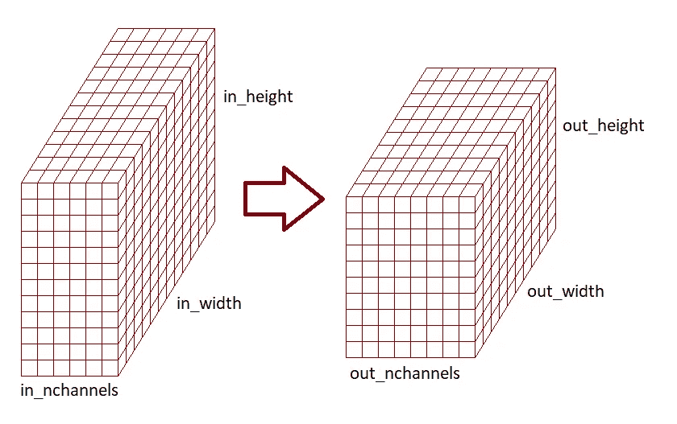
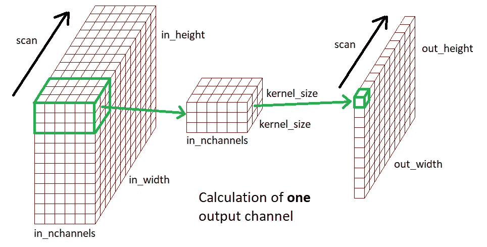

# 卷积神经网络层的剖析

> 原文：<https://medium.com/analytics-vidhya/anatomy-of-a-convolutional-neural-network-layer-d5a5e46f9b58?source=collection_archive---------15----------------------->

我写这些是因为我对 CNN 的解释感到有点困惑。我在 2D 看到了一些卷积如何工作的很好的演示——例如，[http://setosa.io/ev/image-kernels/](http://setosa.io/ev/image-kernels/),但没有看到卷积层中所有权重如何聚集在一起计算结果的简明描述。所以，这里有一个简短的总结:

卷积层的总体目的是将一个秩为 3 的张量(三维矩阵)映射到另一个张量。这三个维度是通道的数量、高度和宽度。首先，我们通常有一个 3 通道(RGB)的输入图像。当我们浏览 CNN 时，频道的数量通常会上升，而高度/宽度会下降(尽管这取决于 NN 架构师)。因此，一个卷积层完成的转换的总体情况是:

其中 **in_nchannels** 由前一层决定，而 **out_nchannels** 可以由 NN 设计者自由选择。

这种转变是怎么做到的？对于每个输出通道，我们有一个权重核，它是一个大小为 3 的秩张量
**in _ nchannels*****kernel _ size*****kernel _ size** 核的大小也由 NN 设计者选择，通常第一层使用 5 或 7，其他层使用 3。在输入张量上扫描核以给出秩 2 输出；对于扫描中的每个位置，我们取内核权重与相应输入片段中的激活的点积:

然后，我们堆叠所有输出通道，以给出秩为 3 的结果；这就是我们如何得到上面第一幅图中的输出。由于我们每个输出通道都需要一个内核，因此该层中所有内核的权重总数为:
**out _ n channels*****in _ n channels*****kernel _ size*****kernel _ size** 示例:Resnet34 的第一层有 3 个输入通道，64 个输出通道，内核大小为 7。层中的总权重数为:
64 * 3 * 7 * 7 = 9408

步幅:扫描从左上方开始，然后以小增量重复改变位置。这个增量称为步幅。跨距的典型值为 1(保持图像高度/宽度大致不变)或 2(将图像高度/宽度大致减半)。

填充:如果没有填充，卷积层将通过一个或几个像素的边界来减小图像大小。例如，步长为 1 的卷积会将高度/宽度减少 kernel_size-1。可以使用填充来避免这种情况。我将把细节作为一个练习，但是作为两个特殊的例子，如果步幅是 1，填充(kernel_size-1)/2 将保持相同的高度/宽度，而如果步幅是 2，它将高度/宽度减半。例如:
kernel_size 3，stride 1，padding 1 —保持相同的高度/宽度
kernel_size 3，stride 2，padding 1 —将高度/宽度减半
kernel_size 7，stride 2，padding 3 —将高度/宽度减半

注意:上面的描述有些简化，因为我们实际上是一次处理一小批图像。这给输入和输出增加了一个额外的维度(小批量)。您可以将卷积层视为一个循环，它对小批量中的每个图像进行上述处理，然后沿着额外的维度堆叠输出。