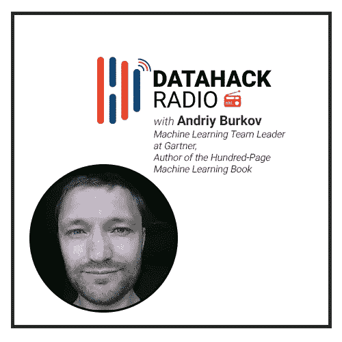
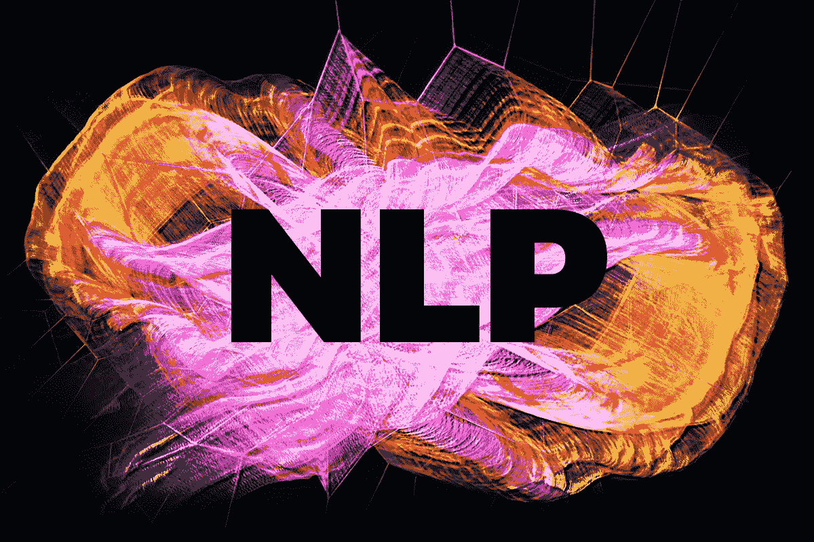
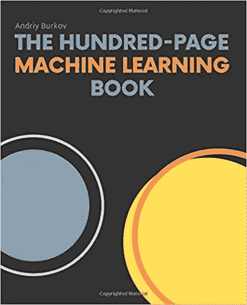

# 安德烈·布尔科夫撰写 100 页机器学习终极书籍的旅程

> 原文：<https://medium.com/analytics-vidhya/andriy-burkovs-journey-to-writing-the-ultimate-100-page-machine-learning-book-69ccd05365de?source=collection_archive---------0----------------------->

# 介绍

你有没有看过大部分关于机器学习的[推荐书籍](https://www.analyticsvidhya.com/blog/2018/10/read-books-for-beginners-machine-learning-artificial-intelligence/)却被它们的厚度和阅读这些书籍需要付出的努力压垮？

如果你有这种感觉，不要担心！你并不孤单。许多人面临这种情况，但对此却无能为力。不是[安德烈·布尔科夫](https://www.linkedin.com/in/andriyburkov/)！安德烈看到了这一点，认为理想的初学者机器学习书应该写在 100 页以内。

更重要的是——他写了这本书并出版了。他最近推出的'['百页机器学习书籍](https://themlbook.com)'已经迅速登上畅销书排行榜，并在亚马逊网站(在“机器学习”类别下)排名第一。这本书甚至得到了伟大的彼得·诺威格的认可！

我们很高兴能在 DataHack 电台第 18 集主持他的节目。库纳尔和安德烈就几个话题进行了丰富的讨论，包括:

*   安德烈对机器学习和人工智能的尝试
*   行业经验，包括 Gartner 的 NLP 项目
*   他写这本书背后的想法
*   他在试图将话题浓缩成这种简洁的形式时所面临的挑战
*   给有抱负的数据科学家的建议

所有 DataHack 电台剧集都可以在以下播客平台上获得。立即订阅！

*   [**SoundCloud**](https://soundcloud.com/datahack-radio)
*   [**分析 Vidhya**](https://www.analyticsvidhya.com/blog/category/podcast/?utm_source=blog&utm_medium=datahack-radio-ines-montani-matthew-honnibal-brains-behind-spacy)
*   [**iTunes**](https://itunes.apple.com/in/podcast/datahack-radio/id1397786677?mt=2)
*   [**谷歌播客**](https://www.google.com/podcasts?feed=aHR0cDovL2ZlZWRzLnNvdW5kY2xvdWQuY29tL3VzZXJzL3NvdW5kY2xvdWQ6dXNlcnM6NDU5MzM1NzYwL3NvdW5kcy5yc3M%3D)

# 安德烈·布尔科夫的背景&涉足人工智能

安德烈的职业生涯始于千年之交的乌克兰。他在计算机工程和网络专业毕业时创建了自己的在线创业公司。但是在做了 3 年之后，网络泡沫破裂了，他的投资者决定退出。

安德烈不会放弃他的梦想。他创建另一家在线创业公司的热情继续熊熊燃烧。鉴于当时的经济形势，这在乌克兰是不可能的。吸引另一个投资者被证明是不可能的。

安德烈的第一个想法是和家人一起搬到欧洲。他们考虑过法国，但最终选定了加拿大的魁北克。主要原因是移民目的，魁北克似乎是一个很好的选择，因为它有一个法国居住社区。

一到加拿大，安德烈就花了一段时间找工作，最后决定攻读计算机科学和人工智能硕士学位。他将此转化为博士学位，选择多智能体系统作为他的主要课题。他的论文——利用重复博弈解决复杂的多主体决策问题。

想看看 AI 领域在最近十年有多大变化？安德烈告诉我们一件令人大开眼界的轶事:

> *“我的一个前同事，当他在魁北克市(比我早几年)完成博士学位时，找不到人工智能方面的工作。这是一个充满异国情调的领域。”*

技术改变我们生活的速度之快令人震惊。

# 博士后获得宝贵的行业经验

一旦安德烈完成他的博士学位，两条路打开了——研究或教学。前者比成为全职教授更吸引他。因此，他决定尝试在日本跨国公司富士通担任行业角色。他和藤津一起工作了 2 年才继续前进。

从那以后，安德烈转到了 WANTED Technologies，这是一个面向公司的招聘门户网站。他的职责主要是将网上招聘信息转化成结构化的知识。在他的职业生涯中起了很大作用的一次极好的经历。

随后，他跳槽到一家被收购过两次的公司，第二次是被 Gartner 收购。用安德烈自己的话说:

> *“我挺过了两次收购！”*

有一种可以理解的疑虑——为这样一个庞大的组织工作会扼杀创造力吗？但是 Gartner 的工作文化很快消除了所有的疑虑。

安德烈领导着一个团队，致力于研发一种名为[天赋神经元](https://www.gartner.com/en/human-resources/talentneuron)的产品。这是一个“结合大数据和统计见解，为任何行业或职能提供全球人才、位置和竞争情报”的门户网站。

# 安德烈的兴趣和在 NLP 的工作

快速浏览一下安德烈的 LinkedIn 个人资料，我们就知道他是一名自然语言处理专家。这是我们 Analytics Vidhya 非常热衷的话题。所以在 NLP 上挑选安德烈的大脑感觉很自然！

他的团队在 Gartner 的角色更倾向于应用文本分析，而不是核心计算语言学。我提到了团队正在进行(或已经进行)的一些有趣的任务:

*   解析自由格式的简历，以检测和提取候选人姓名、雇主、技能、证书、工作经历
*   解析职位描述以检测和提取职位名称、工资、雇主姓名，分配标准职业代码
*   自动化嘈杂和多语言数据标准化、清理和重复数据消除
*   新型数据检测
*   语言检测/按语言进行文本分割
*   序列标签(查询、地址、工资)

这是这一集最吸引人的部分之一，尤其是对于 NLP 爱好者来说。安德烈用几个例子讲述了语言建模的复杂性和细微差别。必听！

# “百页机器学习书”背后的理念

写这本书的想法是怎么产生的？这绝对不是通常的路线！安德烈最初甚至没有想过这个问题。

安德烈多年来在 LinkedIn 上积累了大量粉丝。他每天都会发布一些与机器学习相关的精彩内容(你绝对应该关注他)。

> *“我家里有一大堆机器学习和人工智能的书。但是我从来没有完成过任何一个。我问自己为什么？”*

一个很大的原因是我们变得越来越忙。我们几乎没有时间读完一本书，尤其是一本超过 500 页的书。他在 LinkedIn 的一篇帖子中表达了自己的想法，称如果他写一本关于机器学习的书，篇幅不会超过 100 页。

尽管他并没有打算真的写它！这个帖子像病毒一样传播开来——数百个赞，大量评论。大多数意见可分为两类:

*   反对者:不可能把这么多知识浓缩到 100 页里
*   发烧友:安德烈，你可以写书了。去做吧！

> *“我花了一个星期来考虑这件事。我告诉自己——“我会试着写几章。如果进展顺利，我们拭目以待。如果不顺利，我就不干了。" "*

前三章是在一个周末写的，反响如何？非常积极。虽然页数超过一百页，但安德烈仍然设法将一个数据科学家应该拥有的所有基本知识和基本知识打包在一起。巨大的成就！

这本书最突出的一点是任何人都可以在线阅读。如果你喜欢它或者发现它有用，你应该买平装本或者精装本。我真的很欣赏安德烈这样做背后的思考过程。

# 写书时的挑战和权衡

鉴于这本书的简明本质，省略某些概念是不可避免的。但是是哪些呢？又到了什么程度？这些都是安德烈在这一节中提出的关键问题。

正如我们之前讨论的，这个想法是要包括所有的基础知识，比如核心机器学习算法背后的数学。因此，像强化学习和反向传播这样的主题要么没有被包括在内，要么只是一笔带过。在我看来，这是一个公平的交易。

# 给进入数据科学领域的人的建议(有抱负的数据科学专业人士)

以下是安德烈谈到的要点的简要总结:

*   学习计算机科学的基础知识
*   学会成为一名优秀的程序员
*   找到一个有趣的问题，努力去解决它(有很多平台可以找到数据集)

# 结束注释

仅仅是听安德烈谈论他的书就让我意识到这段旅程有多艰难。我个人读过这本书，怎么推荐都不为过。这是一颗宝石，将帮助成千上万有抱负的数据科学家进入这一领域。

你读过这本书吗？请在下面的评论区告诉我！

*原载于 2019 年 2 月 20 日*[*【https://www.analyticsvidhya.com】*](https://www.analyticsvidhya.com/blog/2019/02/datahack-radio-hundred-page-machine-learning-book-andriy-burkov/)*。*