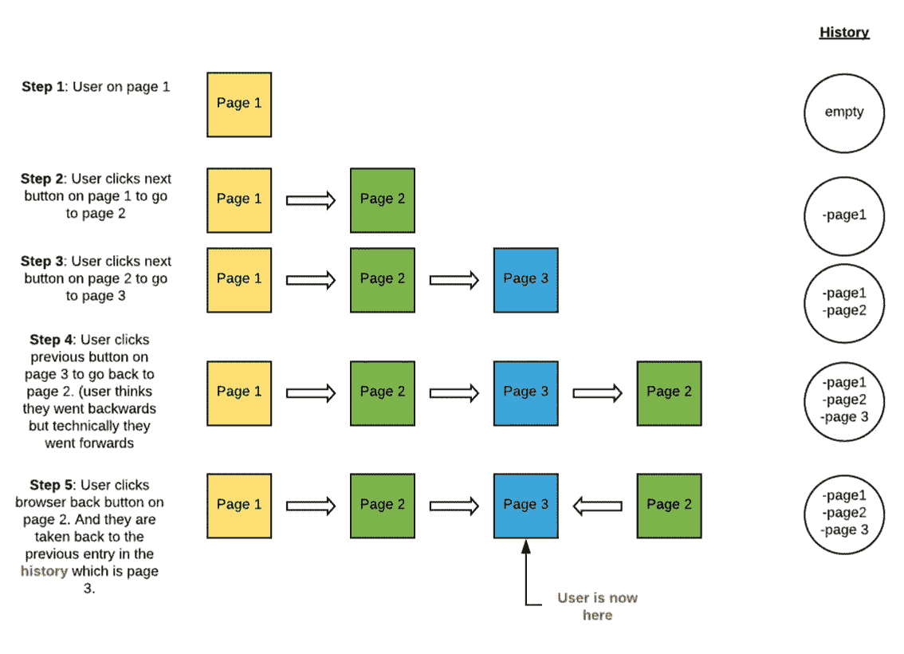

# 角度路由:命令式 vs PopState

> 原文：<https://medium.com/analytics-vidhya/angular-routing-imperative-vs-popstate-7d254b495c54?source=collection_archive---------6----------------------->


页面之间的导航是任何 web 应用程序的重要组成部分。学习 Angular 时，你会意识到路由(导航)是 Angular 的基本概念之一。

**注**:你用过[**AOP-routing**](https://www.npmjs.com/package/aop-routing)**NPM 库吗？它充分利用了本文中解释的概念，并为角度导航系统提供了一些功能，比如装饰路由和在运行时动态修改角度路由表。你也可以在这里阅读关于 aop 路由[的文章。](/analytics-vidhya/the-aop-routing-library-for-angular-9ada05f1741d)**

**任何使用过 Angular 的开发人员至少应该对路由的概念以及路由器对象如何在 Angular 单页应用程序(SPA)中工作有一个较高的理解。**

**首先，让我们从 Angular 中的“路由”或“路由器对象”的简单定义开始:**

**直接从 Angular 文档中提取定义—
[**Angular 路由器支持在用户执行应用任务时从一个视图导航到下一个视图**](https://angular.io/guide/router)**

**除此之外，Angular 还支持通过“Router”
对象的公开方法在单页面应用程序(SPA)中进行路由，例如**

```
router.navigate(['page to navigate to']) 
```

**这将允许您从一个组件导航到另一个组件。路由器对象使用“router outlet”指令作为占位符，在 html 中呈现组件的视图。**

```
<router-outlet></router-outlet>
```

## **简单吧？**

**从表面的角度路由似乎很简单，易于使用。但你知道吗，除了“看起来”之外，角度路由还有更多。**

**在这篇文章中，我将触及角度路由的一个领域，一些(如果不是大多数的话)开发人员要么没有意识到，要么忽略了，这有时会导致很多令人头痛的问题！**

# **命令式 vs 流行状态**

**在角度应用中有两种不同类型的导航。命令式和 Popstate 导航。理解这两者之间的区别，以及这两种类型的导航是如何在应用程序中防止意外的路由行为或混乱(如下图所示)是非常必要的。**

****

## **那么这两者的区别是什么呢？**

****命令式导航**:是通过使用路由器对象的公开方法触发的任何导航，例如**

```
router.navigate() or router.navigateByUrl()
```

**上述方法通常绑定到 html 按钮、链接或其他元素，将导航到指定页面，路由器将在浏览器历史记录中记录活动。**

****Popstate 导航**:是由浏览器特定动作触发的任何导航，并不是 Angular 独有的。这是一个标准的浏览器导航。这种导航类型可以通过执行以下操作来触发；**

1.  **单击浏览器的后退和前进按钮**
2.  **使用 [**window.history**](https://developer.mozilla.org/en-US/docs/Web/API/Window/history) 对象的 **go()** 和 **back()** 方法**
3.  **使用 Angular 的 [**位置服务**](https://angular.io/api/common/Location#forward) 方法如**后退()**或**前进()****

**我之前提到过，不理解这两者之间的区别会导致混淆。这里有一个例子。**

**这是一个运行在 stack-blitz 上的简单的 angular 应用程序。它包含几个带有“下一页”和“上一页”按钮的页面。
要使其正常工作，请务必点击底部的“**预览**”选项卡，打开正在运行的应用程序，复制 URL 并将其粘贴到新的选项卡或窗口中..**

**尝试以下步骤:**

1.  **点击每页上的“下一页”按钮，直到进入第 3 页。**
2.  **点击第 3 页的**上一页按钮**返回第 2 页。**
3.  **现在在第 2 页，再次点击**上一页按钮**返回第 1 页。**
4.  **到目前为止，导航流程一切正常，对吗？。**
5.  **再次重新加载应用程序，从头开始([https://angular-imperative.stackblitz.io/](https://angular-imperative.stackblitz.io/))**
6.  **再次执行步骤 1 和 2。**
7.  **现在在第 2 页点击**浏览器的后退按钮**。**

**你现在回到了第 3 页。导航流程已更改。如果你更进一步地使用下一个和上一个按钮以及浏览器的后退和前进按钮，你会注意到导航变得更加混乱。**

## **为什么会这样？**

**这很简单，注意我使用的上一个按钮的每个方法**

```
router.navigate()
```

**将用户导航到上一页。但是有一个条件！router.navigate()将始终**在历史中向前导航！****

**router.navigate()将总是向前导航，并在浏览器历史记录中添加一个新条目。因此，即使您有一个后退按钮，并且您正在使用 router.navigate()返回到上一页，**您也不是在历史**中向后遍历，您实际上正在做的是前进到上一页。用户可能认为他们已经倒退了，但实际上他们已经前进了。**

## **那么为什么使用浏览器后退按钮会改变流程呢？**

**浏览器的后退按钮(与使用 router.navigate 返回不同)实际上将用户导航到历史上的上一页。因此，如果开发者不采取额外的预防措施，如果用户混合这两种导航，将会给用户带来很多困惑。下面是之前的逐步操作图。**

****

**现在尝试运行下面的应用程序。记得再次点击底部的**预览**标签，打开正在运行的应用，复制网址并粘贴到一个新的标签或窗口..**

**这次为了回到上一页，我使用了位置服务“back”方法，其行为与使用 history.back()相同。**

**再次执行以下操作..**

1.  **点击每页上的“下一页”按钮，直到进入第 3 页。**
2.  **点击第 3 页的**上一页按钮**返回第 2 页。**
3.  **现在在第 2 页点击**浏览器的后退按钮。****

**注意这次你被带到了第一页？这是用户所期望的。还要注意一个细微的区别，当你点击每一页上的“上一页”按钮时，浏览器的“前进”按钮被激活。这是因为下面两种方法**

```
location.back() or history.back()
```

**使用 popstate 导航，其行为就像用户单击了浏览器的后退按钮一样。我强烈建议在导航用户返回到上一页时使用上述方法，而不是 router.navigate()。因为这将使命令式导航和 popstate 导航同步。**

## **但是等等！**

**使用 location.back()或 history.back()时需要注意一些事情**

1.  **因为这两种方法都启用了前进按钮，所以用户可以单击前进按钮返回(前进)到他们来自的页面。这意味着，如果页面 B 要求在点击页面 A 的下一步按钮时执行一个逻辑，那么当用户点击前进浏览器按钮转到页面 B 时，该逻辑将不会被执行。
    对此的一个解决方案是，不从页面 A 的下一步按钮执行页面 B 所依赖的任何逻辑。而是在页面 B 的 [ngOnInit](https://angular.io/api/core/OnInit) 上执行该逻辑，或者使用[解析器](https://angular.io/api/router/Resolve)。**
2.  **如果您正在订阅路由器事件，并且如果您将对象结果显示到控制台，您会注意到对于 location.back()和 history.back()，路由对象 navigationTrigger 属性将是 **popstate** 。(您可以通过在运行上一节中的“impressive-pop state”应用程序时打开开发人员工具来验证这一点。**

**感谢您的阅读。我希望您现在已经了解了命令式和 popstate 之间的导航。**

**如果你喜欢这篇文章，一定要点击拍手按钮，也检查我下面的其他文章！**

*   **[**地图 vs WeakMap**](/p/b324d20cc277)**
*   **[**Aop-路由库为角状**](/analytics-vidhya/the-aop-routing-library-for-angular-9ada05f1741d)**
*   ****[**动态添加和移除角形**](/javascript-in-plain-english/dynamically-add-and-remove-canactivate-route-guards-in-angular-e7820ab4e061) 中的可激活守卫****
*   ****[**简单地说异步编程(理论)**](https://ericsarpong.medium.com/asynchronous-programming-in-a-nutshell-theory-d5fd07cf3b22)****
*   ****[**什么是类型脚本元组**](/@ericsarpong/what-is-a-typescript-tuple-814a016f61fd)****
*   ****[**深入探究 Javascript 图**](/@ericsarpong/deep-dive-into-javascript-map-object-24c012e0b3fe)****