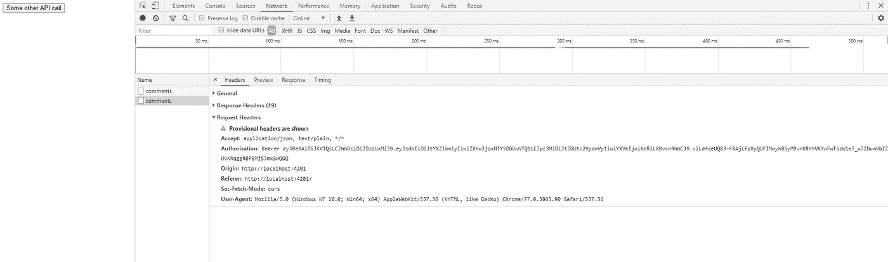

# HTTP 拦截器

> 原文：<https://medium.com/analytics-vidhya/angular8-http-interceptors-e8dcab7339cb?source=collection_archive---------8----------------------->

在这篇文章中，我们将简要讨论有角度的 http 拦截器。在深入研究 http 拦截器之前，让我们先了解一下 Angular 上下文中的拦截器是什么。


# 拦截器:

正如名字 **interceptor** 所暗示的，Angular 中的 interceptor 是一种机制，用于拦截传入或传出的 http 请求，在将请求/响应传递给下一个处理程序之前全局修改请求/响应。通过拦截器，我们可以在请求到达外部 api 之前对其进行编辑。拦截器在 Angular 上下文中最常见的用途是，它们使我们能够向请求添加额外的头，如身份验证令牌，以便请求在服务器端获得授权。此外，我们可以在一个地方处理由于 http 请求而产生的错误。在本文中，我们将看到如何利用拦截器的能力来发送 JSON Web 令牌和请求。但是拦截器的效用并不仅限于发送认证令牌。

为了学习拦截器，我们需要设置一个 Angular 应用程序，我不会详细介绍。让我们直接进入代码。

让我们从认证服务开始。由于我们只处理拦截器，我们将硬编码 JWT 令牌，并假设用户已经登录。用户登录后，我们将把 JWT 令牌存储在 localstorage 中，并在需要时从 localstorage 中检索令牌。

**authentic ation . service . ts**

```
import { Injectable } from '[@angular/core](http://twitter.com/angular/core)';
import {HttpClient } from '[@angular/common](http://twitter.com/angular/common)/http';interface IUser {
  username: string;
  password: string;
};[@Injectable](http://twitter.com/Injectable)({
  providedIn: 'root'
})export class AuthenticationService {constructor(private http: HttpClient) { }user: IUser = {
    username: 'test',
    password: 'test',
  };
  authToken : string = 'eyJ0eXAiOiJKV1QiLCJhbGciOiJIUzUxMiJ9.eyJzdWIiOiJtYXZlbmlyIiwiZXhwIjoxNTY5ODUwNTQ1LCJ
  pc3MiOiJtZGUtc2VydmVyIiwiYXVkIjoibWRlLXBvcnRhbCJ9.viLdfqeUQ83-F8AjLfpXyQUFIMwyhB5yM9vHXRYhVKYuFwTszW1e7_wJ2DumVbIZUVKhqggRBPEMjSJmxSWQGQ';
  url: string = '[https://jsonplaceholder.typicode.com/posts'](https://jsonplaceholder.typicode.com/posts');
  someOtherUrl: string = '[https://jsonplaceholder.typicode.com/posts/1/comments'](https://jsonplaceholder.typicode.com/posts/1/comments');

  login() {
    this.http.post(this.url, this.user)
    .subscribe((response: any) => {
      localStorage.setItem('jwtToken', this.authToken);
    })
   }getToken(): string {
     return localStorage.getItem('jwtToken');
   }someOtherRestApiCall () {
    this.http.get(this.someOtherUrl)
    .subscribe((response) => {
      console.log(response);
    })
   }
}
```

此外，我们在认证服务中有一个方法 someOtherRestApiCall()来对一些虚拟 url 进行 REST api 调用。

现在我们的认证服务已经完成了，让我们来看一下拦截器文件。为此，我们将创建一个名为 httpinterceptor.service.ts 的新文件，并将以下内容写入其中。

**http interceptor . service . ts**

```
import { Injectable } from '[@angular/core](http://twitter.com/angular/core)';
import { HttpInterceptor, HttpRequest, HttpHandler, HttpEvent } from '[@angular/common](http://twitter.com/angular/common)/http';
import { AuthenticationService } from './authentication.service';
import { Observable } from 'rxjs';[@Injectable](http://twitter.com/Injectable)({
  providedIn: 'root'
})
export class HttpinterceptorService implements HttpInterceptor{constructor(public auth: AuthenticationService) {}
  intercept(request: HttpRequest<any>, next: HttpHandler): Observable<HttpEvent<any>> {

    request = request.clone({
      setHeaders: {
        Authorization: `Bearer ${this.auth.getToken()}`
      }
    });
    return next.handle(request);
  }
}
```

它看起来像一个简单的角度服务，但是这里有几件重要的事情。我们可以看到，HttpInterceptorService 类实现了从@angular/common/http 包导入的 HttpInterceptor。该服务注入了我们之前创建的身份验证服务。该服务有一个名为 intercept 的方法，它有两个参数 request 和 next。**请求**参数是我们要发送给服务器的请求对象。 **next** 是一个 http 处理程序，一旦我们完成了这个特定的拦截器，它将负责下一个进程。在 intercept 方法中，我们简单地克隆了请求对象，并为 out REST api 调用设置了头。我们还通过使用 getToken()方法从身份验证服务中检索 JWT 令牌。我们使用 ES6 字符串插值来设置承载令牌。

现在是时候在 app 模块中注册 http 拦截器了。所以我们的 app.module.ts 文件应该如下所示。

**应用模块 ts**

```
import { BrowserModule } from '[@angular/platform-browser](http://twitter.com/angular/platform-browser)';
import { NgModule } from '[@angular/core](http://twitter.com/angular/core)';import { AppRoutingModule } from './app-routing.module';
import { AppComponent } from './app.component';
import { HttpClientModule, HTTP_INTERCEPTORS } from '[@angular/common](http://twitter.com/angular/common)/http';
import { HttpinterceptorService } from './services/httpinterceptor.service';[@NgModule](http://twitter.com/NgModule)({
  declarations: [
    AppComponent,
  ],
  imports: [
    BrowserModule,
    AppRoutingModule,
    HttpClientModule
  ],
  providers: [
    {
      provide: HTTP_INTERCEPTORS,
      useClass: HttpinterceptorService,
      multi: true
    }
  ],
  bootstrap: [AppComponent]
})
export class AppModule { }
```

现在，大部分繁重的工作已经完成，我们只需要设置应用程序组件，其中我们将有一个简单的按钮，它将调用一个方法并进行 api 调用。因此，app.component.html 文件将像下面这样简单。

app.component.html

```
<button (click) = 'someApiCall()'>Some other API call</button>
```

**现在，对于 app.component.ts 文件，我们编写以下内容。**

****应用组件****

```
import { Component } from '[@angular/core](http://twitter.com/angular/core)';
import { AuthenticationService } from './services/authentication.service';[@Component](http://twitter.com/Component)({
  selector: 'app-root',
  templateUrl: './app.component.html',
  styleUrls: ['./app.component.css']
})
export class AppComponent {
  title = 'testapp';constructor(private auth: AuthenticationService) {}ngOnInit() {
    this.auth.login();
  }someApiCall() {
    this.auth.someOtherRestApiCall();
  }
}
```

**现在，完成所有这些工作后，是时候看看结果了。当点击按钮时，我们可以看到下面的结果。我们可以清楚地看到，承载令牌被附加到 http 请求上。**

****

**我是萨特雅普里雅·米什拉。在这里可以联系到我。**

***原载于 2019 年 10 月 8 日*[*http://blog.imsatya.com*](http://blog.imsatya.com/angular8-http-interceptors/)*。***