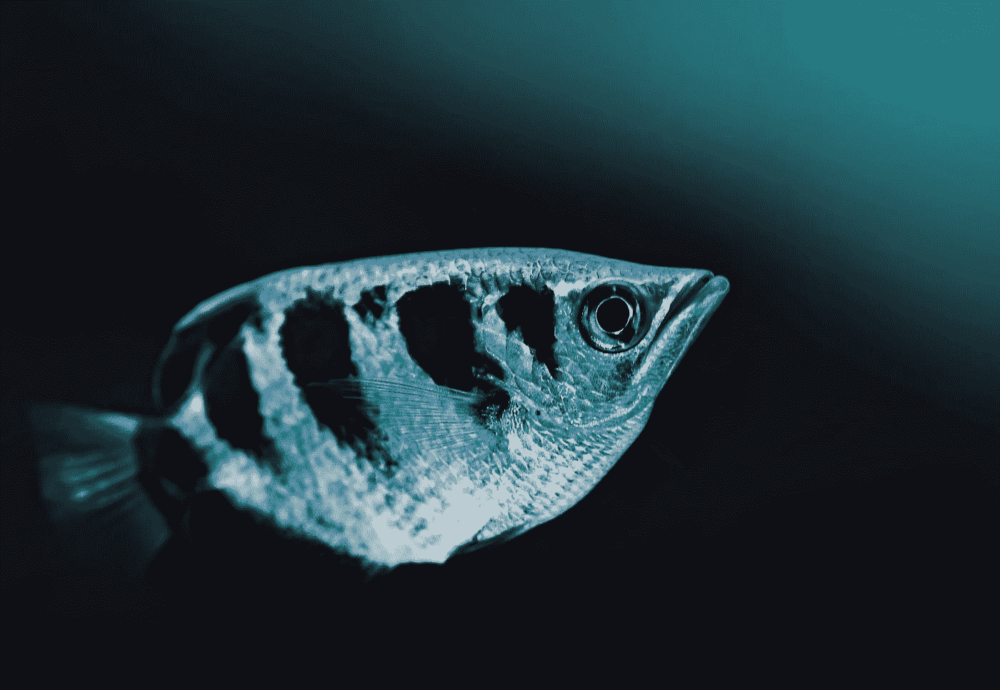

# 2020 年挑战数据科学家的动物

> 原文：<https://medium.com/analytics-vidhya/animals-that-challenge-data-scientists-in-2020-f5f5f1613ff0?source=collection_archive---------15----------------------->

## [数据科学](https://towardsai.net/p/category/data-science)，[观点](https://towardsai.net/p/category/opinion)

## 一些动物给数据科学家复制它们的能力和解决许多现实世界的问题带来了巨大的挑战。

照片由[大卫·克洛德](https://unsplash.com/@davidclode?utm_source=medium&utm_medium=referral)在 [Unsplash](https://unsplash.com?utm_source=medium&utm_medium=referral) 上拍摄

# 介绍