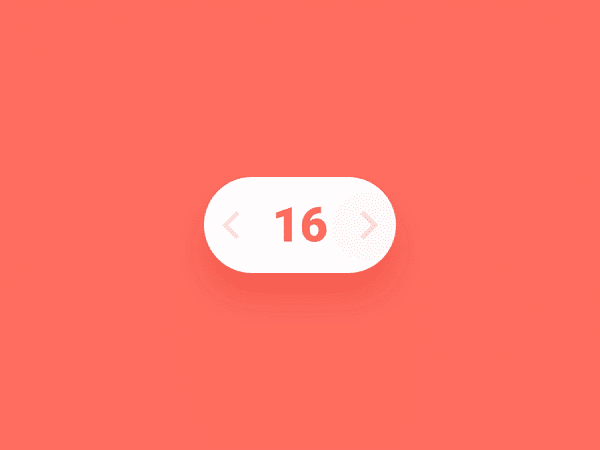
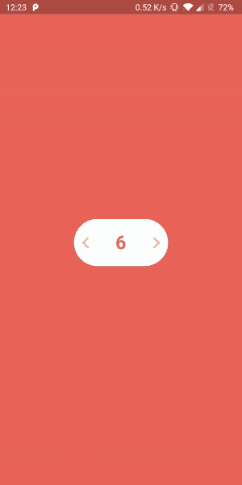

# 颤动中的动画舞步

> 原文：<https://medium.com/analytics-vidhya/animated-stepo-in-flutter-f53fa777ac0f?source=collection_archive---------23----------------------->

说到**用户体验**，动画是必不可少的东西之一，它在增强用户体验方面发挥着重要作用，让你的应用程序更具交互性，让你的用户更乐于使用应用程序。

我正在探索运球的动画组件，在那里我发现了[这个设计](https://dribbble.com/shots/5687260-Stepper-XXII)，并发现它非常有趣和有用。所以，我想把这个步进器设计用在 flutter 中。



【https://dribbble.com/shots/5687260-Stepper-XXII 

# 为什么我要用 Flutter？

由于我现在已经做了快一年的 flutter 开发者，我个人感觉 flutter 对动画有很大的支持。我们可以用更少的努力和时间取得比预期更多的成就。

如果你准备好了，让我们开始吧！

页（page 的缩写）s:这篇文章认为你已经对 Flutter 小部件和工作环境有了基本的了解。

# 所需的组件和动画

## 背景缩放动画(按钮点击效果)

为了制作按钮点击的动画效果，我使用了 [Transform](https://api.flutter.dev/flutter/widgets/Transform-class.html) 小部件的 scale 属性在给定的持续时间内缩小和放大按钮的大小，如下所示:

为缩放动画创建一个[动画控制器](https://api.flutter.dev/flutter/animation/AnimationController-class.html)和[动画](https://api.flutter.dev/flutter/animation/Animation-class.html)对象

现在用 Transform 小部件包装容器小部件，并使用 [scale](https://api.flutter.dev/flutter/widgets/Transform/Transform.scale.html) 属性缩放小部件。

要开始播放动画，只需调用

```
scaleAnimationController.forward();
```

因为我们已经添加了

```
scaleAnimationController.reverse();
```

在动画的状态监听器，所以它会重新缩放部件回到原来的比例，从而给它一个有弹性的效果。

## 移动文本(翻译动画)

现在，我们将使用 Transform 小部件的翻译功能来移动容器中的文本，并制作偏移动画。

创建一个用于翻译动画的[动画控制器](https://api.flutter.dev/flutter/animation/AnimationController-class.html)和[动画](https://api.flutter.dev/flutter/animation/Animation-class.html)对象

现在将待翻译的文本小部件包装在 [Transform.translate](https://api.flutter.dev/flutter/widgets/Transform/Transform.translate.html) 中，并使用 offset 属性:

这将使文本从中心到右边的位置动画。现在要开始播放动画，只需调用:

```
textAnimationController.forward();
```

为了向相反方向移动文本，只需将结束值改为负值。因此，要使动画向负方向移动，您的文本动画应该是:

## 移动文本(翻译动画)

值得注意的是，图标的移动距离是文本的一半，因此对于图标动画，逻辑是相同的，但是唯一的区别是图标动画的结束值和持续时间分别是文本动画和文本动画持续时间的结束值的一半。

所以图标的动画和控制器应该是:

现在在 [Transform.translate](https://api.flutter.dev/flutter/widgets/Transform/Transform.translate.html) 中包装要翻译的文本小部件，并使用 offset 属性:

# 同步所有动画

既然现在我们已经准备好了所有的部件，它们只是被添加到堆栈中，然后点击按钮，动画应该在一个给定的系列中工作，以实现我们的目标。我创造了一种神奇的方法，即 **handleOnTap** :

为了实现这个目标，我们需要在右侧和左侧都实现它。右边是递增计数器，左边是递减计数器。

# 结论



[来自 flutter_stepo 的演示 gif](https://github.com/hd-motion/flutter_stepo)

加油..！，我们通过仔细观察动画和应用 flutter 的一些动画属性，成功地将上述设计转换为代码。

要使用 Stepo 作为定制的小部件，您可以从 pub:

[](https://pub.dev/packages/stepo) [## stepo |颤振套件

### 一个高度可定制的动画单位步进飞镖 SDK 版本> = 2.1.0 添加包依赖…

公共开发](https://pub.dev/packages/stepo) 

## 或者

您可以在 Github 上查看该项目的完整源代码:

[](https://github.com/hd-motion/flutter_stepo) [## 高清运动/颤动 _ 步进

### 一个高度可定制的动画单位步进飞镖 SDK 版本> = 2.1.0 添加包导入…

github.com](https://github.com/hd-motion/flutter_stepo) 

感谢您阅读这篇文章。随时欢迎反馈。如果你喜欢它，请点击拍手按钮，并分享这篇文章。

可以在 [Github](https://github.com/harpreetseera) 、[LinkedIn](https://www.linkedin.com/in/harpreetseera/)&[Twitter](https://twitter.com/Harpreet_Seera)上和我联系。

感谢 [Damanpreet Singh](https://github.com/damanpreetsb) 的帮助和支持。