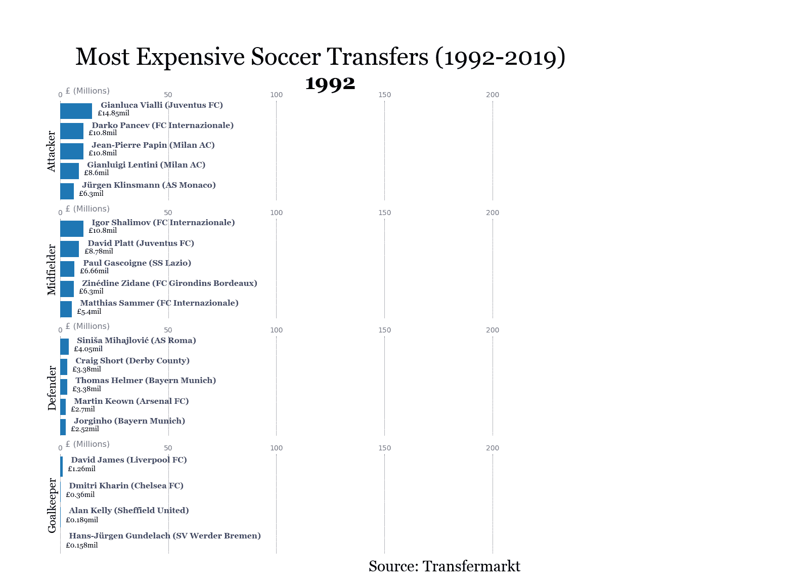
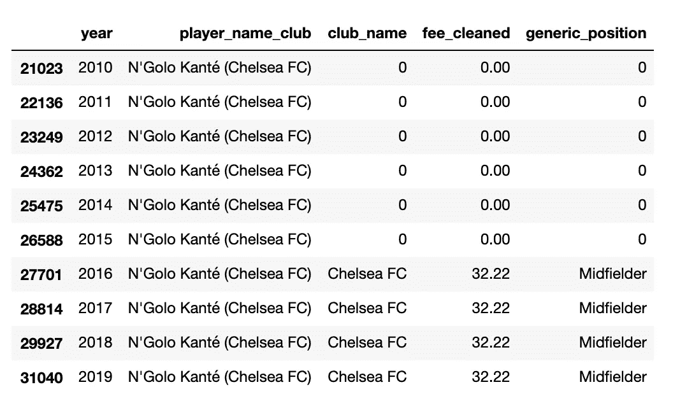
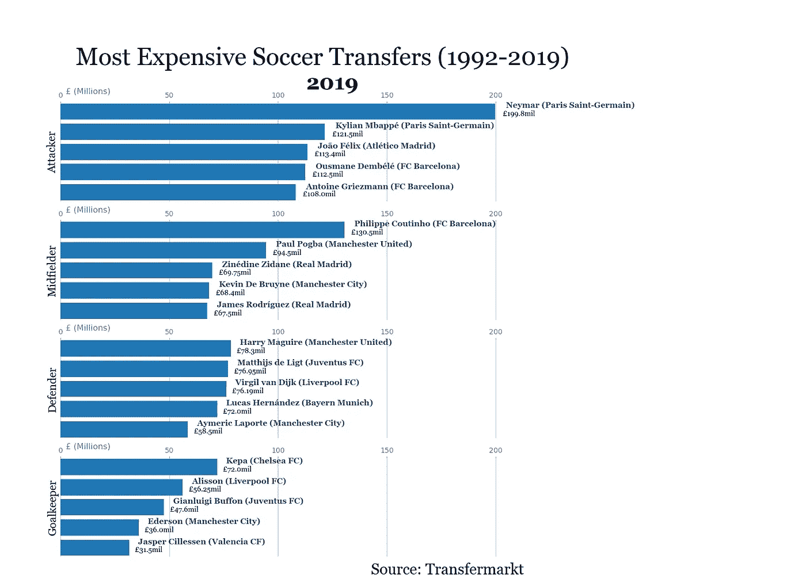

# 用 Python 和 Matplotlib 制作足球转会费动画

> 原文：<https://medium.com/analytics-vidhya/animating-soccer-transfer-fees-with-python-and-matplotlib-ea1491999ef6?source=collection_archive---------14----------------------->



转会费是足球界永无休止的讨论，每年夏天都会带来更高的价格和更奢侈的交易。

我决定用一个动画条形图，按照头寸分组，来形象化显示转会费随时间的增长。为此，我依赖于 [matplotlib](https://matplotlib.org/index.html) 和 [Gabriel Berardi](/@6berardi/how-to-create-a-smooth-bar-chart-race-with-python-ad2daf6510dc) 和 [Pratap Vardhan](https://towardsdatascience.com/bar-chart-race-in-python-with-matplotlib-8e687a5c8a41) 的两篇非常有用的媒体文章。

数据是通过 ewenme 的 git [repo](https://github.com/ewenme/transfers) 收集的，它最初是从 [Transfermarkt](https://www.transfermarkt.co.uk/) 刮来的。首先，我合并了存储库中的各个数据集:

```
mytemplist=[]#loop over folders in directory
for folder in os.listdir(os.getcwd()):
    if '.' in folder:
        continue

    current_folder = os.getcwd() + '/' + folder
    print(current_folder)

    #loop over file in folder and read csv
    for file in os.listdir(current_folder):
        print(os.getcwd() + '/' + folder + file)
        df = pd.read_csv(os.getcwd() + '/' + folder + '/'+ file)

        mytemplist.append(df)

        print('done writing file: {}'.format(file))df = pd.concat(mytemplist)
```

第二步是通过将位置分组为四个主要位置来清理数据，删除重复的位置(保留球员加入球队的行——“in”，删除球员离开球队的行——“out”)，并创建一个包含球员姓名和球队名称的新变量(即“埃登·阿扎尔(皇马)”)。

```
#group positions based on attack, mid, def, goalkeeper
positions = [df['position'].isin(['Centre-Forward',
                                  'Left Winger',
                                  'Right Winger',
                                  'Striker',
                                  'Second Striker',
                                  'Forward']),
            (df['position'].isin(['Central Midfield',
                                'Attacking Midfield',
                                'Defensive Midfield',
                                'Right Midfield',
                                'Midfielder'])),
             (df['position'] == 'Goalkeeper')]

generic_position = ['Attacker', 'Midfielder', 'Goalkeeper']df['generic_position'] = np.select(positions, generic_position, default = 'Defender') #drop players where fee_cleaned==NA
df.dropna(subset = ['fee_cleaned'], inplace=True)df = df[df['fee_cleaned'] > 0.1]#keep only players with transfers "in" to club - not leaving (duplicates otherwise)
df = df[df['transfer_movement'] == 'in']#make new variable: player_name + club_name
df['player_name_club'] = df.apply(lambda x: str(x['player_name'] + ' (' + x['club_name'] + ')'), axis=1)
```

第三，我创建了一个新的数据框架(top_transfers)，其中保存了他们年度位置组合中前 10 名的球员行(即 1999 年后卫)。这使得数据集更小，更清晰，更容易查看。

```
#Get top 10 transfers for each year + position; sort by fee_cleaned, group by, and take top 10
top_transfers = df.sort_values(by=['fee_cleaned'],ascending=False).groupby(['year','generic_position']).head(10)#keep necessary columns only
top_transfers = top_transfers[['player_name_club', 'club_involved_name','fee_cleaned','year','generic_position']]#Sort by year
top_transfers = top_transfers.sort_values(by=['year'],ascending=True)
```

第四步是使用一个类似于 R 的 [complete](https://tidyr.tidyverse.org/reference/complete.html) 函数(tidyr 包)的函数，它在 pandas 中并不作为一个独立的函数存在，需要几行代码(这篇 [stackoverflow](https://stackoverflow.com/questions/40093971/pandas-dataframe-insert-fill-missing-rows-from-previous-dates) 的帖子非常有用)。简而言之，这一步骤允许转会费(即恩戈洛·坎特在 2016 年转会切尔西)在 2017 年、2018 年和 2019 年继续存在。

```
#complete rows to keep player row after year of signing (i.e. player_x signed in 2018, keep player_x in 2019 data as well)
#credit to: [https://stackoverflow.com/questions/40093971/pandas-dataframe-insert-fill-missing-rows-from-previous-dates](https://stackoverflow.com/questions/40093971/pandas-dataframe-insert-fill-missing-rows-from-previous-dates)levels = ['year','player_name_club']
full_idx = pd.MultiIndex.from_product([top_transfers[col].unique() for col in levels], names=levels)
top_transfers_complete = top_transfers.set_index(levels).reindex(full_idx)top_transfers_complete = top_transfers_complete.groupby(level=['player_name_club']).ffill().reset_index()top_transfers_complete.fillna(0, inplace=True)
```

在我们的新数据集中查看 N'Golo 坎特，结果如下:

```
top_transfers_complete[top_transfers_complete['player_name_club'].str.contains('Kant')].tail(10)
```



正如你在上面看到的，一旦转会发生(在这个例子中是在 2016 年)，我们的新数据框架包括一个用于每个年份和 player_name_club 组合的行。

对于该项目的数据可视化方面，我创建了两个函数，这两个函数根据位置(守门员、后卫、中场、进攻者)创建条形图并将条形分成支线剧情。

下面显示的第一个函数使用 matplotlib 设计了一个单独的条形图，列出了前五名玩家的姓名和价格，以及年份和位置类型。下面的大部分代码纯粹是格式化。

```
def draw_indiv_barchart(ax,df, position,year):
    df = df[df.generic_position == position]
    dff = df[df['year'].eq(year)].sort_values(by='fee_cleaned', 
                                              ascending=True).tail(5)
    ax.clear()
    ax.set_xlim([0, 250])
    ax.set_xticks(np.arange(0, 250, 50))
    ax.barh(dff['player_name_club'], dff['fee_cleaned'])
    dx = dff['fee_cleaned'].max() / 200

    for i, (value, name) in enumerate(zip(dff['fee_cleaned'], dff['player_name_club'])):
        ax.text(value + dx, i + 0.1, '    ' + name, color='#3b4463',size=16, weight=600, 
                ha='left', va='bottom', fontdict = {'fontname': 'Georgia'})
        ax.text(value + dx, i - 0.1, '   £'+str(value)+'mil', size = 14, weight =200,
                ha = 'left', va = 'center', fontdict = {'fontname': 'Georgia'})
    ax.text(0, 1.09, '  £ (Millions)', transform=ax.transAxes, size=16, color='#777777')
    ax.xaxis.set_major_formatter(ticker.StrMethodFormatter('{x:,.0f}'))
    ax.xaxis.set_ticks_position('top')
    ax.tick_params(axis='x', colors='#777777', labelsize=14)
    ax.set_yticks([])
    ax.margins(0, 0.01)
    ax.grid(which='major', axis='x', linestyle='-')
    ax.set_axisbelow(True)
    ax.xaxis.set_ticks_position('top')
    ax.spines['top'].set_visible(False)
    ax.spines['right'].set_visible(False)
    ax.spines['bottom'].set_visible(False)
    ax.spines['left'].set_visible(False)    
    plt.subplots_adjust(left = 0.075, right = 0.75, top = 0.825, bottom = 0.05, wspace = 0.2, hspace = 0.2)
    plt.locator_params(axis = 'x', nbins = 12)
    plt.box(False)
```

第二个函数调用了第一个函数四次，在字典 ax_dict 上循环。

```
ax_dict = {ax1: "Attacker",
          ax2: "Midfielder",
          ax3 : "Defender",
          ax4: "Goalkeeper"}def draw_subplots(year):

    for ax, position in ax_dict.items():
        draw_indiv_barchart(ax,top_transfers_complete,position,year)
        if ax == ax1:
            ax.set_title(year, size=42, weight=600, ha='center',fontdict = {'fontname': 'Georgia'}, y = 1.1)
        ax.set_ylabel(position, size = 22,fontdict = {'fontname': 'Georgia'})
```

为了可视化一年的数据(本例中为 2019 年)，运行了以下代码:

```
current_year=2019fig, (ax1, ax2,ax3,ax4) = plt.subplots(4,figsize=(22, 16))
fig.suptitle('Most Expensive Soccer Transfers (1992-2019)', 
             ha='center', va='center', y= 0.9, x = 0.4,
           fontsize=48, fontdict = {'fontname': 'Georgia'})
ax1.set_ylabel('Attacker')
fig.text(0.65, 0.02, 'Source: Transfermarkt', ha='right',fontsize=30,
             bbox=dict(facecolor='white', alpha=0.8, edgecolor='white'),fontdict = {'fontname': 'Georgia'}) draw_subplots(year = current_year)
```

生成以下静态条形图:



最后一步是动画可视化，使用 IPython 的 HTML 函数和 matplotlib 的动画函数。页面顶部的 gif 是以 fps = 2 生成的，下面的是 0.7，因此移动缓慢:

```
animator = animation.FuncAnimation(fig, draw_subplots, frames=range(1992, 2020), interval = 600)
HTML(animator.to_jshtml())animator.save('animation.gif', writer='imagemagick', fps = 2, bitrate = 1800)
```


这是最终的可视化，显示了过去 20 年的良好上升趋势。

这里是完整的 git 库:[https://github.com/stefangouyet/transfers](https://github.com/stefangouyet/transfers)

本文转载于: