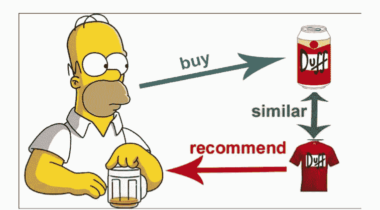
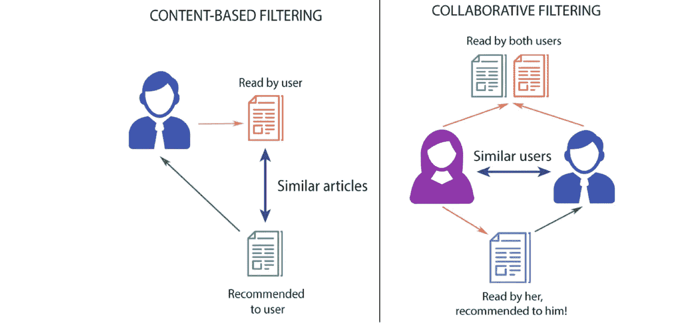

# 动漫推荐引擎|内容和协同过滤

> 原文：<https://medium.com/analytics-vidhya/anime-recommendation-engine-content-collaborative-filtering-c6e69be29d29?source=collection_archive---------2----------------------->

# 介绍

这篇文章讲述了一个男孩无意中发现了这个惊人的数据集。凭借机器学习的能力，他探索数据集，寻找**‘接下来看什么？’**使用基于内容的协同过滤。

# 问题陈述

每个流媒体内容都有自己的观众，每个内容都有自己的评级。如果观众喜欢，他们会给内容留下一些好的评级。但是在哪里适用呢？观众可能会花上几个小时滚动浏览数百部，有时数千部动漫，却永远找不到他们喜欢的内容。企业需要根据他们的喜好和需求提供建议，以创造一个更好的流媒体环境，增加收入和网站的停留时间

# 什么是推荐引擎？

它是一种无监督的学习算法(没有衡量准确性的目标变量)，主要用于帮助消费者做出决策。我相信你在网购的时候见过它们。它们还出现在流媒体应用程序(又名网飞和 Hulu)等地方，帮助你选择接下来要看的电视节目或电影，以及在媒体等新闻/媒体网站上推荐你可能喜欢阅读的其他文章，以及许多其他用途。显然，许多像亚马逊这样的电子零售商已经使用推荐算法有一段时间了，但许多较小或较新的网站仍然需要。有不同种类的推荐器，它们基于不同的特征进行预测。点击[分析 Vidhya](https://www.analyticsvidhya.com/blog/2018/06/comprehensive-guide-recommendation-engine-python/) 了解更多信息

# 关于数据集

该数据集包含来自 73，516 个用户的关于 12，294 部动漫的用户偏好数据的信息。每个用户都可以添加动画到他们的完整列表中，并给它一个评级，这个数据集是这些评级的汇编。学分:[动漫推荐数据库](https://www.kaggle.com/CooperUnion/anime-recommendations-database)

# 项目目标

1.  迎接数据— Konnichiwa (こんにちわ)
2.  Analyze the data- Byakugan (白ガン)
3.  Preparing data for consumption- Sonaeru (備える)
4.  Recommendation building phase — Tsukuru (作る)

# 1.迎接数据— Konnichiwa (こんにちわ)

Konnichiwa (こんにちは or in kanji 今日は) is a Japanese greeting, typically a mid-day greeting. It is also used as an informal greeting, “hello”. So here our guests are the data. So let’s welcome our dataset guests !

> “我不会逃跑的，我从不反悔！那是我的忍道:我的忍者之道。”—鸣人 Uzumaki

# 数据集详细信息

## 1)动漫 _ 数据:

*   **anime _ id**—my animelist . net 标识一部动漫的唯一 id。
*   **名称** —动漫全称。
*   **流派** —该动漫的逗号分隔流派列表。
*   **类型** —电影、电视、OVA 等。
*   **集** —这部剧有多少集。(1 如果是电影)。
*   **评分** —这部动漫的平均评分(满分 10 分)。
*   **成员** —该动漫“群”中的社区成员数量。

## 2)评级 _ 数据:

*   **user_id** —不可识别的随机生成的用户 id。
*   **anime_id** —该用户评价过的动漫。
*   **评分** —该用户已分配的 10 分中的评分(如果用户观看了该视频但未分配评分，则为 1 分)

# Merging dataframes — Fusion(融合)

在本节中，我们将融合我们的 csv 来宾，以使推荐引擎更加强大。融合哈！

我们已经成功地合并(融合)了 csv 并使其变得强大。让我们开始行动吧

> “我想去看看，了解外面的世界。我不想在不知道外面有什么的情况下死在这些墙里面。”—艾伦·耶格(对泰坦的攻击)

# Analyze the data- Byakugan (白ガン)

为了建立一个推荐引擎，我们必须了解我们的数据集。那么，让我们来看一下数据集的概述。BYAKUGAAN！！

# 排名前 10 的动漫

我是根据用户 id 提供的评分来判断热门动漫的。让我们看看谁是冠军

**结果:**

*   死亡笔记排名第一，紧随其后的是剑术在线和对泰坦的攻击

> “看看你的周围，你会看到所有的人，如果没有他们，这个世界会变得更好。”——光矢上(死亡笔记)

# 基于社区规模的 10 大动漫

我现在根据他们的社区规模(成员数)来判断顶级动漫。让我们看看谁是冠军

## **结果:**

*   死亡笔记再夺桂冠。“我想告诉你**我是 L** ”

> “没有天堂或地狱。不管你活着的时候做什么，一旦你死了，每个人都会去同一个地方。死亡是平等的。”-L(死亡笔记)

# 收视率分布

现在，我将感受两个数据集上的评分分布。我相信 anime.csv 的评分来自评论网站，而 rating.csv 中的 user_rating 来自用户 id

**见解:**

*   大多数评分都在 6-10 分之间
*   分布的模式大约是 7.5-8.0
*   两种分布都是左偏的
*   我们将-1 评级作为用户评级中的异常值，可以将其转换为 NaN

# 流媒体

Byakugan！我现在看到这个强大的动画是从哪里来的

**见解:**

*   67.6%的动画在电视上播放，13.5%通过电影播放
*   10.2%的动漫以 OVA 的形式流出，超过了 ONA(1.18%)

# 体裁词云

## 抬头，见证流派云！

我们可以感觉到在我们的数据集中有很多喜剧类型的动画，然后是动作，爱情，戏剧

> "我决心成为海贼之王…如果我死于尝试…那至少我尝试过！"-蒙其·D·路飞(海贼王)

# Preparing data for consumption- Sonaeru (備える)

在把我们的数据客人交给推荐引擎之前，我们必须微调他们，塑造他们，训练他们面对老板！

## a)处理 NaN 值

首先，我们必须考虑 NaN 值，因为这围绕着评分，一个没有给出任何评分的用户没有给引擎增加任何价值。因此，让我们放弃并粉碎那些南价值观

## b)过滤用户标识

让我们检查一下用户 id 的数量，并根据它进行过滤

有只评价过一次的用户，即使评价过 5，也不能认为是有价值的推荐记录。所以我认为用户的最低 200 分是阈值。您可以尝试更改阈值来获得更好的结果，但这样做效果很好。

# c) Pivot Dojo

这个数据透视表由作为标题的行和作为用户 id 的列组成，这将帮助我们创建稀疏矩阵，这对于查找余弦相似度非常有帮助！不知道余弦相似度是什么？不要担心，我们将在下一节揭示这一点。

> "为了打败邪恶，我将成为一个更大的邪恶."-勒鲁什·兰珀鲁格(代码 Geass)

# Recommendation building phase — Tsukuru (作る)

## 协同过滤

协同过滤是一种可以根据相似用户的反应过滤出用户可能喜欢的项目的技术。它的工作原理是搜索一大群人，找到与特定用户口味相似的一小群用户。从 [Analytics Vidhya](https://www.analyticsvidhya.com/blog/tag/collaborative-filtering/) 了解更多信息

## 使用 KNN 的余弦相似度

余弦相似性是一种度量标准，用于衡量文档的相似程度，而不考虑文档的大小。在数学上，它测量的是在多维空间中投影的两个向量之间的角度余弦。余弦相似性是有利的，因为即使两个相似的文档相距欧几里德距离很远(由于文档的大小)，它们仍有可能更靠近在一起。角度越小，余弦相似度越高。从[分析 Vidhya](/analytics-vidhya/introduction-to-similarity-metrics-a882361c9be4) 了解更多关于相似性指标的信息

我们已经拟合了稀疏矩阵，让我们得到一个随机的动漫标题，并为它找到推荐。

在这里，我们从随机选择的索引(anime_title)中返回 6 个邻居在 KNN 的距离和索引，这些将是我们推荐的动画

# 测试协作推荐

正如我们所看到的，这些是推荐的。但是这段代码没有太多我们选择的灵活性。我建议你去看看[因陀罗·林的笔记本](https://www.kaggle.com/indralin/try-content-based-and-collaborative-filtering)，在那里他为这个协同过滤创建了一个很棒的功能。我用我的眼睛从他那里捕捉了两段代码。英雄联盟

> “人类之所以强大，是因为我们有能力改变自己。”-埼玉(一拳人)

## 基于内容的过滤

基于内容的过滤，也称为认知过滤，基于项目内容和用户简档之间的比较来推荐项目。每个项目的内容都表示为一组描述符或术语，通常是文档中出现的单词。基于内容的推荐器处理用户提供的数据，无论是显式的(评级)还是隐式的(点击链接)。基于该数据，生成用户简档，然后使用该简档向用户提出建议。随着用户提供更多的输入或对推荐采取行动，引擎变得越来越准确。在 [Analytics Vidhya](https://www.analyticsvidhya.com/blog/tag/content-based-recommendation-engines/) 中了解有关基于内容的过滤的更多信息

## a)清洁动漫 _ 标题

我们在动漫标题中找到了许多符号。让我们删除那些使用这个函数的

我们得到了干净整洁的标题。现在是终极 TFIDF 给我们推荐下一部动漫的时候了

## b)术语频率(TF)和反向文档频率(IDF)

TF 就是一个单词在文档中出现的频率。IDF 是文档在整个语料库中出现频率的倒数。使用 TF-IDF 主要是因为两个原因:假设我们在谷歌上搜索“分析的兴起”。“the”肯定会比“analytics”出现得更频繁，但是从搜索查询的角度来看，analytics 的相对重要性更高。在这种情况下，TF-IDF 加权在确定项目(文档)的重要性时否定了高频词的影响。在[分析 Vidhya](https://www.analyticsvidhya.com/blog/2020/02/quick-introduction-bag-of-words-bow-tf-idf/) 中了解有关 TFIDF 的更多信息

在这里，我们将在流派上使用它，以便我们可以根据流派内容推荐用户

Scikit-learn 已经提供了成对度量(机器学习术语中的内核),既适用于向量集合的密集表示，也适用于向量集合的稀疏表示。这里我们需要给推荐动漫赋值 1，给不推荐动漫赋值 0。所以我们使用 sigmoid 内核

我们已经得到了动漫名称的指数，现在让我们开始找出推荐的动漫

> “你应该尽情享受这个小小的弯路。因为在那里你会发现比你想要的更重要的东西。”Ging Freecss(猎人 X 猎人)

## c)基于内容的推荐功能

在这里，我们创建了一个获取动画推荐的函数。我们使用枚举函数将相似性得分转化为列表，对列表进行排序，并选择前 10 个得分进行推荐。

## 来带来推荐之战吧！

推荐结果

> 如果我愿意，我可以更进一步。”—悟空(龙珠 z)

## 一篇新媒体文章露出了真面目。这能鼓掌吗？

## 我会发更好的文章吗？

## 我能成为优秀的作家吗？

## 下一集尽在[中篇 Z](/@benroshan)